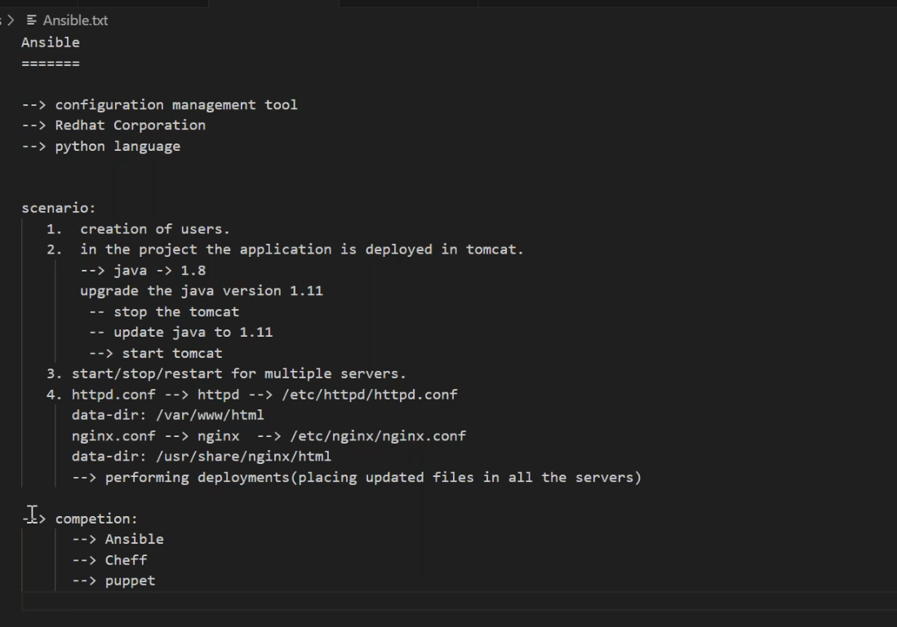
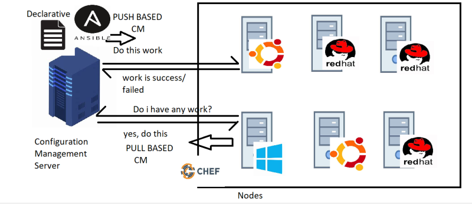
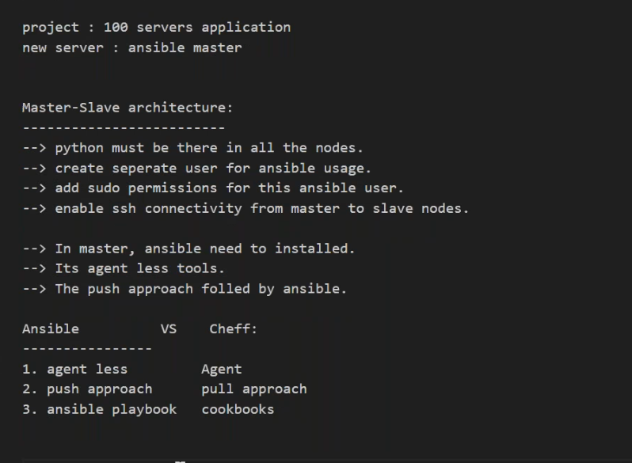
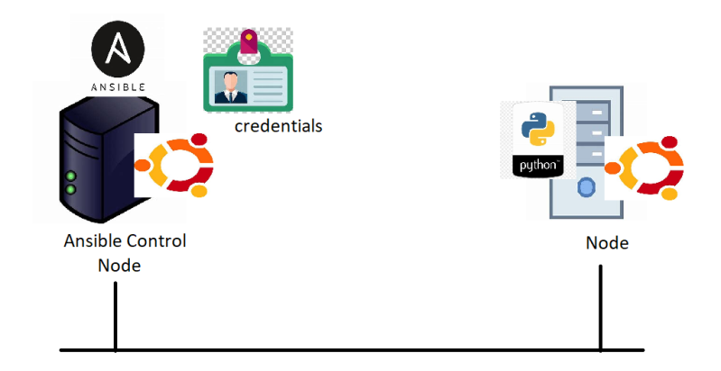
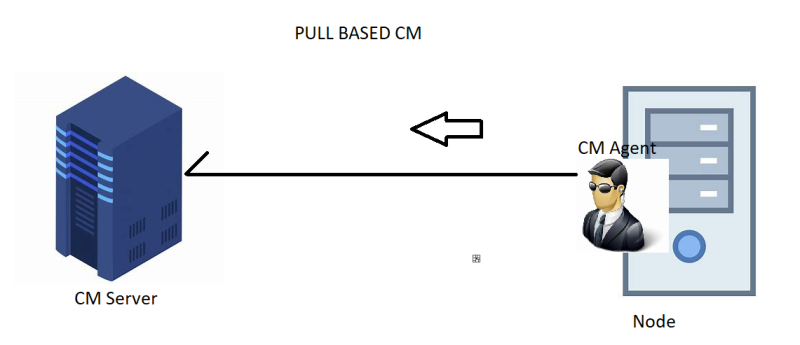
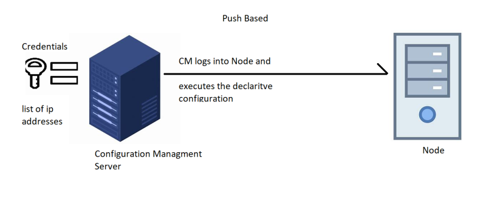
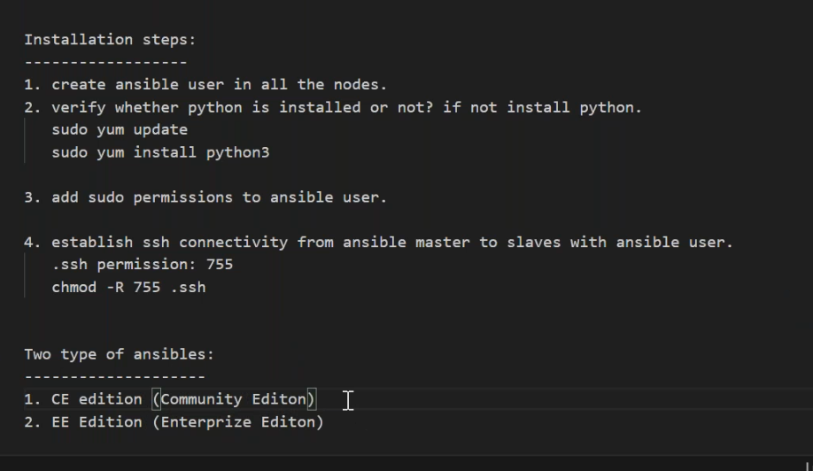
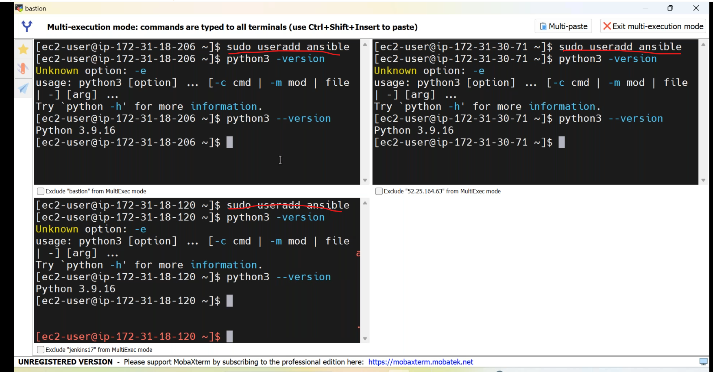
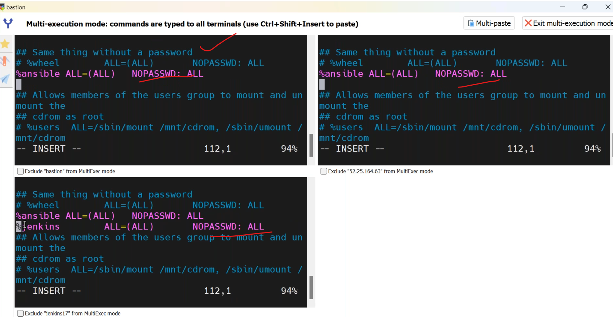
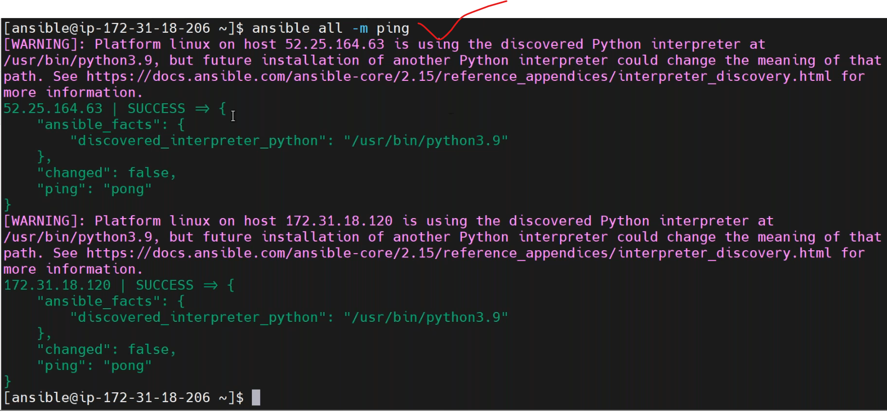

## 12/01/2024
------------------------
### configuration management tool
-----------------------------------


* __Ansible Installation and configuration__.




* __pull based cm__.


* __push based cm__.


### ansible server configuration
-----------------------------------
* establishing connections between master to nodes with ansible user.
    * login servers with ansible user.
    * in master ansible user create ssh keys.
    * copy the public key to nodes.
       * check the `.ssh` available in nodes.
       * if not available create `.ssh` folder.
         ``````
         mkdir .ssh
         cd .ssh
         vi authorized_keys
         <paste public-key>
         ``````
    * chek the connectivity by `ssh ansible@<node-ip>`.




* for ansible community addition docs [Refere Here](https://www.ansible.com/community?extIdCarryOver=true&sc_cid=701f2000001OH7YAAW)
* to ansible ping create a hosts file copy all nodes ip addresses.
``````
sudo vi /etc/ansible/hosts
ansible ping -m all
``````

