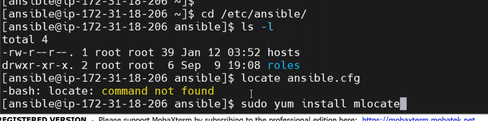
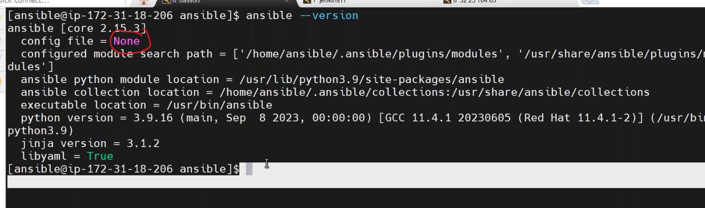
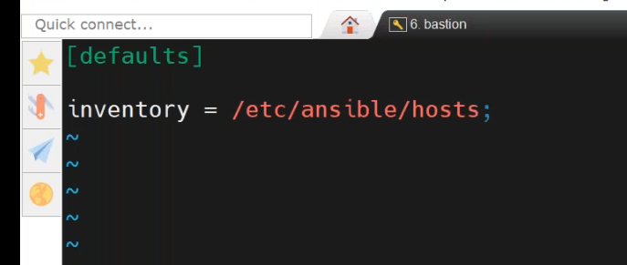
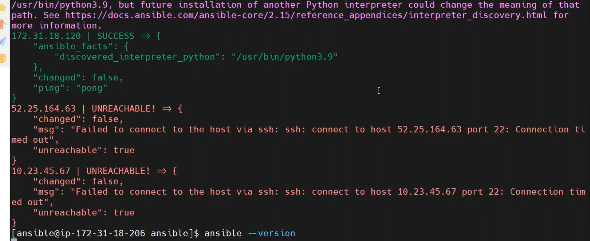
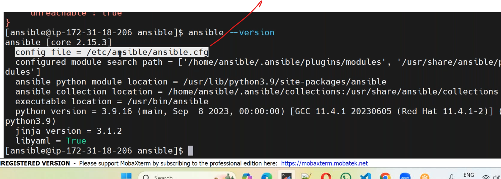
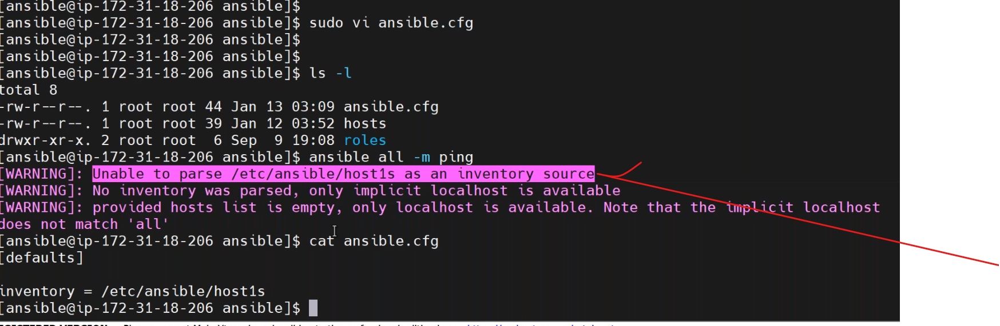
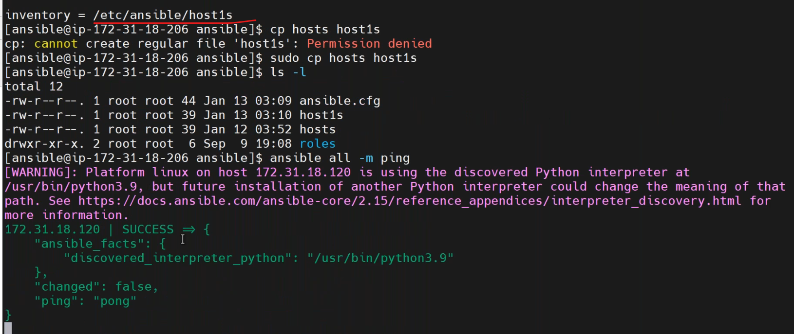
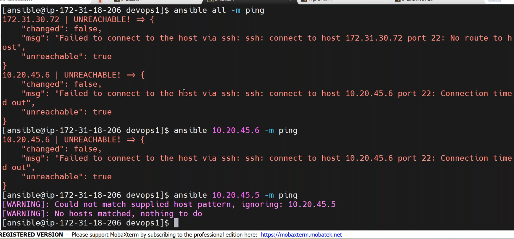
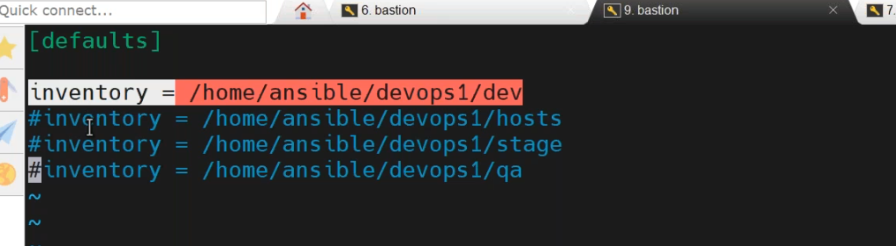

## 13_01_2024
-------------------
### Ansible configuration file:

* `locate` command.

* in old versions of ansible we have a default config files,host files.

* to create configuration file [Refere Here](https://docs.ansible.com/ansible/latest/reference_appendices/config.html)
* create a custom configuration file
``````
vi ansible.cfg
``````
* set a default path for inventory `hosts` path



* ansible by default looks for configuration file.

* if change inventery path.



### Ansible configuration file:
--------------------------
``````
directory: /etc/ansible
configuration: ansible.cfg 
``````
### priority of ansible.cfg file
-------

* ANSIBLE_CONFIG (environment variable if set)

* ansible.cfg (in the current directory)

* ~/.ansible.cfg (in the home directory)

* /etc/ansible/ansible.cfg

### ansible inventory:
-----------------
* --> The place where we are adding remote server ip details that file is called inventory file.
    `/etc/ansible/hosts`
``````
ansible all -m ping
`````` 
  1. ansible loads the ansible.cfg file
  2. it looks for inventory "/etc/ansible/hosts"
  3. load the values from inventory file
  4. perform the ping operation on all the hosts present in inventory file.

  `export ANSIBLE_CONFIG="filepath"`

 * all == group + non-group


 ### adhoc commands:
  --------------

  `ansible <groups> -m <module> <args>`

 * python: modules

* ex: ansible all -m ping 

## main commands:

1. ansible
2. ansible-doc
3. ansible playbook
4. ansible vault 
5. ansible galaxy
