EFS(Elastic File Share)
----------------------
* we can add same volume to multiple servers.
### SAN vs NAS
---------------------------
* SAN - local to storage
* NAS - network storege
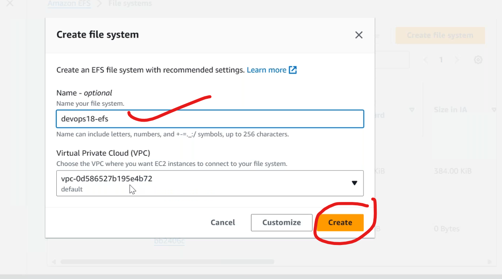
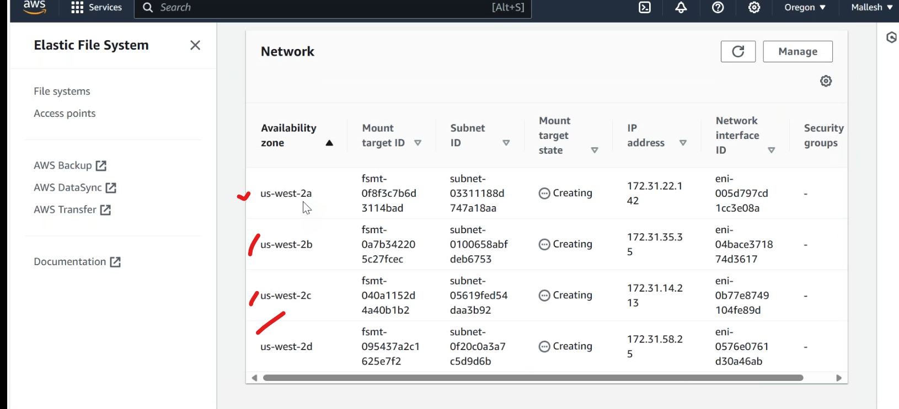
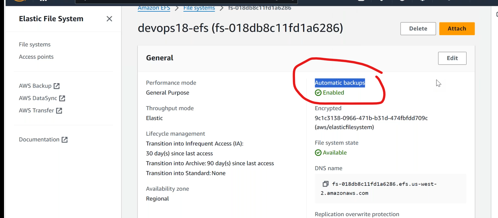
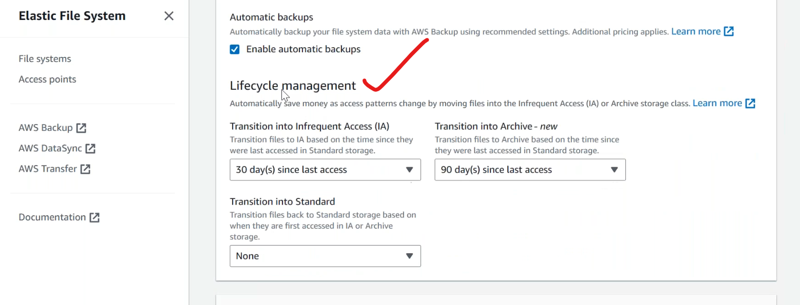
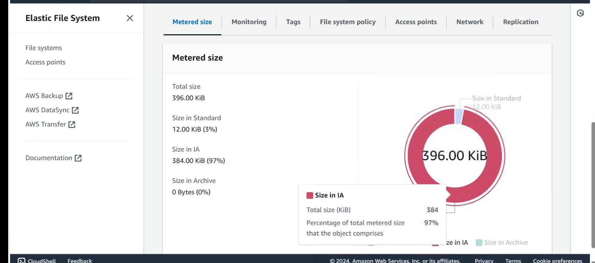
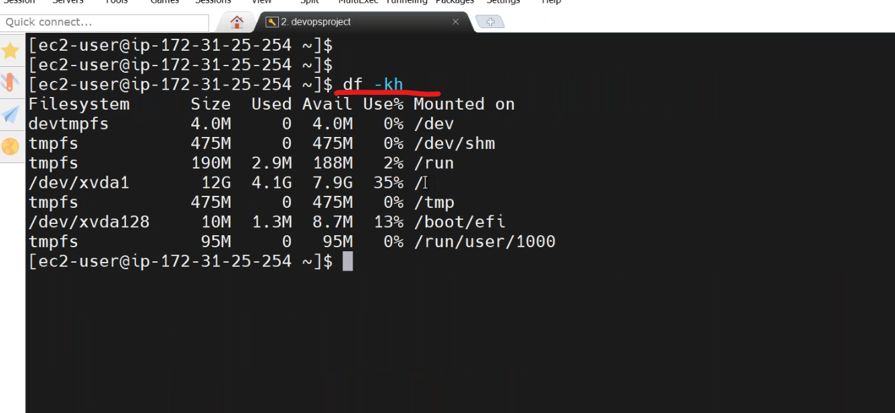
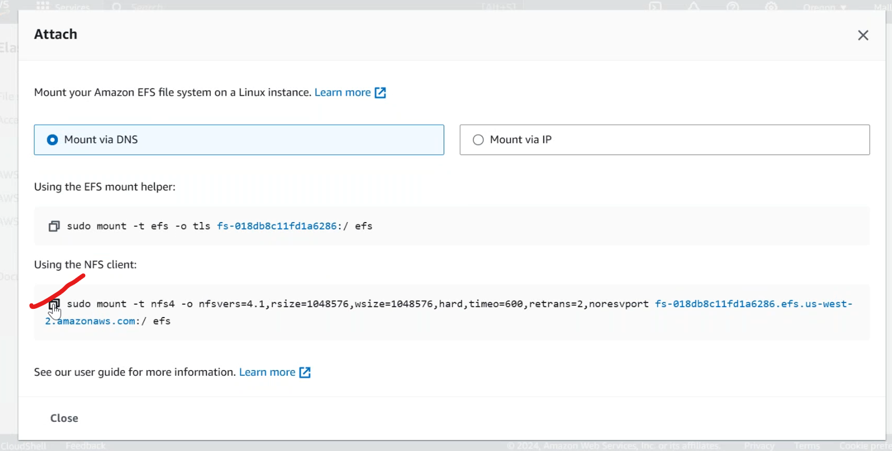
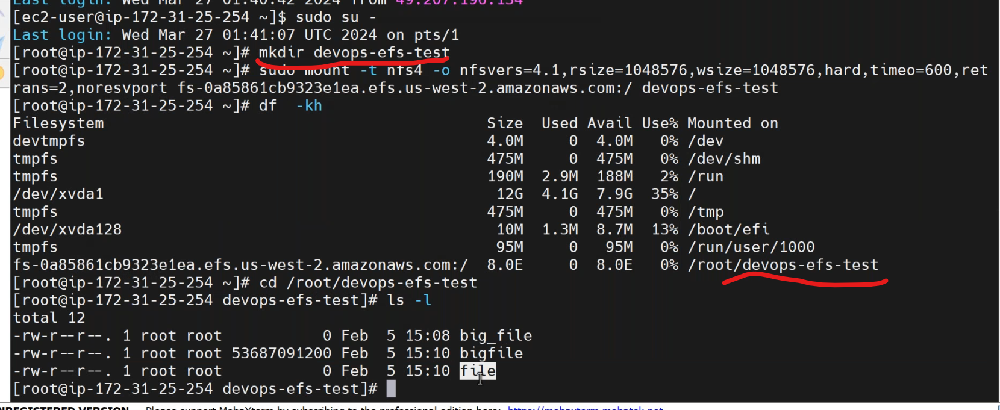
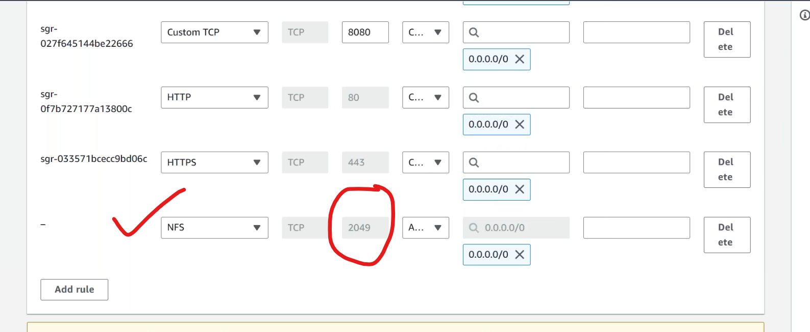
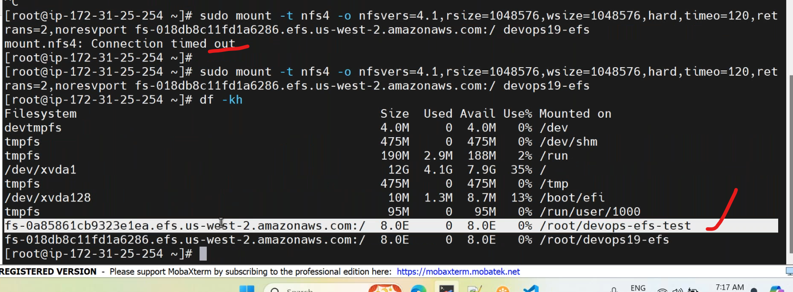

## VPC Flow Logs
----------------------------------
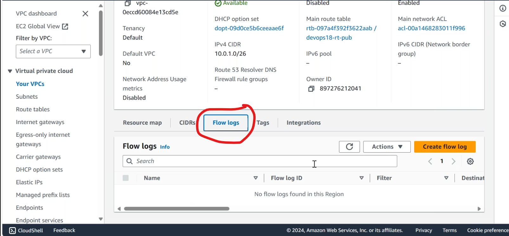
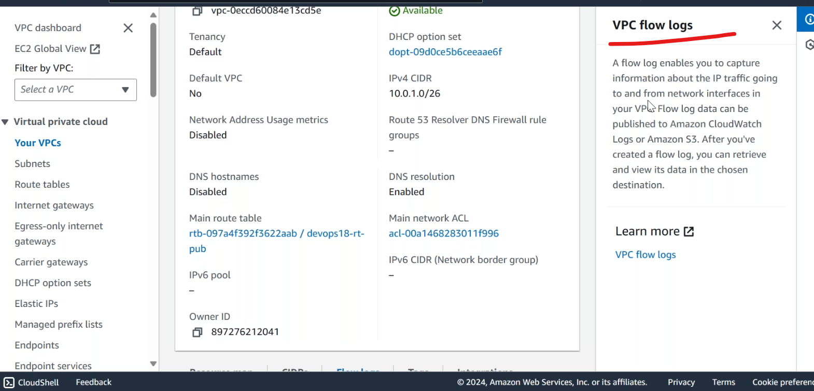
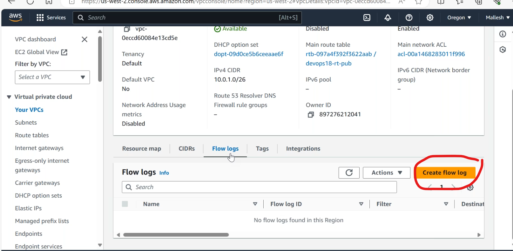
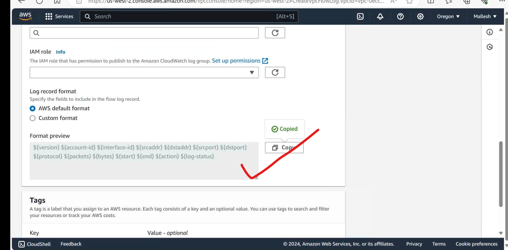

## Network ACLs
--------------------------------------
* firewall at subnet level
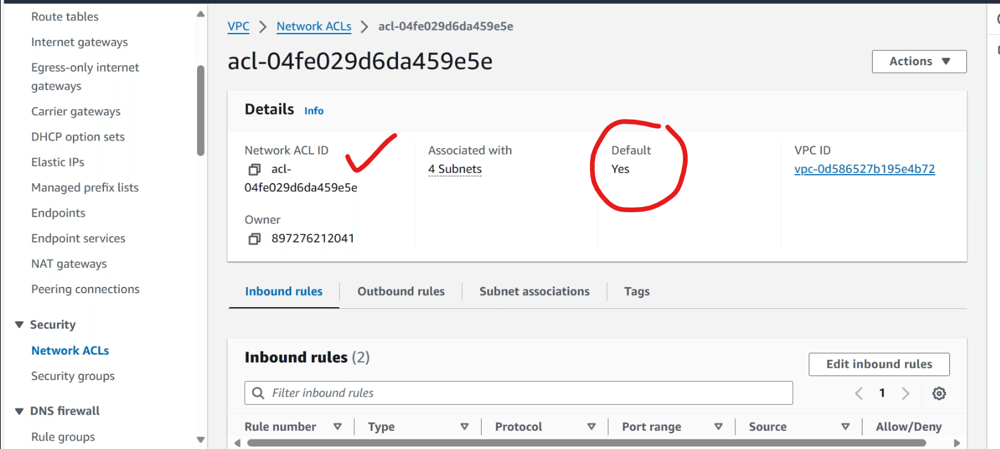
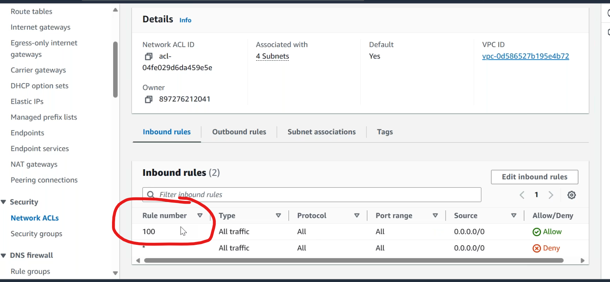
* __*__ is least priority rule.
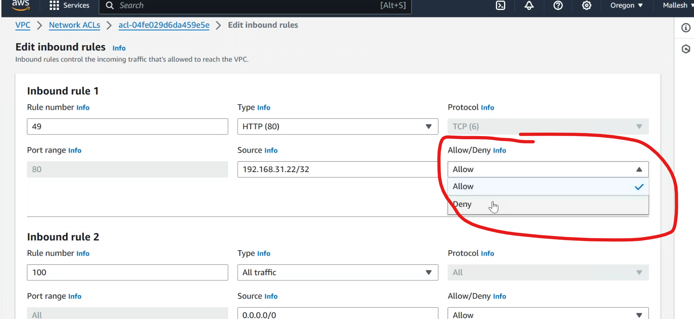
* maximum rules can be created is __40__.

## WAF
-----------------------------
* firewall on top of Load Balencer.

