## IAM users&groups&roles
---------------------------------
* if user have indiviual policies and the user added to group,so user has both individual and group level permissions.
## roles
---------------------------------
* roles are logical entity.
* these are communicate with one aws service to another aws service.
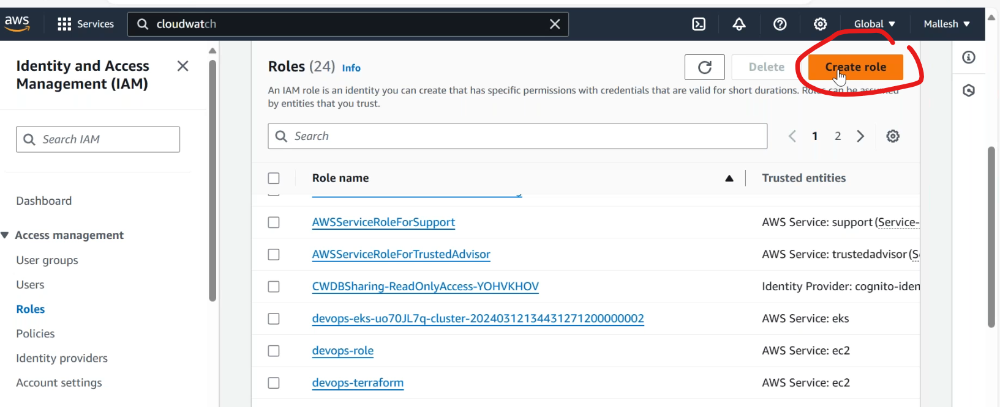
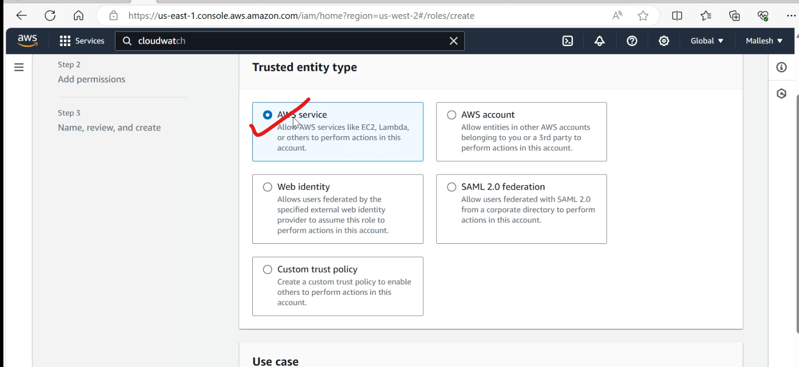
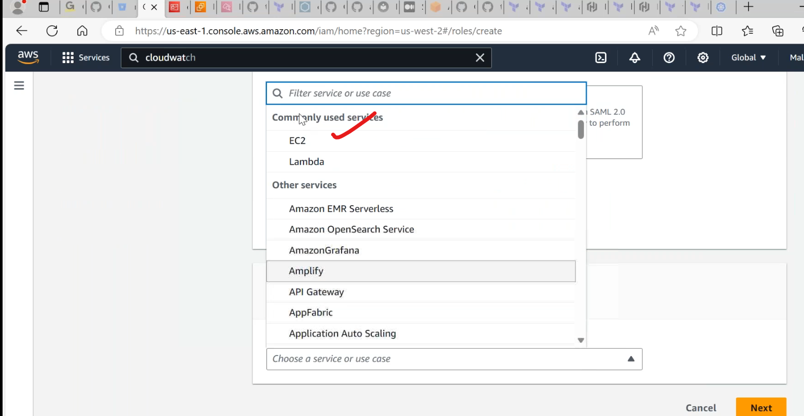
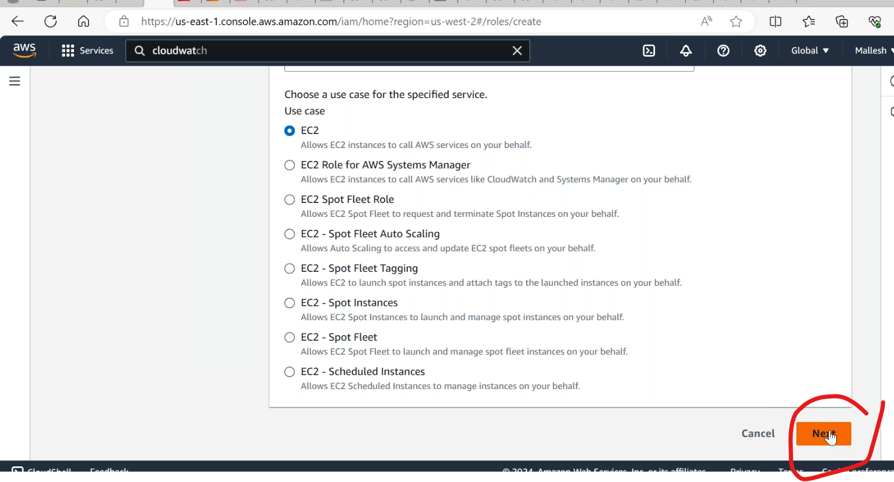
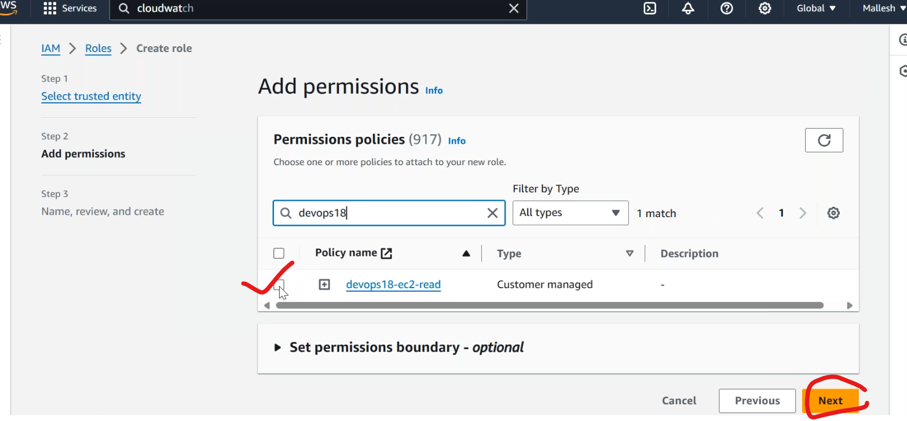
* entire users data presented in file.
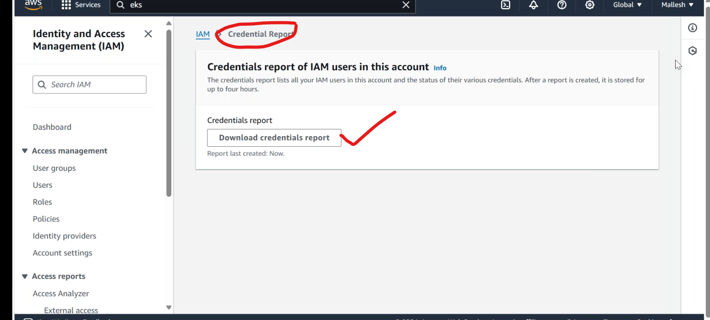
### policies
-----------------
* defines boundary limits.
1. aws managed policies
* available to evryone.
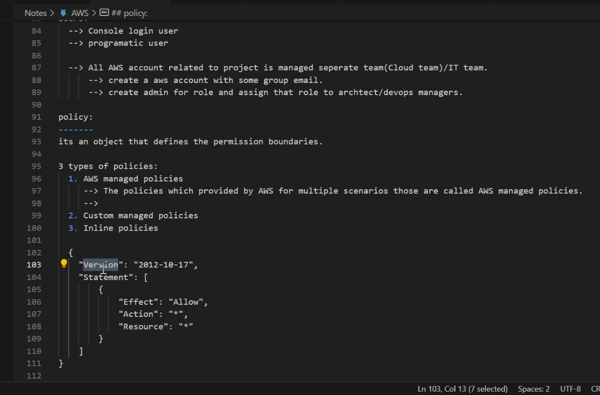
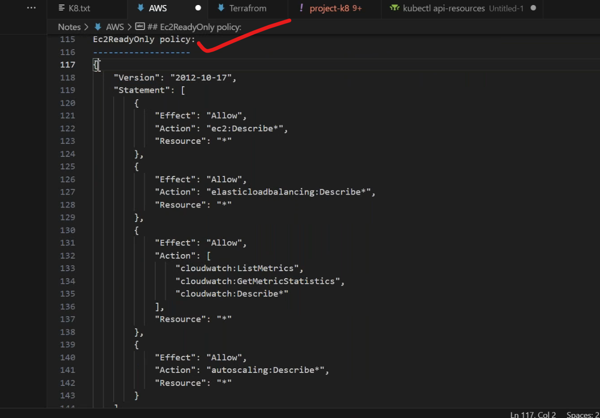
2. custom policies
* we can write based on requirements.
* available for everyone
3. inline policies
* it only applicable to specific user or specific group.
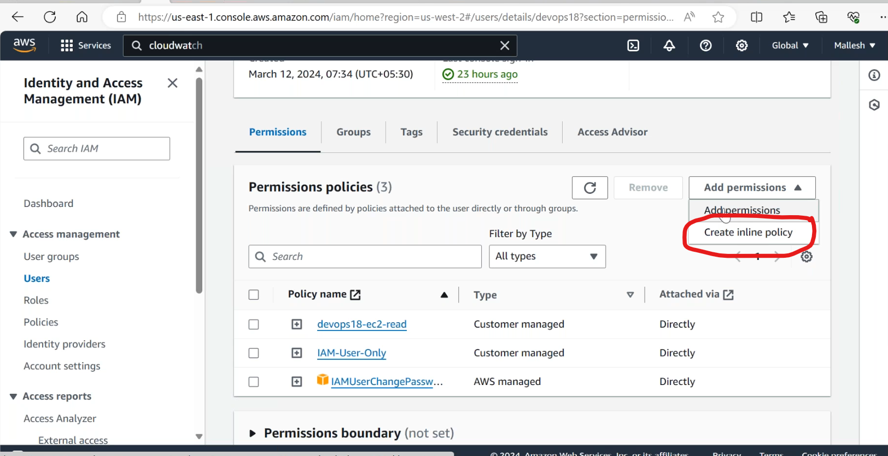
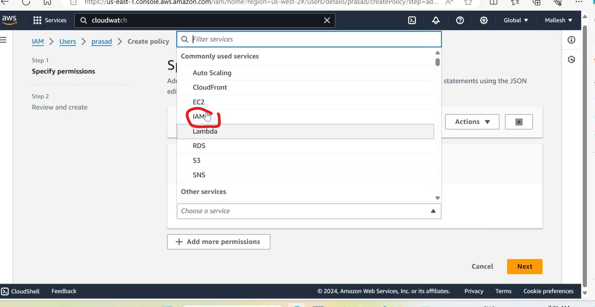
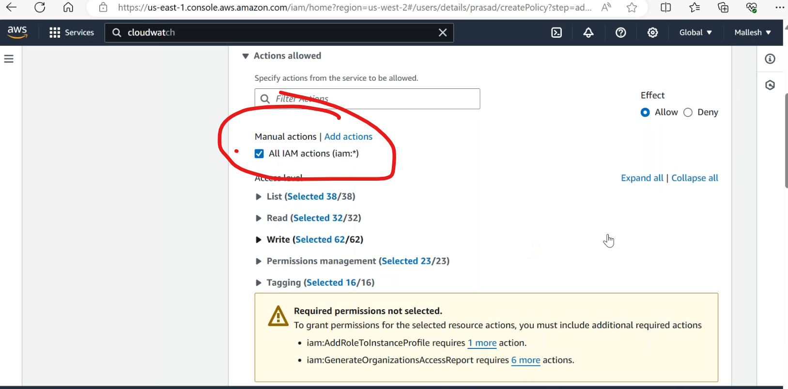
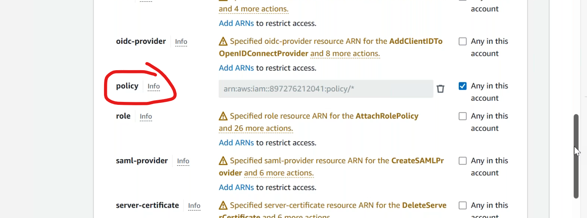

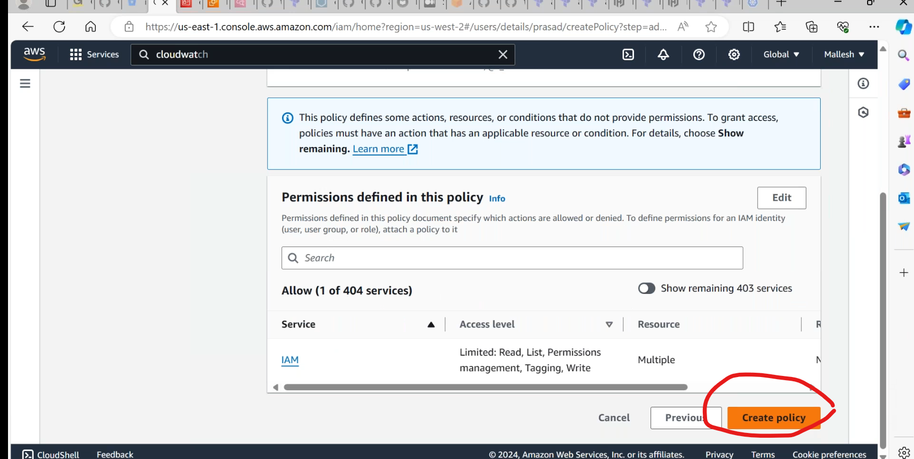
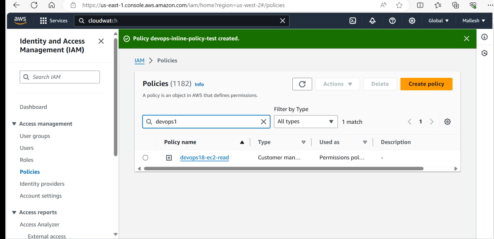
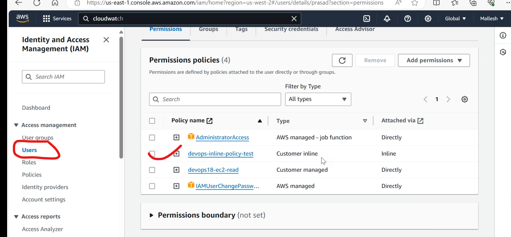
## ARN(amazon resource name)
--------------------------------------

* we are unable to find `ec2 ARN` in console directly.but it can be found in terraform statefiles.
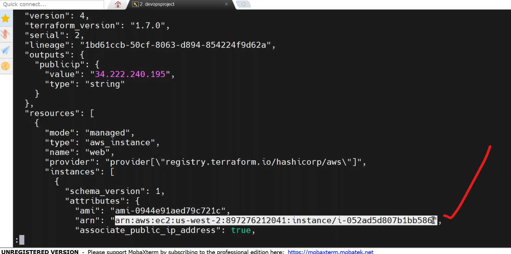
