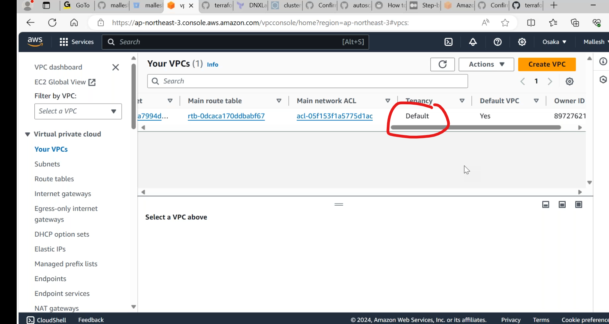
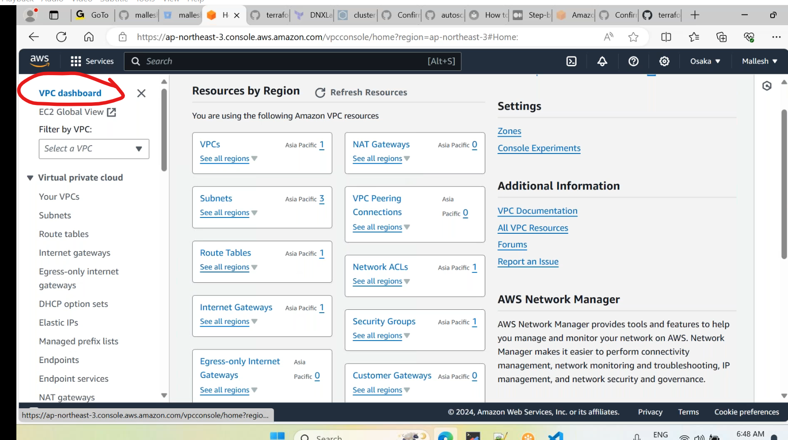
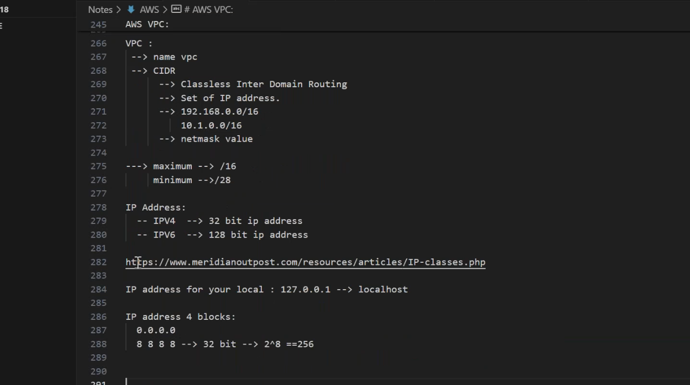
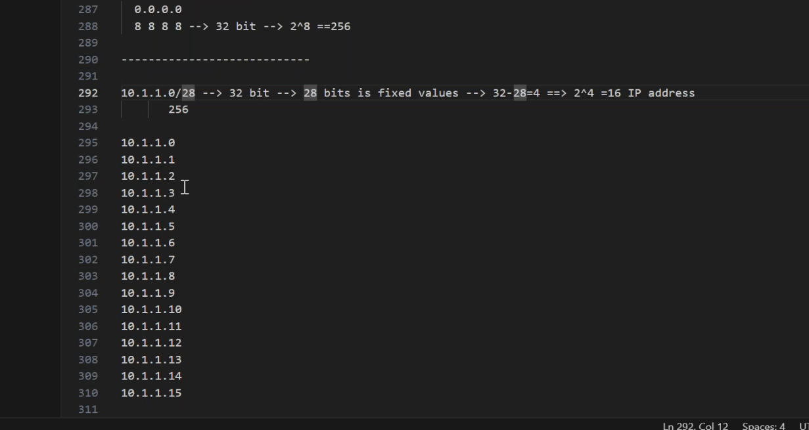
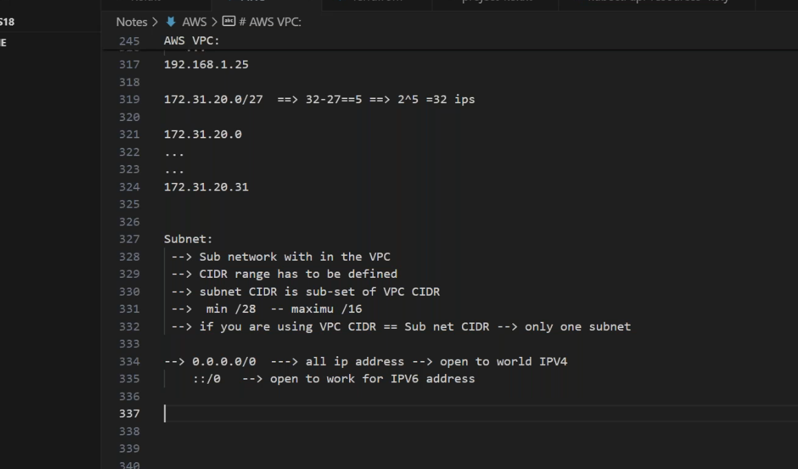

## AWS VPC
------------------------------------
* virtual private cloud
* an isolated environment for our application.
* its a regional service.
* every region have default vpc.

* `5` vpcs willbe created ina single region.
* [Refer Here](https://ap-south-1.console.aws.amazon.com/servicequotas/home/dashboard) aws resources quotas.
* 
* [Refere Here](https://docs.aws.amazon.com/vpc/latest/userguide/what-is-amazon-vpc.html) for vpc docs.
* `0.0.0.0/0` means expose to internet.
### ip address
--------------------------
* types of ipaddresses
   * ipv4 - 32 bit
   * ipv6 - 12 bit 
 * [Refer Here](https://www.meridianoutpost.com/resources/articles/IP-classes.php) for ip classes.
  
  
  