 VPC Coninued..(18/03/2024)
------------------------------------
* VPC flow
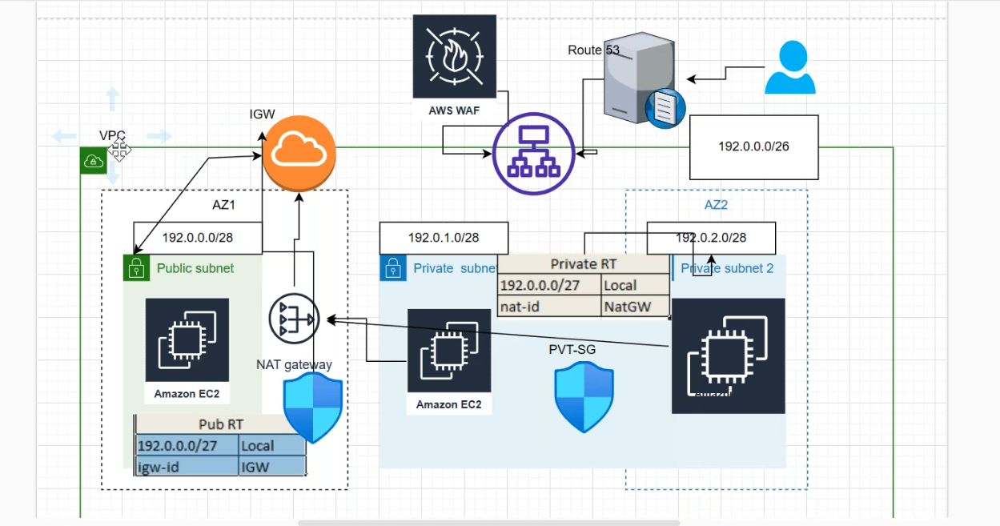

1. create vpc with cidr of `10.0.1.0/26`.
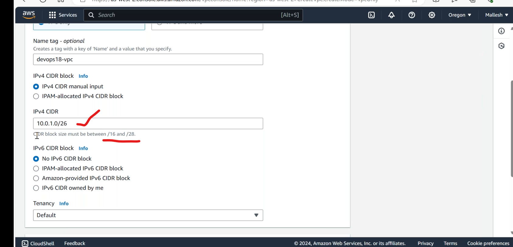
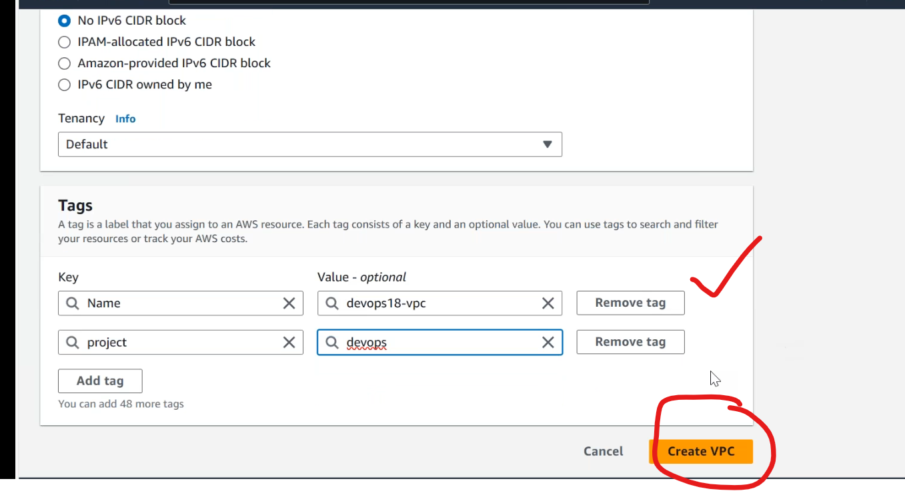
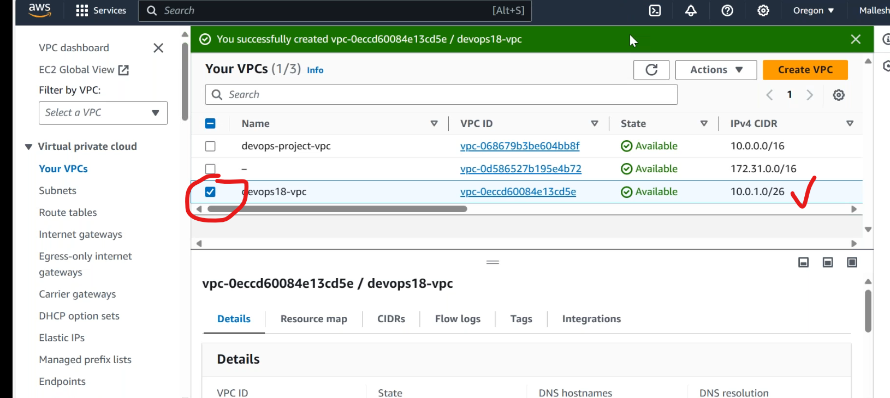

2. create 4 subnets
      * public1-`10.0.1.0/28`
      * public2-`10.0.1.16/28`
      * private1-`10.0.1.31/28`
      * private2-`10.0.1.47/28`
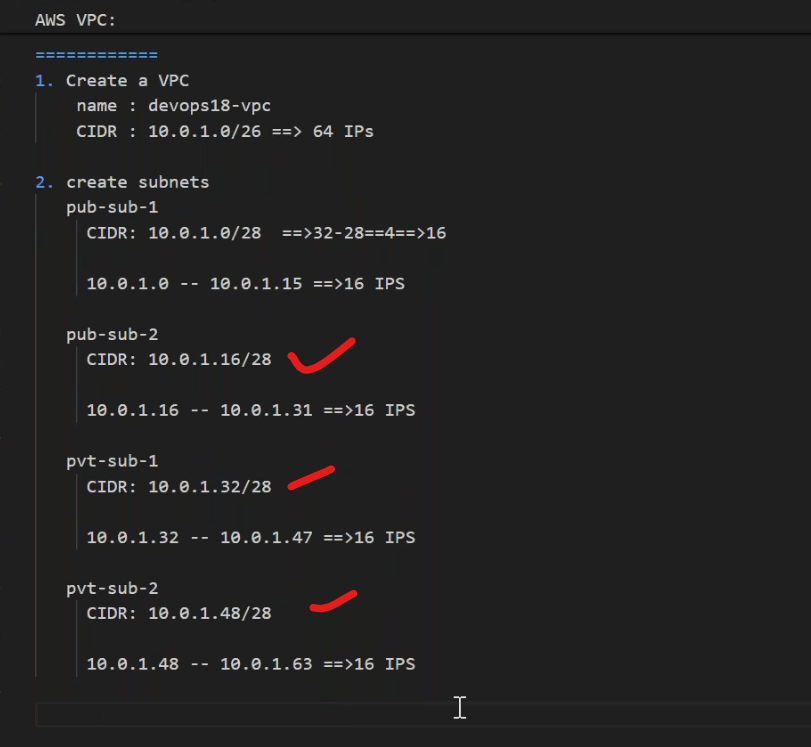
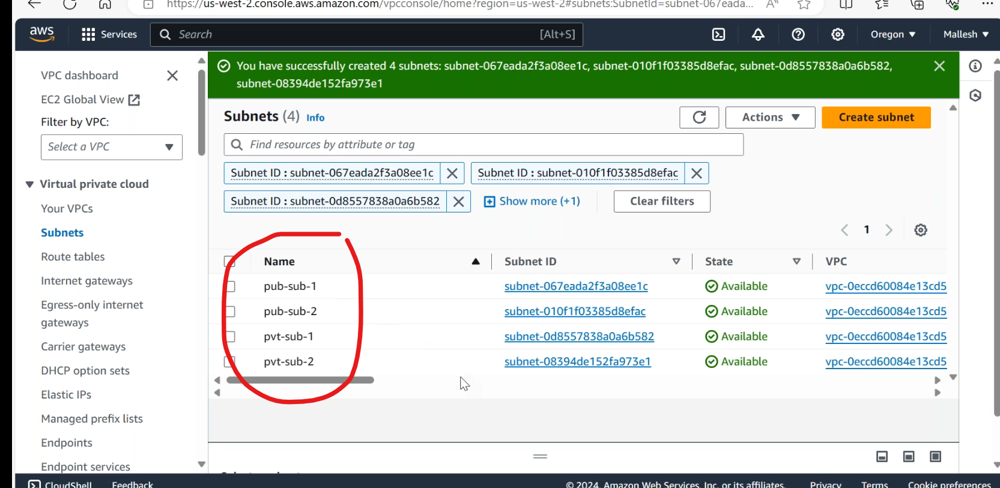
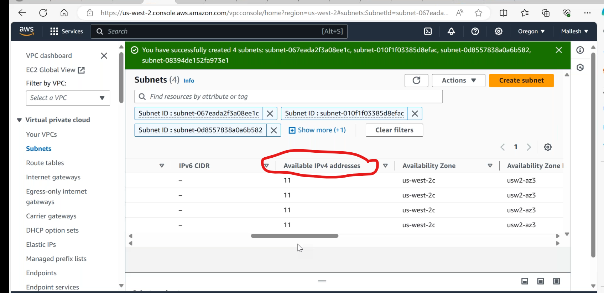
* [Refere Here](https://docs.aws.amazon.com/vpc/latest/userguide/subnet-sizing.html) for reserved subnets.

* by default one routing table can be created.
* lets create a one manual routing table.

* every vpc has default security group created.
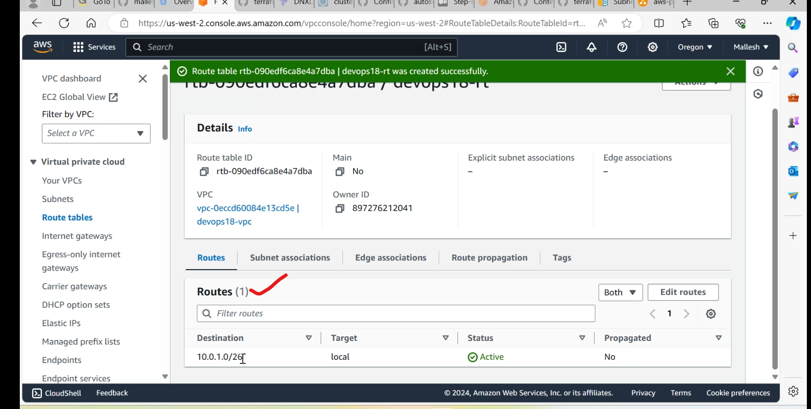
* create a ec2 instance with our custom vpc,in sg open ssh,and launch instance.
* when we access the public ip of instance in terminal,it was not connected,because of no internetgateway to the vpc.
* lets create a internet gateway.
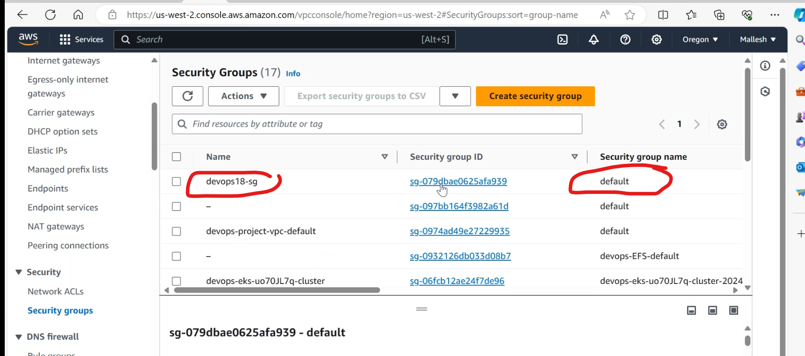
* attach to vpc
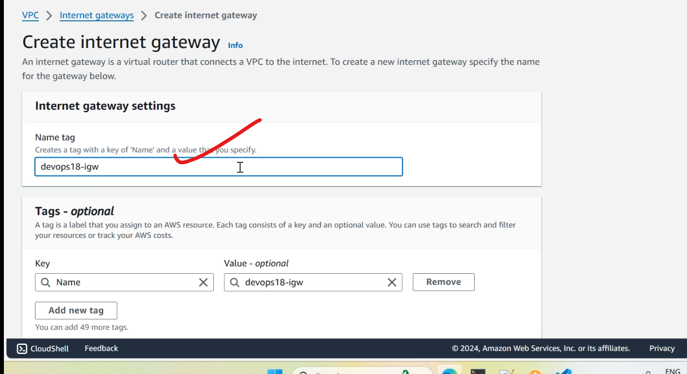
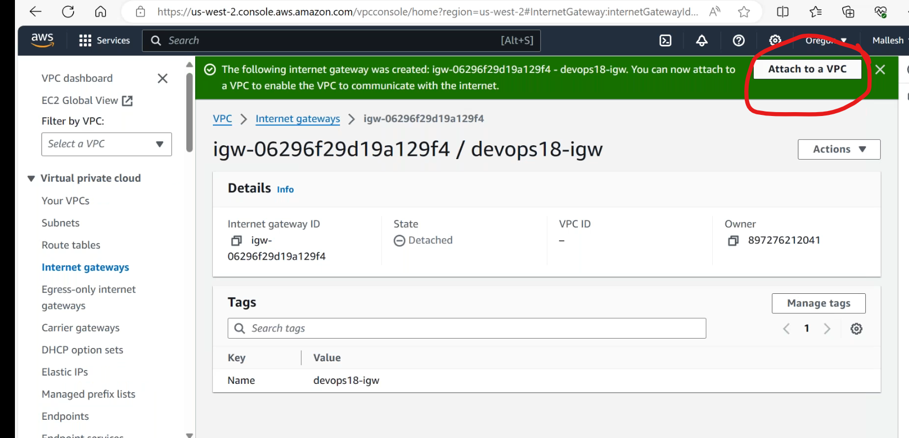
* only one vpc can attach to one IGW.
* now lets try to connect ec2 instance from terminal.again it is not connected,the problem with route table.
* add a route in routing table 

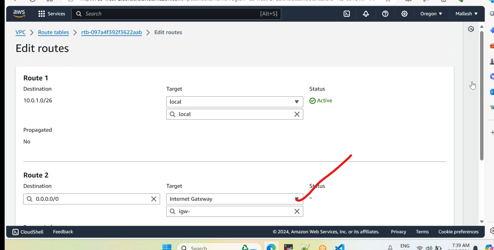
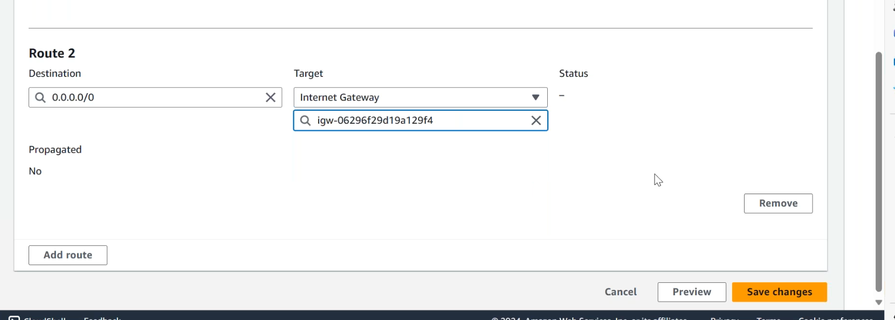

