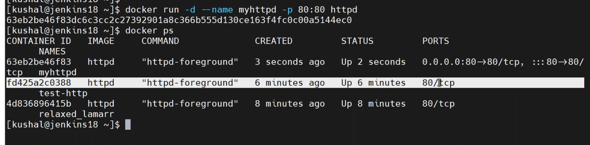
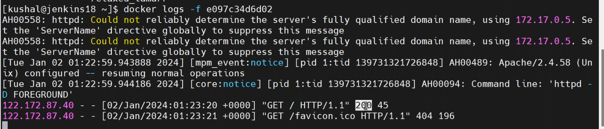
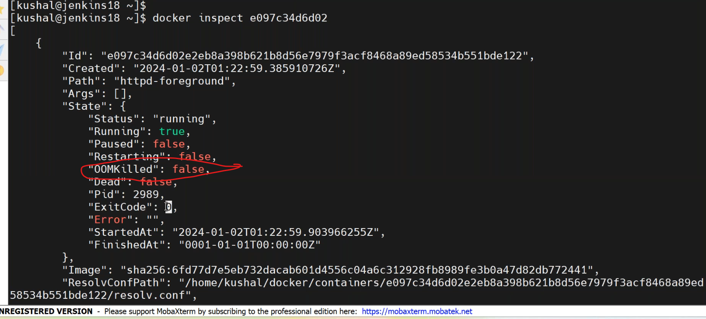
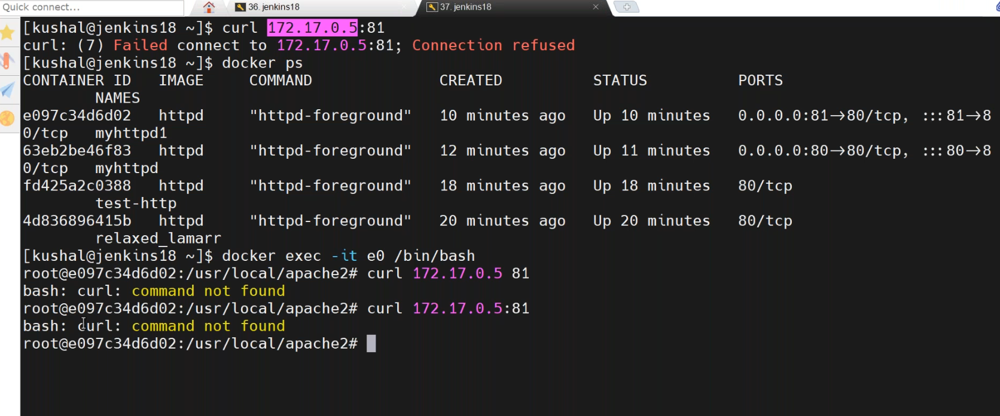
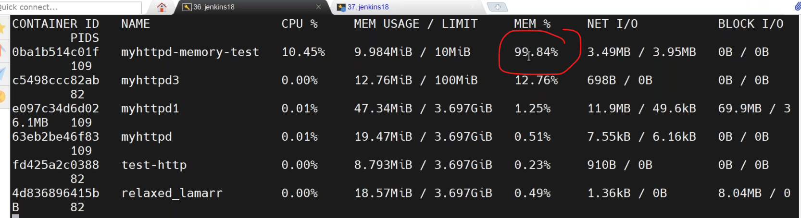
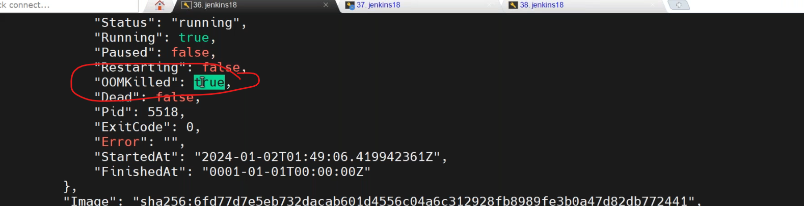
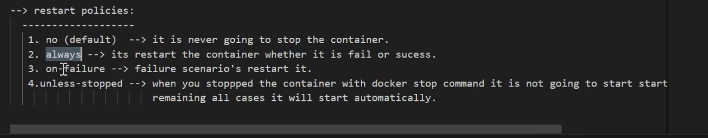
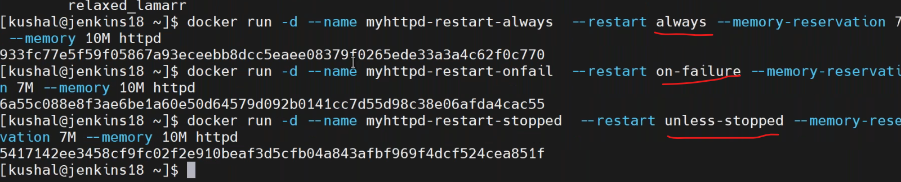
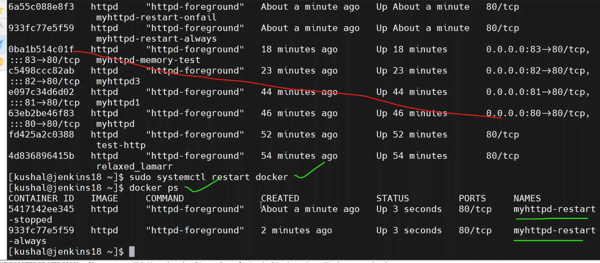
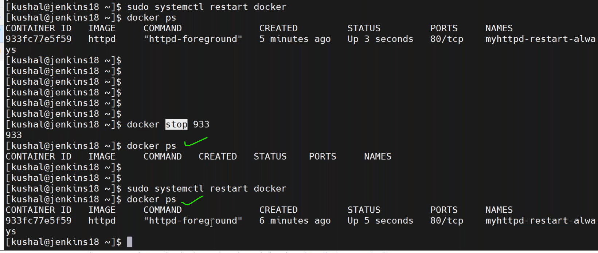

## 02/01/2024
------------------------
* [refere here](https://labs.play-with-docker.com/) for docker playground.
### Port Forwarding
-------------------

* docker commands used today
``````
docker container logs <containerid>
docker container inspect <conatinerid>
docker container exec -it <container-id> /bin/bash
docker container run -d --name mynginx -P --memory-reservation 10M --memory 50M nginx
docker stats
``````


* to entering into container

* infinity loop
```
`while true;do curl <ip-addr>:port ;done`
```


* container restart policies




