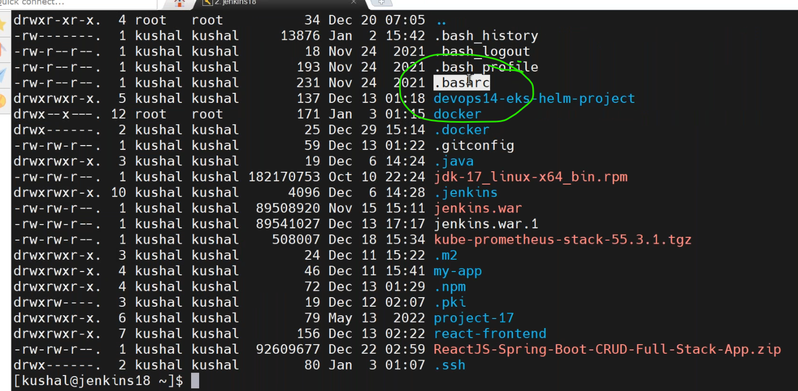
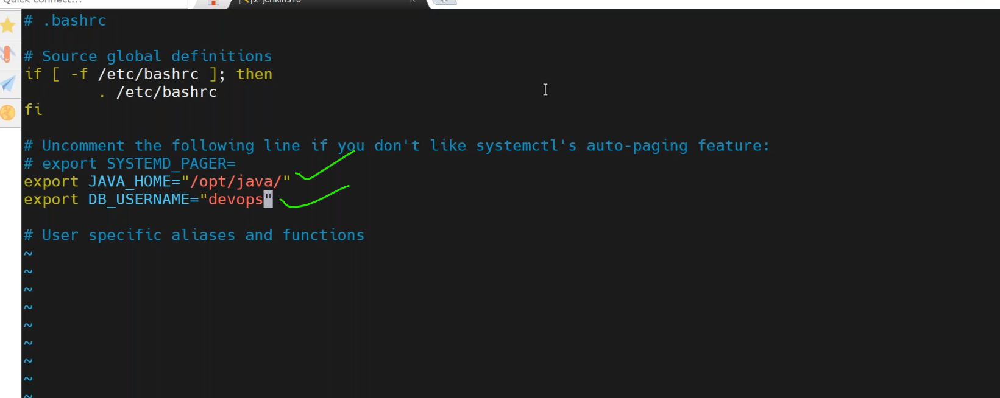
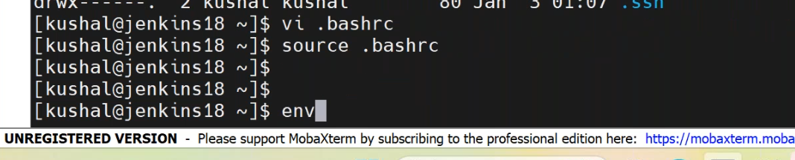
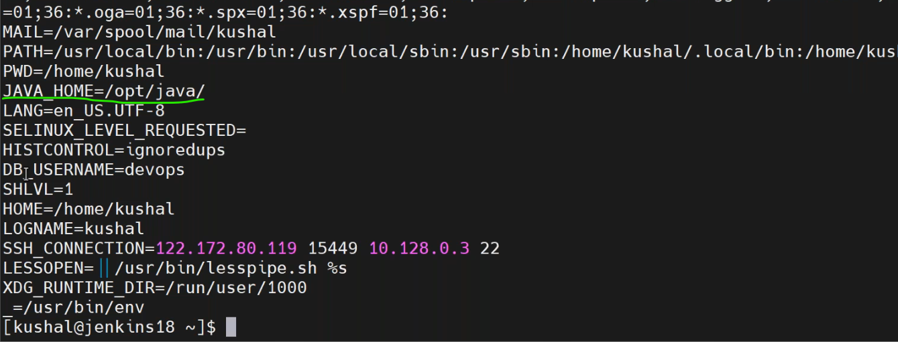
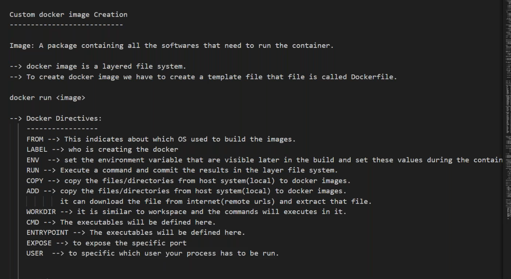
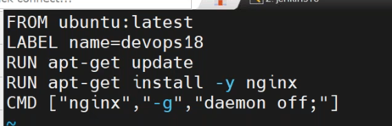
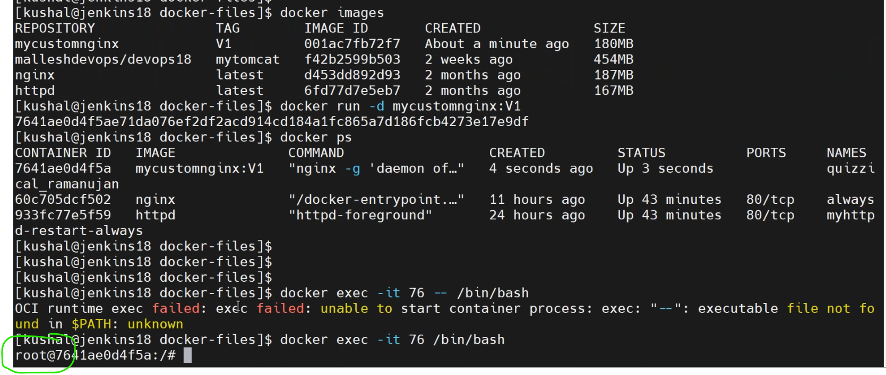
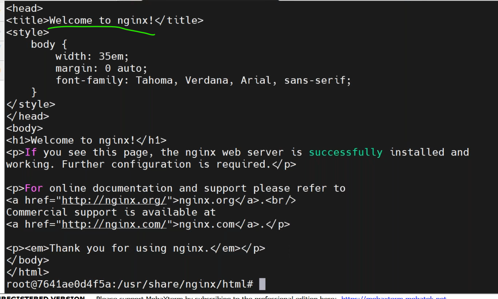
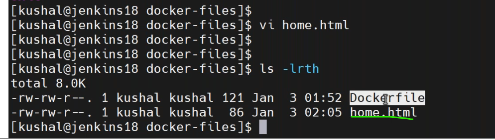
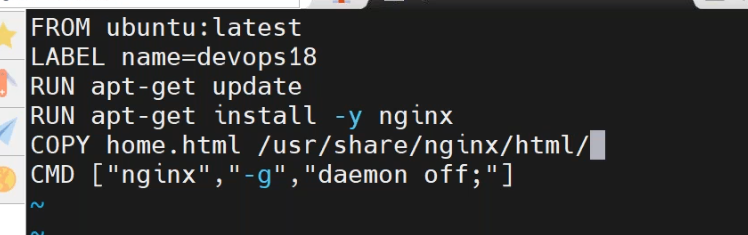

## 03/01/2024
--------------------- 
### docker image creation
-------------------------

* Environment variables setup.
   * in home directory `ls -al`

* `vi .bashrc` edit the file and define environmental variables.
* after that `source .bashrc`.
* check `env`.



* [refere here](https://docs.docker.com/engine/reference/builder/) official docs of dockerfile

* create dokerfile for nginx.


* to build image
``````
docker iamge build -t nginx:1.0 .
docker image ls
docker image history <dockerimage-id>
docker container run -d - P nginx:1.0
docker container ls

``````



* create new html file
* `vi home.html`
``````
<html>
<h1> welcome to docker image creation </h1>
</html>
``````

* `vi Dockerfile`

* `docker image build -t nginx:2.0 .`
* `docker container run -d -P nginx:2.0`
  
