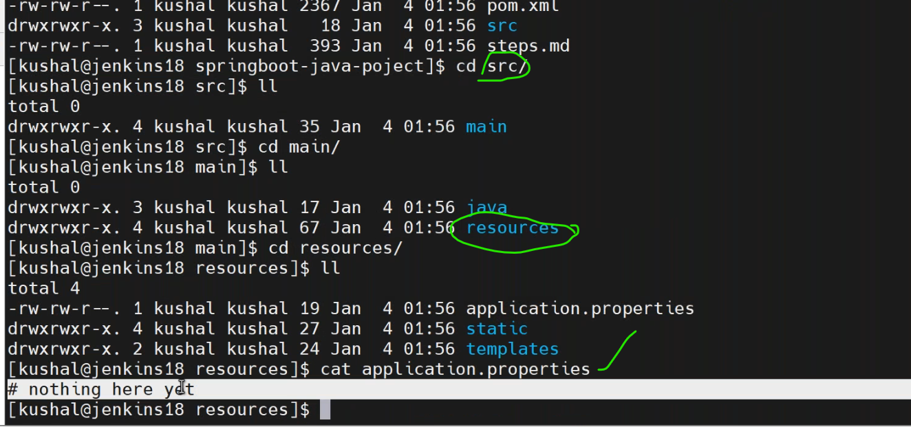
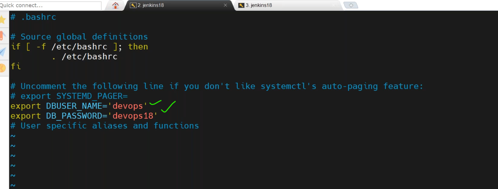
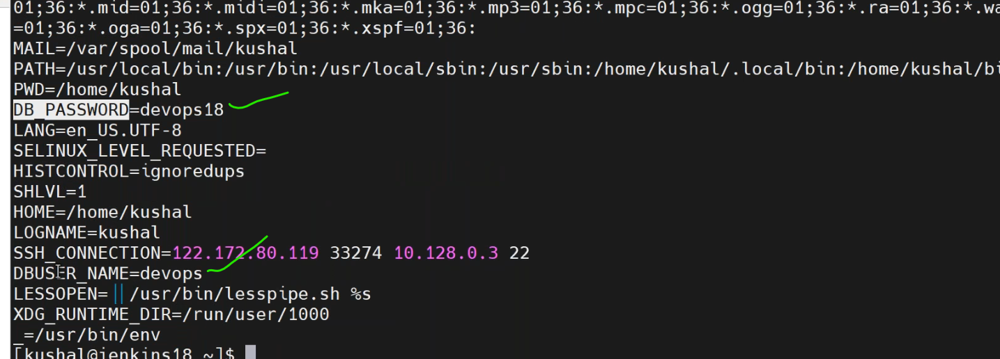
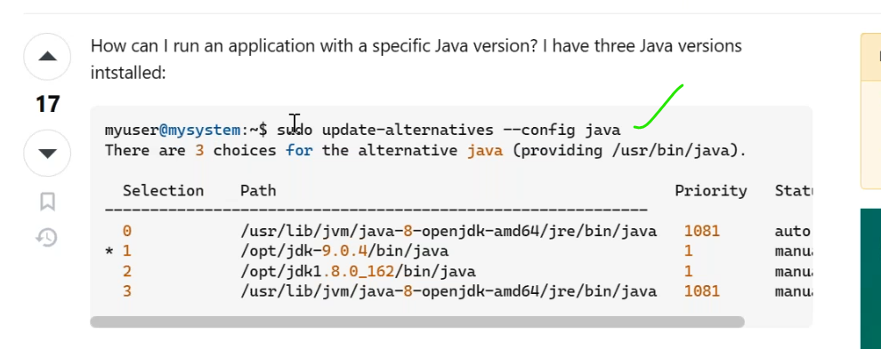
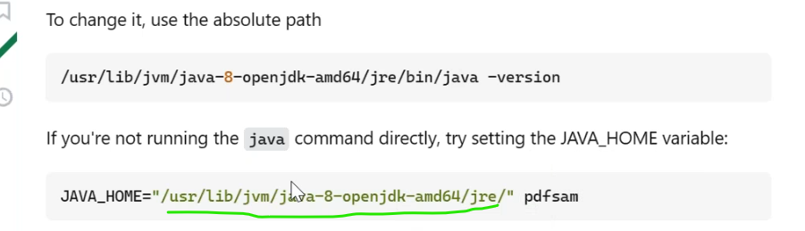
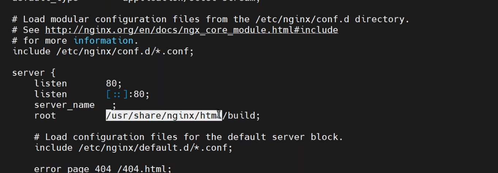
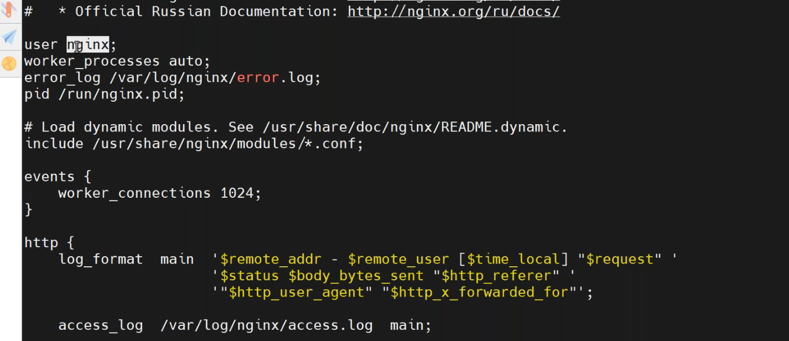

## 05/01/2024
-------------------------
* application need username,password to connect database.developers defined these credintials in properties file.

* to set enviromental variables edit the __.bashrc__ folder.

``
vi .bashrc
``
  


``````
source .bashrc
. .bashrc
``````


### Environment- multiple java versions

* In our os only one default version.
* to work our application with multiple versions,expose it as a environment variable.
``````
JAVA_HOME="/opt/openjdk11" <path of java version>
``````


* [refere here](https://stackoverflow.com/questions/50463766/how-to-run-an-application-on-a-specific-java-version)


### Reactjs application
------------------------
* git clone <paste the url>.
* check the npm version __npm -version__.
``````
cd reactjs
ls -al
npm install
npm init
npm run build 
``````
* check for nginx.
* nginx path in configuration file.

* when we do `npm run build`, it generates __build__ folder.
* this __build__ folder copy to the `/usr/share/nginx/html/`,then restart nginx. 

* write a Dockerfile to it.
``````bash
FROM ubuntu:latest
LABEL reactjs-app
RUN apt-get update
RUN apt-get install nginx -y
COPY build /usr/share/nginx/html
COPY nginx.conf /etc/nginx/nginx.conf
CMD ["nginx","-g","daemon off;"]
``````
* create a Dockerfile and copy it.
``````
docker image build -t myreactjs:1.0 .
docker image ls
docker container run -d -P myreactjs:1.0
docker container ls -a
docker container logs <container-id>
``````

* modify Dockerfile
``````bash
FROM ubuntu:latest
LABEL reactjs-app
RUN apt-get update
RUN apt-get install nginx -y
RUN useradd nginx
COPY build /usr/share/nginx/html
COPY nginx.conf /etc/nginx/nginx.conf
USER nginx
CMD ["nginx","-g","daemon off;"]
``````
* again build image run container and check, it is not running.

* again modify
``````bash
FROM ubuntu:latest
LABEL reactjs-app
RUN apt-get update
RUN apt-get install nginx -y
RUN useradd nginx
COPY build /usr/share/nginx/html
COPY nginx.conf /etc/nginx/nginx.conf
CMD ["nginx","-g","daemon off;"]
``````
* again built the image and run the container.
* check <publicip:port>

### Multi-stage for reactjs
----------------------------
* Dockerfile
``````bash
# build environment
FROM node:13 as build
WORKDIR /app
ENV PATH /app/node_modules/.bin:$PATH
COPY package.json ./
COPY package-lock.json ./
RUN npm install --silent
RUN npm install react-scripts@3.4.1 -g --silent
COPY . ./
RUN npm run build 

# production environment
FROM nginx:stable-alpine
COPY --from=build /app/build /usr/share/nginx/html
EXPOSE 80
CMD ["nginx","-g","daemon off;"]
``````
* build a new image.
``````
docker image build -t myreact-multi:1.0 .
docker image ls
docker container run -d -P myreact-multi:1.0
docker container ls
``````
* <publicip:port>


