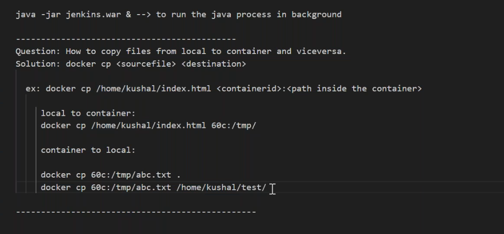
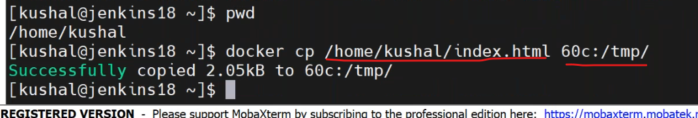
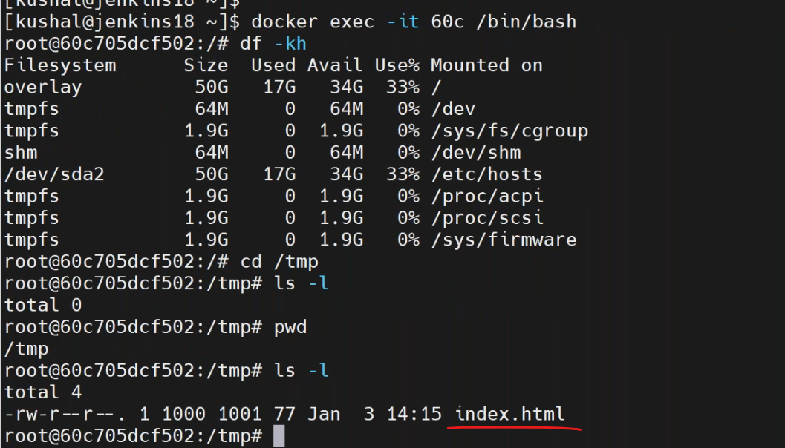
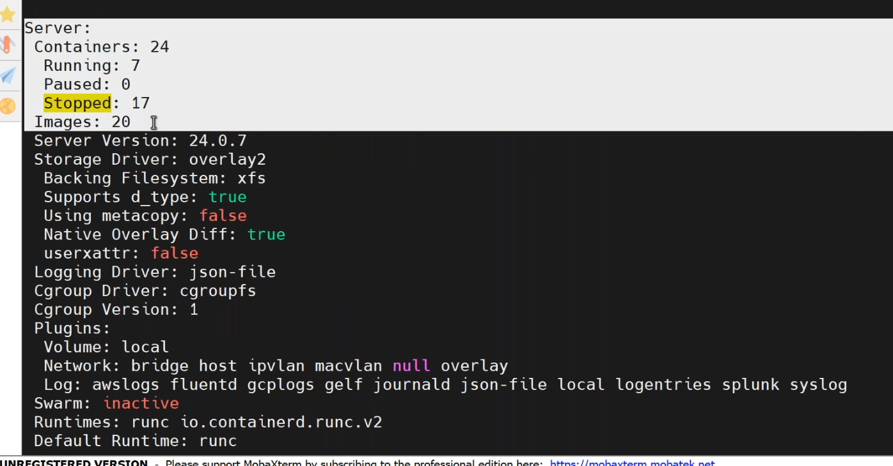
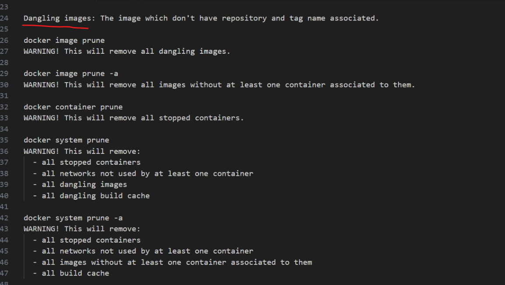

## 06/01/2024
------------------------
* copy files from host to conatiner and container to host viceversa.



* to check logs or activities
``````
docker events
docker event --help
``````

* to check how many containers run in host.
``````
docker info
docker stats
``````

* to know host entire docker containetrs storage ,to delete images,containers,volumes entire.
``````
docker system df
docker image prune
docker image prune -a
docker container prune
docker system prune 
docker system prune -a
docker image rm $(docker image ls -a -q)
docker container rm -f $(docker container ls -a -q)
``````
* the image which has no repo and no tag associated is called `dangling image`

* differece between __COPY__ and __ADD__.?
  

