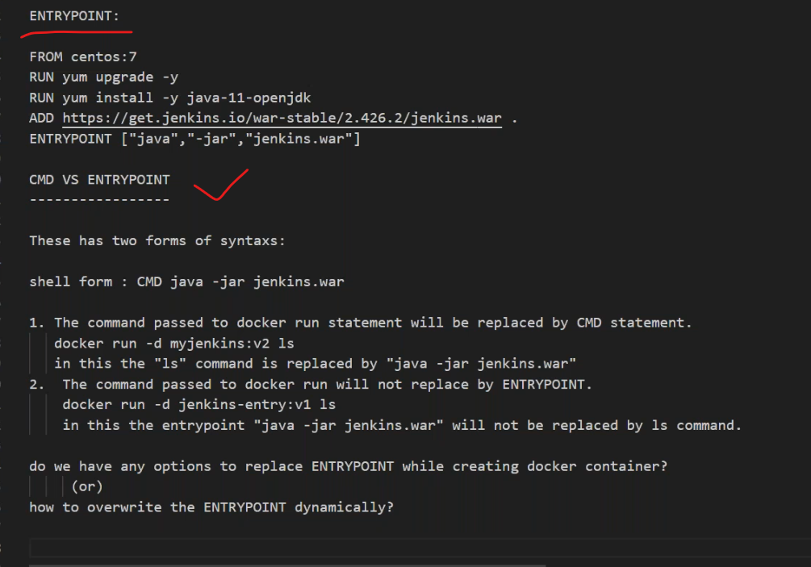
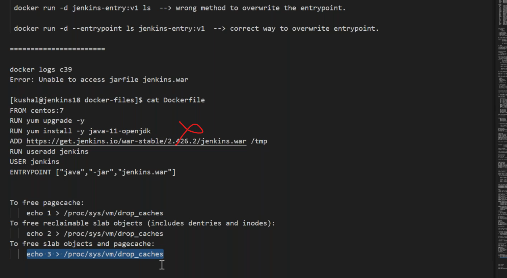
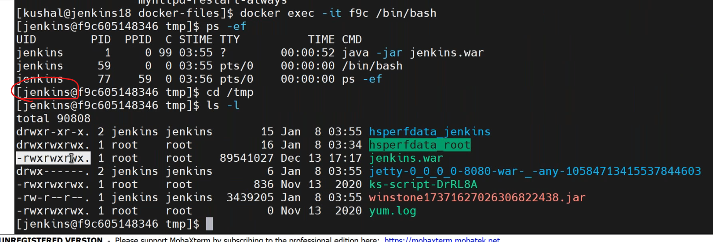
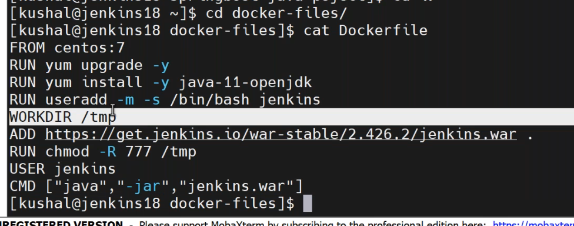
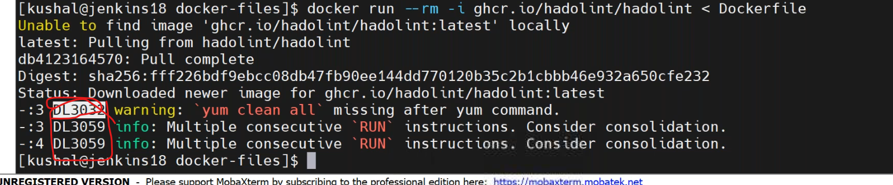
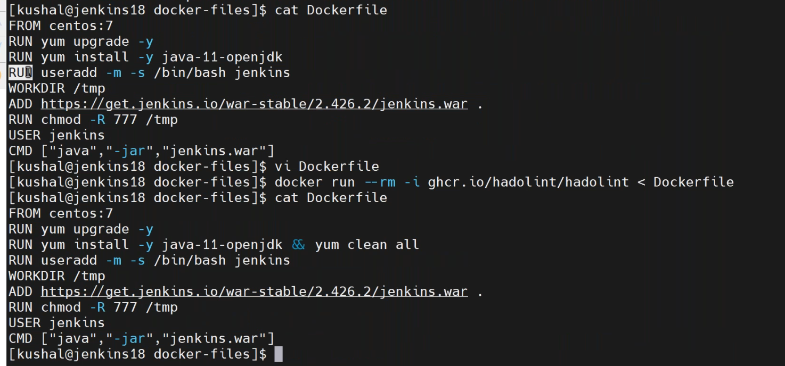
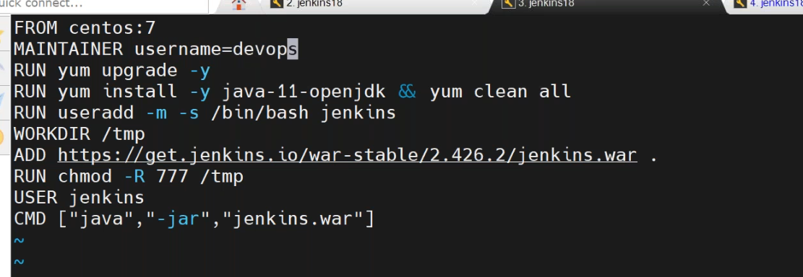
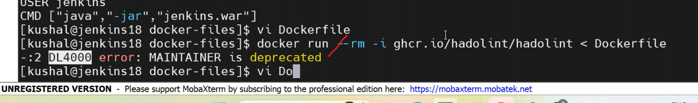
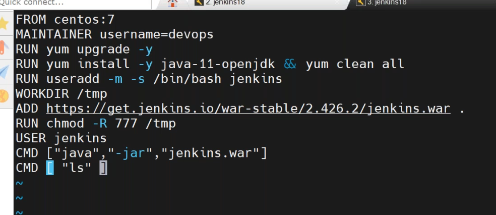
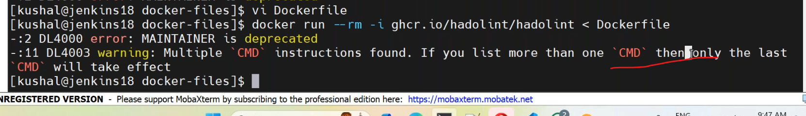

## 08/01/2024
-----------------------
* __CMD__ vs __ENTRYPOINT__.
* to know history.
``````
docker history <container-id>
``````





### docker linting
---------------------
* [refer here](https://docs.docker.com/develop/develop-images/guidelines/).
* we have to use some kind of tool to validate Dockerfile called docker linting.
* __Hadolint__ used to validate dockerfile.
* [refere here](https://github.com/hadolint/hadolint) for hadolint.
* [refer here](https://hub.docker.com/r/hadolint/hadolint) hadolint docker image.







