# EKS(Elastic k8s Service)
-------------------------------------------
* [Refer Here](https://docs.aws.amazon.com/eks/latest/userguide/what-is-eks.html) for official docs of EKS.

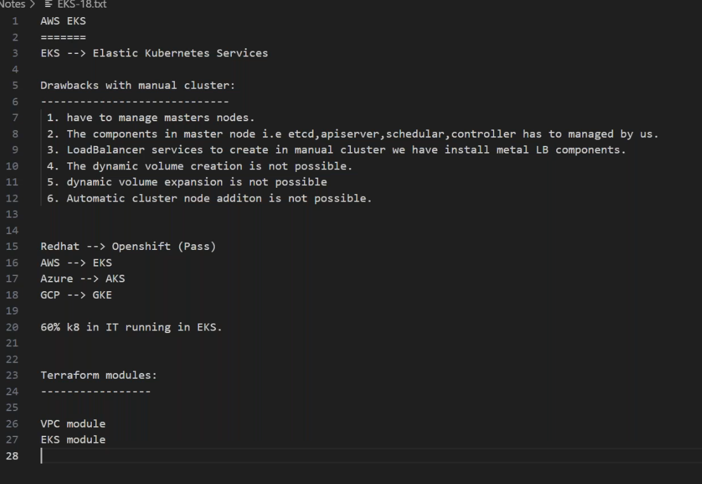
### EKS Architecture
------------------------------

1. create a __bastion server__ to execute our terraform template to create EKS cluster, ensure only port 22(SSH) will be opened in security group.
    * connect the bastion server to github by ssh authentication.


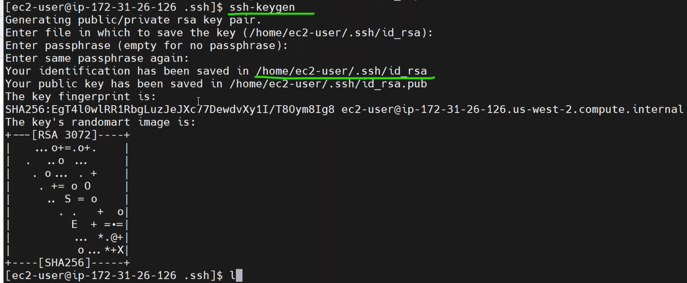
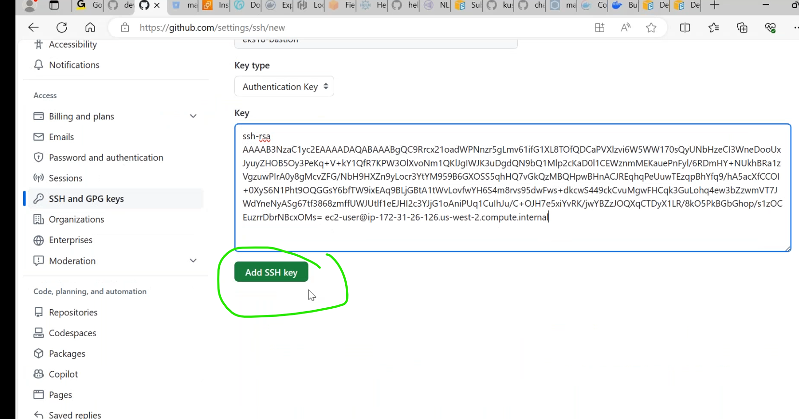
* [Refer Here](https://github.com/devops17-Talent/eks17) git repo.


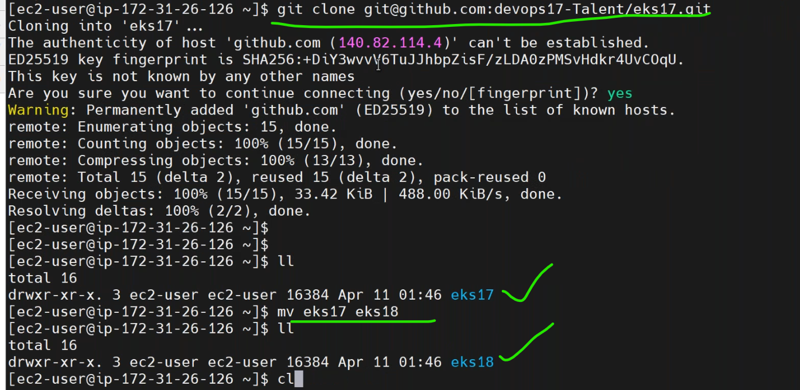
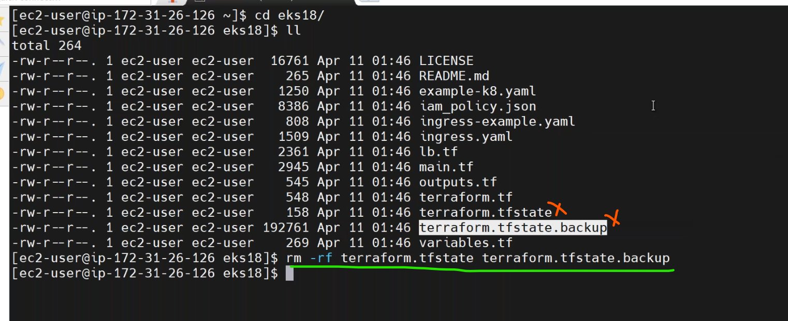

2. install terraform in the bastion server.
   * [Refer Here](https://developer.hashicorp.com/terraform/tutorials/aws-get-started/install-cli) for amazon linux.
   * [Refer Here](https://registry.terraform.io/providers/hashicorp/random/latest/docs) for `random`.
* execute the terraform script by,
```
terraform init
terraform validate
terraform plan
terraform apply --auto-approve
```
* we got an error with credintials.
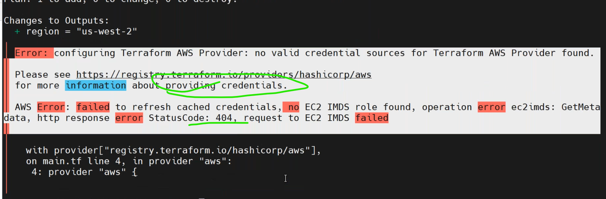
* here we have two solutions.
  1. configure aws cli.
   * for that install aws cli [Refer Here](https://docs.aws.amazon.com/cli/latest/userguide/getting-started-install.html).
  2. attach `Iam Role` to the Bastion server.give admin access to the role.
   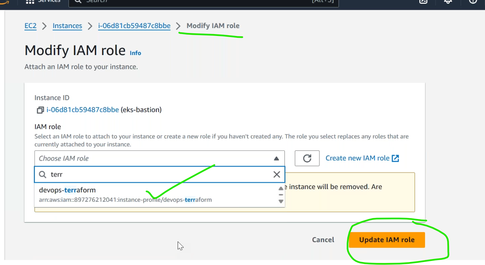
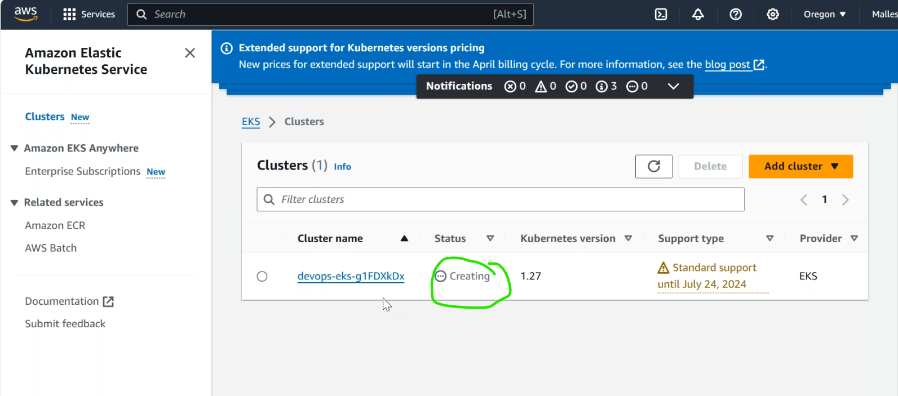
### accessing eks from bastion machine
--------------------------------------------------
* if we want to communicate with eks cluster,we need to have a client(kubectl).
* to install `kubectl` for amazon linux [Refer Here](https://docs.aws.amazon.com/eks/latest/userguide/install-kubectl.html).
```
kubectl version --client
```
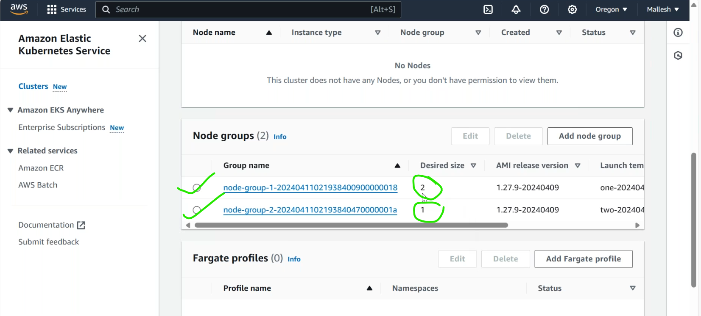

* install aws cliv2 [Refer Here](https://docs.aws.amazon.com/cli/latest/userguide/getting-started-install.html)

* connect the eks cluster from bastion machine by,
```
aws eks update-kubeconfig --region region-code --name my-cluster
aws eks update-kubeconfig --region us-west-2 --name devops-eks
```
* after execute this command `.kube` folder getting created.
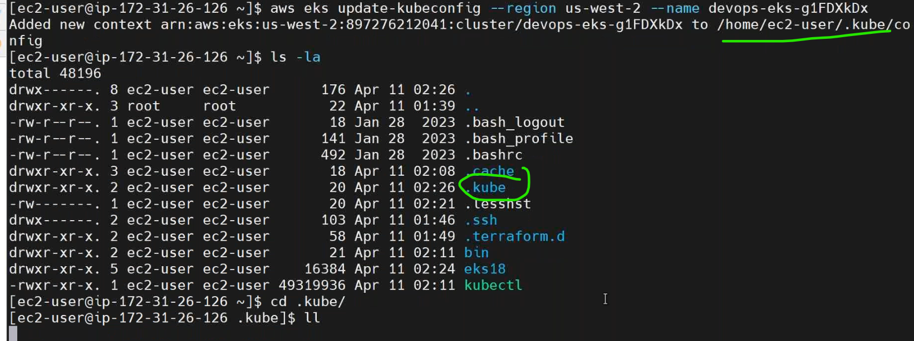
* execute `kubectl get nodes`.
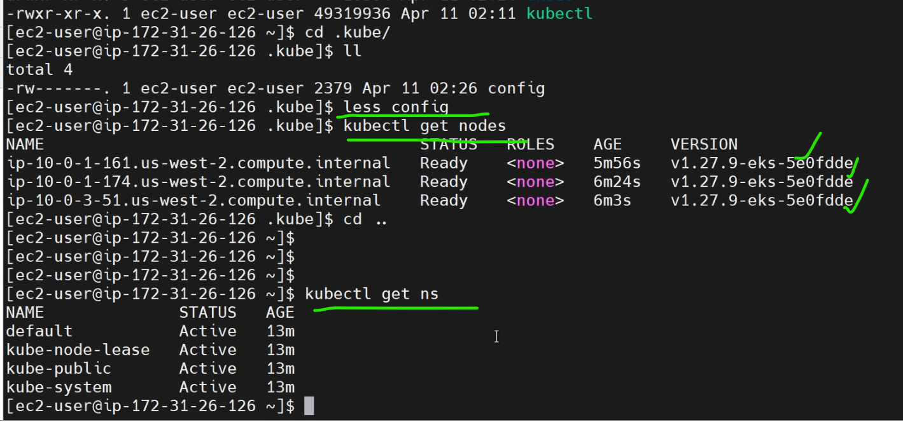
* connect to cluster not only from bastion machine but also anywhere,where `.kube` is present.
* for local laptop.
 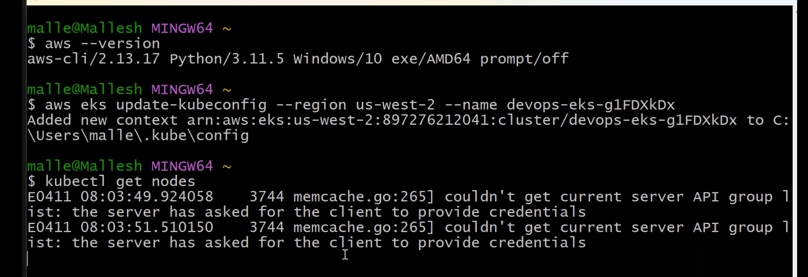


