promethues
-----------------------------------
* this is monitoring tool.developed in go language.
  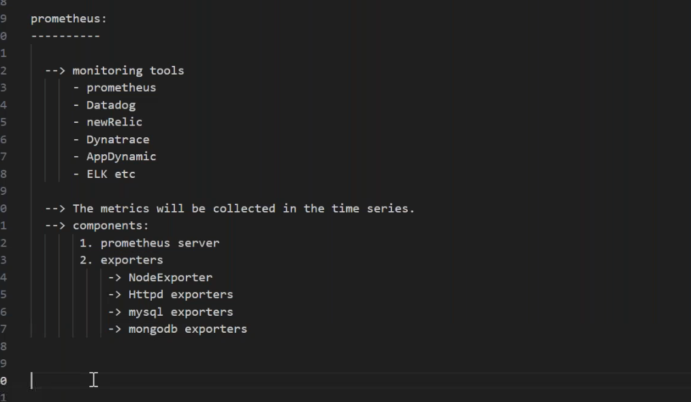
* [Refer Here](https://prometheus.io/) for official docs.
* componets in prometheus [Refere Here](https://prometheus.io/docs/introduction/overview/).
* metrics are numerical measurements.to get the metrics is called __scraping__(to scrap metrics).
* `Architecture`:
* `TSDB`:__time series database__.
* we have to do configurations in targets in prometheus server to get the metrics__(service discovery)__.
* prometheus pull data from the exporters.
* node exporter will run as a daemonset. in each worker node.
* all the components of prometheus running as `pods`.
* alert manager for alert notification.
  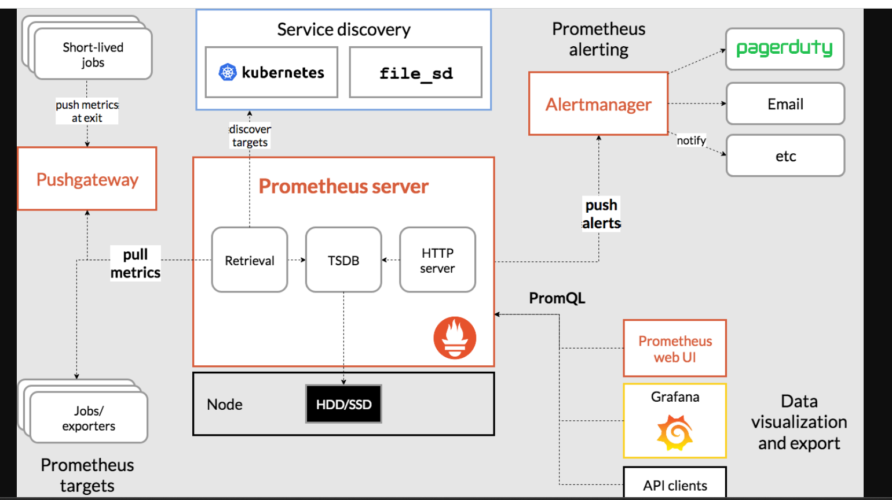

* prometheus will not collect `nodelevel` details directly.we deploy `node exporter` in each workernode.
* we use `shell script` to hit the url and get the responses.pushgateways will worked on external scripts.
* we use `helmcharts` to install `prometheus`.
* [Refer Here](https://github.com/prometheus-community/helm-charts/tree/main/charts/kube-prometheus-stack) for helmcharts.
* [Refer Here](https://artifacthub.io/packages/helm/prometheus-community/kube-prometheus-stack) for Artifacthub.
* to download it to bastion machine helm source of prometheus [Refer Here](https://github.com/prometheus-community/helm-charts).
```
git clone https://github.com/prometheus-community/helm-charts.git
```
 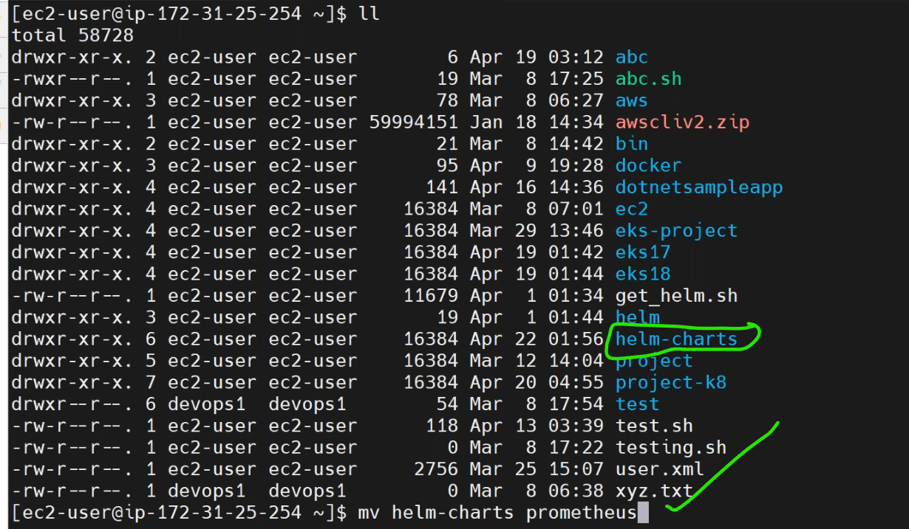
 ### to create helm charts by the command
```
helm create <chart-name>
```
* [Refer Here](https://prometheus.io/docs/instrumenting/exporters/) for exporters.

 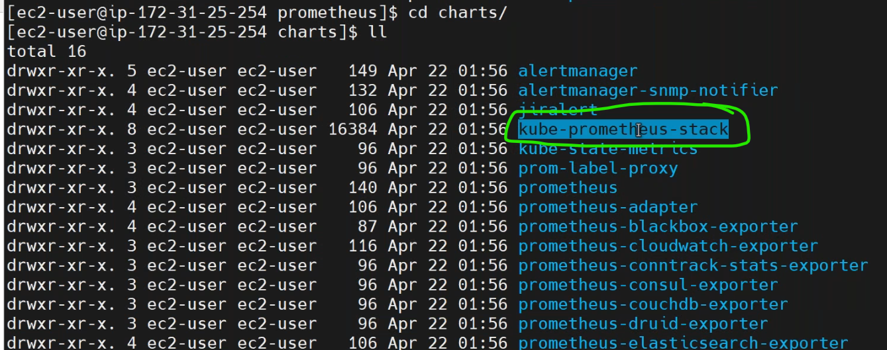
  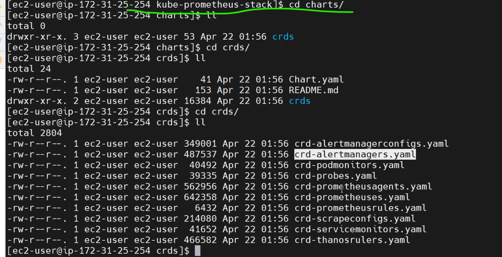

* `less charts.yaml`:
  
  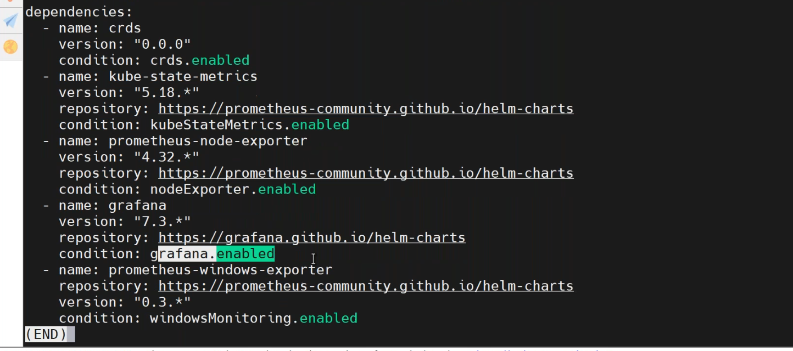
* to modify values `vi values.yaml`.
  
  
* to install helm charts.
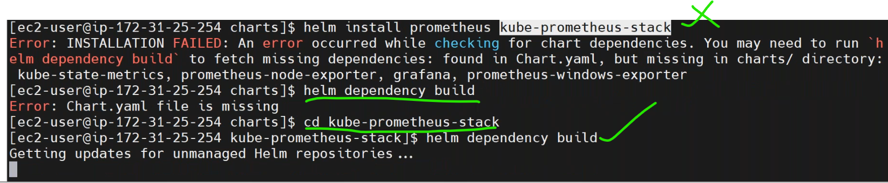
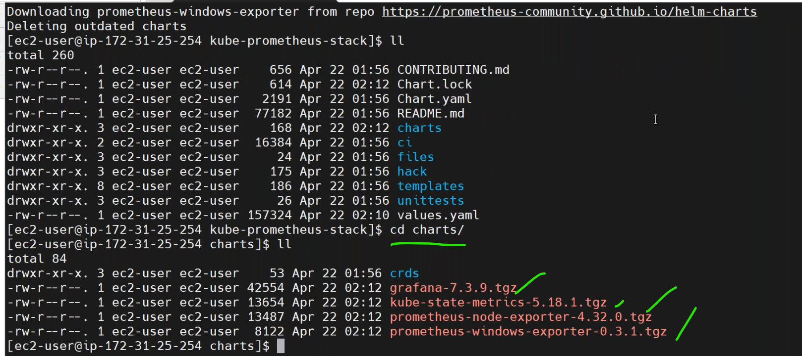
* `stateful sets`(pending).
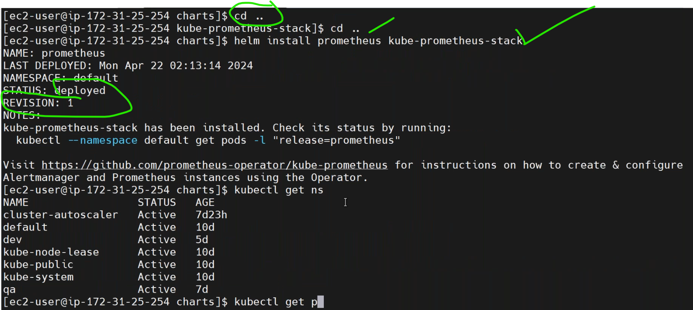
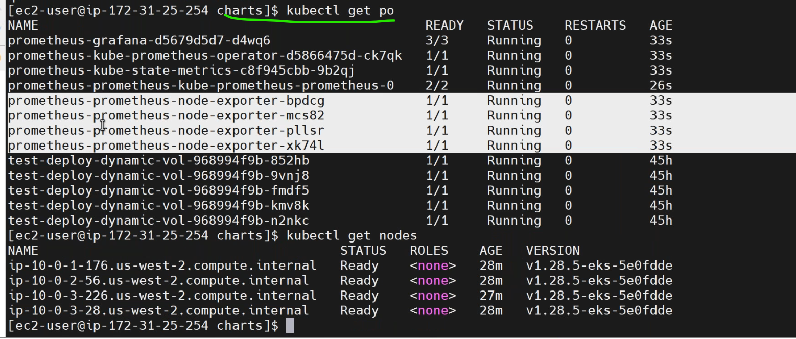
## ports
```
prometheus ui port - 9090
node exporter port - 9100

```

* to change the service type of prometheus pod of 9090 port to `clusterip` to `loadbalencer`.
```
kubectl edit <pod-name>
```
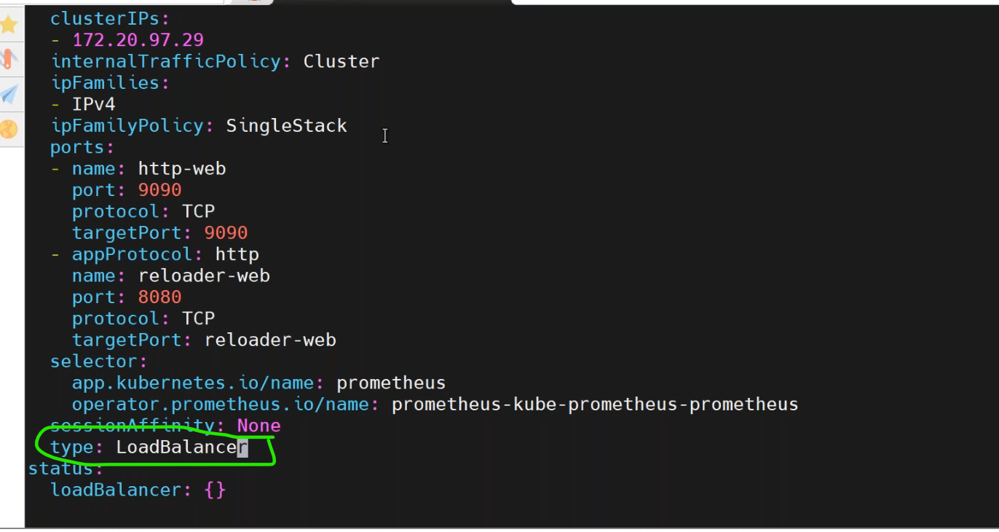

* `kubectl get svc`.
  
  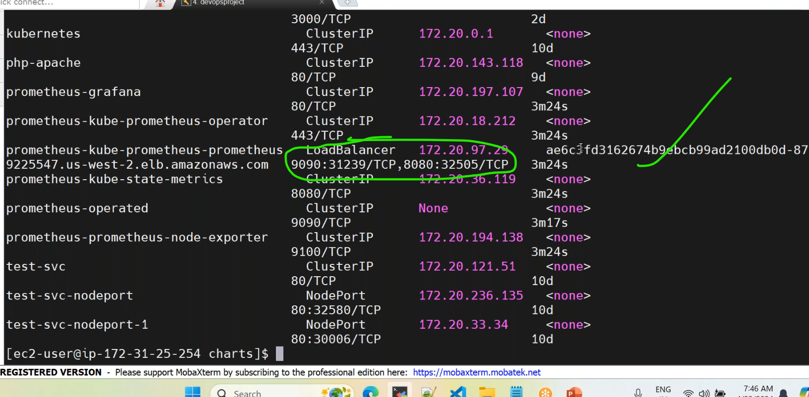
  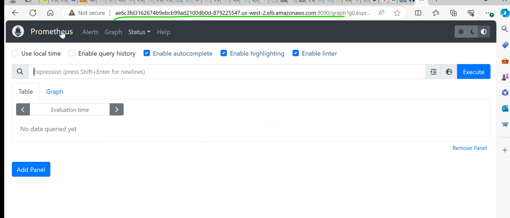
  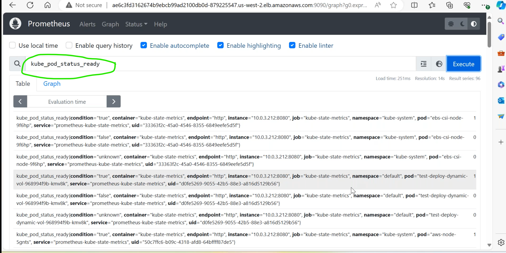
  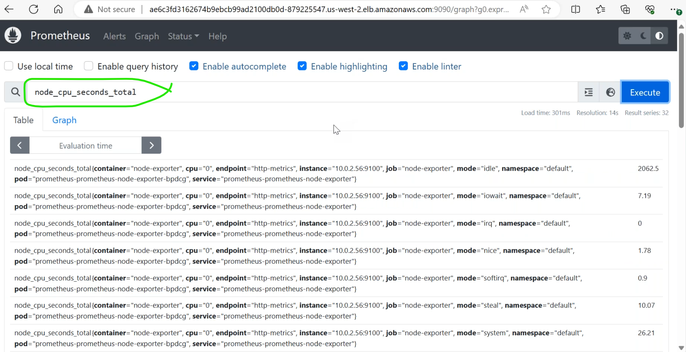
  