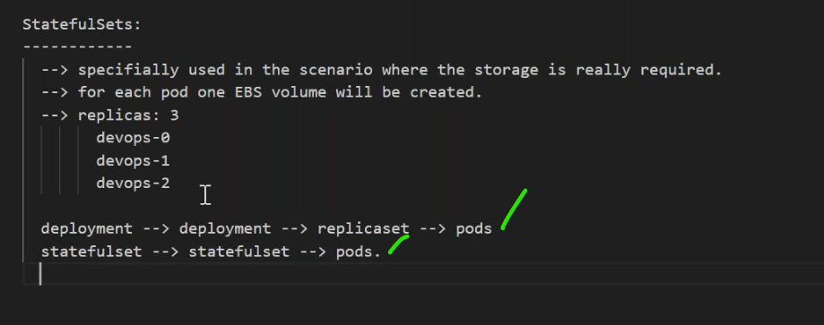
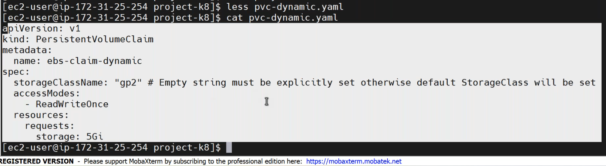
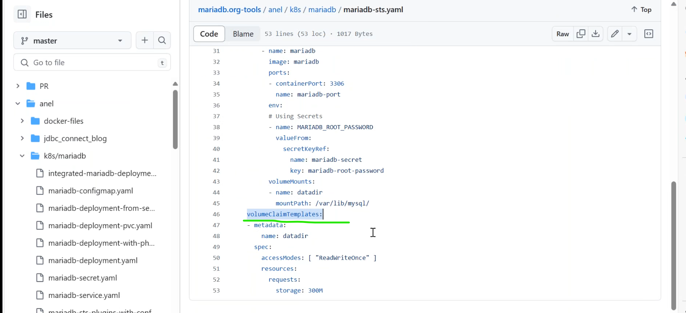
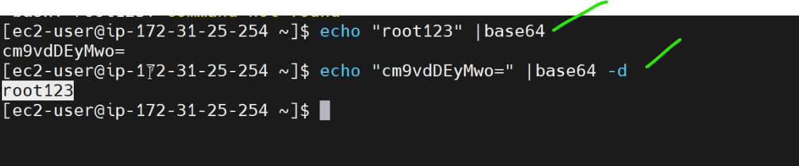
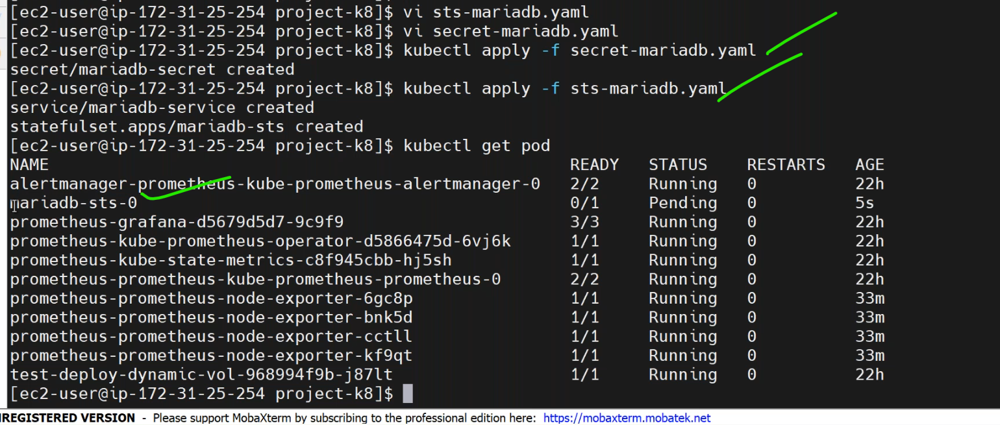
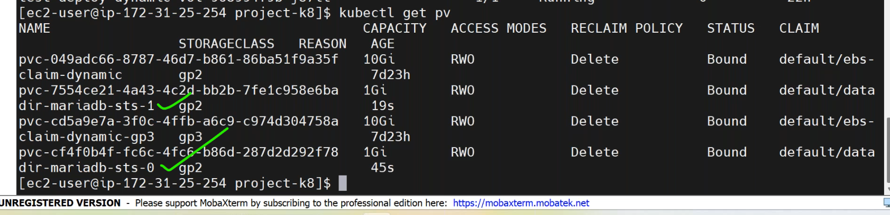
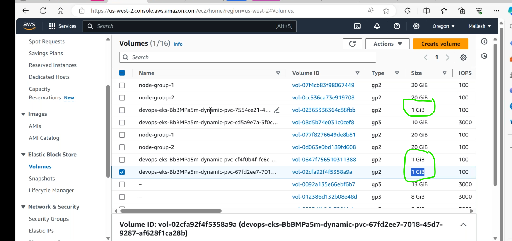
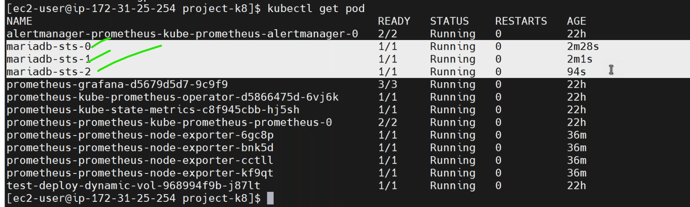
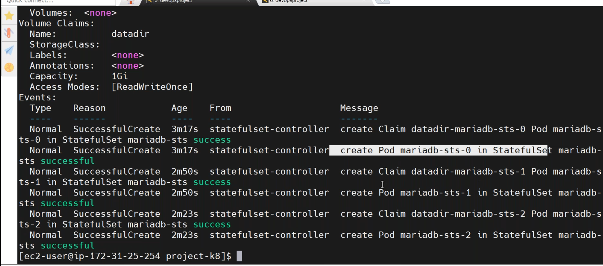
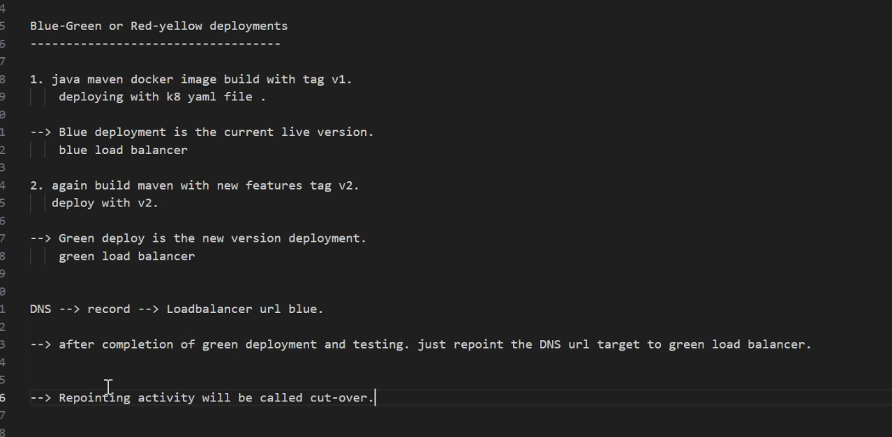

Stateful sets
--------------------------------------------------------
* `EBS volume` can be attached to different nodes in the cluster.the problem with this is if the deployment happens pods will be allocated to different nodes.
* if we want to use same storage by multiple pods we go with `elastic file share(EFS)`.
* 
### deploying mariadb as statefulset
---------------------------------------------------
* [Refer Here](https://mariadb.org/create-statefulset-mariadb-application-in-k8s/) for officail docs.
* [Refer Here](https://github.com/MariaDB/mariadb.org-tools/blob/master/anel/k8s/mariadb/mariadb-sts.yaml) for github.

* `pvc definition` directly added to statefulset as a template `volumeclaimtemplate`.
  
   

* `statefulset` is also looklike deployment.
```yaml
apiVersion: v1
kind: Service
metadata:
  name: mariadb-service   # service name same
  labels:
    app: mariadb
spec:
  ports:
  - port: 3306
    name: mariadb-port
  clusterIP: None
  selector:
    app: mariadb
---
apiVersion: apps/v1
kind: StatefulSet
metadata:
  name: mariadb-sts
spec:
  serviceName: "mariadb-service"  # service name will be same
  replicas: 3 # 3 independent ebs volumes created.
  selector:
    matchLabels:
      app: mariadb
  template:
    metadata:
      labels:
        app: mariadb
    spec:
      containers:
      - name: mariadb
        image: mariadb
        ports:
        - containerPort: 3306
          name: mariadb-port
        env:
        # Using Secrets
        - name: MARIADB_ROOT_PASSWORD
          valueFrom:
            secretKeyRef:
              name: mariadb-secret
              key: mariadb-root-password
        volumeMounts:
        - name: datadir
          mountPath: /var/lib/mysql/
  volumeClaimTemplates:  # volumeclaim
  - metadata:
      name: datadir
    spec:
      accessModes: [ "ReadWriteOnce" ]
      resources:
        requests:
          storage: 300M
```
* to create secret file for mariadb login credintials `vi mariadb-secret.yaml`.
```yaml
apiVersion: v1
kind: Secret
metadata:
    name: mariadb-secret
type: Opaque
data:
  mariadb-root-password: c2VjcmV0 ## echo -n 'secret'|base64
```
* default username for mariadb is `root`.






* to know stateful sets `kubectl get sts`.
  
# Blue/Green Deployment
-----------------------------------------------


