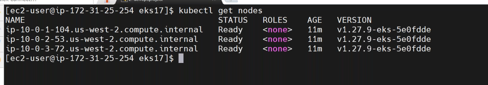
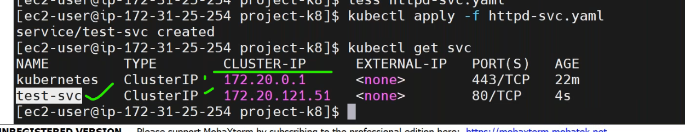
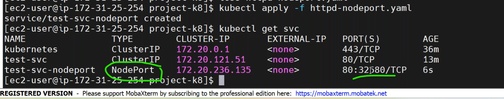
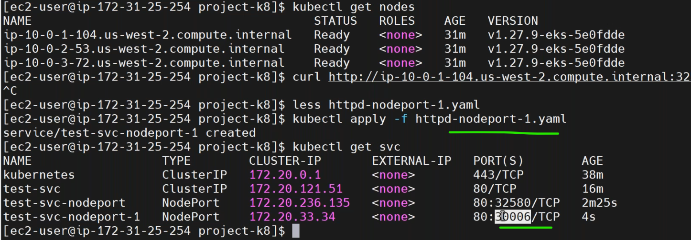
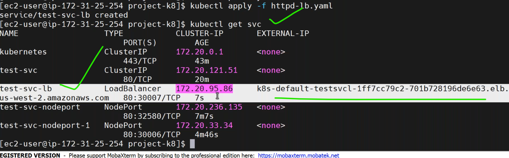
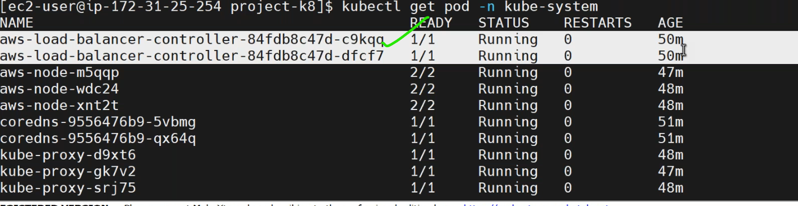
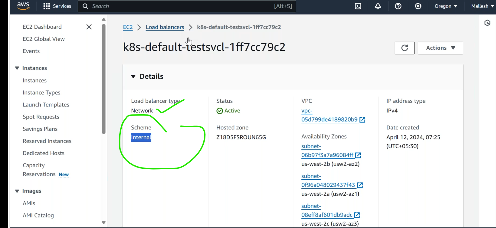
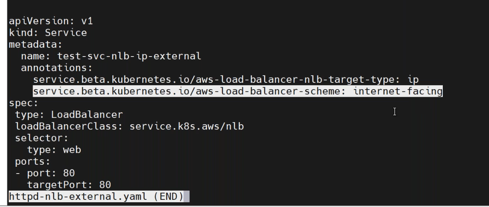
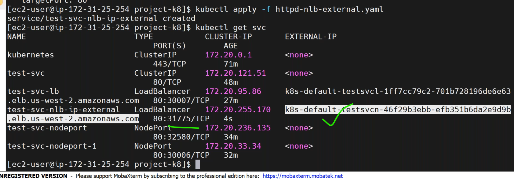
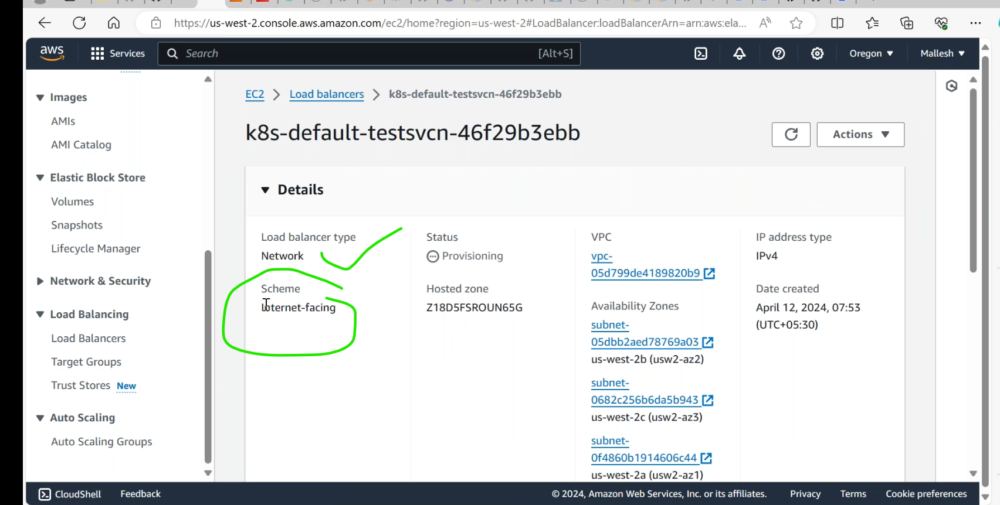

* cluster setup.


# services
-----------------------------------------------------
* [Refer Here](https://kubernetes.io/docs/concepts/services-networking/service/) for official docs of service.
* Service used in k8s for communication in the cluster.
### 1. Internal communication
-------------------------------
* `ClusterIp`(default service):
   *  cluster ip service which creates an internal ip accesssible within k8s cluster.
   *  We are able to access the application using svc ip with in cluster. 
   *  Each service gets an Ip address and this is virtual ip which helps in forwarding traffic to one of the pods based on labels .this ip is called as ClusterIp.
   *  Service is Similar to Layer4 LoadBalencer in AWS.
  
### 2. external communication
-------------------------------------
* To expose __svc__ to outside world.we have 3 types.
  * `NodePort`:
  ---------------------------------------------------------------------
      * Expose the service to the Particular port on the all the nodes of K8s cluster.
* [Refer Here](https://kubernetes.io/blog/2023/05/11/nodeport-dynamic-and-static-allocation/) nodeport ranges.
  * `LoadBalencer`:
  -------------------------------------------------------------------
      * Exposes service to the LoadBalencer.
  * `External`:
  ---------------------------------------------------------------------
      * Creates a Dns Record which can be added to DNS servers maintain by u r organization.

* [Refer Here](https://github.com/jaya4606/vtalent-practice/blob/main/classpractice/my_practice/k8s/pods/svc/httpd-svc.yaml) for sample service manifest.

* communication happens in service by endpoints.
* whenever you make a request to service,service is forwarding the request to one of the pods,because it has entries in endpoints.

* `Enpoints` speaks about port and all pods ip addresses.
* when we creating service,endpoints are getting created internellay.
    * endpoint is a location where your application is running on each pod.
    * all entries are getting from selector.
    * if your application running on 100 pods you have 100 endpoints. 
* login into any one of the pod and check the communication.

* [Refer Here](https://github.com/jaya4606/vtalent-practice/blob/main/classpractice/my_practice/k8s/pods/svc/svc.yaml) for `nodeport type svc` manifest.


* [Refer Here](https://github.com/jaya4606/vtalent-practice/blob/main/classpractice/my_practice/k8s/pods/svc/lb-svc.yaml) for sample `lb service` manifest.

* when we r using EKS(kubernetes as service) we can use loadbalencer.
* here we have one extra component __cloud control manager__.it is specific to cloud.

* ti can be internel lb so it can be accessed within the vpc.


### Annotations
----------------------------
* Annotations are also key value pairs, they are used by the tools i.e. aks or eks to extendfunctionality.
* [Refer Here](https://kubernetes-sigs.github.io/aws-load-balancer-controller/v2.2/guide/ingress/annotations/) for annotations.
* for official docs [Refer Here](https://kubernetes.io/docs/concepts/overview/working-with-objects/annotations/).
* sample aws annotation svc for internel manifest,
```yaml
apiVersion: v1
kind: Service
metadata: 
  name: nginx-svc-lb 
  annotations: 
    kubernetes.io/role/internal-elb: "1"
  spec: 
    type: LoadBalancer 
    selector: 
      app: nginx
    ports: 
    - name: webport  
        port: 35000 
        targetPort: 80
```
* for external annotaion.





