# Ingress
----------------------------------
* [Refer Here](https://kubernetes.io/docs/concepts/services-networking/ingress/) for official docs.
* Application Load Balancer on Amazon EKS [Refer Here](https://cto.ai/blog/aws-load-balancer-controller-on-eks-cluster/).
* `Ingress` is Layer 7 load balancer.
* When we need path based or hostname based routing we can use `ingress`.
* Ingress supports layer7 lb with in k8s cluster but to expose this functionality outside of k8s cluster it needs `ingress controller`.
* k8s doesnot have default `ingress controller`.
* There are many free ingress controllers,
  * nginx ingress controller
  * haproxy ingress controller
  * contour ingress controller
* All the cloud providers have layer 7 lb they support `cloud specific ingress controller`.
  * aws supports `application load balancer ingress controller`.
  * azure supports `application gateway ingress controller`.
* sample manifest of ingress controller is,
```yaml
apiVersion: v1
kind: Pod
metadata:
  name: aspnetapp
  labels:
    app: aspnetapp
spec:
  containers:
  - image: "mcr.microsoft.com/dotnet/core/samples:aspnetapp"
    name: aspnetapp-image
    ports:
    - containerPort: 80
      protocol: TCP

---

apiVersion: v1
kind: Service
metadata:
  name: aspnetapp
spec:
  selector:
    app: aspnetapp
  ports:
  - protocol: TCP
    port: 80
    targetPort: 80

---

apiVersion: networking.k8s.io/v1
kind: Ingress
metadata:
  name: aspnetapp
  annotations:
    kubernetes.io/ingress.class: azure/application-gateway
spec:
  rules:
  - http:
      paths:
      - path: /
        backend:
          service:
            name: aspnetapp
            port:
              number: 80
        pathType: Exact
```
* to know ingress class,
```
kubectl get IngressClass
```
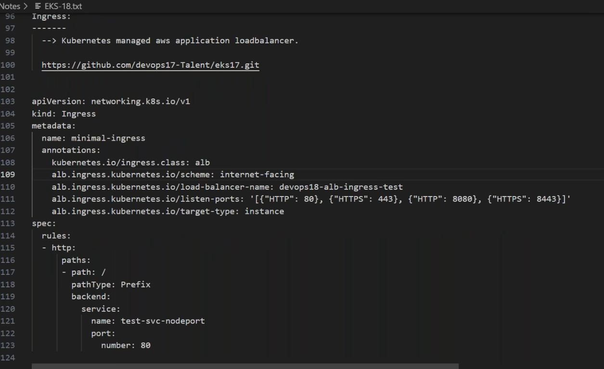
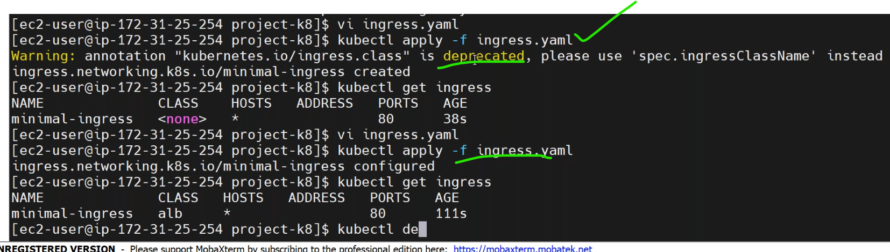
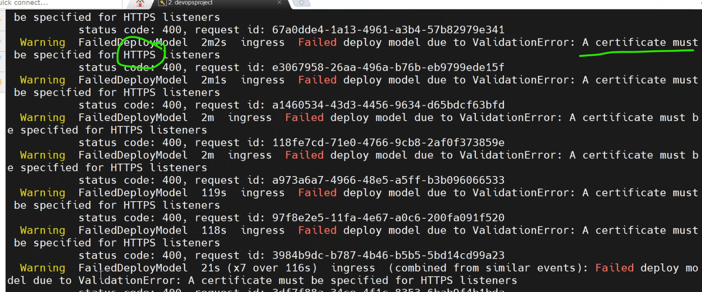
* for `https` protocols we need a autherized certificates.
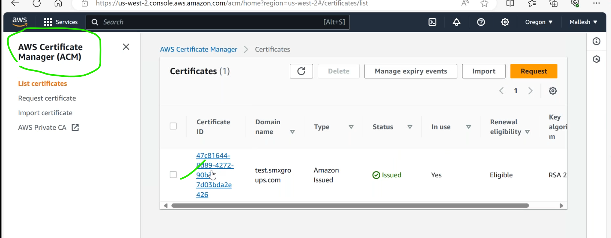

* [Refer Here](https://kubernetes-sigs.github.io/aws-load-balancer-controller/v2.2/guide/ingress/annotations/#ssl) for ssl certificate in annotaions.
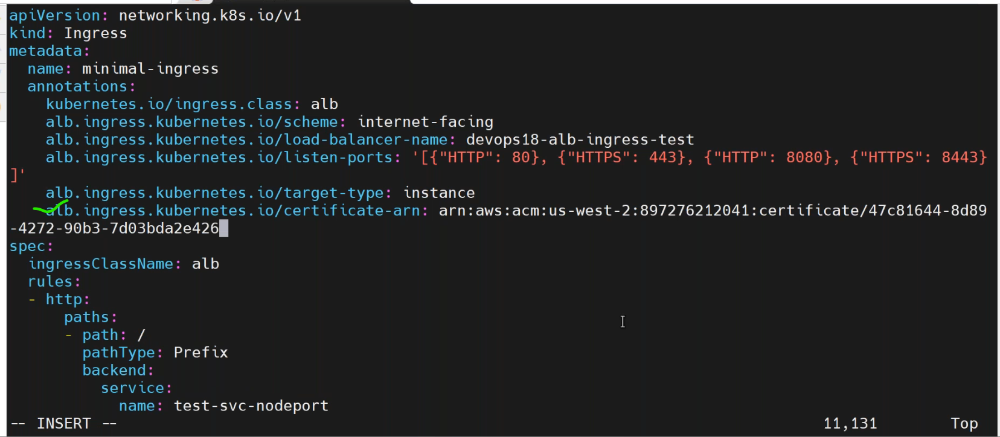
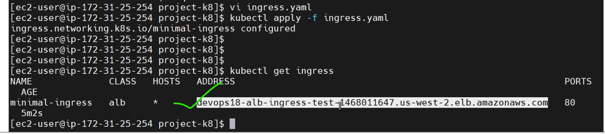
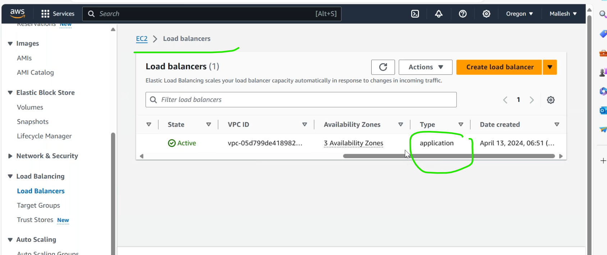
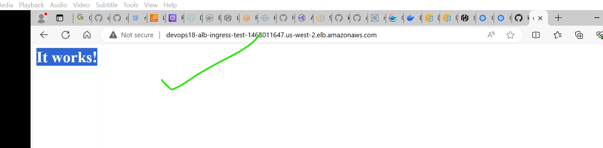
* lets deploy another application.
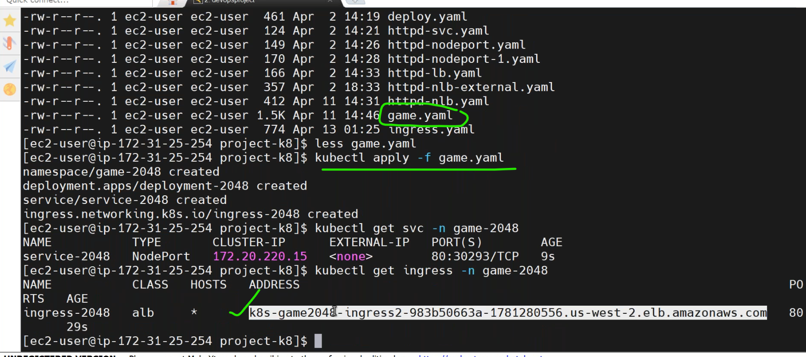

* `Ingress` is specific to namespace only.whereever u r `service`,yoy have to create `ingress` in that namespace.
---------------------------------------------------------------------
### dual stack
---------------------------------------------------------------------
* Both IPv4&IPv6 are called dual stack.
### instance type and ip type
-----------------------------------------
* `instance type`:
  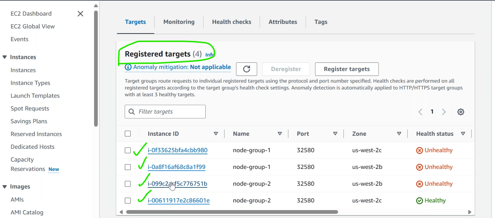
* `ip type`:
  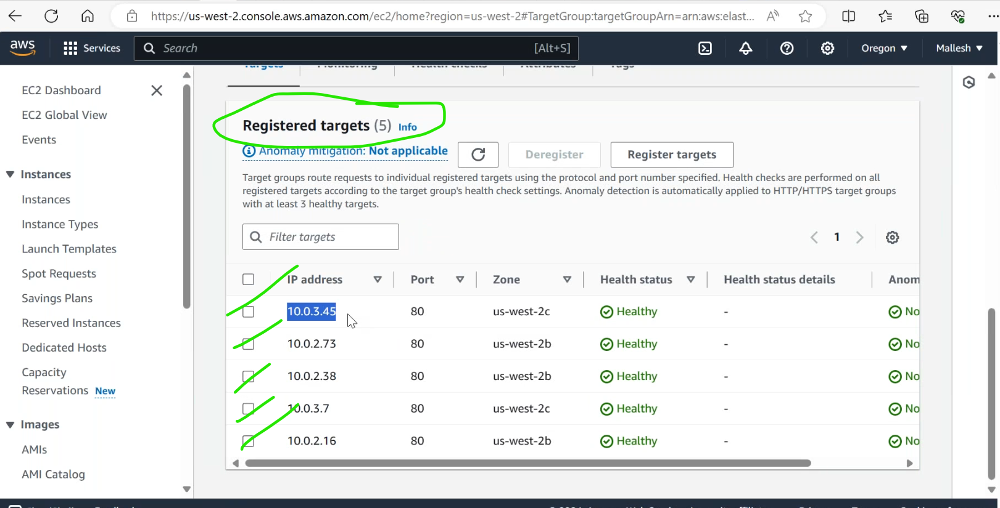

## Auto Scalling in K8s
------------------------------------------------------------------------------
1. pod level
   * `hpa`(horizantal pod autoscaller).
     * it increase or decrease pods automatically.
     * it has no downtime.
   * `vpa`(vertical pod autoscaller).
     * to increse or decrese the particular pod resources.
     *  it requires downtime.
2. node level
  
### Horizontal Pod Autoscaler
--------------------------------------
* This allows to autoscale pods based on metrics.
* [Refer Here](https://kubernetes.io/docs/tasks/run-application/horizontal-pod-autoscale/).
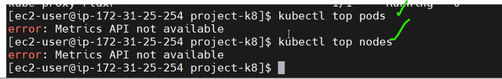
* install the metric server in EKS.[Refer Here](https://docs.aws.amazon.com/eks/latest/userguide/metrics-server.html) for official docs.
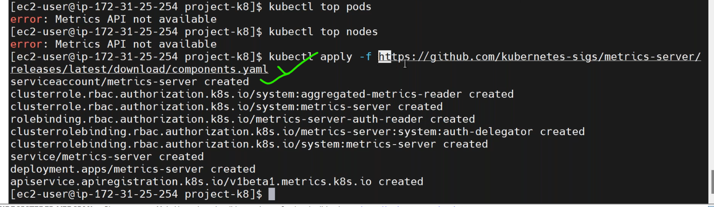
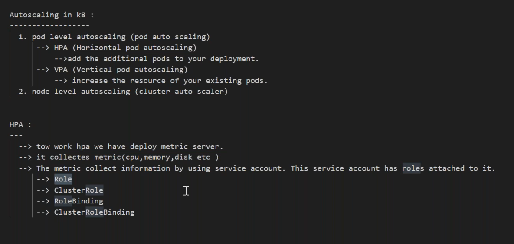
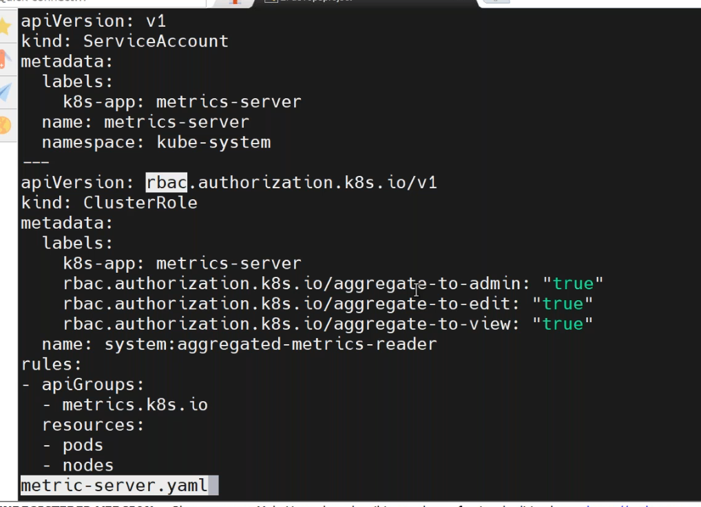
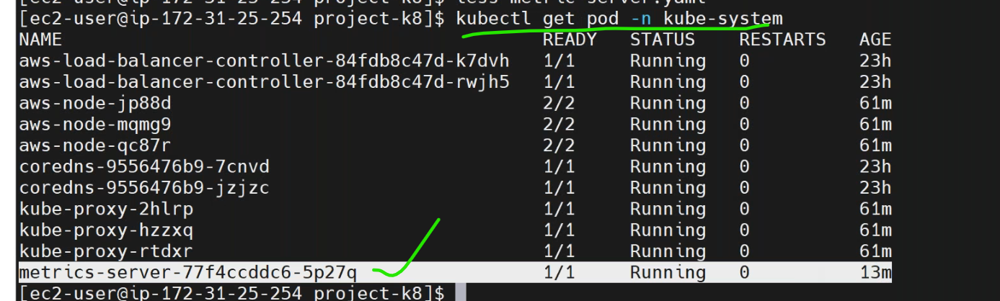
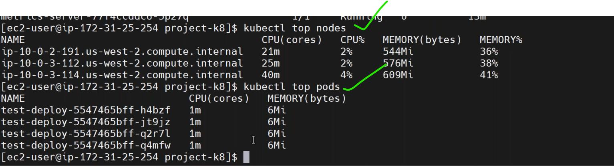
* `Role`: is something which is scoped to a particular namespace.
* `clusterRole`: is something which is applicable to entire or all the namespaces.
* [Refer Here](https://github.com/jaya4606/vtalent-practice/tree/main/classpractice/my_practice/k8s/pods/hpa) for sample `hpa` manifest.

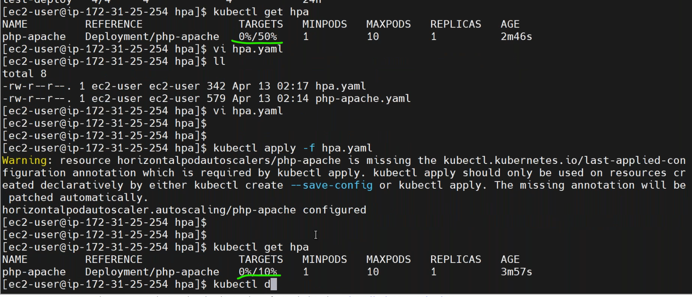
* cerate a load genrate pod by [Refer Here](https://kubernetes.io/docs/tasks/run-application/horizontal-pod-autoscale-walkthrough/).
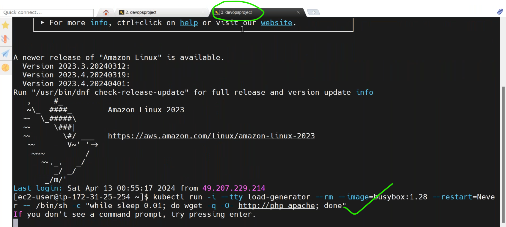
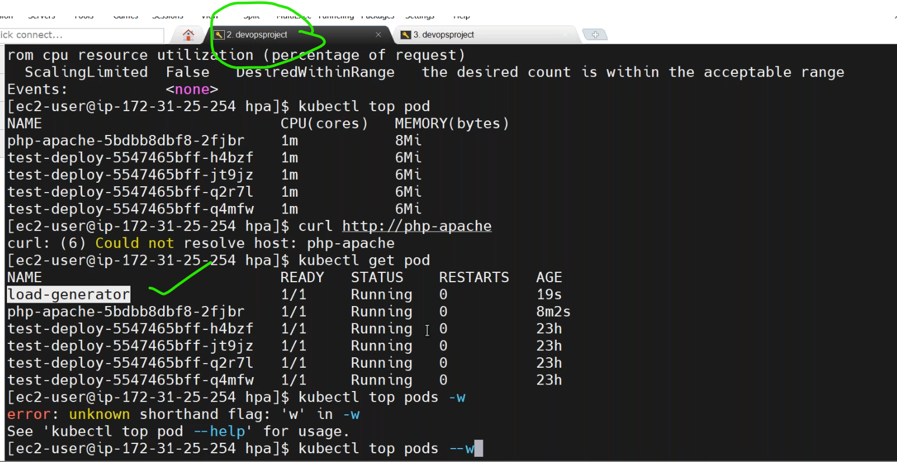
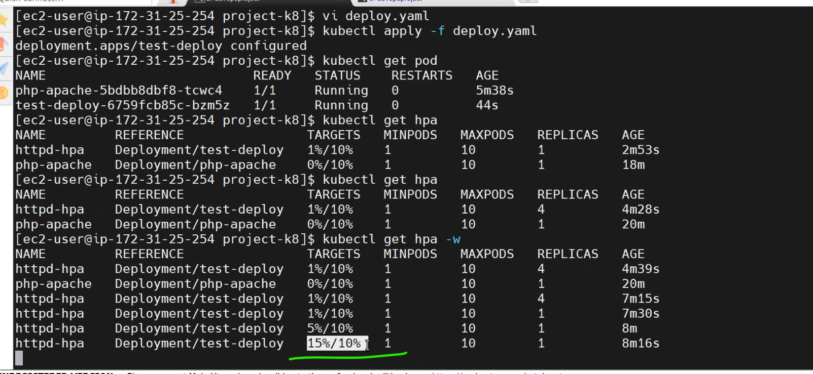


