# cluster autoscaller
------------------------------------
* add nodes when it requires.

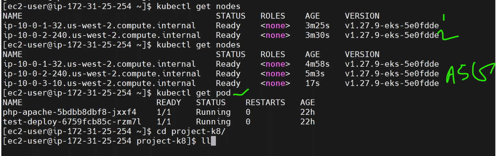
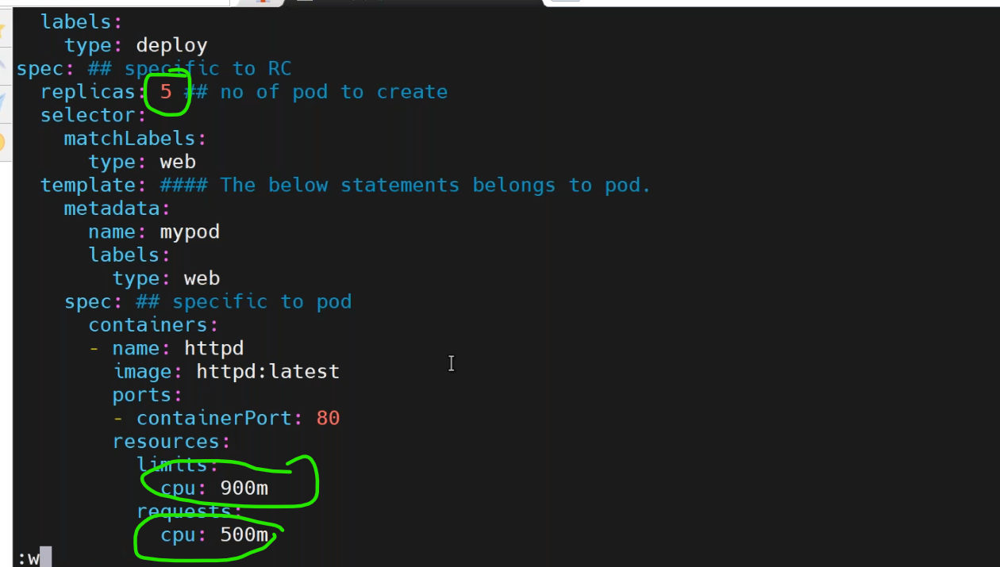
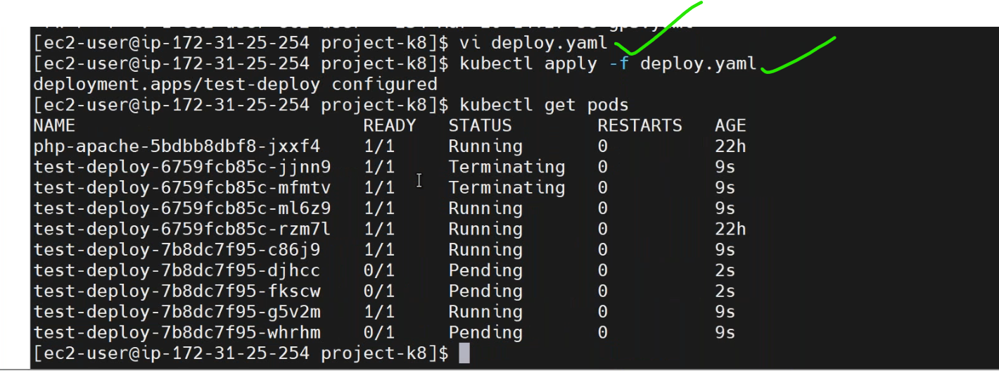
* when we give more resources for pods,nodes doesnt have enough resorces to execute the pods.
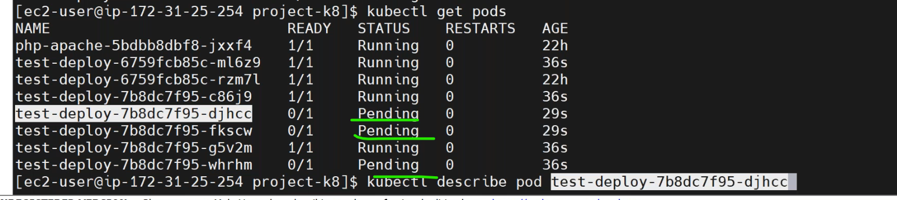
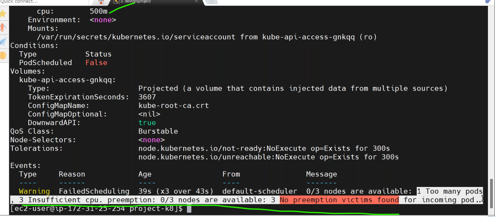
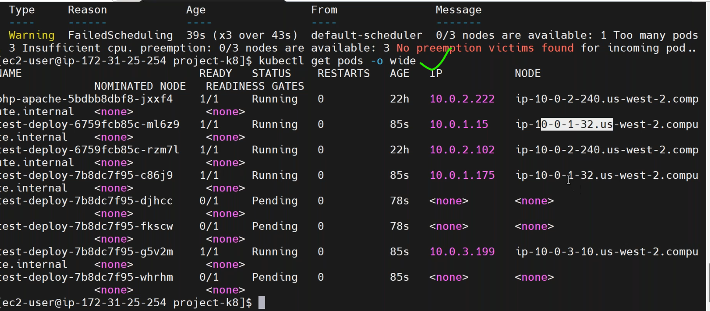
* for cluster autoscalling [Refer Here](https://github.com/kubernetes/autoscaler/blob/master/cluster-autoscaler/cloudprovider/aws/README.md).
* [Refer Here](https://docs.aws.amazon.com/eks/latest/userguide/autoscaling.html) aws eks autoscalling.
* for the autoscalling steps [Refer Here](https://www.kubecost.com/kubernetes-autoscaling/kubernetes-cluster-autoscaler/).
* we can do cluster autoscalling with terraform.
* create a `cluster_autoscaller.tf`. [Refer Here](https://github.com/DNXLabs/terraform-aws-eks-cluster-autoscaler) for cluster autoscalling in terraform.
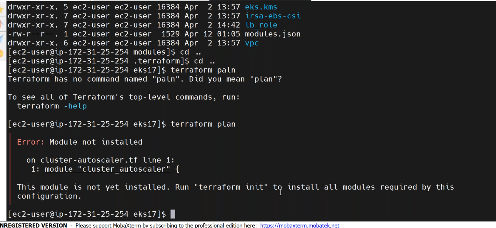
* we have to do `terraform init` to initilze the autoscale module.
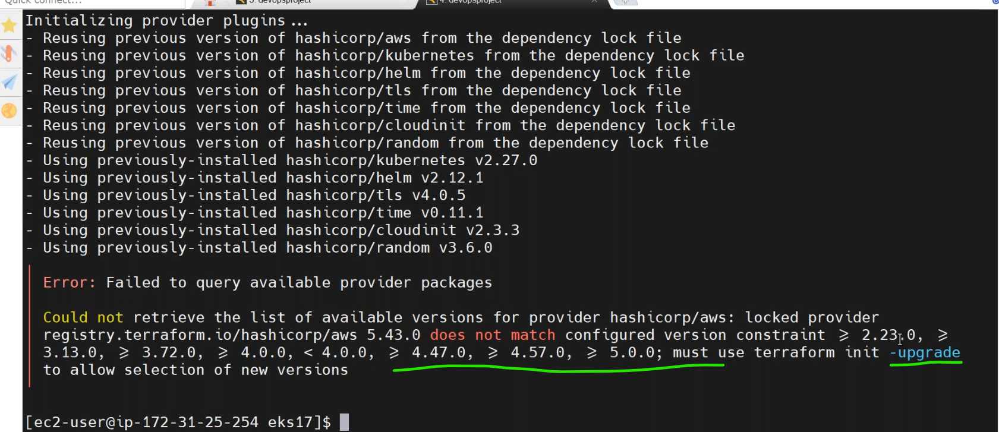
* the above module is not working due to version.
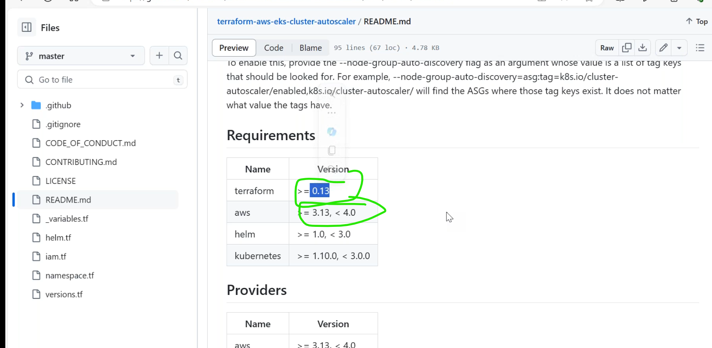
* use this module [Refer Here](https://registry.terraform.io/modules/lablabs/eks-cluster-autoscaler/aws/latest).
* edit the file `cluste_autoscaller.tf`.

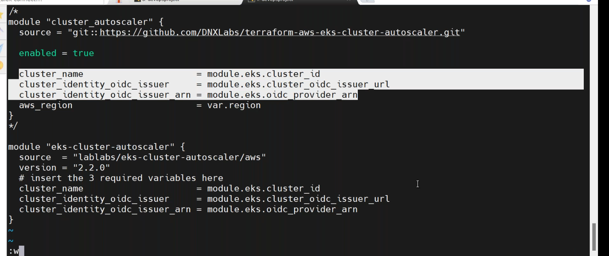
* Multiline commenting in terraform.
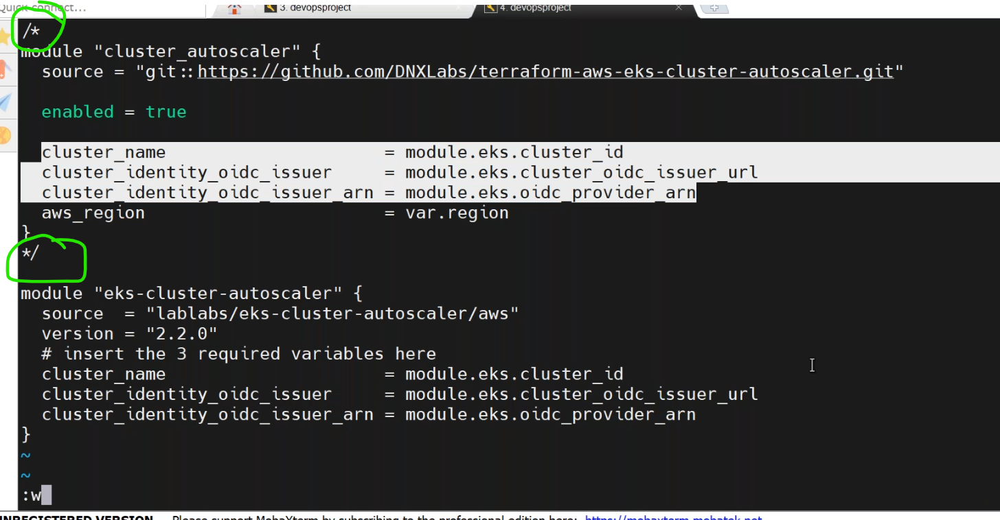
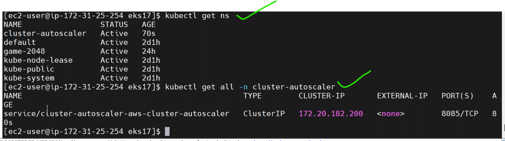
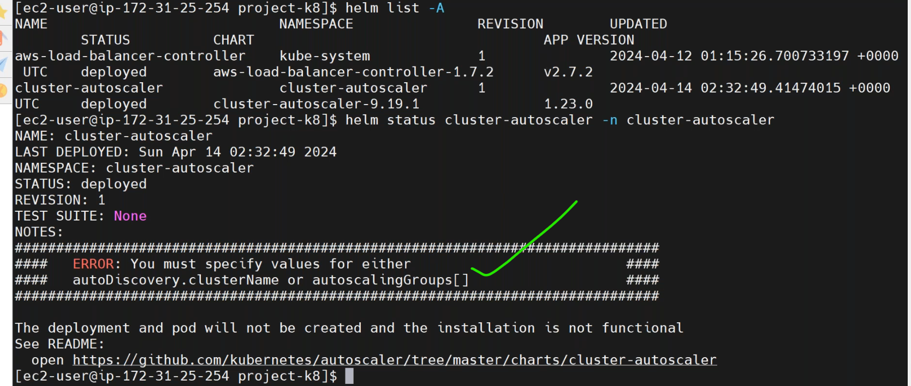
* give the `cluster_name` insted of `cluster_id`. inthe __cluster_autoscaller.tf__.
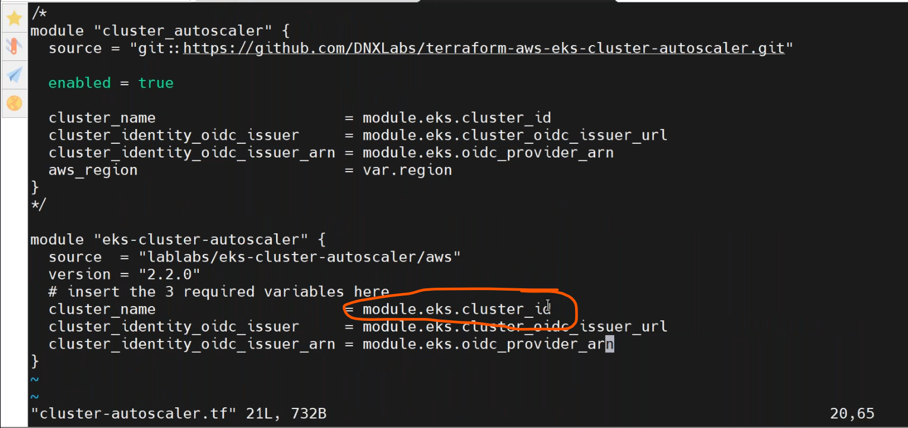
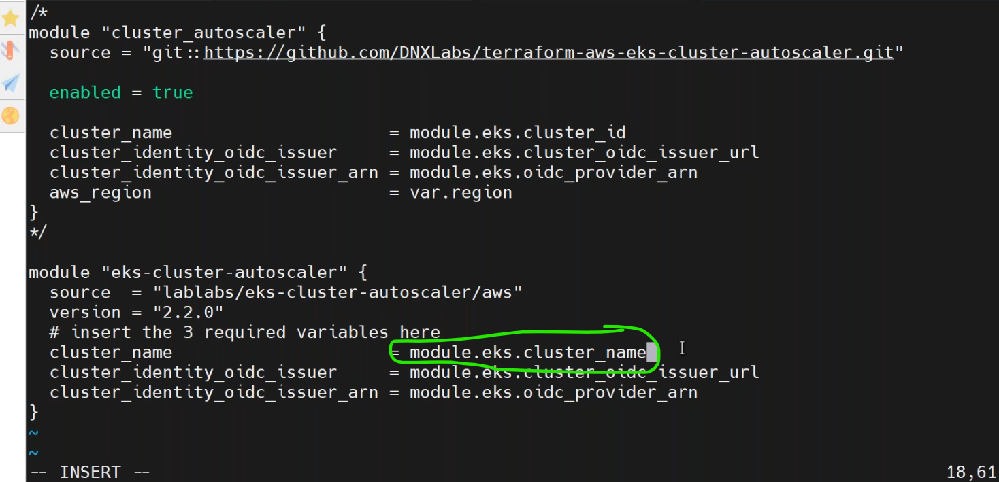
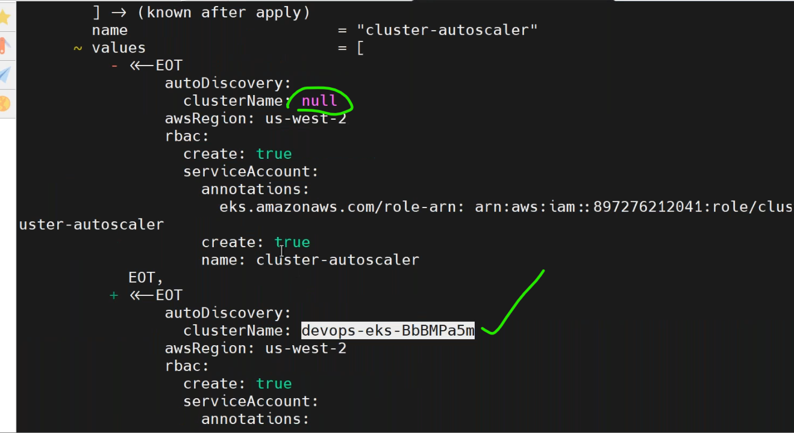

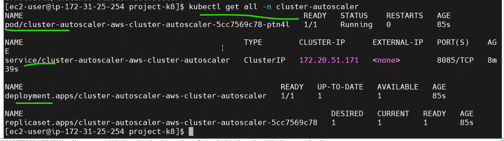

* number of nodes increased automatically.
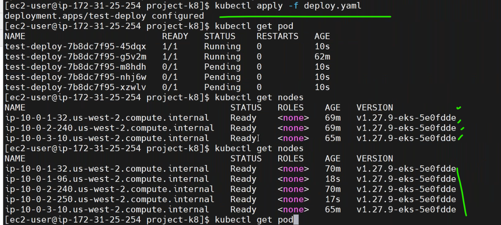
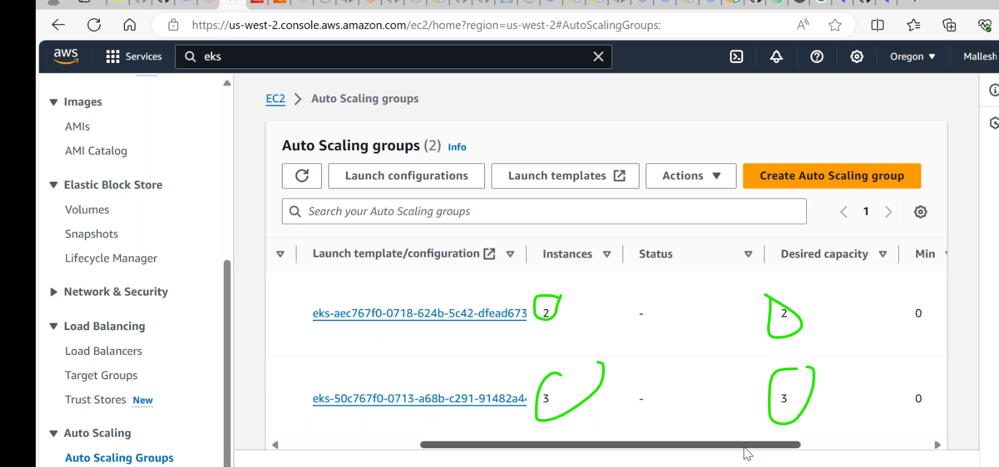

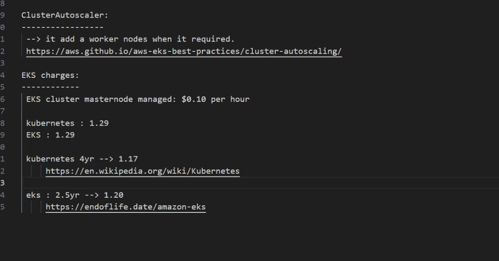
* [Refer Here](https://en.wikipedia.org/wiki/Kubernetes#Release_timeline) for k8s release versions.
* [Refer Here](https://endoflife.date/amazon-eks) for aws eks supported versions.
