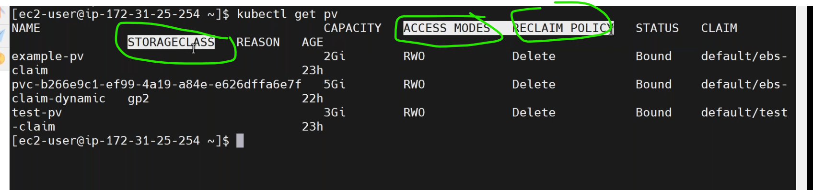

### AccessModes
---------------------------------------
* can we give same single `EBS Volume` to multiple pods?
* [Refer Here](https://kubernetes.io/docs/concepts/storage/persistent-volumes/) official docs acces modes.
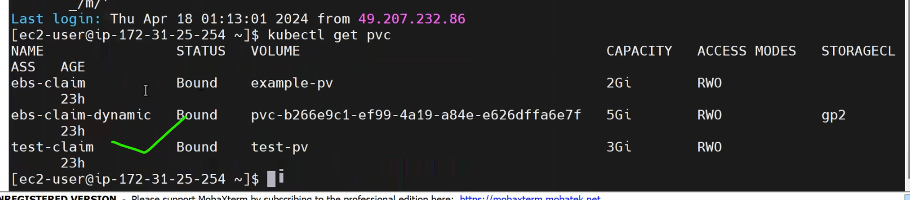

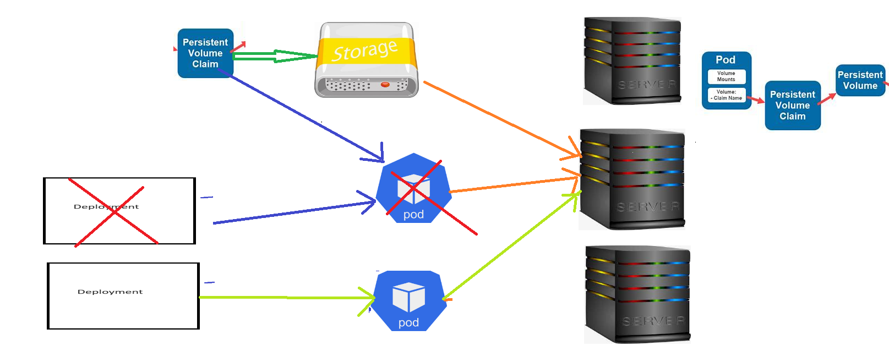
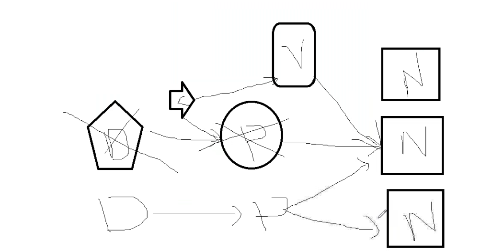

### Reclaim policy
--------------------------------------------------------------
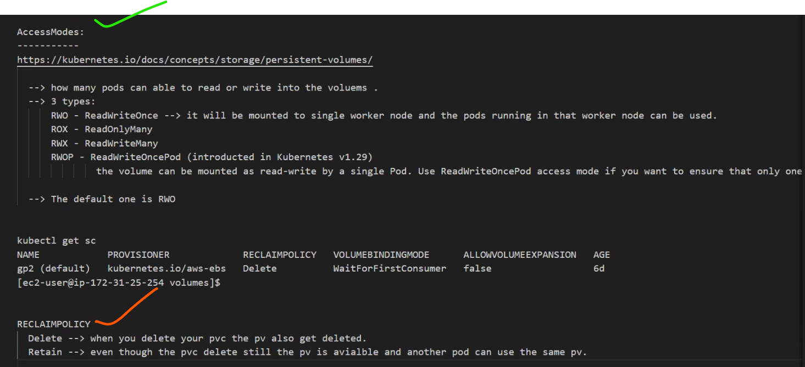
* [Refer Here](https://kubernetes.io/docs/concepts/storage/persistent-volumes/) for reclaim policies.

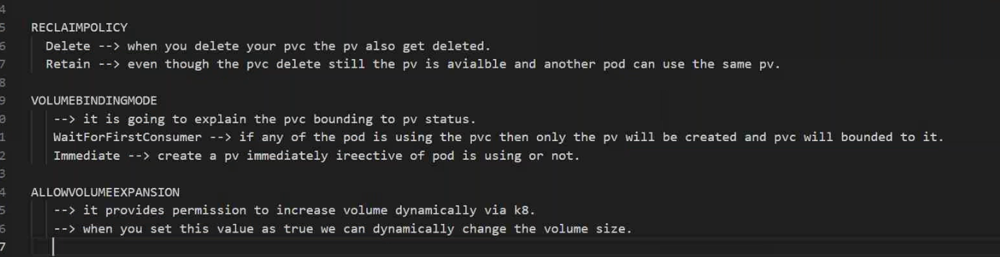
* by default `volume expansion` is `false`.
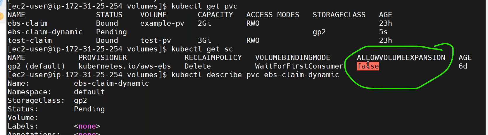
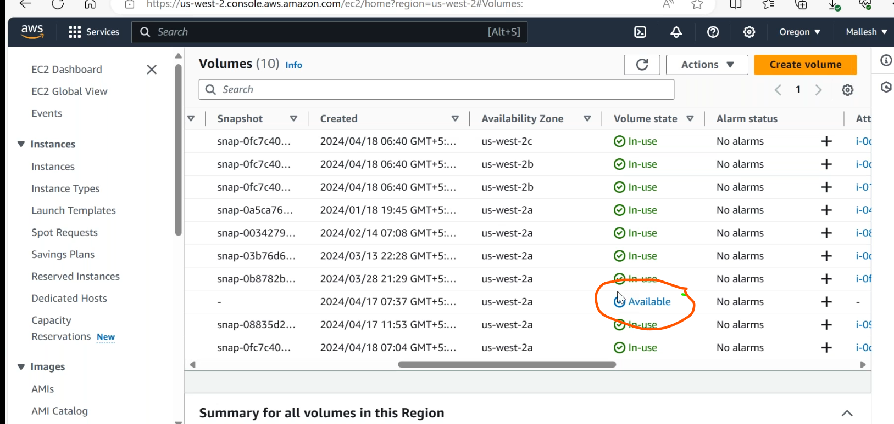
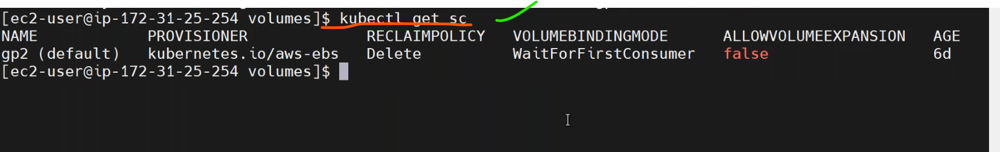

* `orphan values`:
  * Kubernetes Orphaned Resources [Refer Here](https://medium.com/@alcide_io/kubernetes-orphaned-resources-bcebec0e6a09).
  * Garbage Collection in k8s [Refer Here](https://kubernetes.io/docs/concepts/architecture/garbage-collection/).
  * we have to cleanup unused volumes.

* [Refer Here](https://docs.aws.amazon.com/eks/latest/userguide/efs-csi.html) for network fileshare for `readwritetomany(RWX)`.
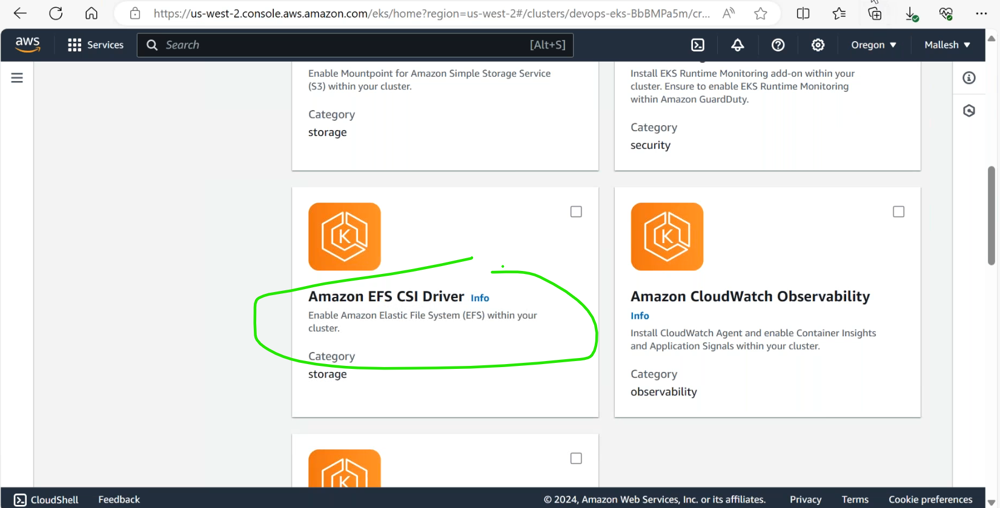
* [Refer Here](https://github.com/kubernetes-sigs/aws-efs-csi-driver/blob/master/docs/README.md) for the aws-efs-csi configuration.
  
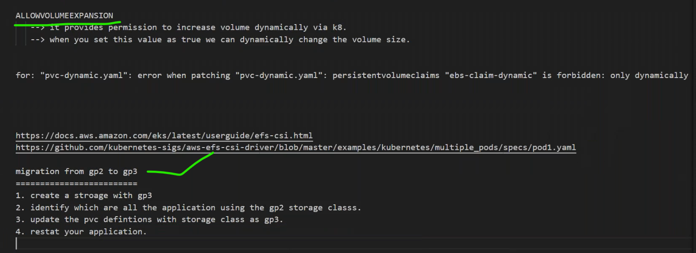
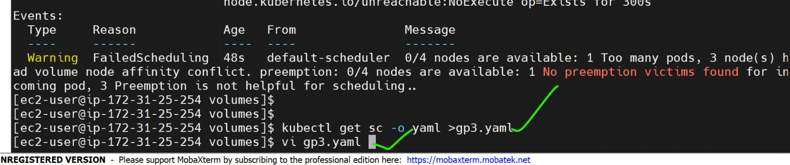