Terraform statefile Backup
------------------------------------------------------
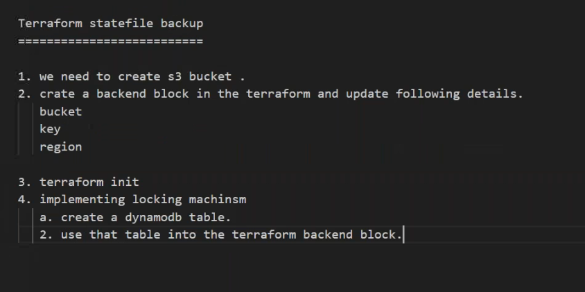
* [Refer Here](https://developer.hashicorp.com/terraform/language/settings/backends/configuration) for terraform backend.
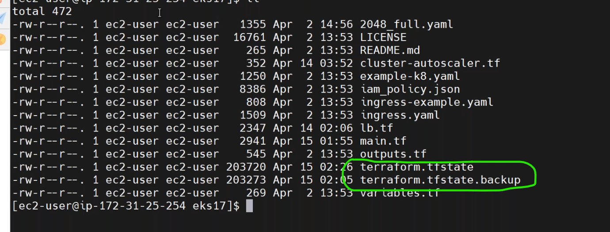
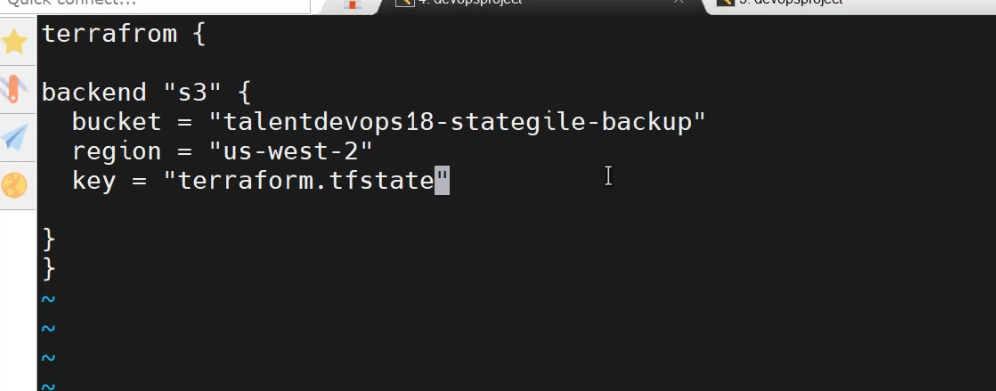
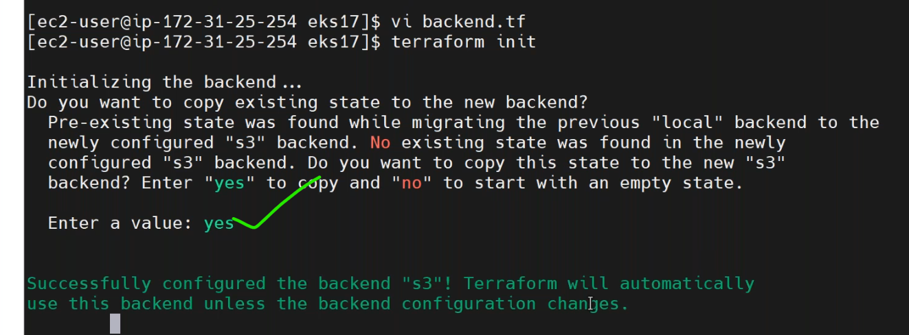
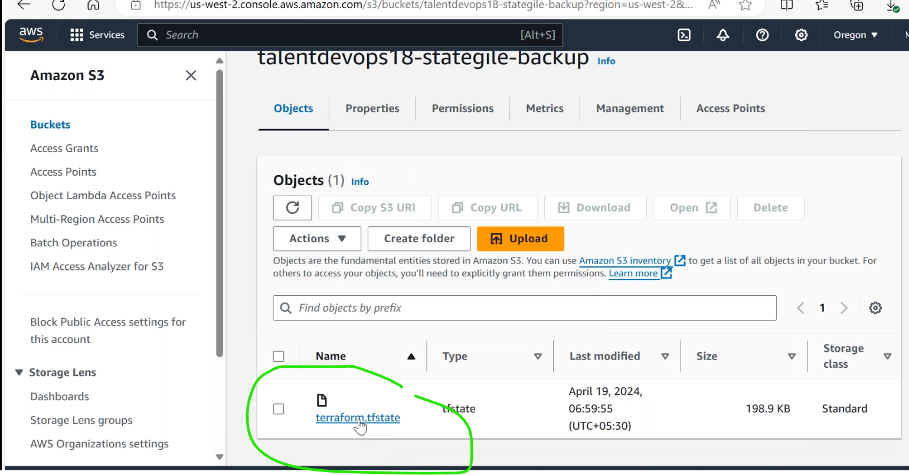
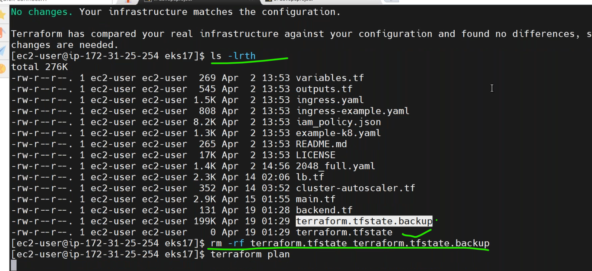
* create a `dynamodb` for locking the terraform state file.
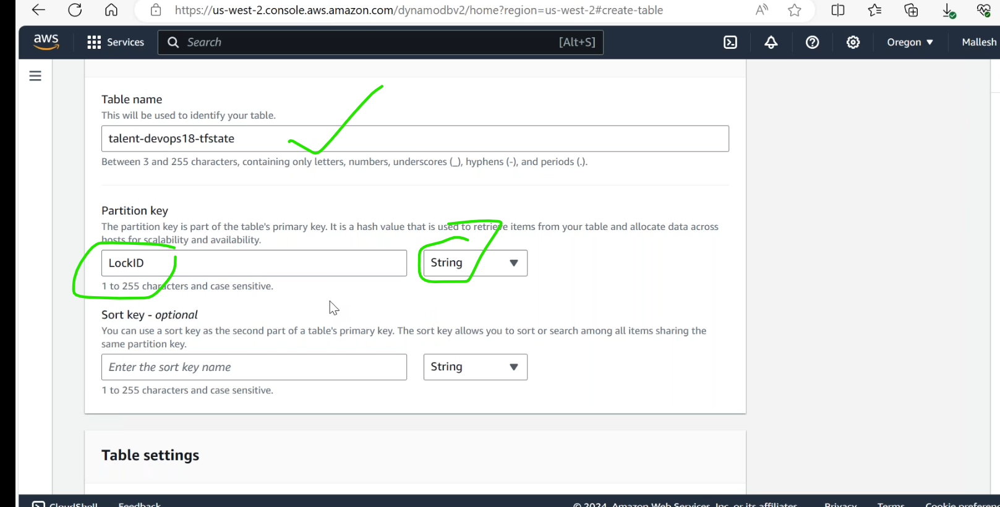
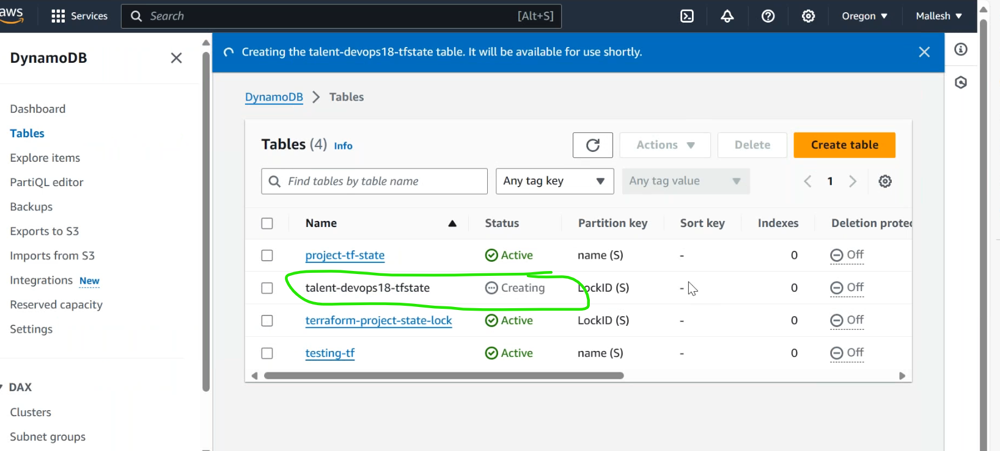
* update the `terraform backend` file.
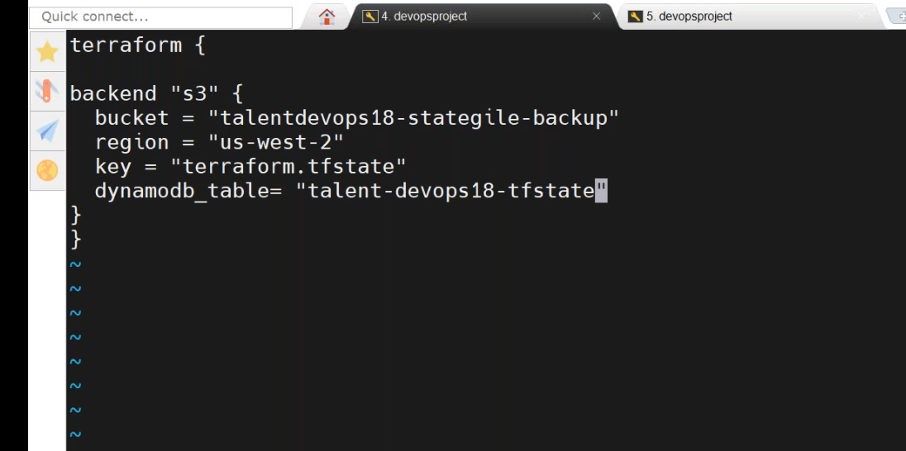
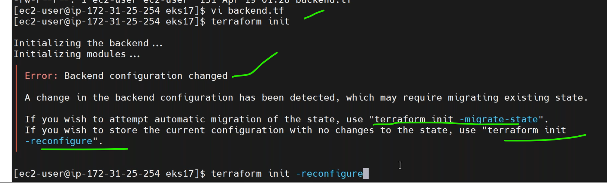
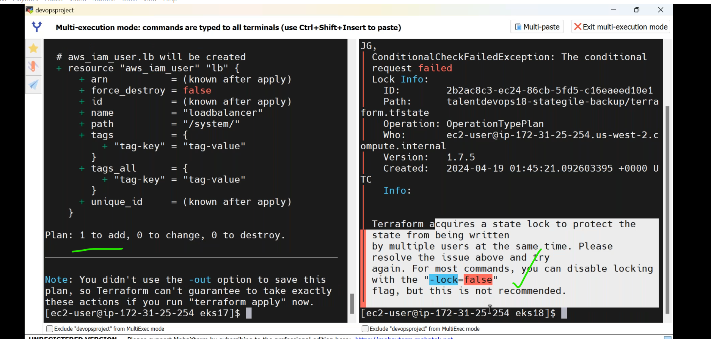

Route 53
--------------------------------------------------------------------
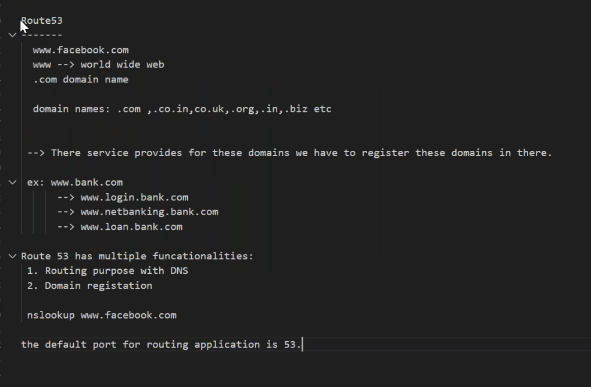
* [Refer Here](https://github.com/jaya4606/vtalent-notes/blob/main/notes/AWS/aws6.md) reserved ip addresses.
* any subnet `third ip` used for `DNS` functionality.
* domain registration in aws
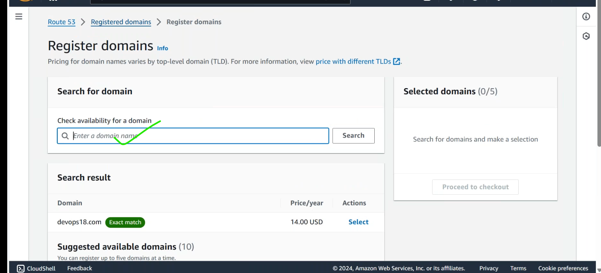
* purchase one domain in godaddy.com [Refer Here](https://www.godaddy.com/en-in).
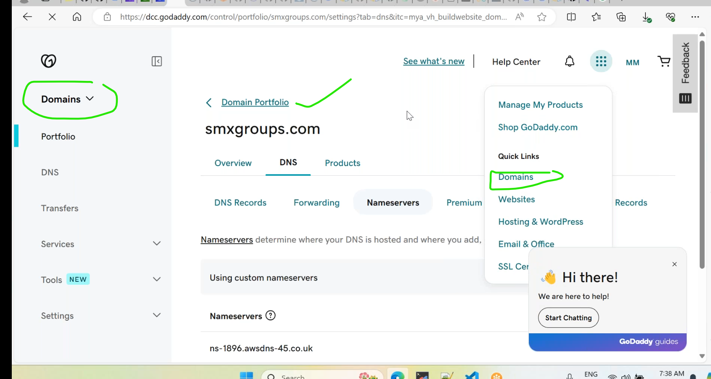
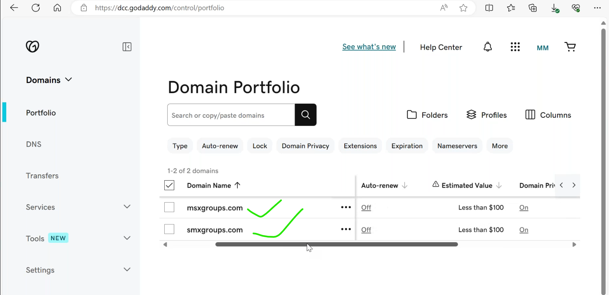
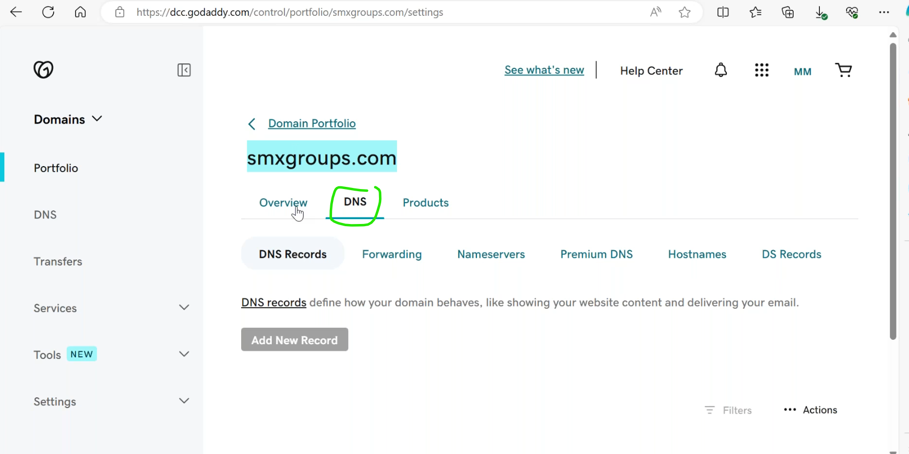
* first buy a domain and goto `hostedzone` in aws route53.
* create dummy hostzone.
  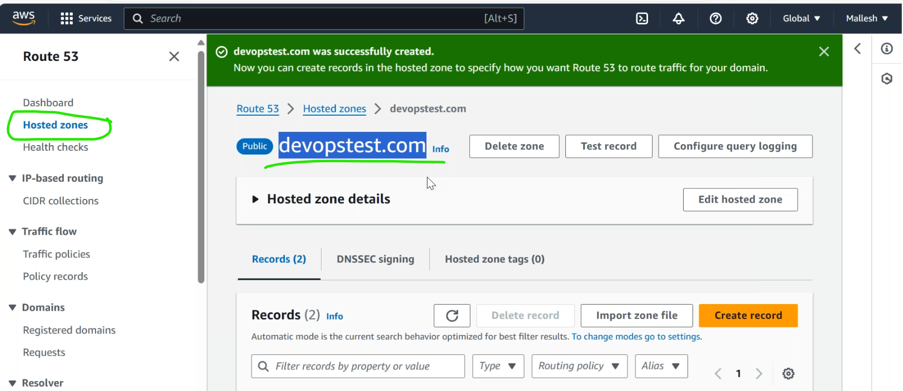
  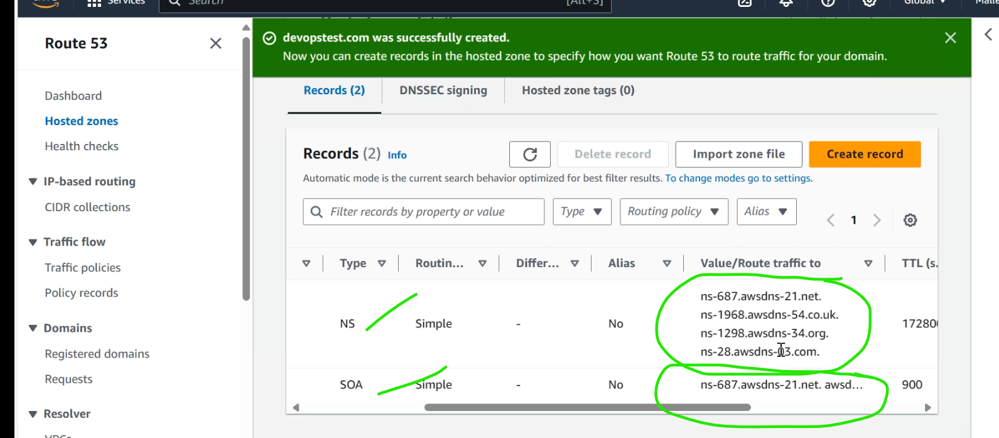

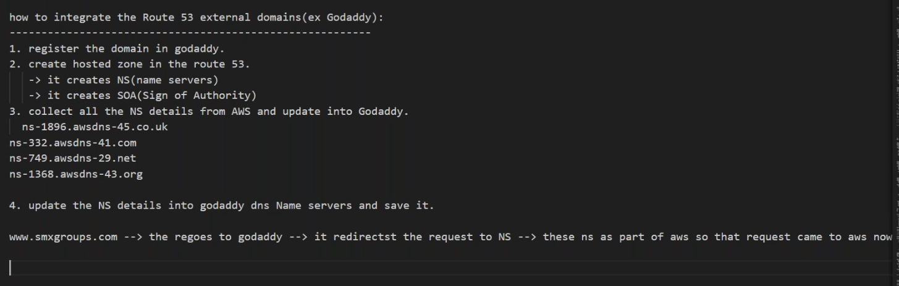
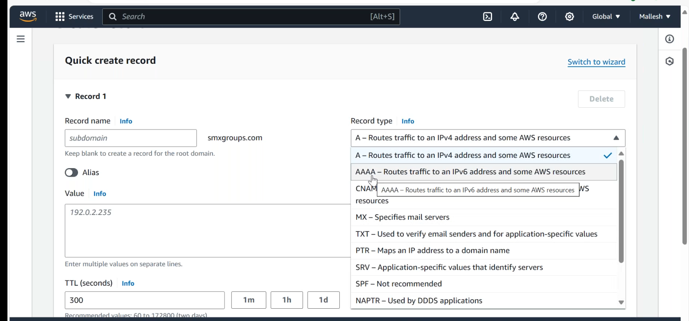
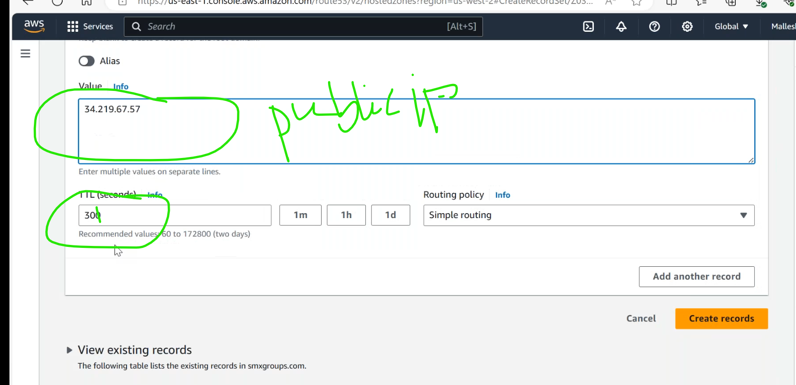
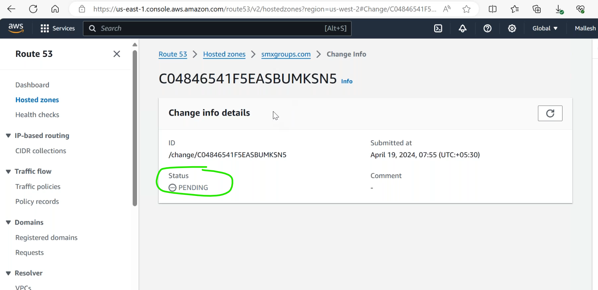

