###  git  (30_11_2023)
----------------------
 * source code management tools
    * github
    * bitbucket
    * gerit
    * stash
* create github and bitbucket accounts
* create repository in github 
   * we can add new files to this repo
   * create git folder in my laptop anywhere
    ``````
    mkdir git
    cd git
    ls -al
    git status
    git init
    ls -al 
    ``````
   * whereever you initilized git that folder will be tracked by git.
   * create a one dummyfile
    ``````
    touch test.txt
    git stauts
    git add *
    git status
    git commit -m "first commit"
    git status
    git log

    ``````
* git config --global email.name <email>
* git config --global user.name <name>    

## 01/12/2023
---------------
* connection between local and remote servers by 
 * http
   * username and password provide
   * but this username and password section removed in github present
 * ssh
   * add ssh key in settings
  
* use the commands in git hub to connect local
  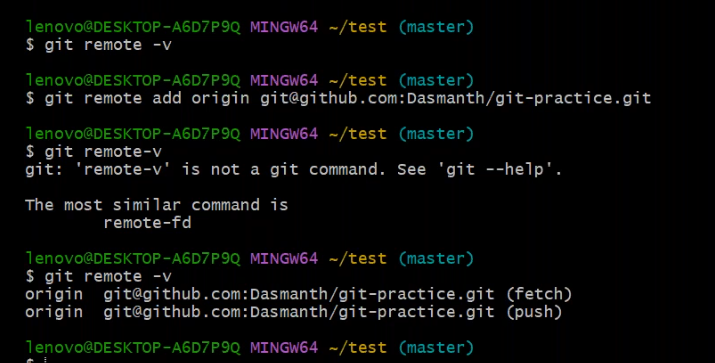
*to change branch name master to main
``````
git branch -M main
``````
 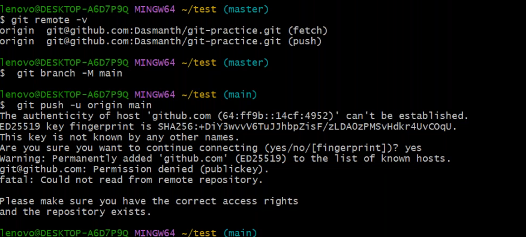
  
* we are connecting by ssh but we dint configure ssh credintials in github account
   * ssh-keygen
   * it generate publi/private key in home directory
   * goto that .ssh folder,copy public key to github account settings section
  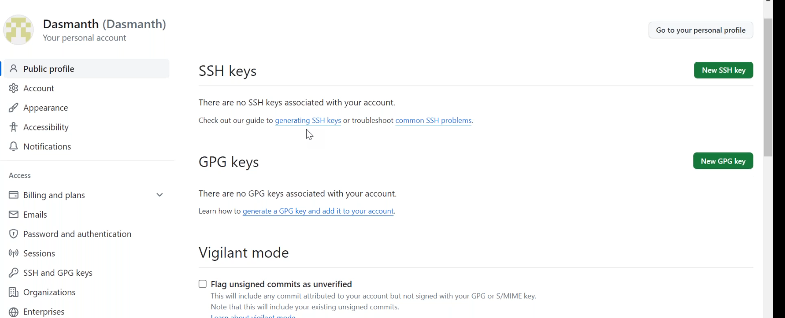

  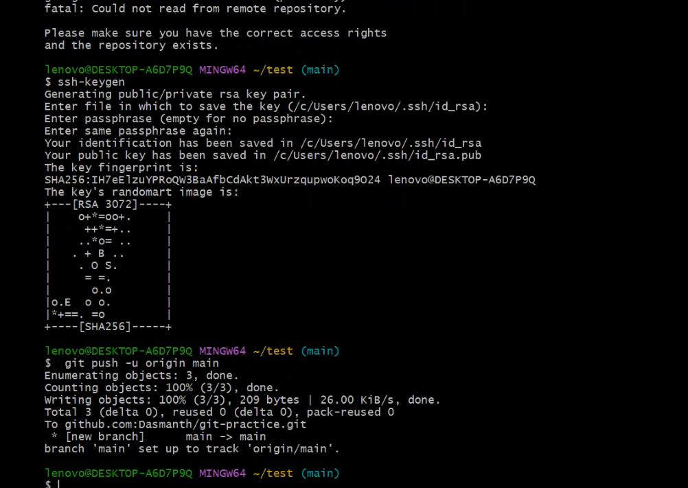

* git clone is used to clone the other remote rpository into my local system.


## 02/12/2023

  merge conflicts
  ------------------
  ### scenario-1
  1. stash the local changes first 
     * git stash push devops.html
  2. pull rmote changes
     * git pull
  3. git the statshed to local
     * git stash pop
  4. corrct the file and commit changes
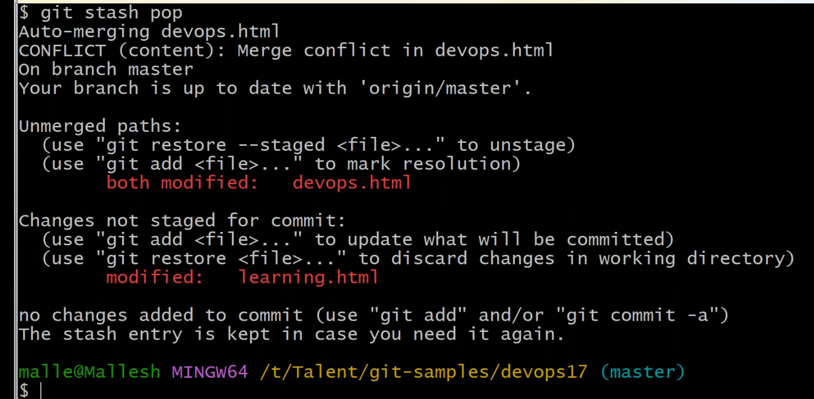
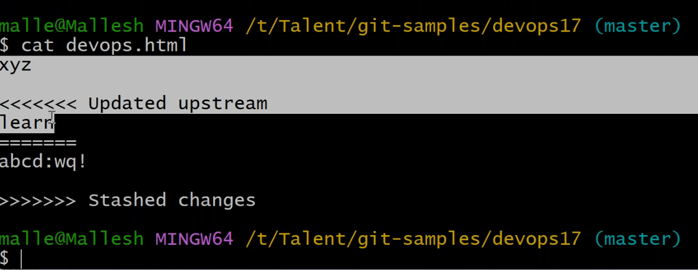
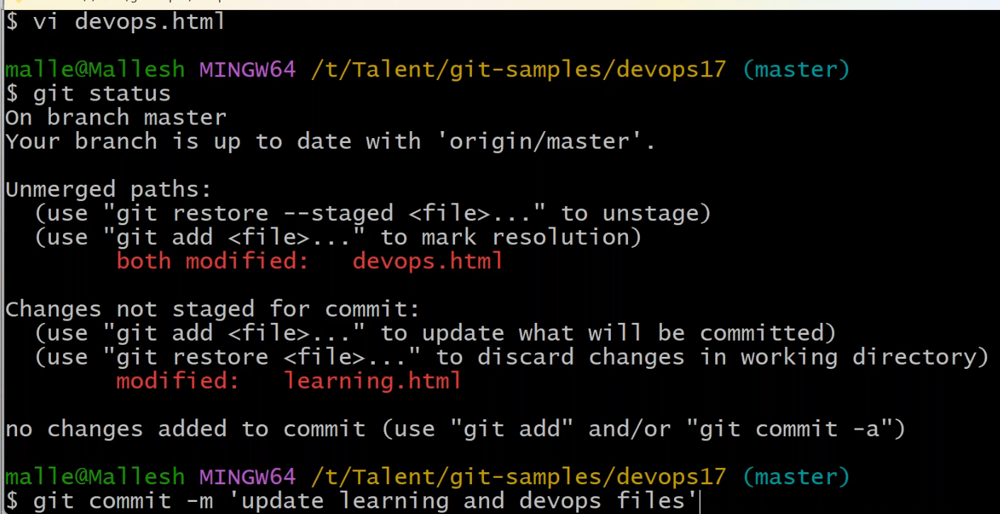

### scenario-2
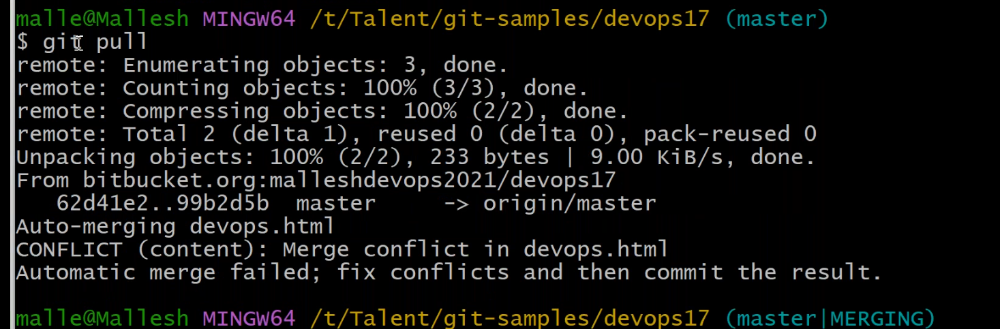
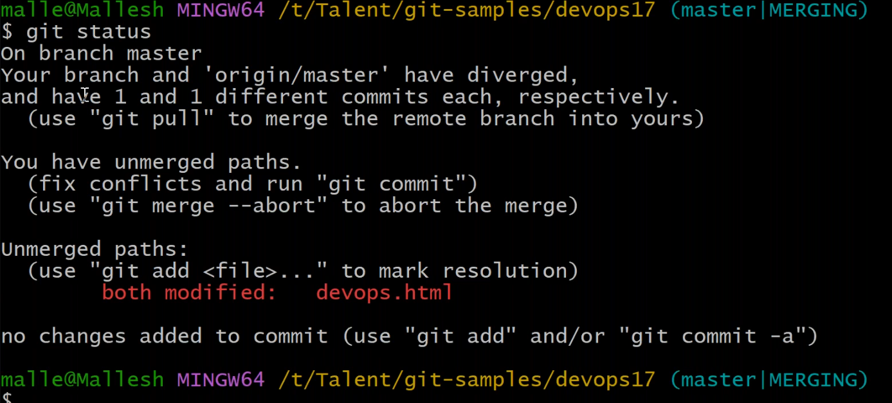
* git mergetool
  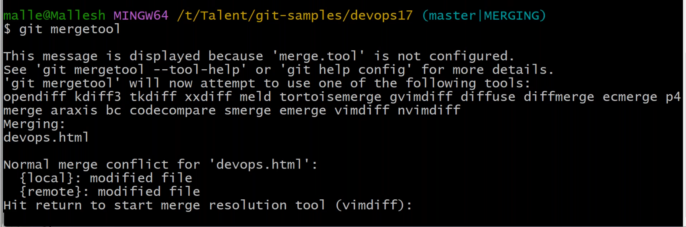
  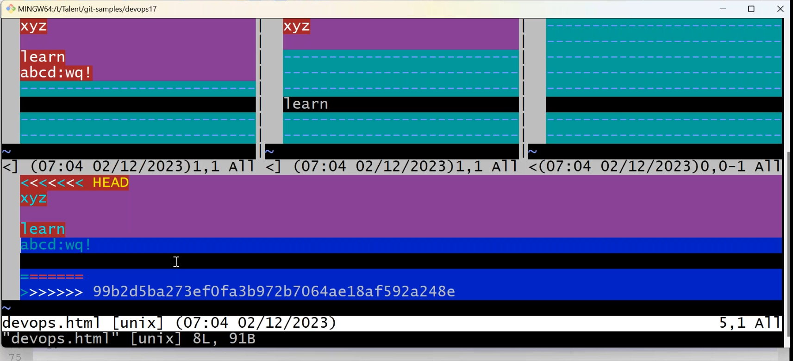
  
  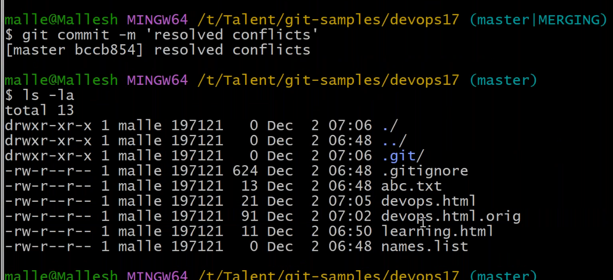


* To avoid merge conflicts whenever we want to make changes in local first do git pull make up to date and after that make changes in local repo. 
  
``````
git log -p 3
git log -p 1
git log -p 2
git log --pretty=format : " %h %an "
git log --pretty=format : " %h %an %ae "
git log --pretty=format : " %h %an %ae %s "
``````

04/12/2023
----------------
1.for tracked files
 * git restore <filename>
2. for staged area files
 * git restore --staged <filenmae>
3. alredy commited changes
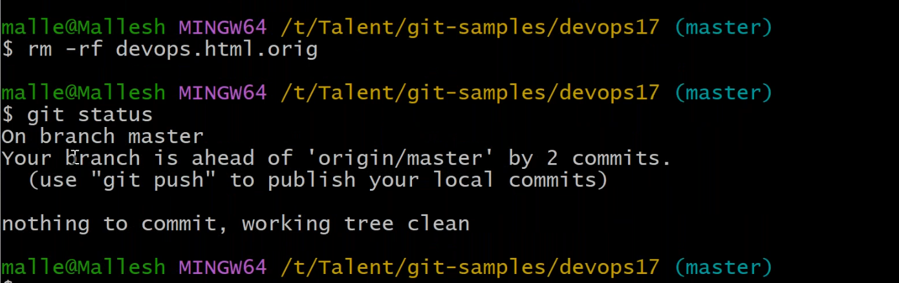
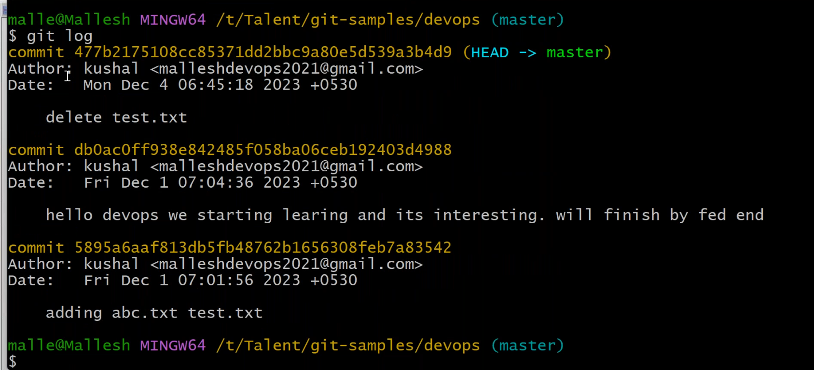

## pull request

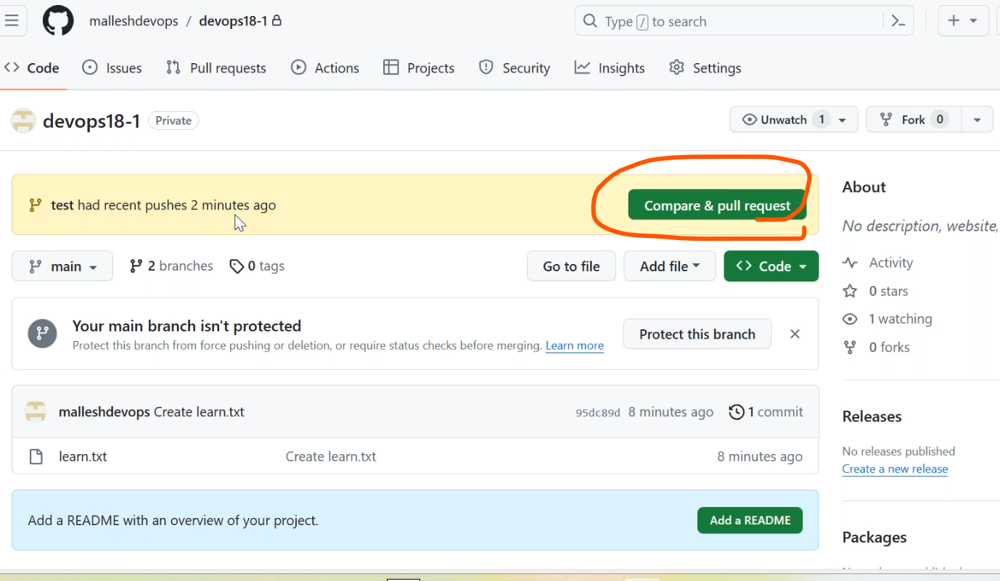
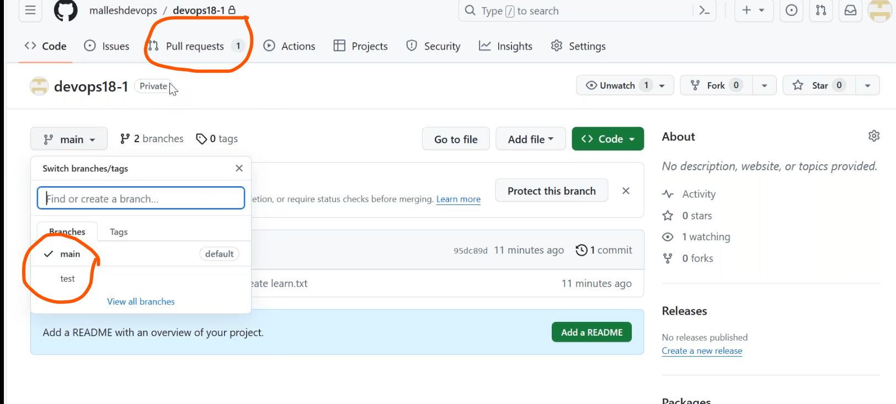

* we will not add changes to main branch we raise a pull request but we were not approved this request
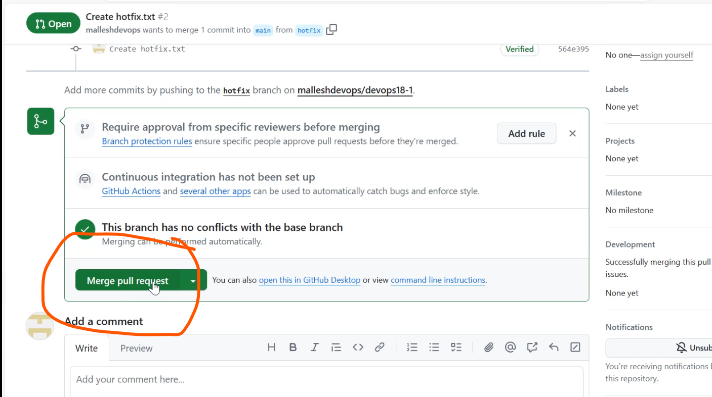
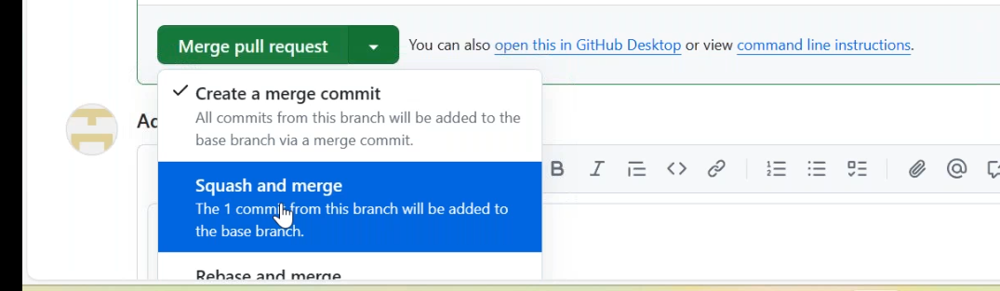
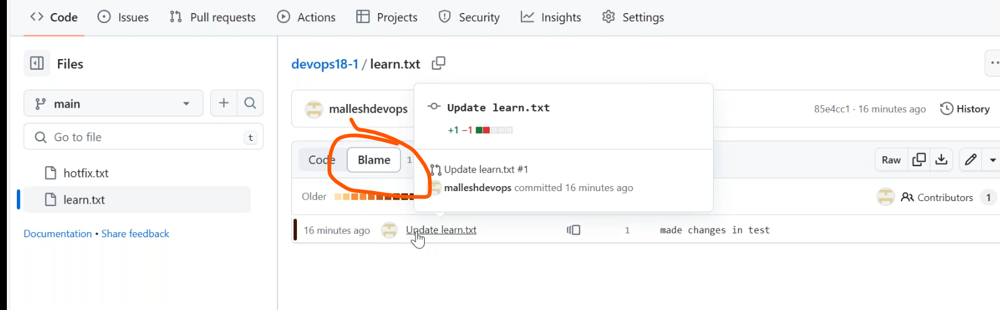
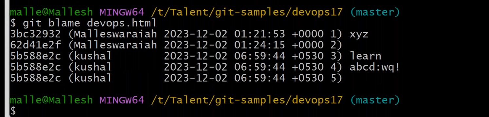
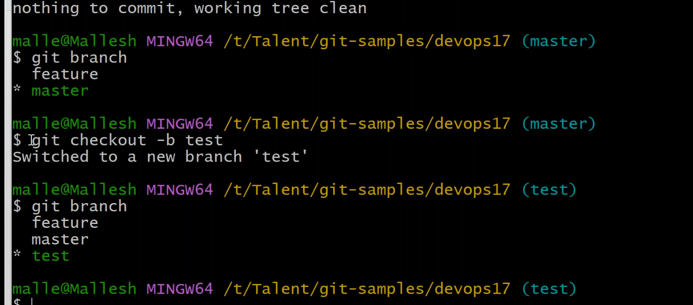
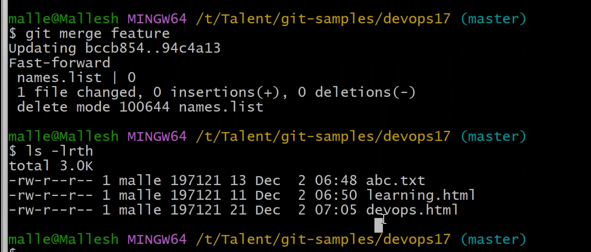
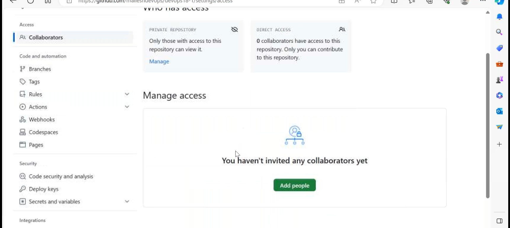
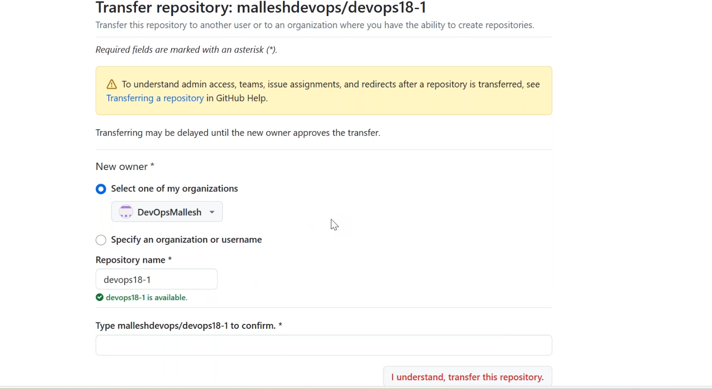


   

   