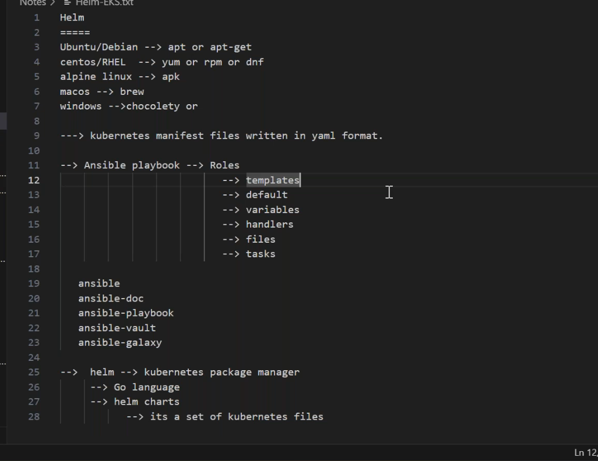
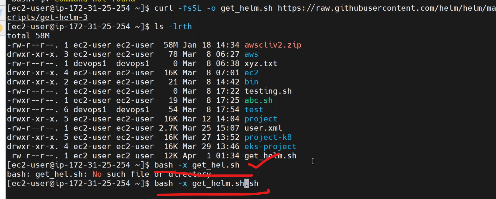
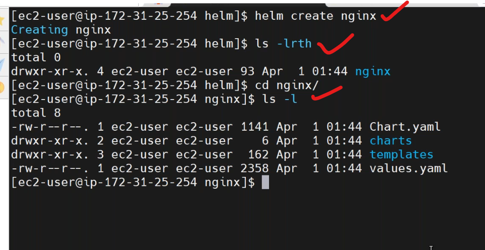
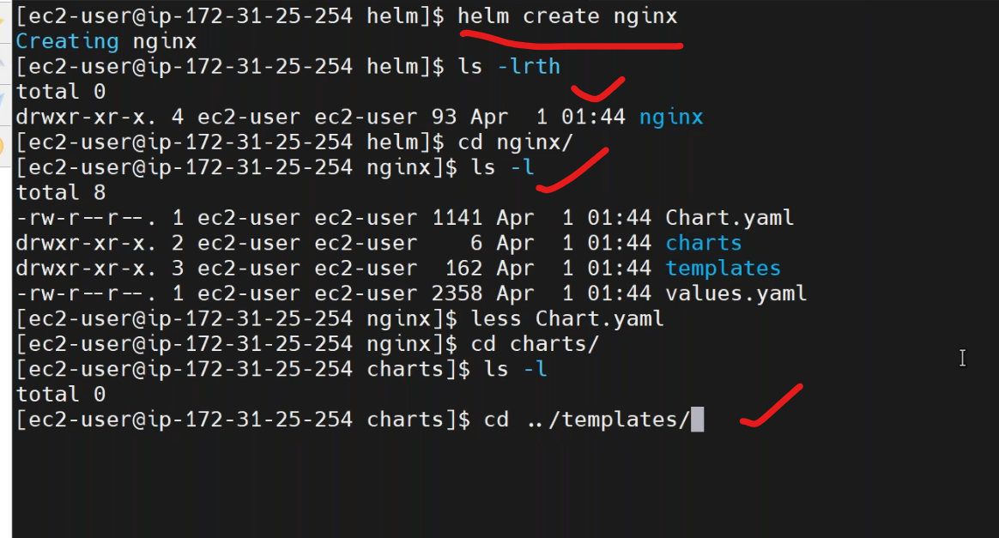
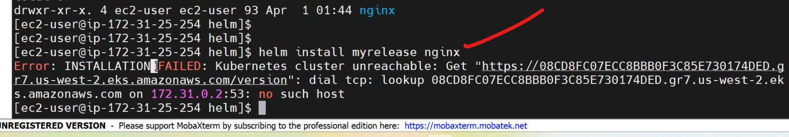
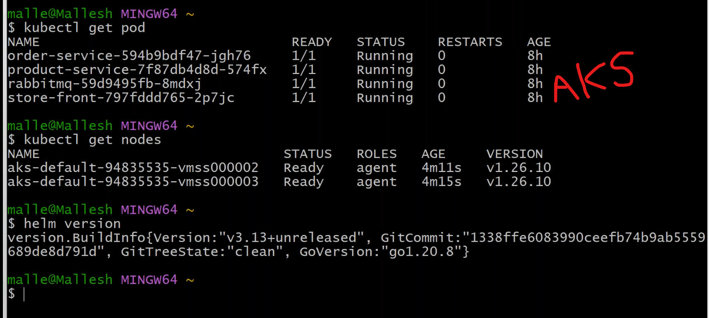
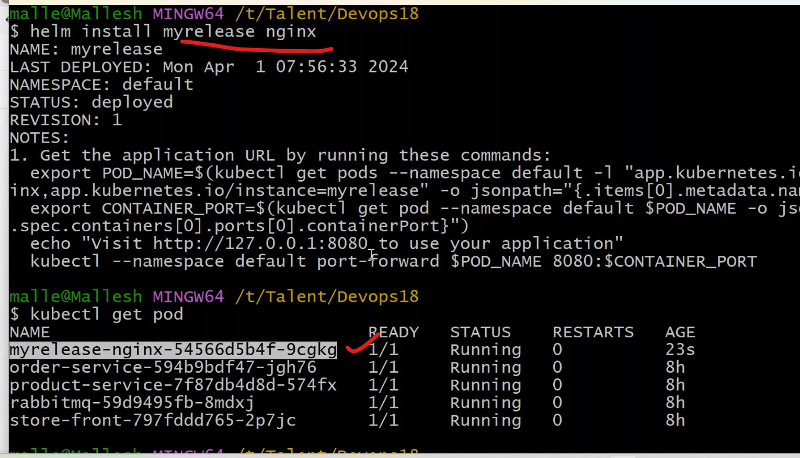
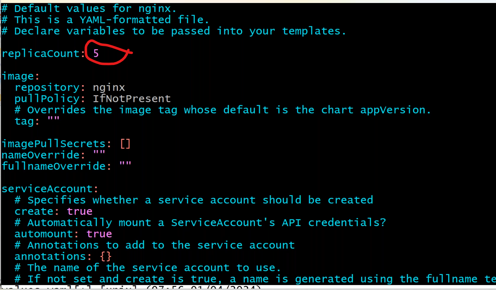
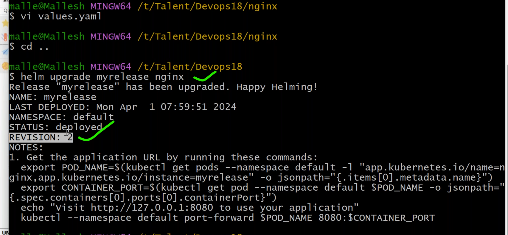
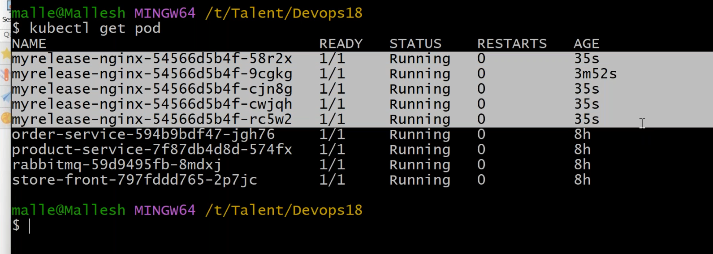

## Helm    (01_04_2024)
------------------------------------------
* [Refer Here](https://helm.sh/docs/intro/install/) for helm installation.

* helm installation

```
bash itself executabel we no need to give permissions
```
* create helm chart




* helm chart deployment.
```
helm install <release name> <chartname>
helm install my-nginx nginx
```

* helm to connect the k8s cluster it depends on __.kube/config__ folder,it has cluster information.






```
helm install my-release nginx --dry-run
```

### k8s Links
--------------------------------
* k8s vs k3s: The Comprehensive Difference [Refer Here](https://medium.com/@ostridelabs/k8s-vs-k3s-the-comprehensive-difference-f7667d141c0)
* What’s Sysbox by Nestybox? [Refer Here](https://sestegra.medium.com/whats-sysbox-by-nestybox-3b4dbcfe878)
* Secure, Efficient Docker-in-Docker with Nestybox [Refer Here](https://ctalledo.medium.com/secure-docker-in-docker-with-nestybox-529c5c419582)
