# helm continution...

## builtin objects in helm
---------------------------------------
* for official docs [Refere Here](https://helm.sh/docs/chart_template_guide/builtin_objects/)
  

## multiple cluster management in k8s
------------------------------------------------------
* all the clusters information stored __~/.kube/config__.
* command used in `.kube`. to know the all the clusters information
```
kubectl config get-contexts
```
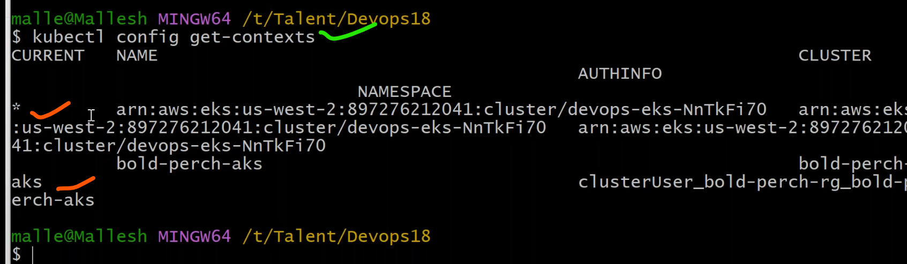
* to switch from one cluster to another cluster use the below command
```
kubectl config use-context <cluster-name>
```
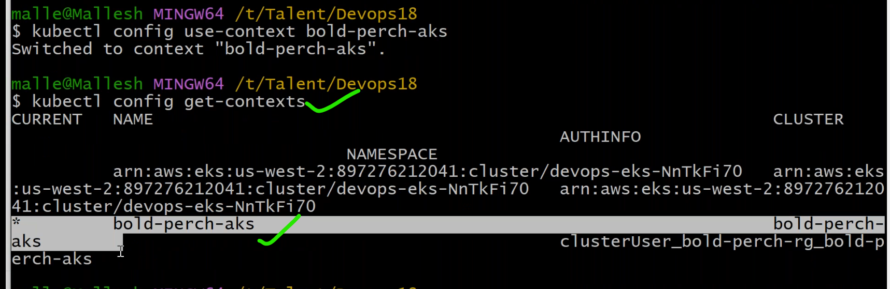
* check __deploment.yaml__ in template.
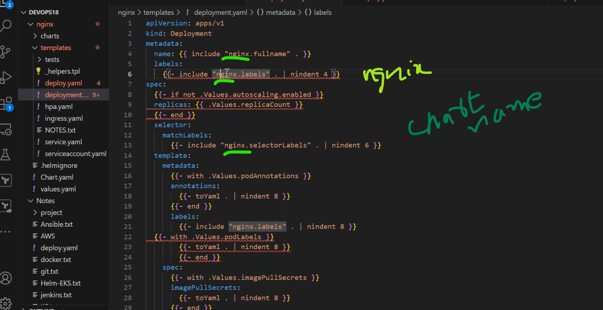

### conditions in helm
----------------------------------
* __if__
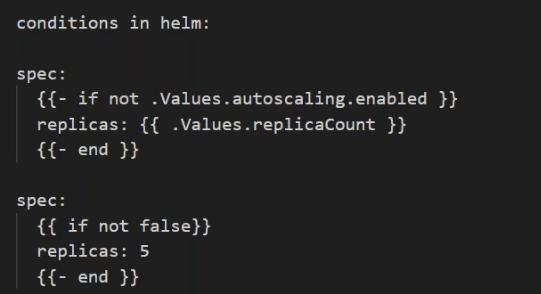
* __with__
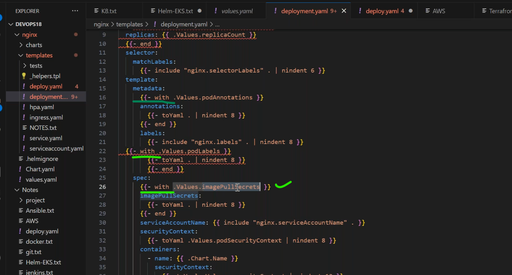
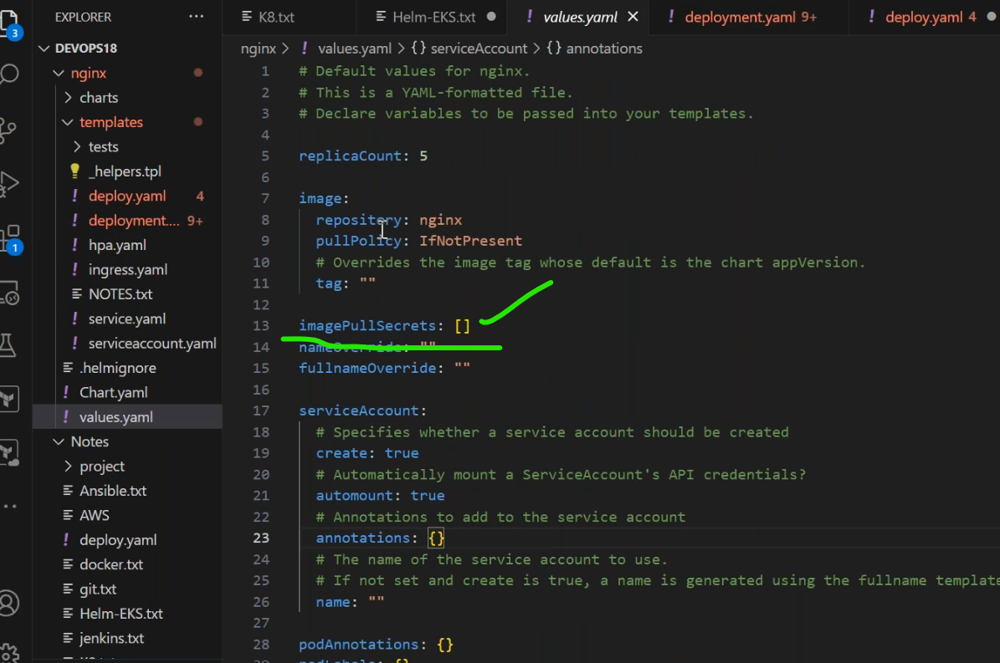
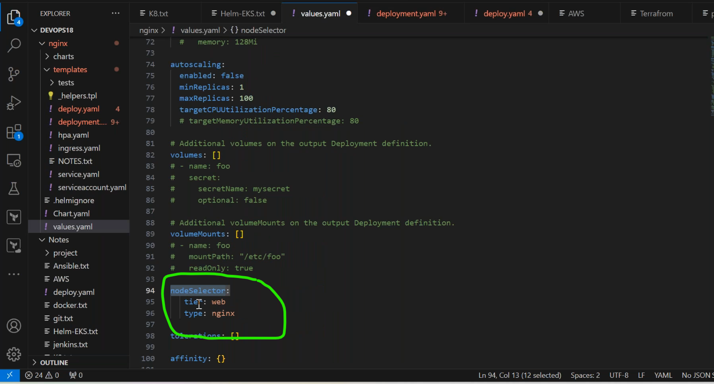
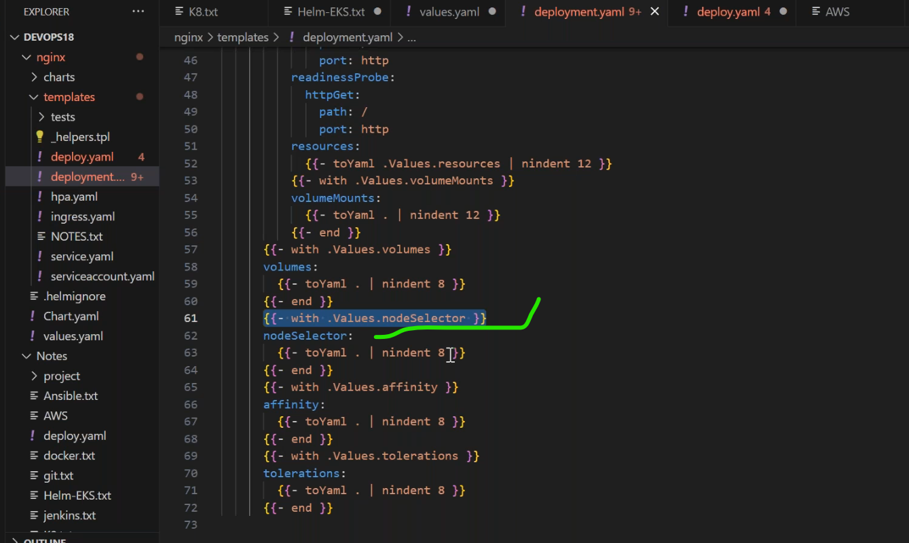
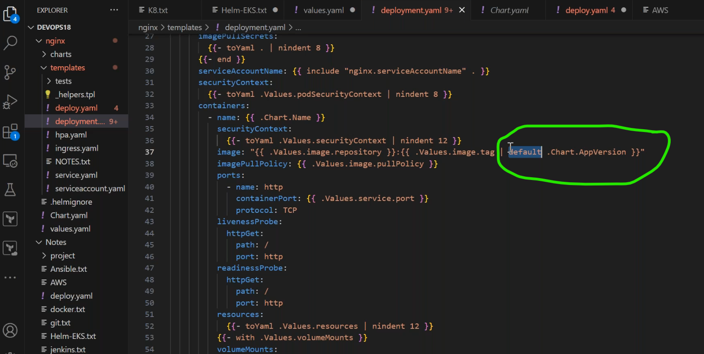

### commanads used in helm
------------------------------
* to list all hem repos
```
helm list
helm list -A
```
* to install helm repo
```
helm intall <release-name> <chart-name>
helm install mynginx nginx
```
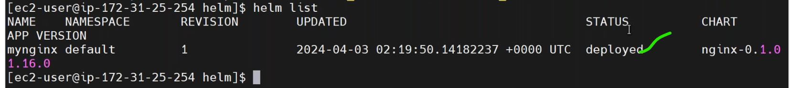
* to upgrade the changes (rolling update)
```
helm upgrade <release-name> <chart-name>
helm upgrade mynginx nginx
```
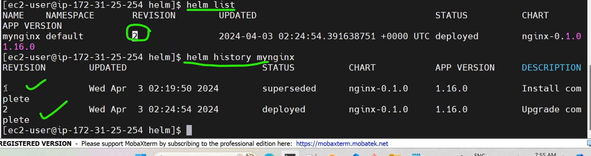
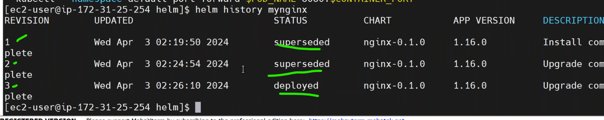
* go back to previous release
```
helm rollback <relase-name>
helm rollback mynginx
```


