# Helm Continued...
----------------
## Helm charts for multiple environments
----------------------------------------------------
### creating a name space in helm
-----------------------------------------
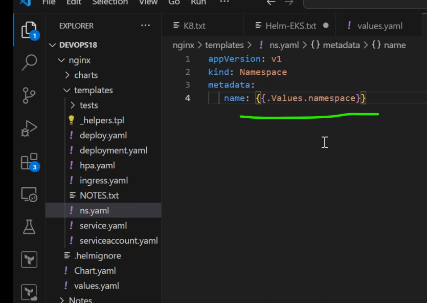
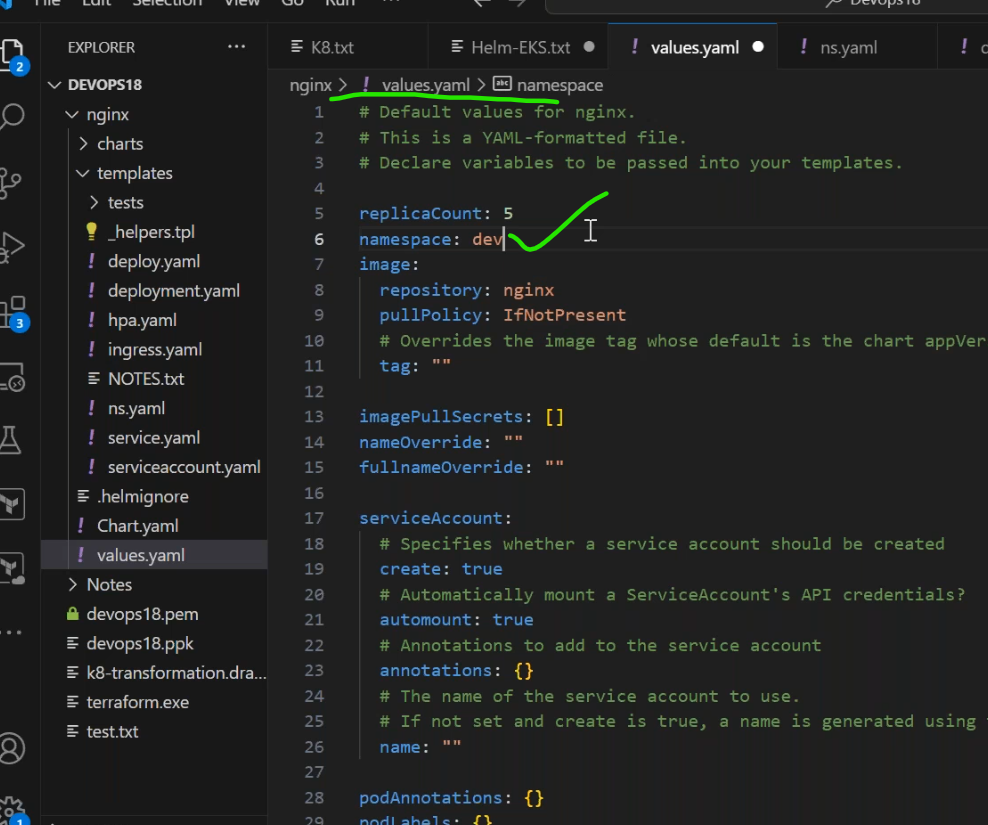
* namespace for particular workload like deployment.
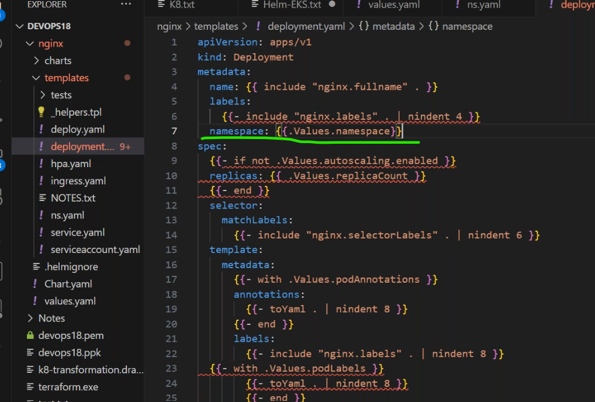
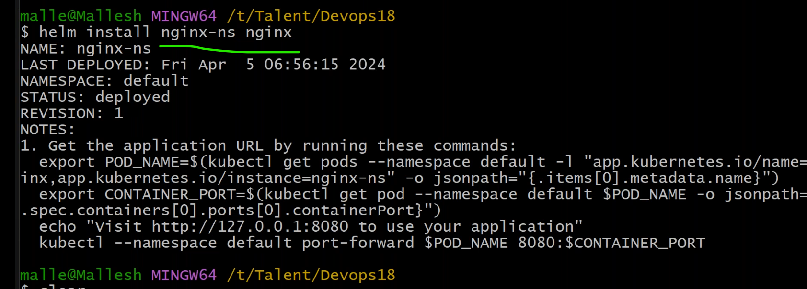
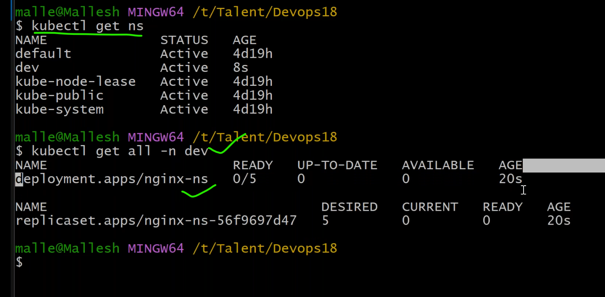
* pods creation failed.
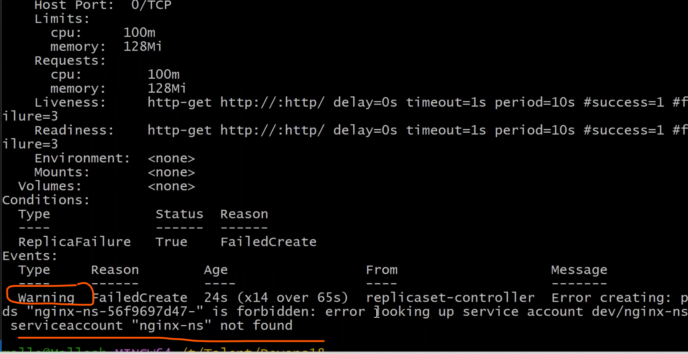
* service and service accounta are created in default namespace,service account is dependency with namespace
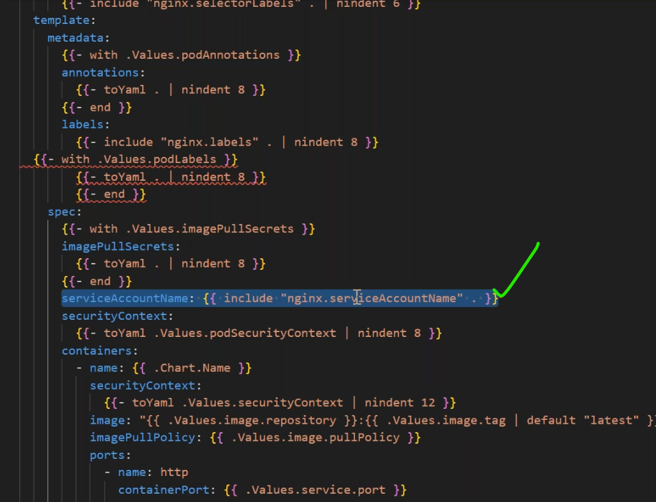
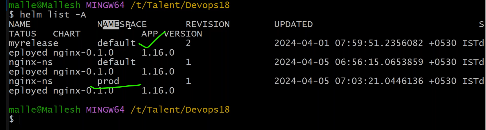
### scenario1: how to manage same helm chart for multiple environments.
-------------------------------------------------------------------------------
* create dev,prod,qa yaml files.
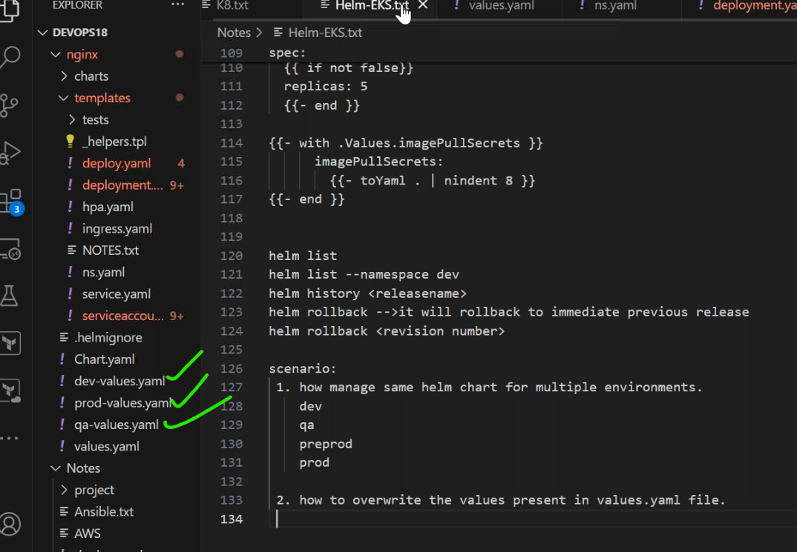
* change replicas to __1__ in devvalues.yaml, in qa __2__,prod __10__.
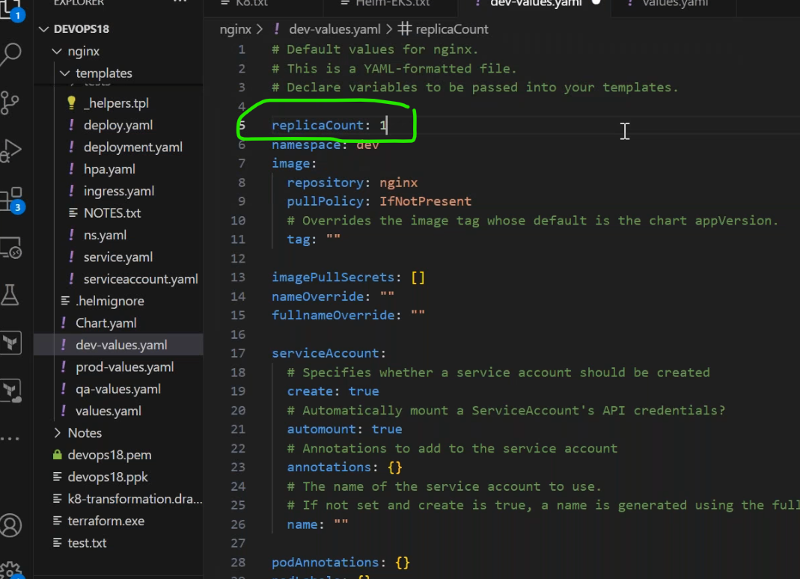
* how to pass values.yaml for specific qa environment?
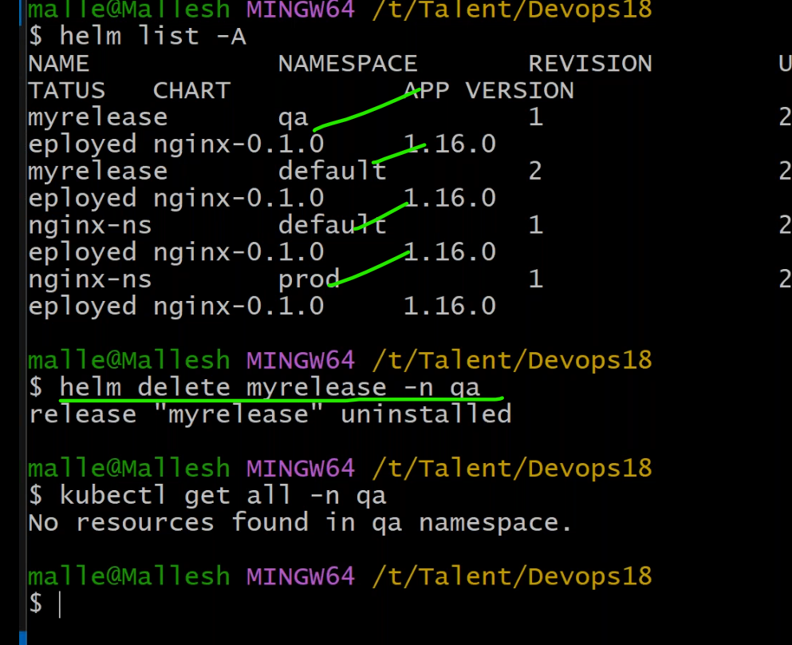
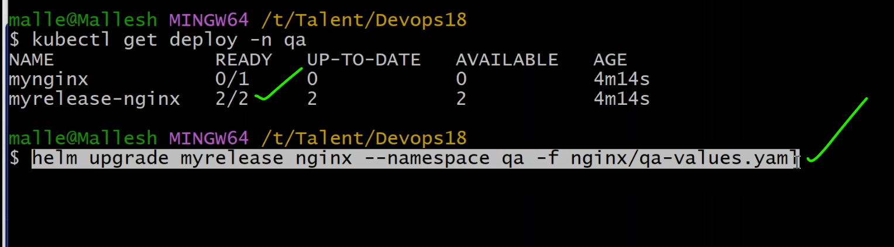
* to overwrite value by __--set__.
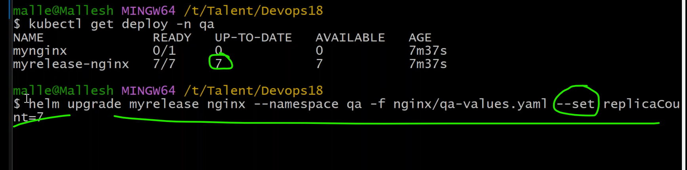
  

### scenario2:how to overwrite the values present in __values.yaml__ file.
----------------------------------------------------------------------------------

