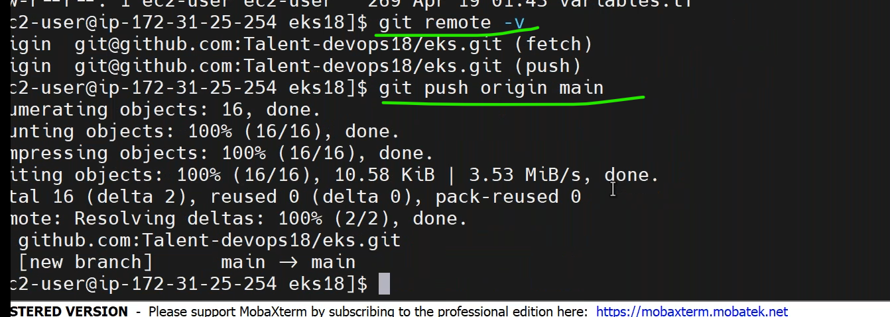

git
------------------------------------------------------
* to check the git repo by,
```
git remote -v
```
* to remove the git repo by,
```
git remote remove origin
```

 ### how to push local repo to remote repo
 --------------------------------------------------------------------------
 * `steps`:
-------------------------------------------------------
```
git init
git status
git add *
git status
git commit -m " <commit message> "
```


* to push the local changes to `remote repo` we need a repo url.
* create a new repository in github.
  
  
* to add remote repo by,
```
git remote add origin <repo link>
git remote -v
```
* to change the branch name by,
```
git branch -M main
```
* to push the changes form local to remote by,
```
git push -u origin main
```

* generate ssh keypair for the user by,
```
ssh-keygen
```

* add publickey in `github` ssh keys.




## jenkins Installation
---------------------------------------------------------------------------
* create a another server and install `jenkins` in it.
* to know the os relase by,
```
cat /etc/os-release
```
* [Refer Here](https://www.jenkins.io/doc/tutorials/tutorial-for-installing-jenkins-on-AWS/) for the installation steps of jenkins in amazon linux.
* [Refer Here](https://aws.amazon.com/corretto/?filtered-posts.sort-by=item.additionalFields.createdDate&filtered-posts.sort-order=desc) for amazon OPENJDK(correto).
### drop cache in vm
---------------------------
* to clear cache in vartual machine by,
```
sudo -i
sync;echo 3 > /proc/sys/vm/drop_caches
or
sysctl -w vm.drop_caches=3
```

* we have to give `dns` to jenkins ip.
  
*  associate `elastcip` to the jenkins inastance.
  
  

### creating a declerative pipeline to execute the terraform script
----------------------------------------------------------------------------------
* write a jenkins declerative pipeline,
```Jenkinfile
pipeline {
    agent any
    stages {
        stage('terraform') {
            steps {
                sh 'terraform init'
            }
        }
        stage('tf validation') {
            steps {
                sh 'terraform validate'
            }
        }
         stage('tf plan') {
            steps {
                sh 'terraform plan'
            }
        }
         stage('tf apply') {
            steps {
                sh 'terraform apply --auto-approve'
            }
        }
        stage('tf destroy') {
            steps {
                sh 'terraform destroy --auto-approve'
            }
        }
    }
}

```
* to parameterize the build [Refer Here](https://www.jenkins.io/doc/book/pipeline/syntax/#parameters).
* to add options in pipeline [Refer Here](https://www.jenkins.io/doc/book/pipeline/syntax/#options).
* to use `when condition` [Refer Here](https://www.jenkins.io/doc/book/pipeline/syntax/#when).
```Jenkinsfile
pipeline {
    agent any
    options { buildDiscarder(logRotator(numToKeepStr: '3')) }
    parameters { choice(name: 'TF_CHOICES', choices: ['plan', 'apply','destroy'], description: 'select prefered parameter') }
    stages {
        stage('terraform') {
            steps {
                sh 'terraform init'
            }
        }
        stage('tf validation') {
            steps {
                sh 'terraform validate'
            }
        }
         stage('tf plan') {
             when {   // when
             expression { params.TF_CHOICES == 'plan' }
        }
            steps {
                sh 'terraform plan'
            }
        }
         stage('tf apply') {
             when {     //when
             expression { params.TF_CHOICES == 'apply' }
        }
            steps {
                sh 'terraform apply --auto-approve'
            }
        }
        stage('tf destroy') {
             when {                             // when 
             expression { params.TF_CHOICES == 'destroy' }
        }
            steps {
                sh 'terraform destroy --auto-approve'
            }
        }
    }
}
```
### Integrating jenkins to github account
-------------------------------------------------------------------------------------------
* make changes in `sudo vi /etc/passwd`.
  
  

* go to jenkins user and generate sshkeys.
```
sudo su - jenkins
pwd
ssh-keygen
```
* copy public key and add it in github ssh keys.
 

* add private key in jenkins credintials.`username with privatkey`.
  

* error in this.
  
* to resolve this error we need to set non host verificationj stratagy.
  

  


# discussions
------------------------------------------------------------------
1. Oracle java license changes.
2. Jenkins vulnerabilities.
3. jenkins java compatability.
4. jenkins upgrade.