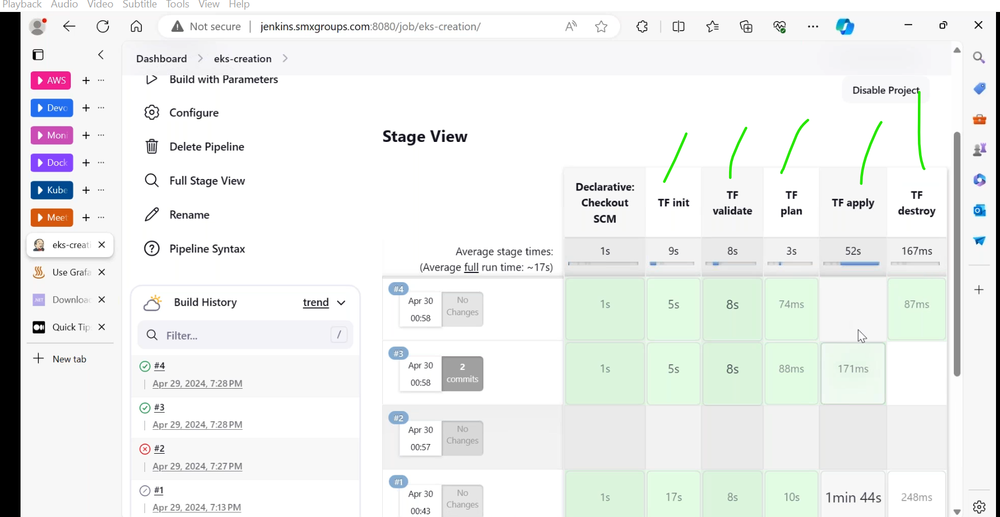

* [Refer Here](https://github.com/VictoriaMetrics/VictoriaMetrics/tree/master/deployment/docker) check this repo.
* new Feature in jenkins latest version.(disk space management).

* it monitering the `tmp` directory.
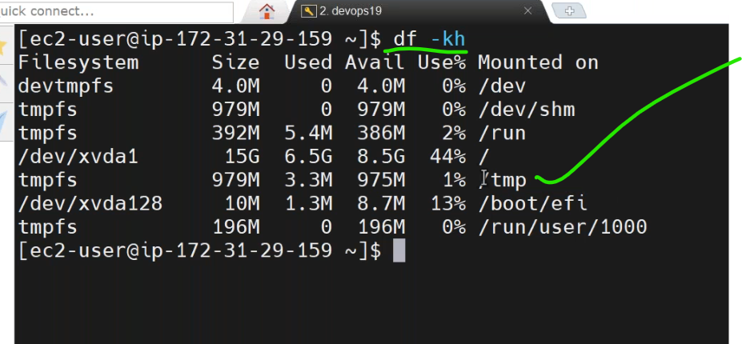
* [Refer Here](https://www.jenkins.io/changelog-stable/) change logs of jenkins.

# 3 tier Architecture
---------------------------------------------
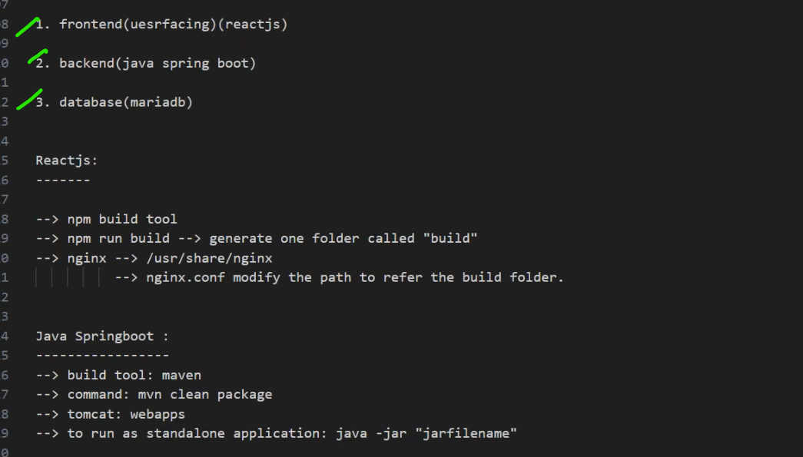
* Each `microservice` will have their own repository.
* create a private repository for java `springboot`.
  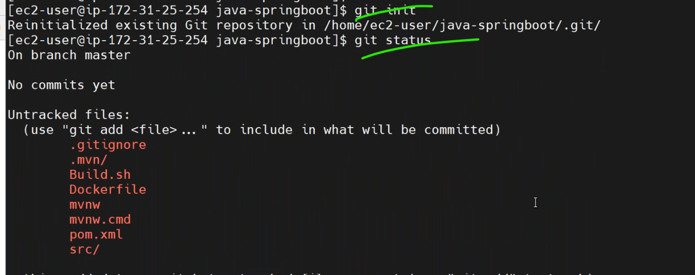
  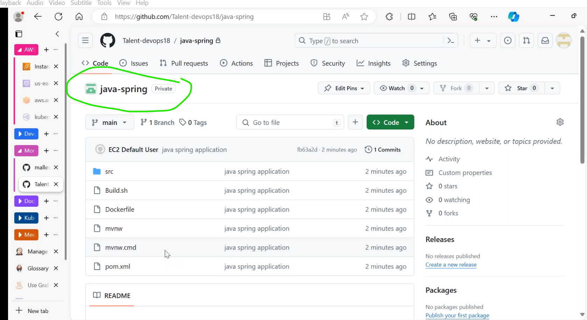
  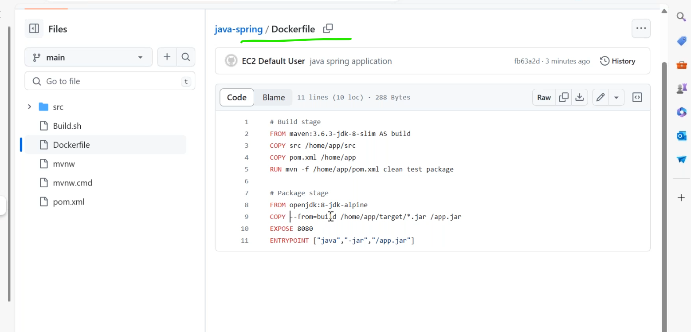
  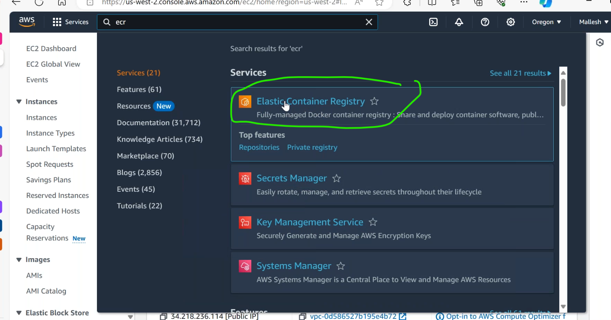

* [Refer Here](https://medium.com/@vijulpatel865/building-docker-image-using-jenkins-pipeline-push-it-to-aws-ecr-aa02cc7a295e) for docker image creation and push to `ecr`.
* we have to jenkinspipelines for craeting 3 different `docker images`.
  1. java app
  2. nodejs
  3. db
* to work with `ecr` we need to configure aws cli.
* jenkins file for java springboot.
```Jenkinsfile

```
* we have to create `ecr` private to push the image to ecr.
### ECR creation
----------------------------------------
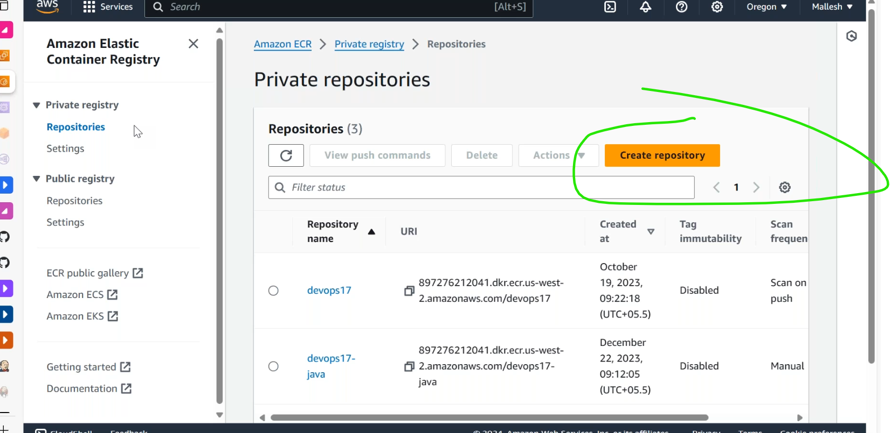
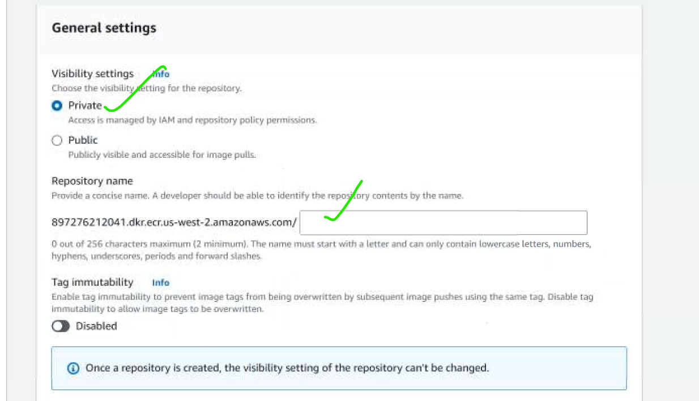
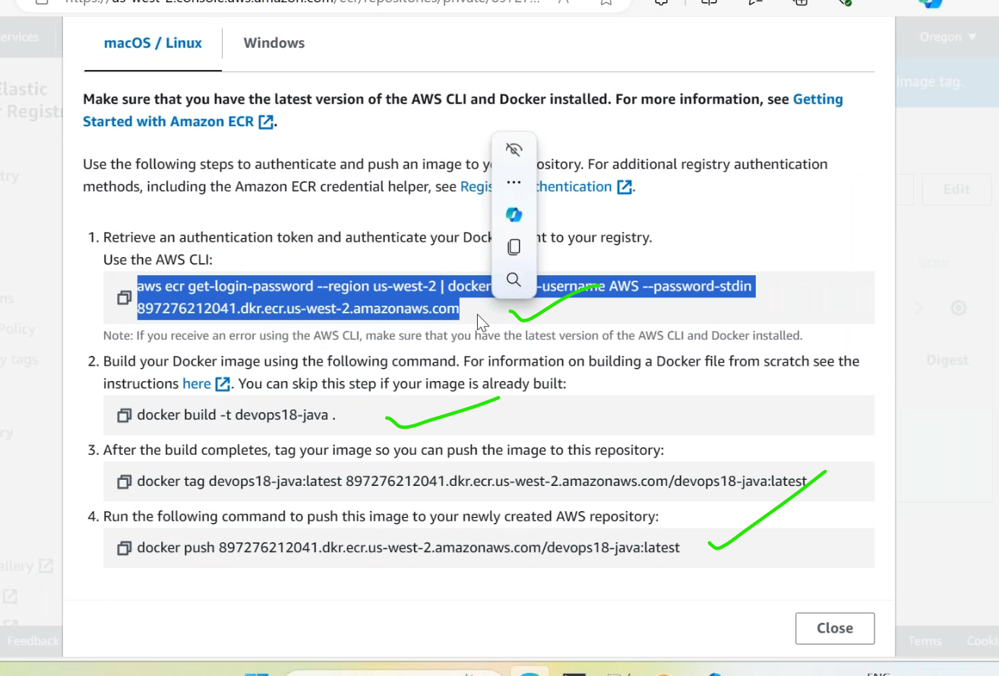
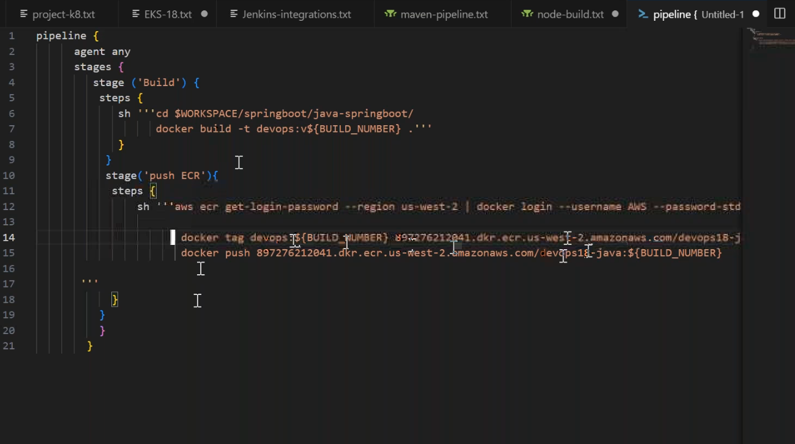
* try to run pipeline it is failed. because there is no docker in this jenkins server.
  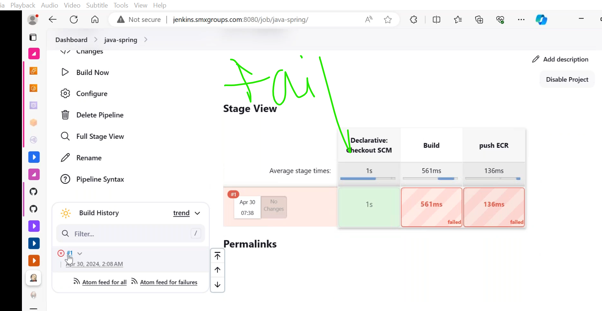
* install docker in it.[Refer Here](https://docs.aws.amazon.com/serverless-application-model/latest/developerguide/install-docker.html) for docker installtion for amazon linux.
*  create a react js build repo in `ecr`.
  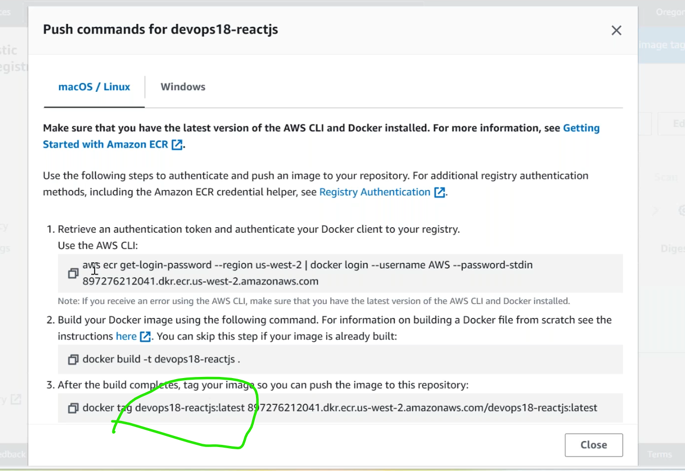
  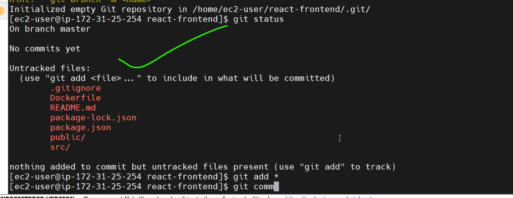
* scanning the image.
  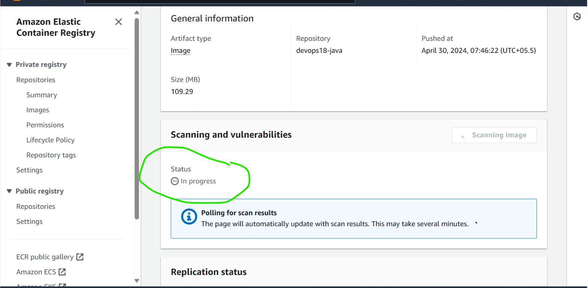
