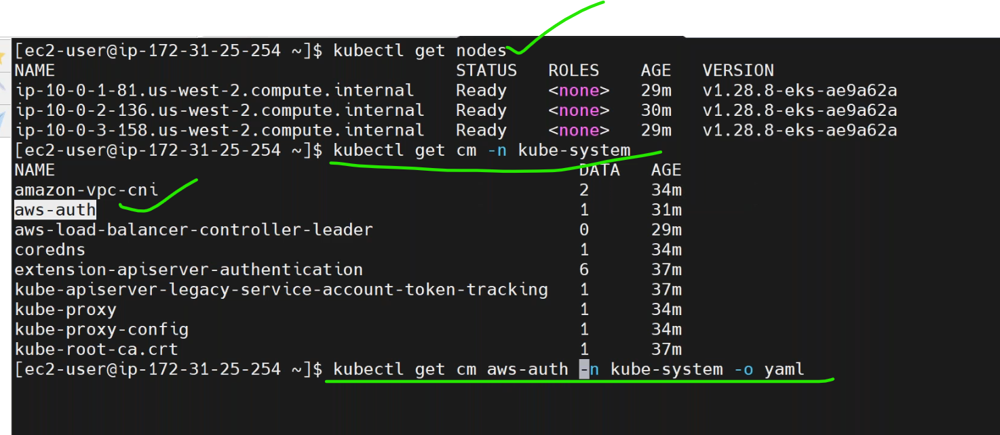
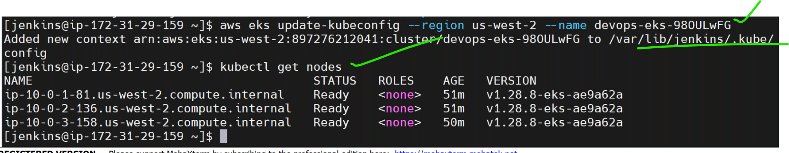

* create a EKS cluster in jenkins pipeline.
  
  
  
* till now we already push the java image and nodejs image to ECR.
* we get the mariadb from official dockerhub.download(pull) the image and push this to ECR.
* write a pipeline for mariadb image to download from dockerhub and push it to ECR.
* create a new ECR repository.


* jenkins server consumes disk space because of the docker images so we have clean the images after docker push completed.
  
  
  
  
* now we have 3 images of java,nodejs and mariadb.
 
 * [Refer Here](https://hub.docker.com/_/mariadb) for the docker image.
  
## Springboot Application


* in the react js front end code we define the backend  java url.
  
* in the backend java code we define base url of the front end.
  
* mariadb url get from java code.
  
  
  
* lets create the eks cluster.

* now we have to connect EKS cluster in bastion server not in jenkins server.by
```
aws eks update-kubeconfig --region us-west-2 --name <clustername>
```


* what role was allocated to jenkins server same role will be allocated to bastion machine.
  
  
  
  
  
* after creating the cluster we need to deploy least depency of the application so we can deploy mariadb by using helm charts.
* [Refer Here](https://github.com/bitnami/charts/blob/main/bitnami/mariadb/README.md) for maraidb helmchart.
* bitnami was the vmware company.


* create a one repo for the mariadb.move the maraidb to separate folder and make it as git repo.commit all the files in mariadb.

* create a new private repository in github.
  
* check the values.yaml by
```
less values.yaml
```


* create a new file with modified values.
  
  
* commit the changes and push to repo.
* now create a pipeline to deploy the helm charts.
## jenkins integration with kubectl and helm

* install kubectl [Refer Here](https://docs.aws.amazon.com/eks/latest/userguide/install-kubectl.html) and install helm [Refer Here](https://docs.aws.amazon.com/eks/latest/userguide/helm.html) in jenkins server with jenkins user.


* we dont have a `.kube` folder in jenkins server.
  
* now install helm.
  
* write a new jenkinsfile to run the mariadb with helm.
  
  
  
  
* create namespace by command.
