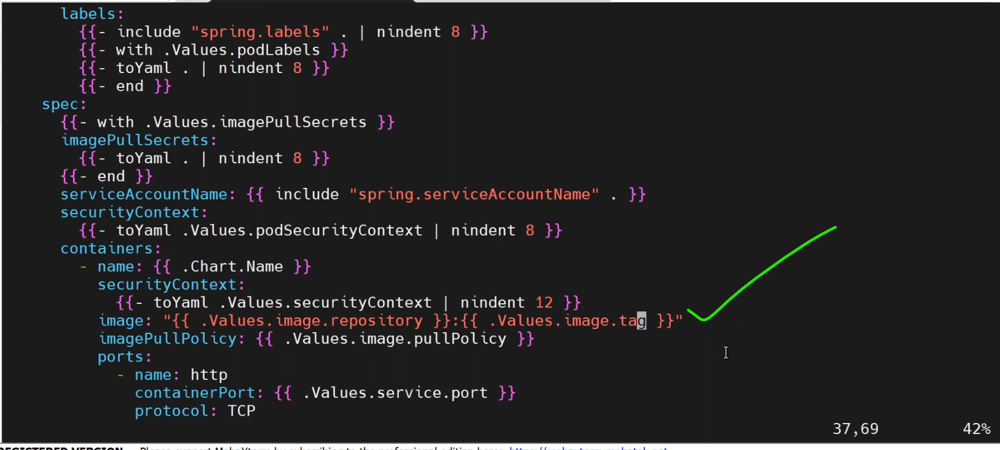
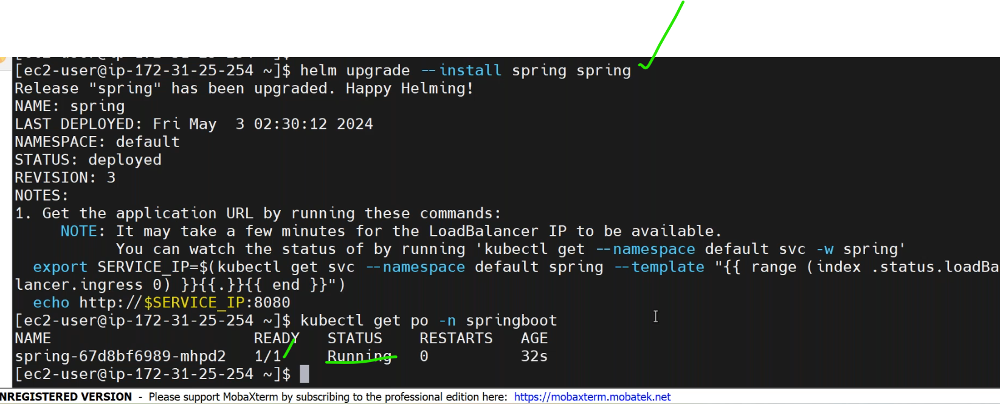
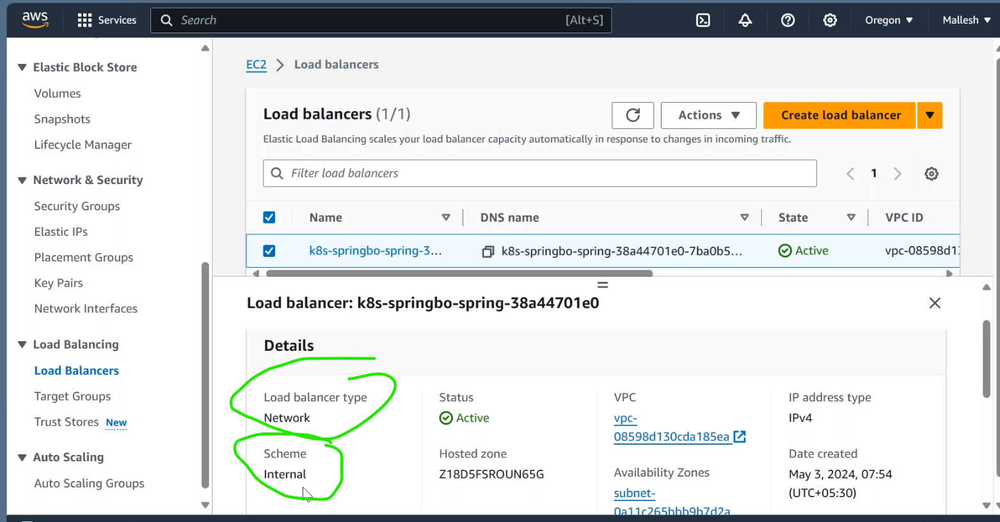

* create helm chart for java application.

* Till now we are using public docker images(public registry) in k8s manifest.now we use our custom docker images(private registry[ECR]) in k8s manifests.
* so we need to create a secret.
* [Refer Here](https://skryvets.com/blog/2021/03/15/kubernetes-pull-image-from-private-ecr-registry/) for docs.
* [Refer Here](https://gist.github.com/t2wu/ce286e0883fe10cd54b664be17bf63fe) for another link.
```yaml
kubectl create secret docker-registry regcred \
  --docker-server=<aws-account-id>.dkr.ecr.<aws-region>.amazonaws.com \
  --docker-username=AWS \
  --docker-password=$(aws ecr get-login-password) \
  -o yaml
```


* this `.dockerconfigjson` contains ECR credintials.
* in the k8s manifest file we have a parameter `imagepullsecrets` we use this secret in that parameter.

* Pull an Image from a Private Registry [Refer Here](https://kubernetes.io/docs/tasks/configure-pod-container/pull-image-private-registry/) for official docs.
* we are created separate namespaces for java,reactjs,database.but the secrets are available for all the namespaces.
* now goto java helm chart `chart.yaml` remove the app version. 
  
  
  
* give the values in values.yaml file.
  
  
  
  
* push all changes to github.
  
* in the java application default username and password are root,root.but in helm chart we can give username root and password root123 a different passwords.
  
  
* create a new namespace for java app `ns.yaml`.
  
* specify the namespace in `deployment.yaml`.
  
* hpa
  
* ingress
  
* change this in service.yaml,service account.yaml also.
* give the value of namespace in `values.yaml`
  
  
* it getting failed.
    
* to check the failure by `kubectl describe po <pod-name> -n <namespace>`.
  
* liveness and readiness probes are failed.
* we keep the default valuses in probes http,http is default 80 port.
* define a liveness probe as a tcp socket.[Refer Here](https://kubernetes.io/docs/tasks/configure-pod-container/configure-liveness-readiness-startup-probes/).
  
  
  
  
* it is failing beacuse it is unable to connect the database.
### we have two approaches to connect or change credintials in database.
 1. we can update new username password in application.properties file again do docker build and create new docker image.
 2. we can `application.properties` as configmap.create a separate configmap and add to pod or container as a volume.
* copy the all data present in `application.properties` and create a new file in helm directory `vi application.properties` and paste the entire values.
   
* create a namespace database.
```
kubectl create ns database
```

* first we deploy the database afteer that we have to deploy java app.
  
  
* one pod is communicate with another pod witin the k8s cluster by clusterip.
* `databse url`.
```
<servicename>.<namespace>.<port>
```


* [Refer Here](https://kubernetes.io/docs/concepts/configuration/configmap/) config maps.
  
* configmap added to deployment.`vi deployment.yaml`.
  
  
  
* pod creation is failing because the configmap present in default namespace and the application files placed in springboot  namespace.
  
  
* disable the resources in values.yaml file.
  
  
  
* it is created internel network loadbalencer.
  
* we have to specify annotations in service.yaml file in EKS.
  
* the pod is running and database is connected but we have to access by internet give a annotations.
  
  