## 11/12/2023
-------------------------------
* use command __which git__ to find git path
   * find the path and paste in global tool configuration
* install maven 
``````
  sudo yum install maven -y
  sudo apt install maven -y
  mvn -version
``````
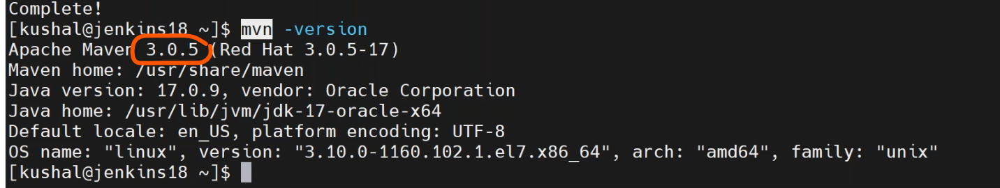
* configure maven in tools
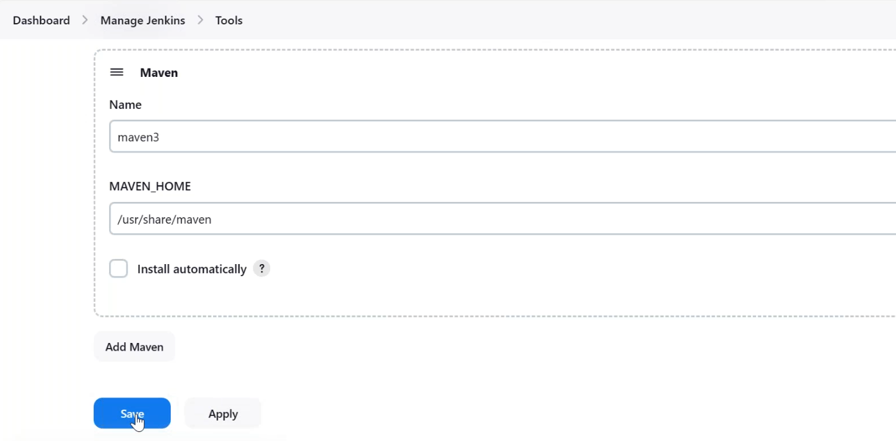
* create a new freestyle job git-mvn-integration
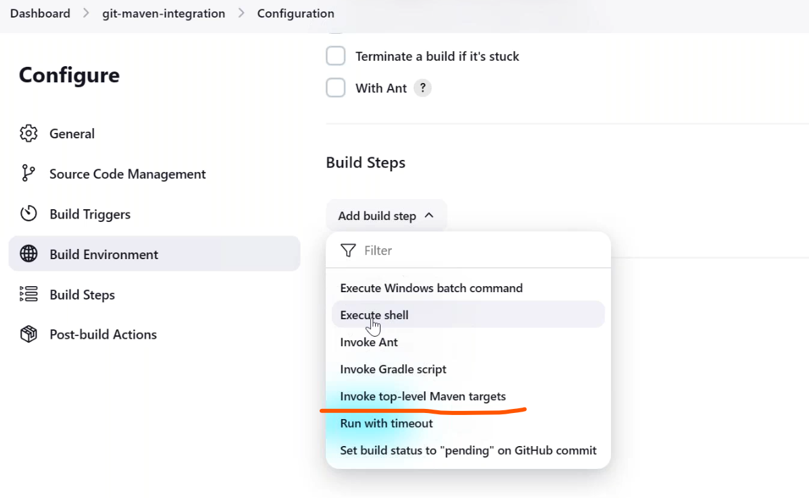

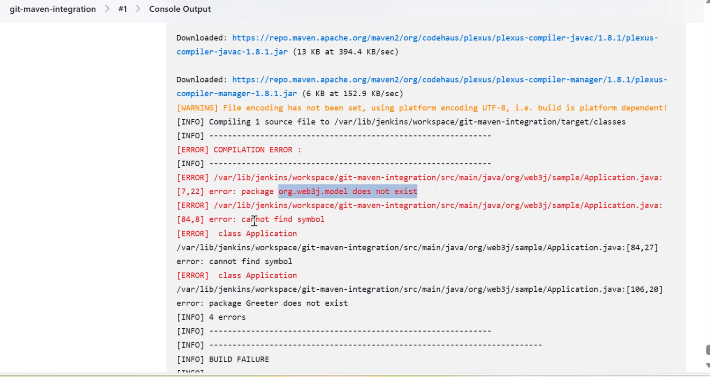
  * this is code internal error.
* integration with private repositories in jenkins
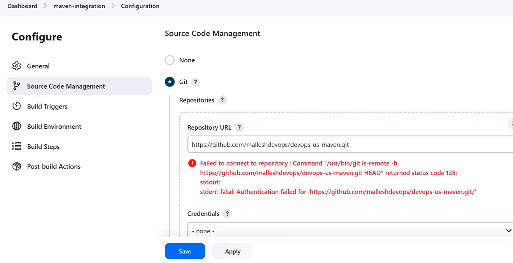
   * it has failed so we had to add credintials of private github account.
* so we authenticate by ssh
   * we have  normal user,root user,jenkins user in which user we can create ssh-keygen??
     * key will be different for each user
     * so generate jenkins user
     * got jenkins home directory ssh-keygen
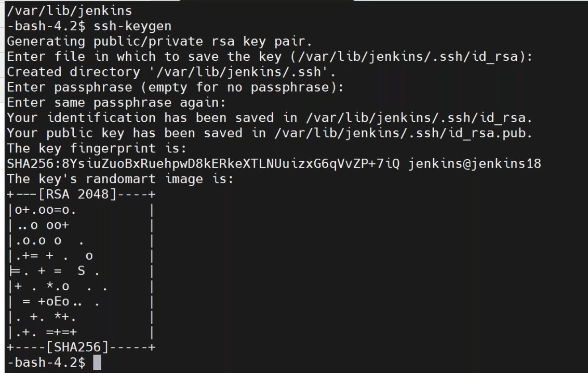
     * add publickey to github repo
``````
  cat /.ssh/id_rsa.pub
``````
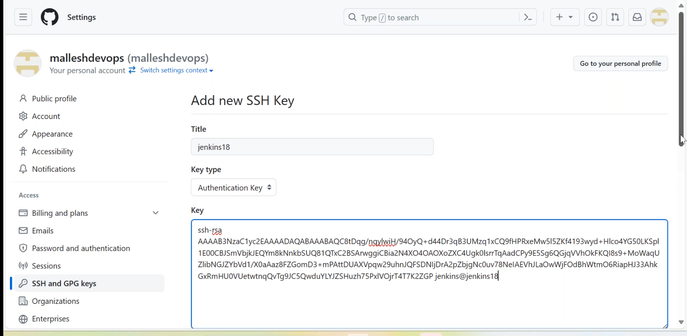
     * using private key create credintials in jenkins
``````
   cat /.ssh/id_rsa
``````
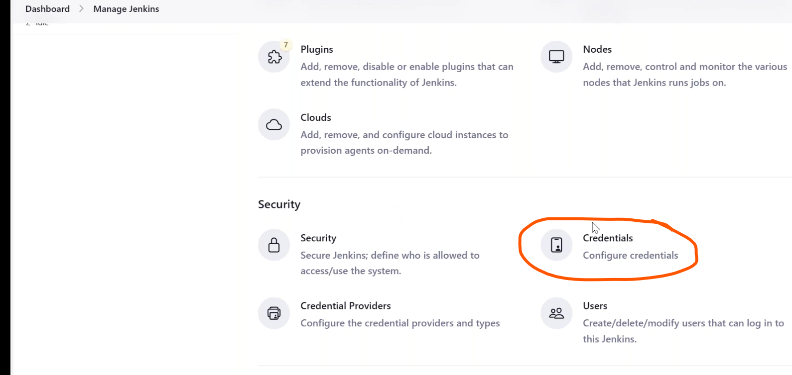
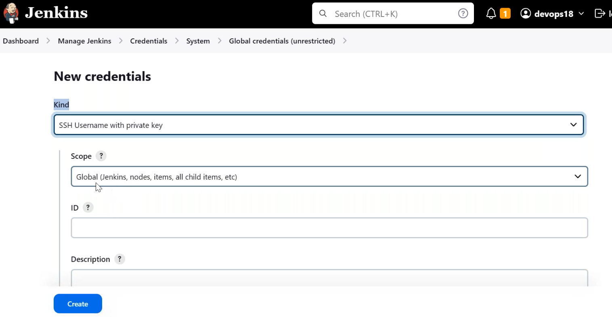
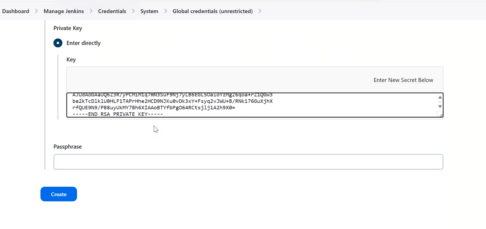
 * git clone repo manually in command line
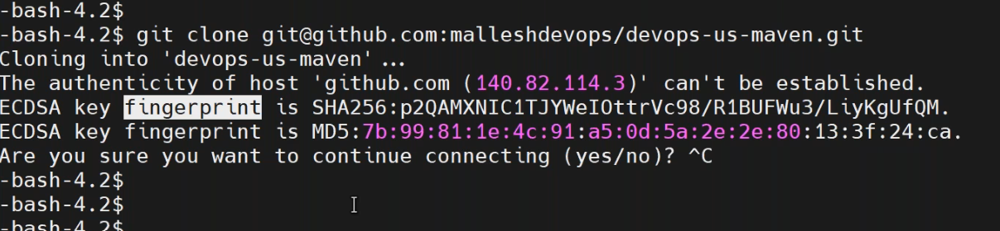
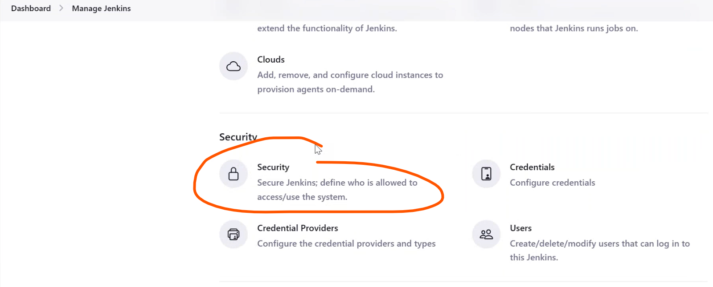
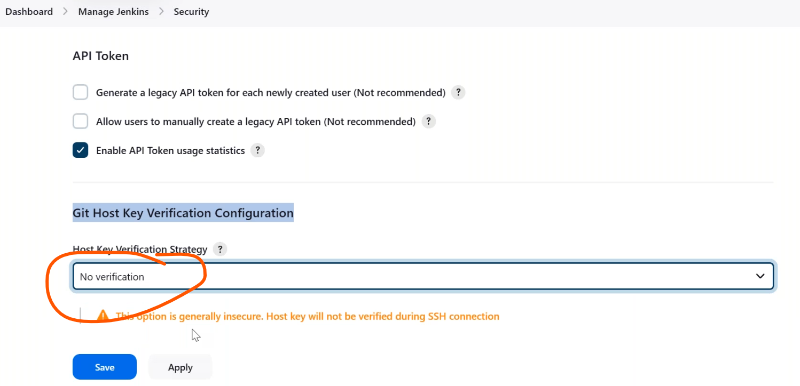
* without selecting the no verification stratagy we got a error in the build.
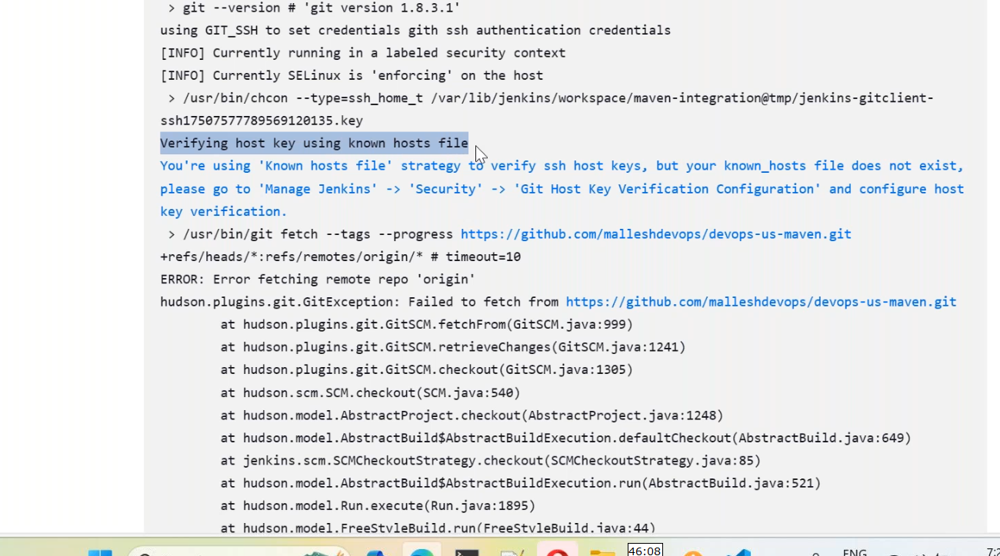
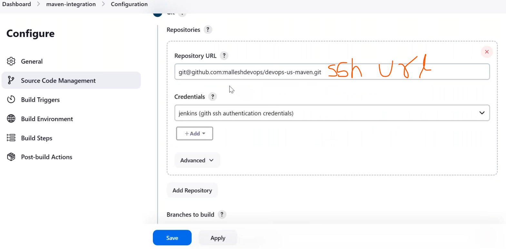
* we can deploy jar/war file in tomcat webapps folder
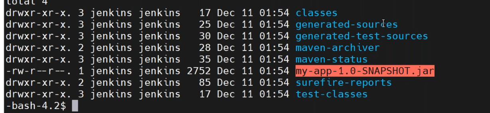
* discard old builds
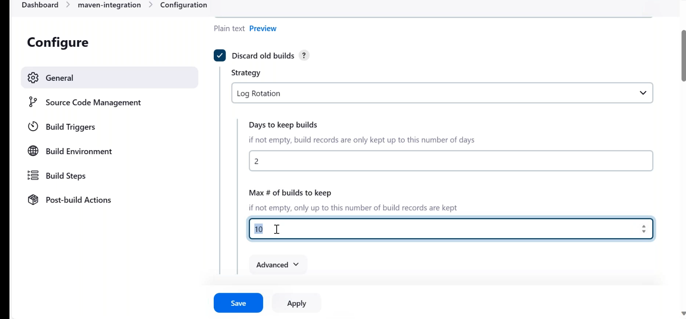
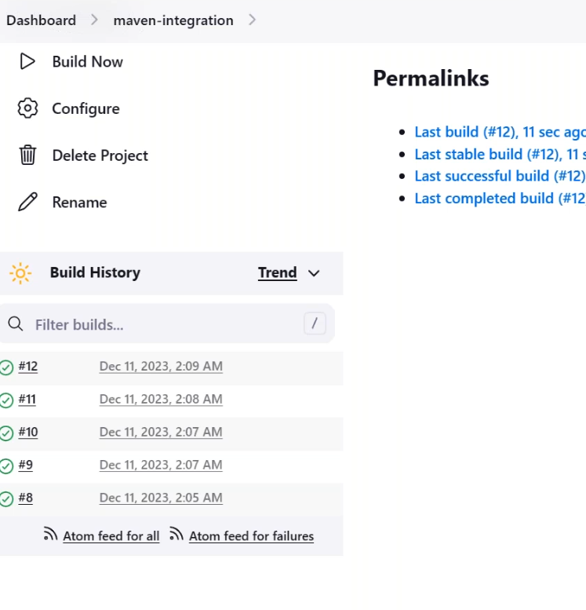
* going to delete a workspace before creating a new build
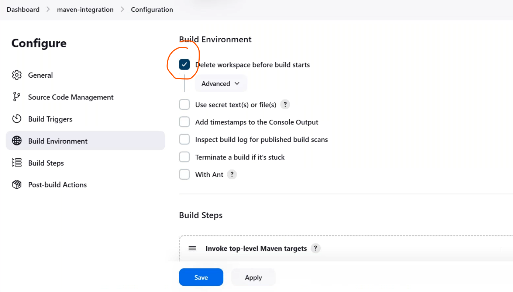
* add time stamp to the console output
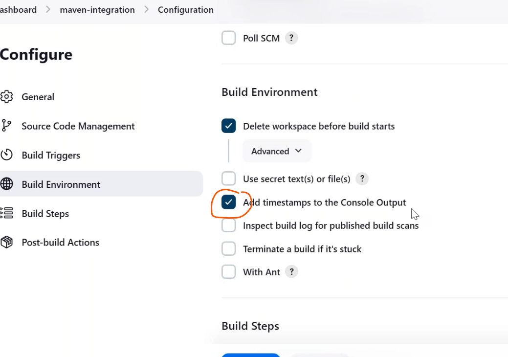
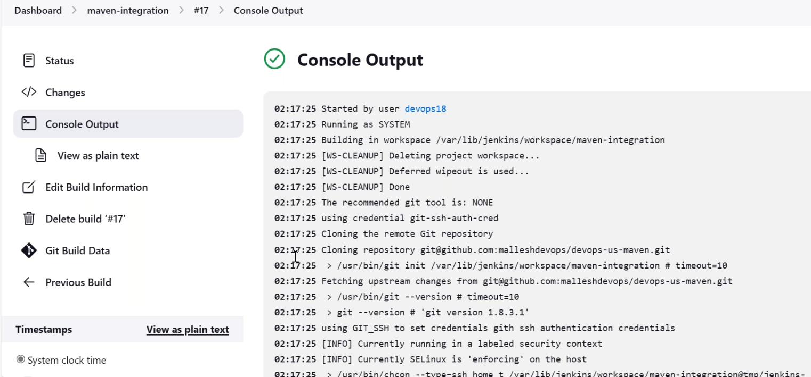
  