## 12/12/2023
----------------------
### scenario-1
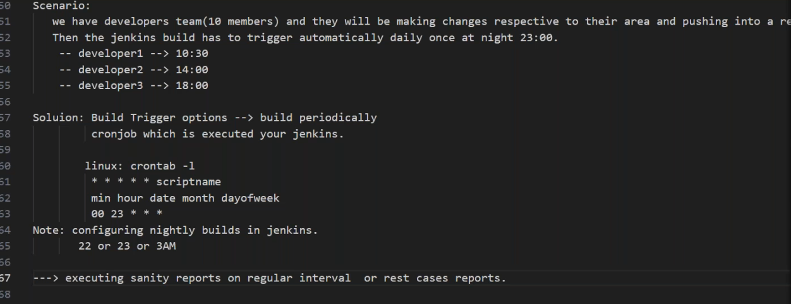
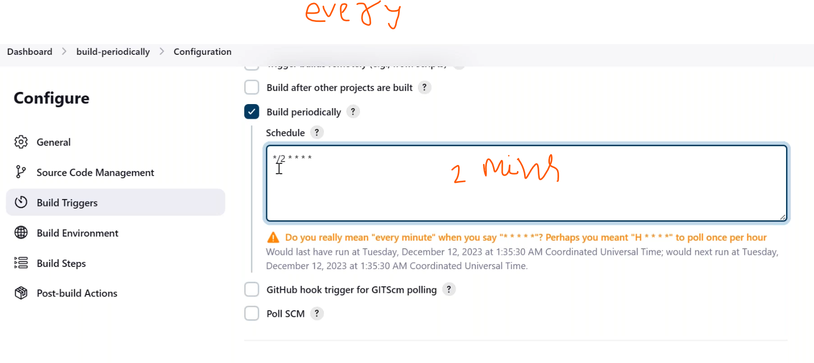
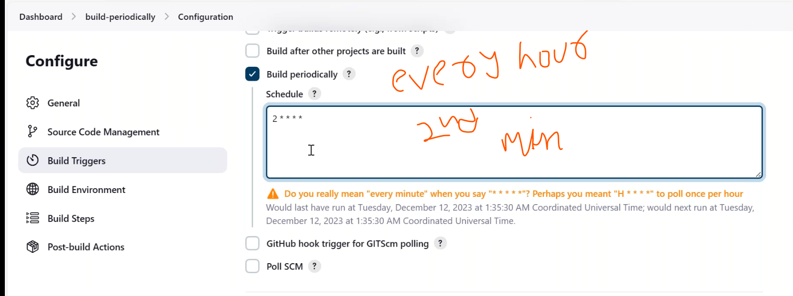

### scenario-2
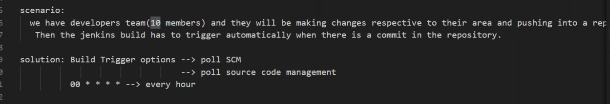
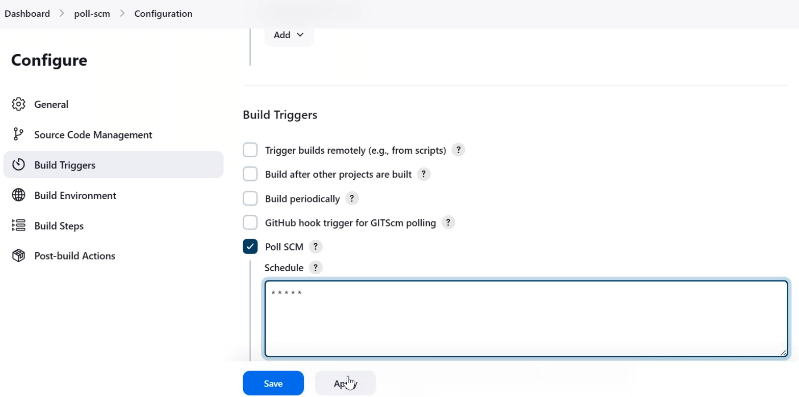
* changes in a repo it automatically trigger the build.
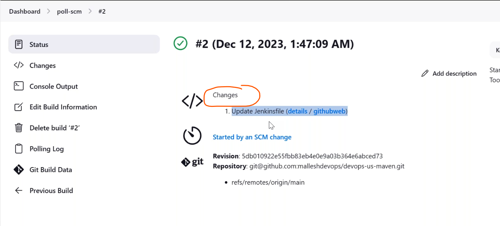

### scenario-3

* git webhooks 
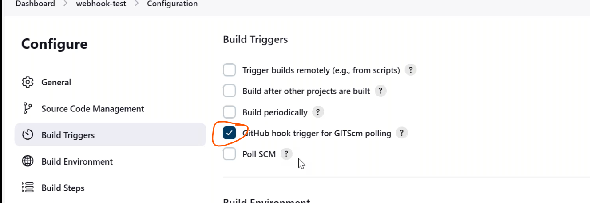
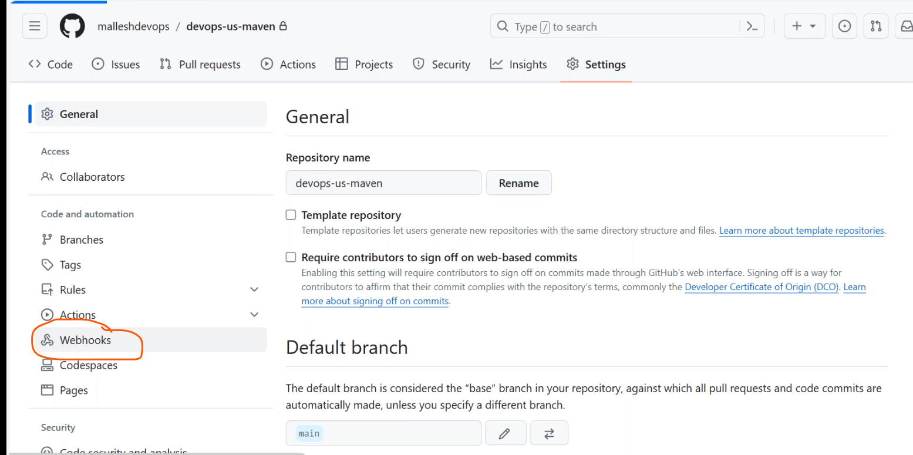
* add url
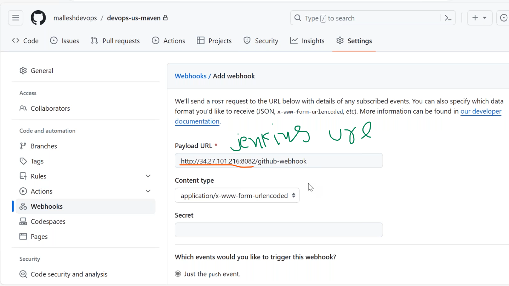
* url error
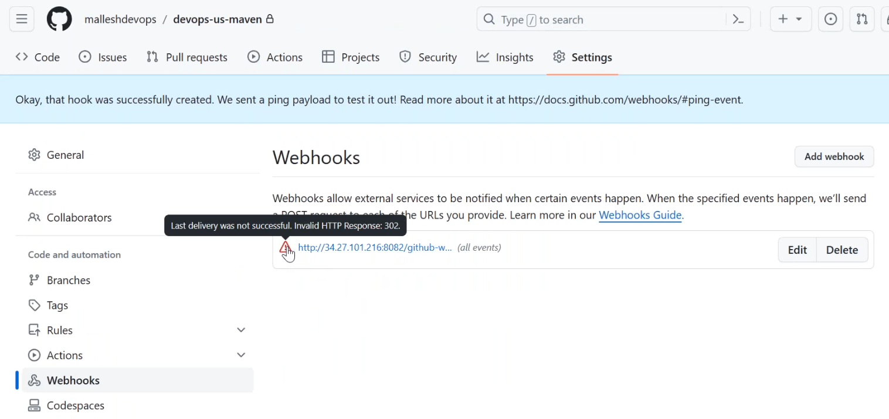
* added correct url
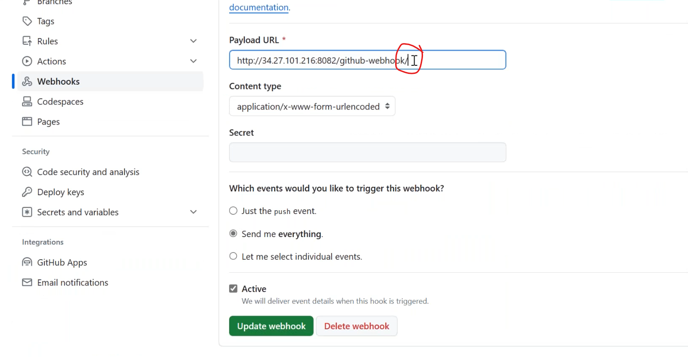
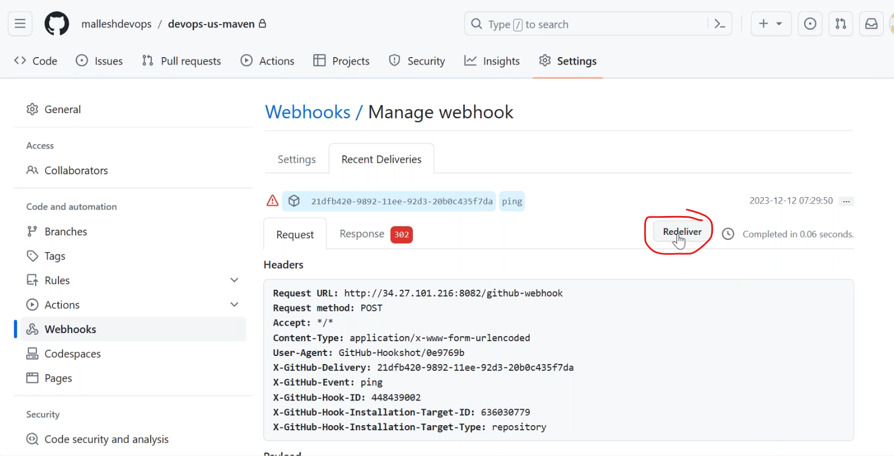
* make some changes in that repo
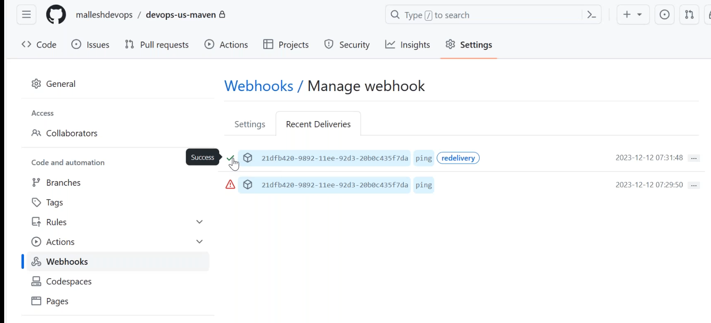
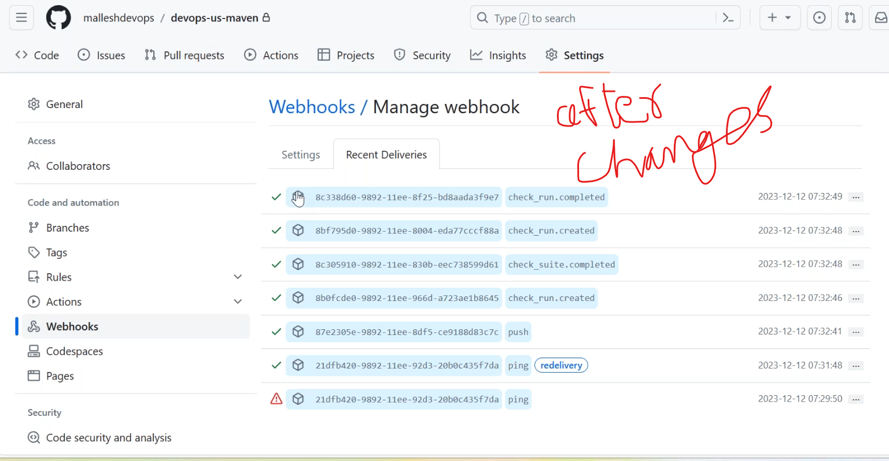
* build triggers automatically in jenkins
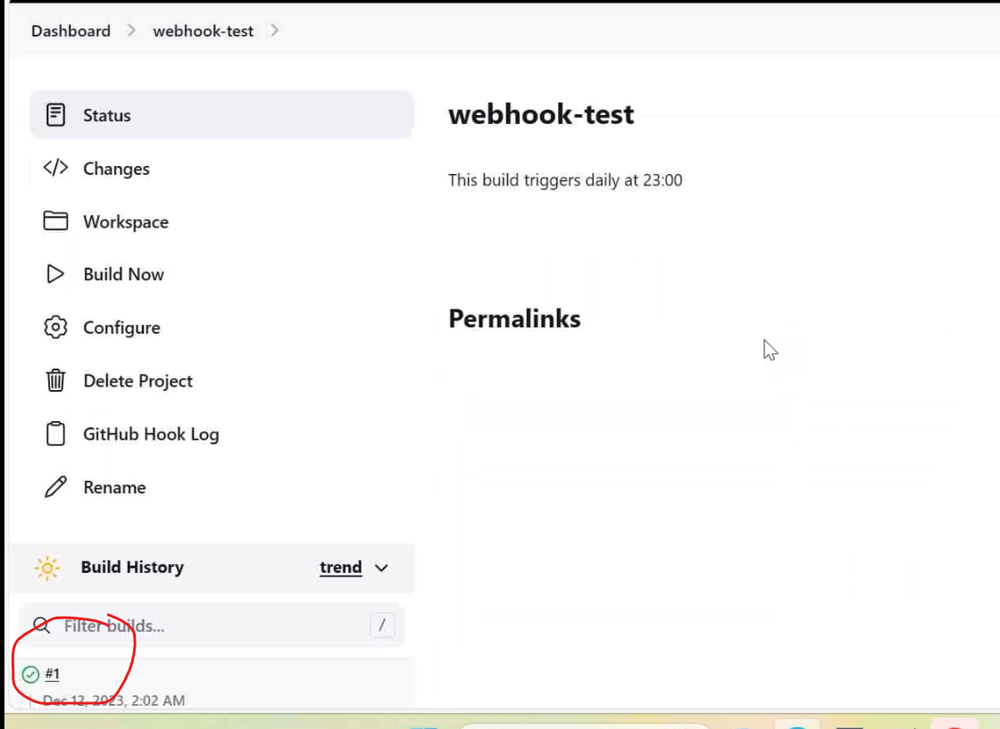
* after commit the changes in jenkinsfile it automatically triggers build
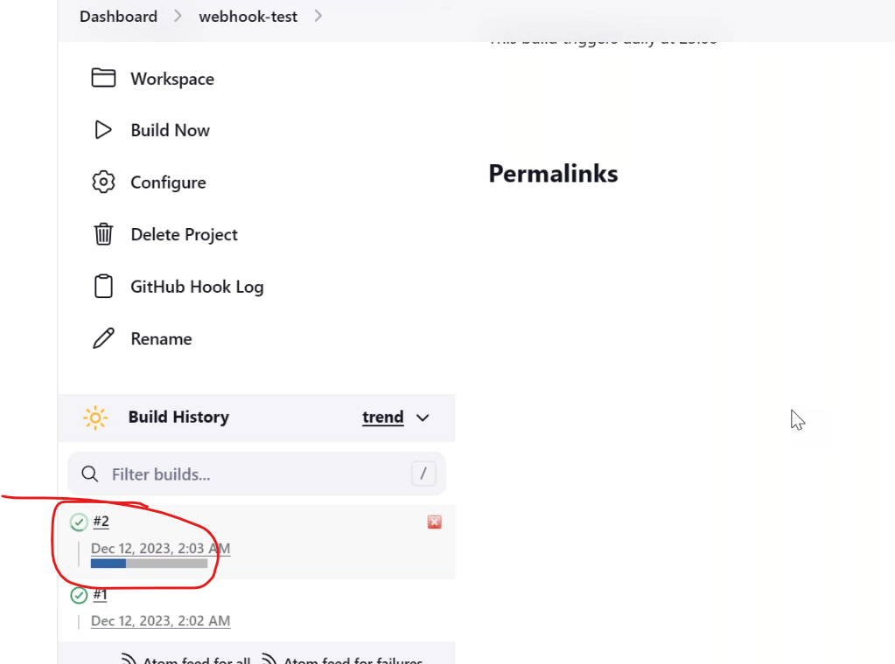
* upstream and downstream jobs
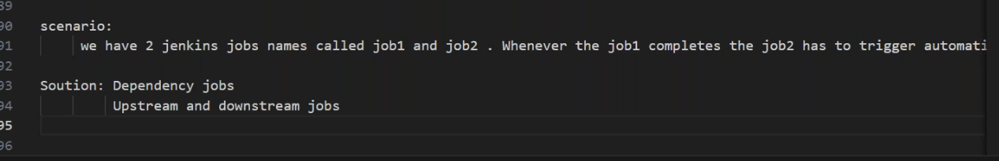
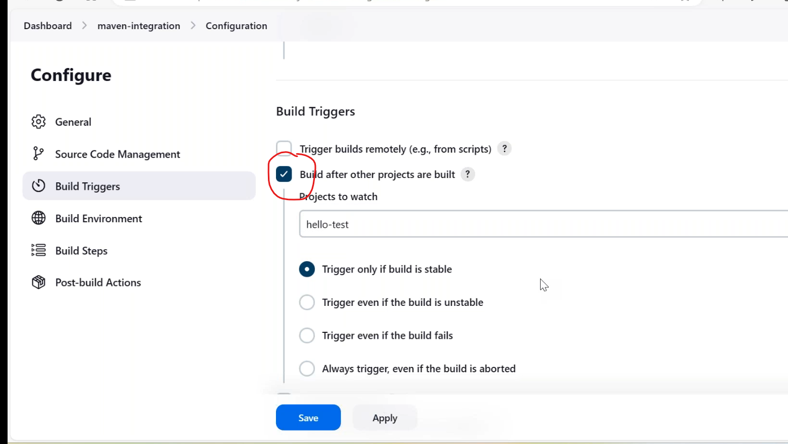
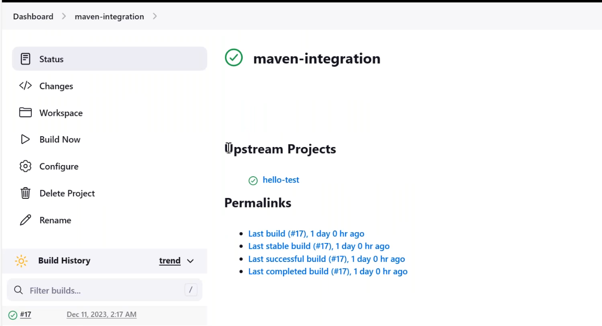
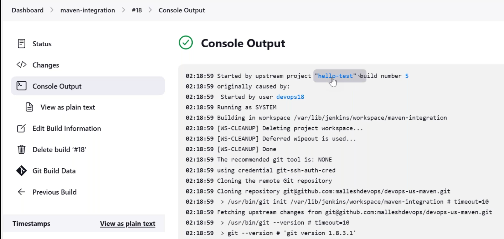

