## 13/12/2023
-----------------
### npm build tool
------------------
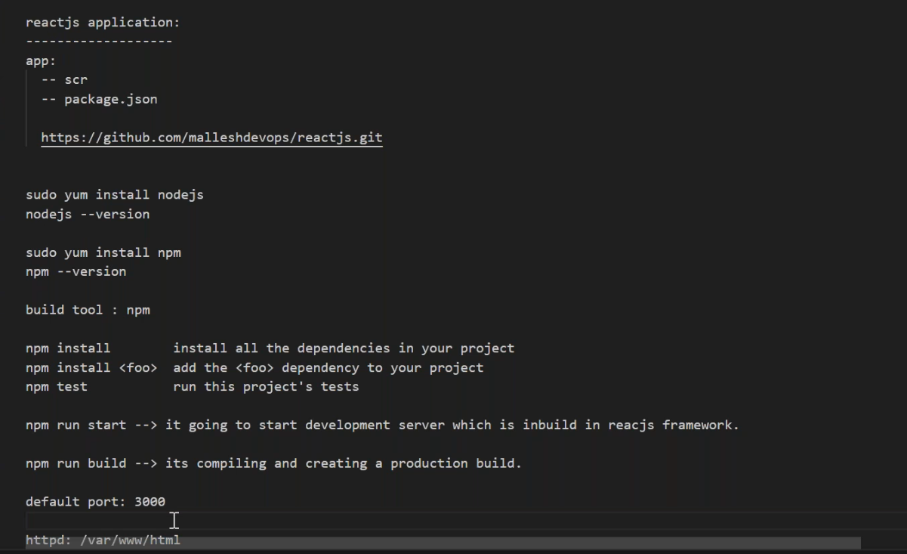
* npm run build
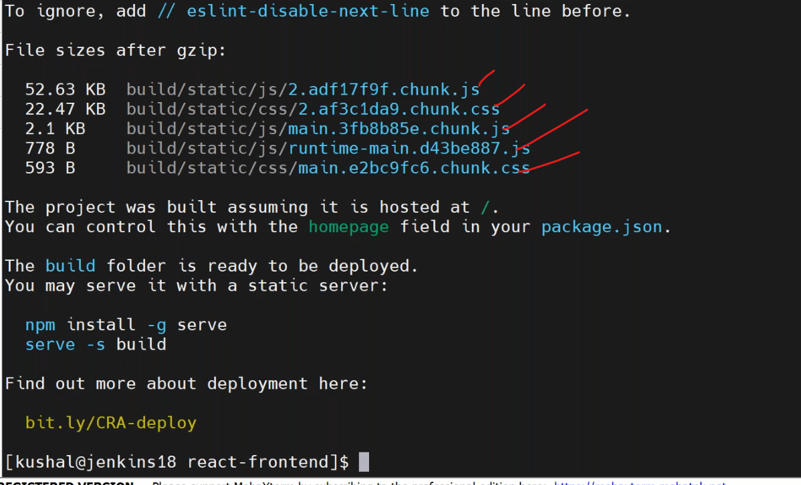
* copy the build file into nginx root folder
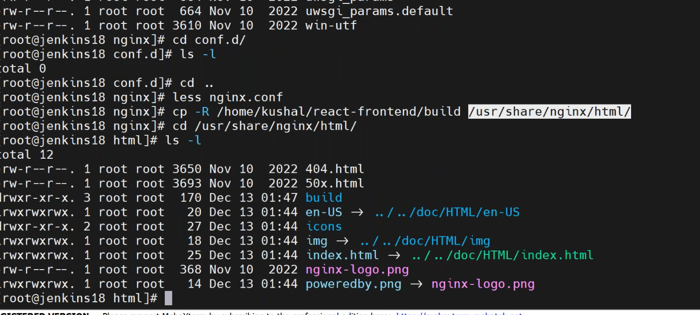
* change the path nginx root folder
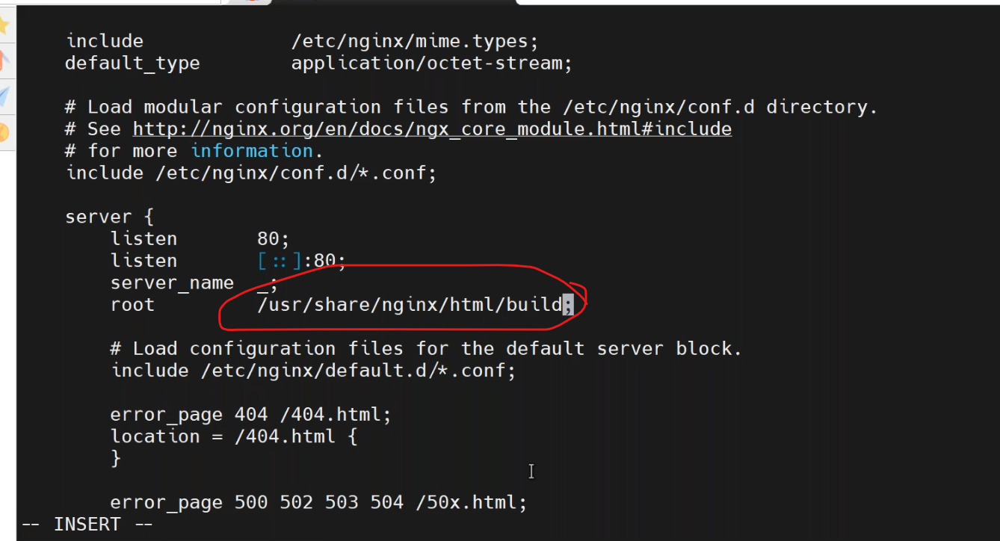
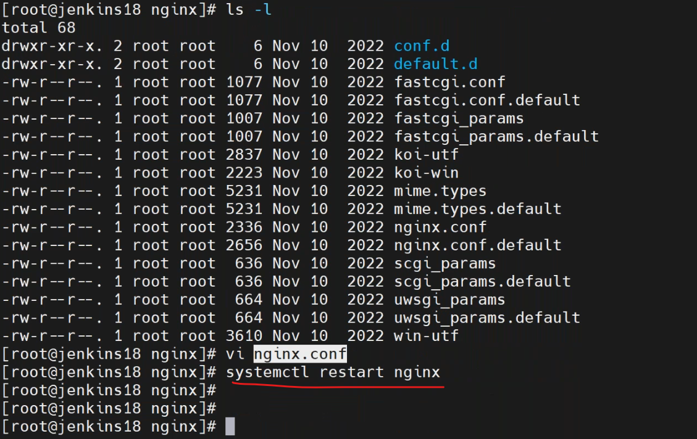
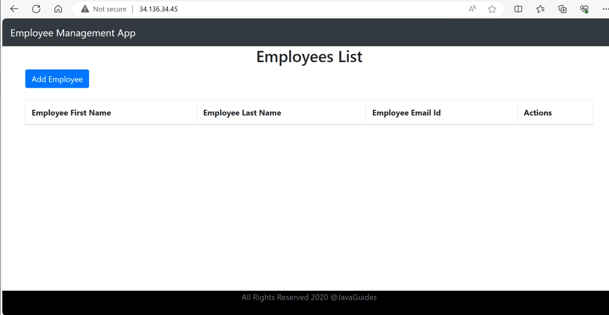

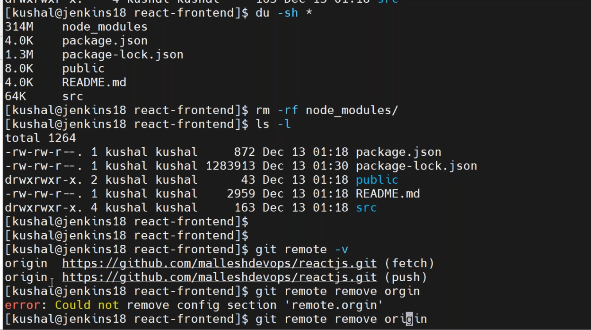
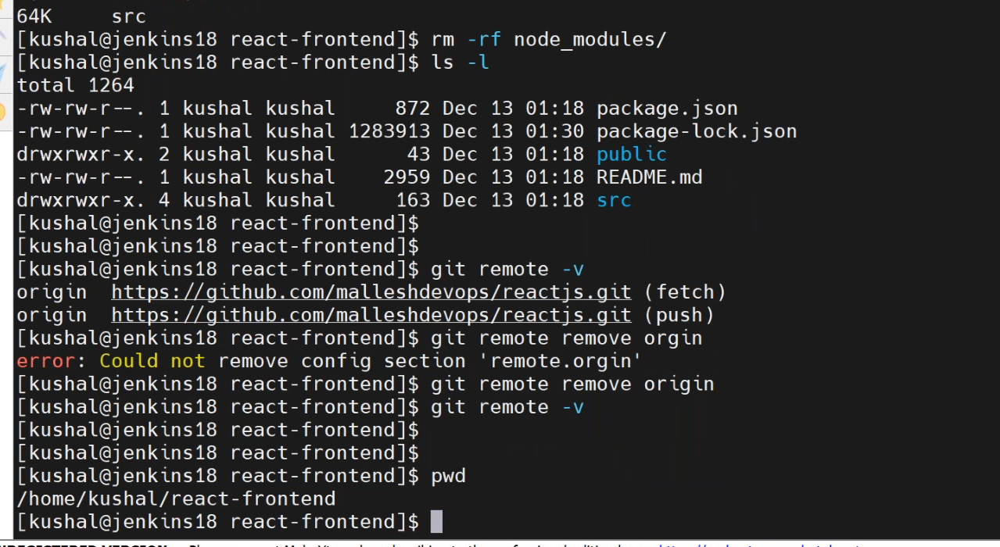

* reactjs build from jenkins
  * install nodejs and npm 
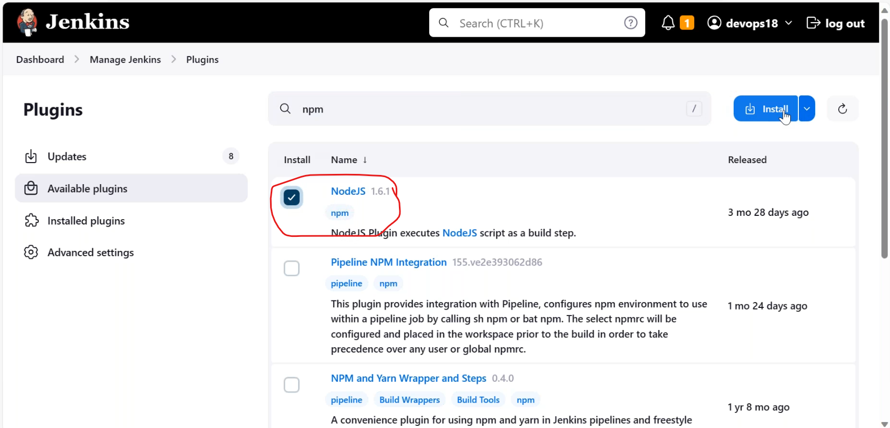
 * added nodejs plugin

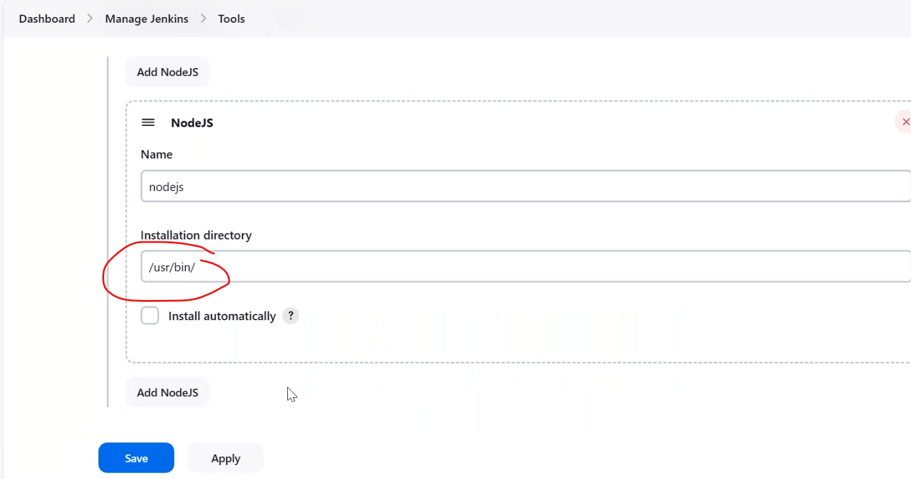
 * create a nodejs job
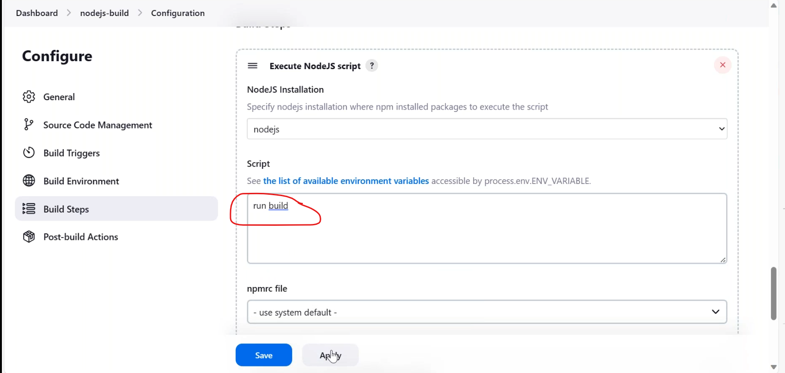
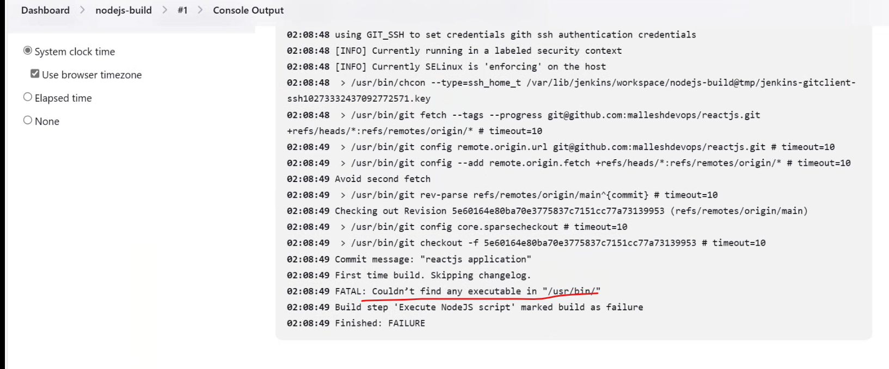
``````
npm install
npm run build
``````
* give sudo permisiions to jenkins user


