## 21/12/2023

---------------------

### pipeline

---------------------

* workflows
* jenkins as a code.
* DSL(domain specific language)

1. Declerative pipeline

--------------------------

``````
pipeline{
    agent any{
        stages{
            stage("test1"){
                steps{
                    echo "devops" 
                }
            }
        }
    }

}
``````

2. Scripted pipeline

-------------------------

``````
node{

}
``````

* developed on groovy language

--------------------------------------------------
--------------------------------------------------

* create a pipeline folder and in that folder create pipeline projects.
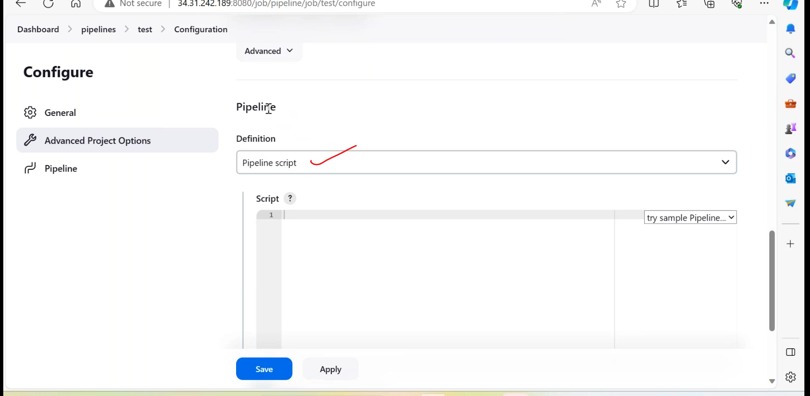
* actual task will be in steps.
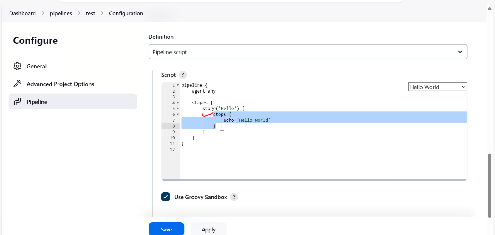
* build the sample pipeline
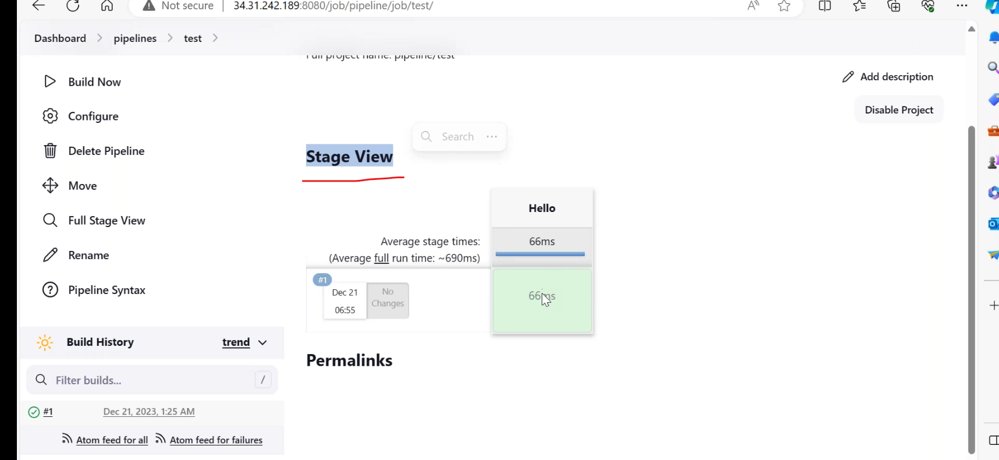
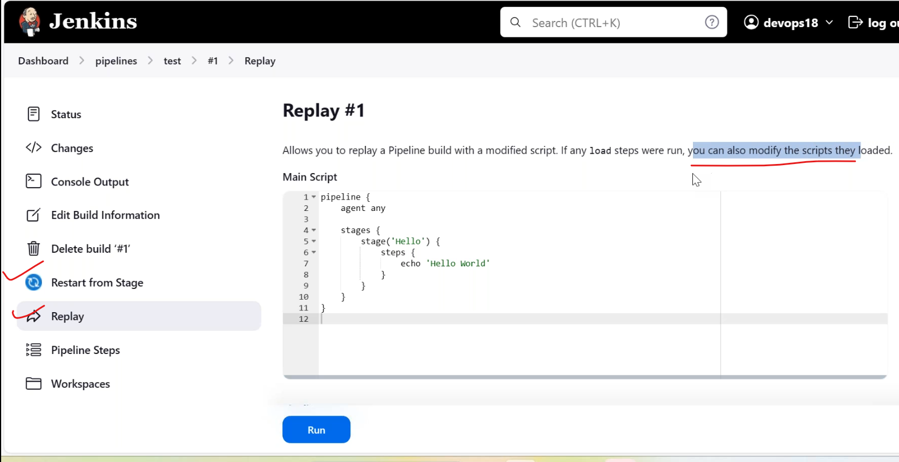
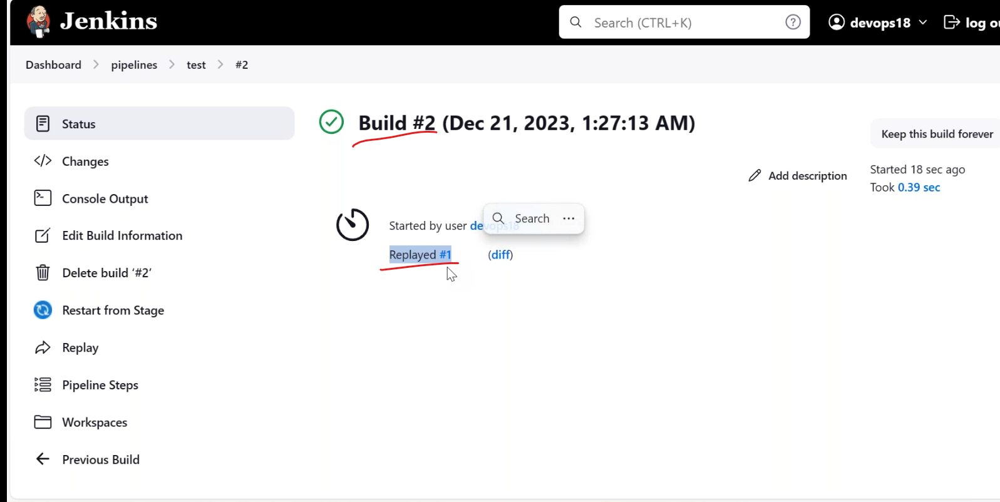
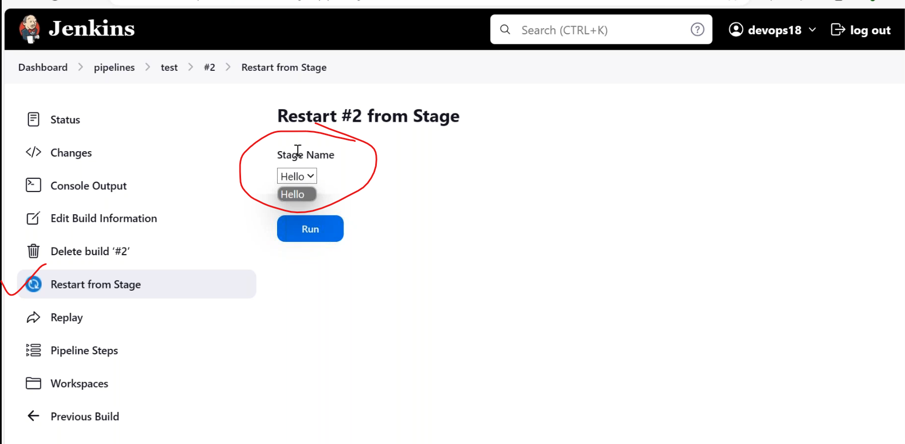

### scenario

-------------

* can u create apipeline job for me to do maven build and send the email notification when it fails.

1. git integration

* git installation done.

2. maven integration

* mvn installation done.
* mvn clean package

3. email configuration

* smtp configuration done.

``````
pipeline{
    agent any
    tools {
        maven "maven3" 
    }
        stages{
            stage("git installation"){
                steps{
                    git clone " paste github link "
                }
            }
            stage("maven build"){
                steps{
                  sh "mvn clean package"
                }
            }
        }
    }


``````

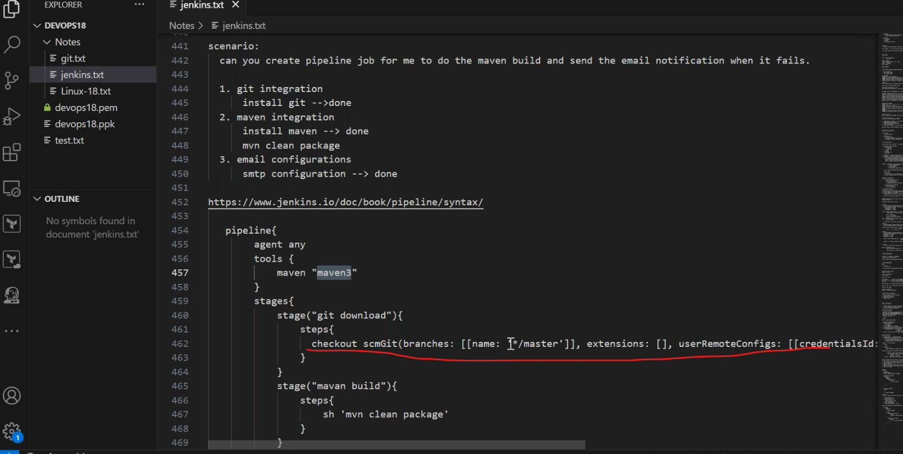
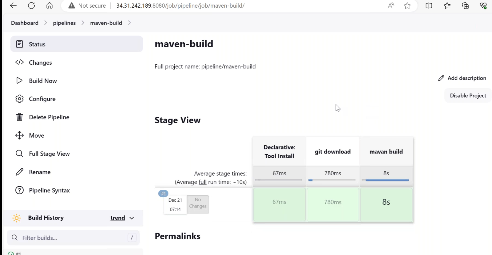

* tools sections we give the names of global tools integration.

``````
pipeline{
    agent any
    tools {
        maven "maven3" 
    }
        stages{
            stage("git installation"){
                steps{
                    git clone " paste github link "
                }
            }
            stage("maven build"){
                steps{
                  sh "mvn clean package"
                }
        post{
             always{
                "copy the generated script"
             }
        }    }
        }
    }


``````

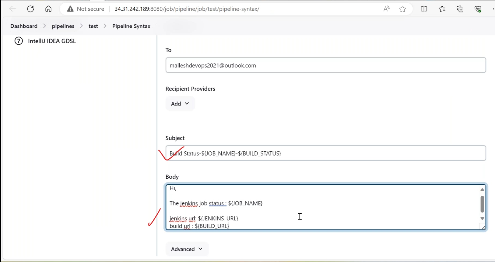

* we can define each stage for email notifications.
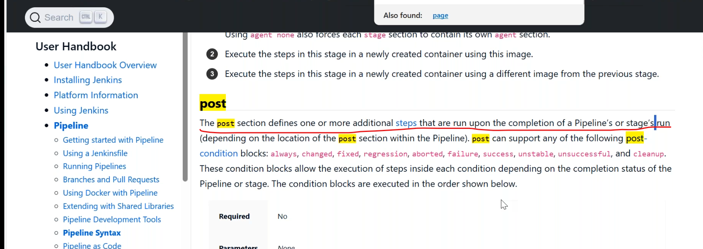

### jenkins pre-defined environment variables

--------------------------------------------
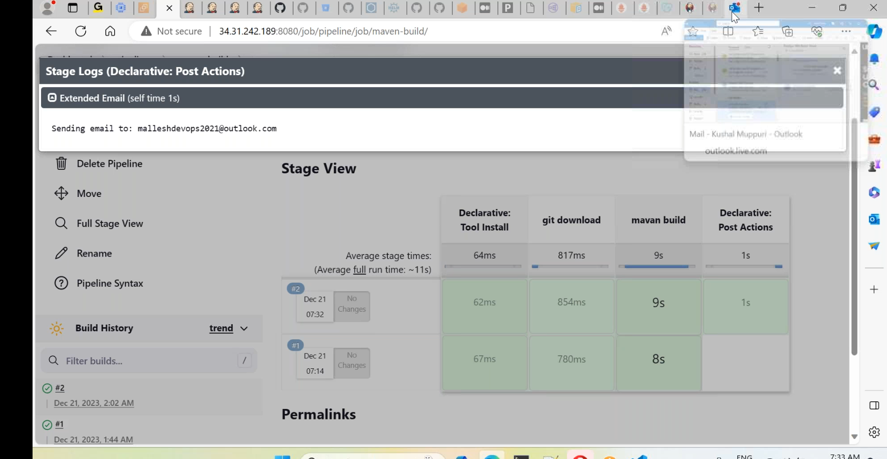
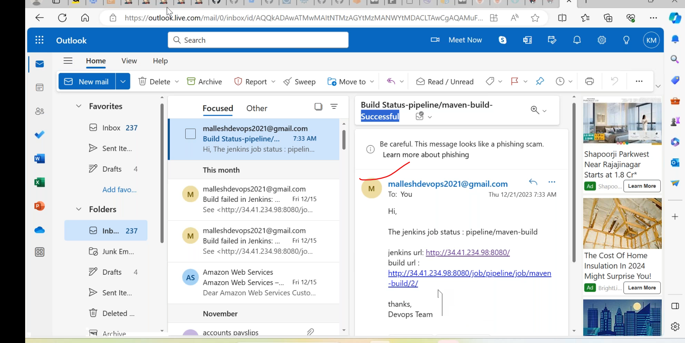

* build discarder
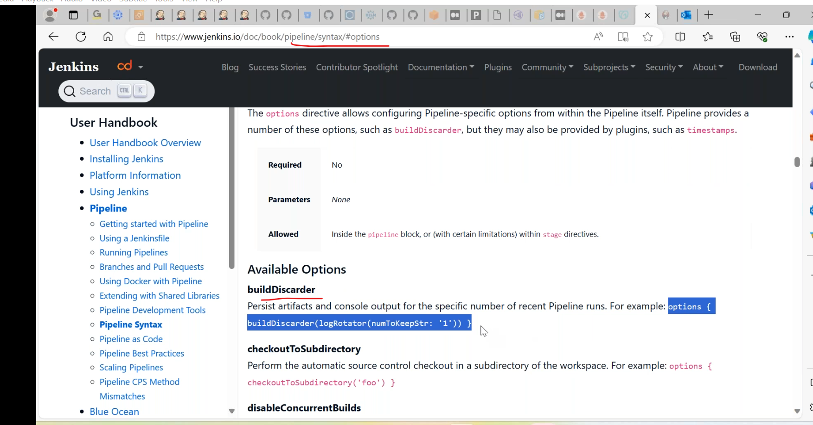
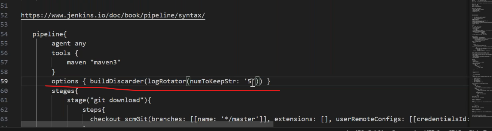
* it automatically reflects.
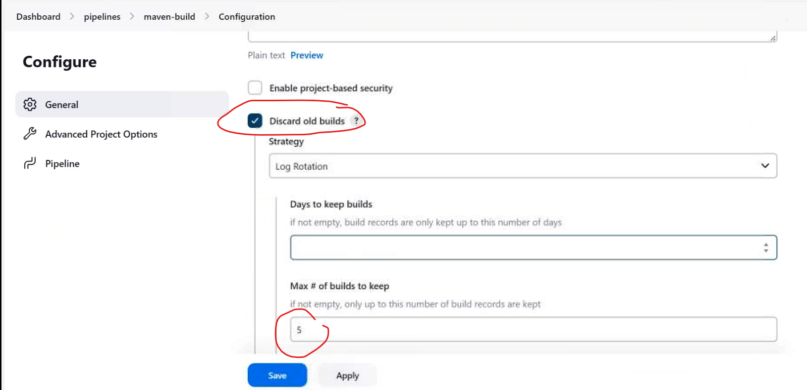
* triggers
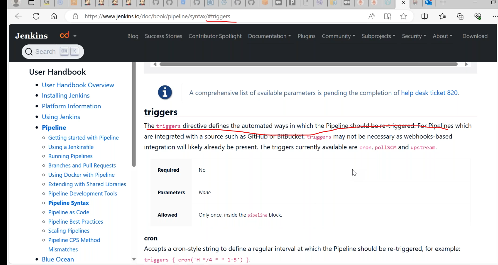
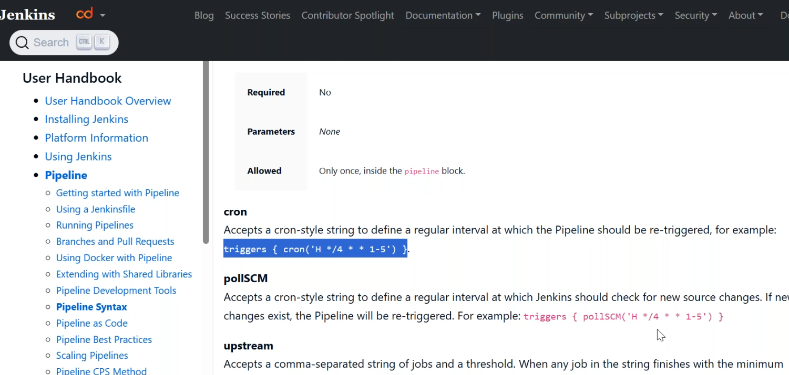
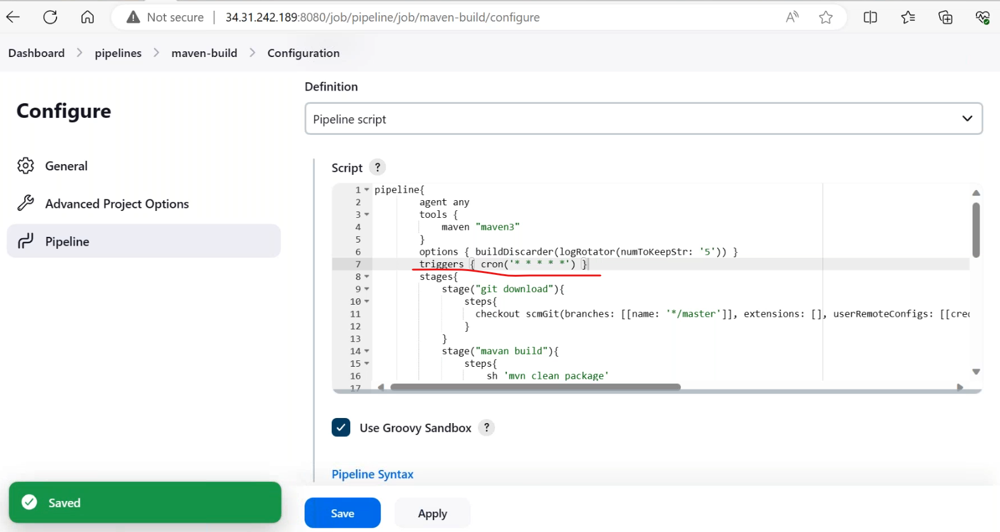
* after run pipeline build build periodically automatically triggered.
* comment for any line "__//__"
