## 22/12/2023
--------------------
### spring-petclinic
------------------
* in this spc project used a test reports framework calle jacoco.
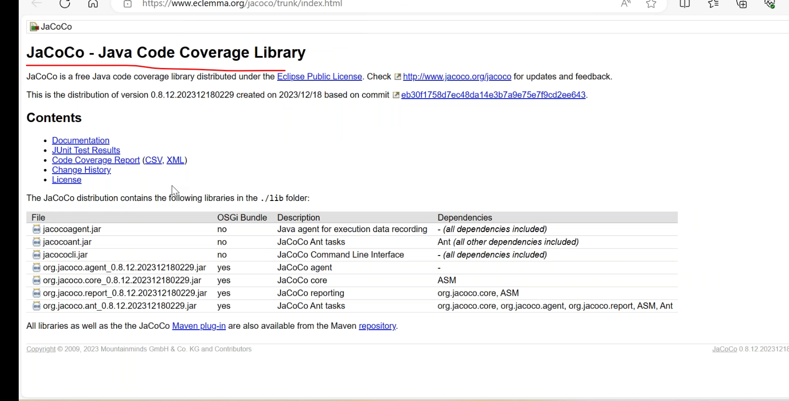
* install jacoco plugin in plugins section.
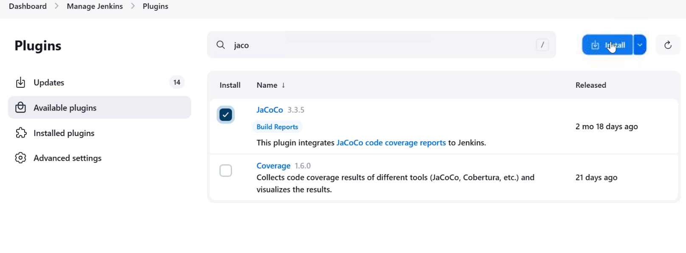
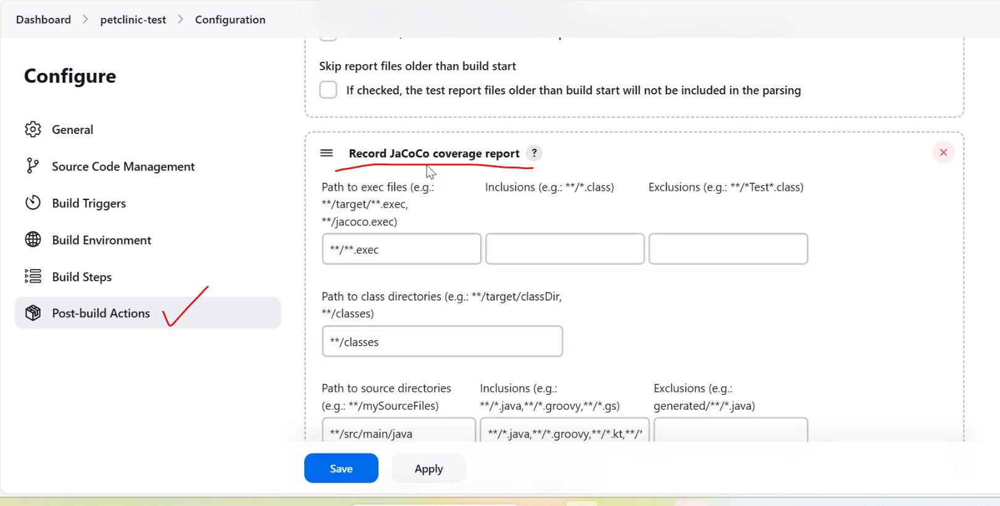
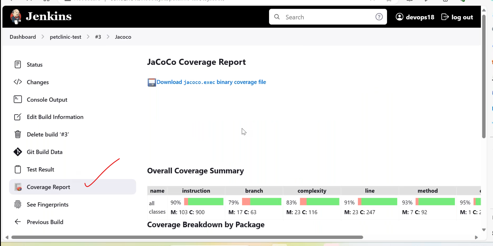
* when we run jar file it failed
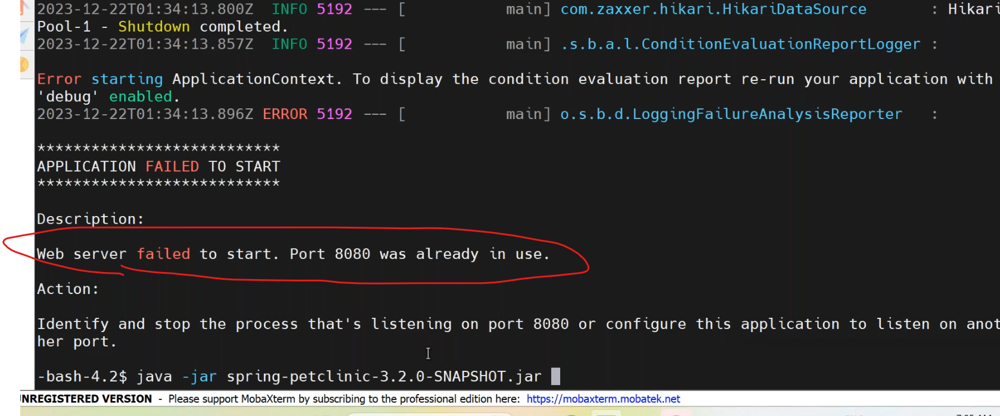
* so to run this change default port to custom port.any spring boot application to change custom port.

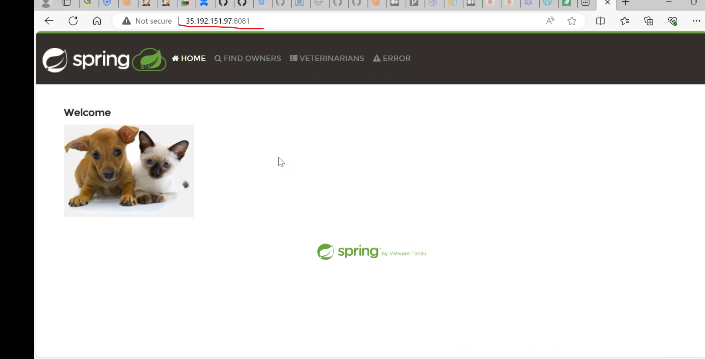
### master-slave configuration
---------------------------------
* each slave we have to install java for to work jenkins in slaves.
   * create a jenkins user in these slaves.
   * generate ssh keys with jenkins user.
* go to jenkins ui
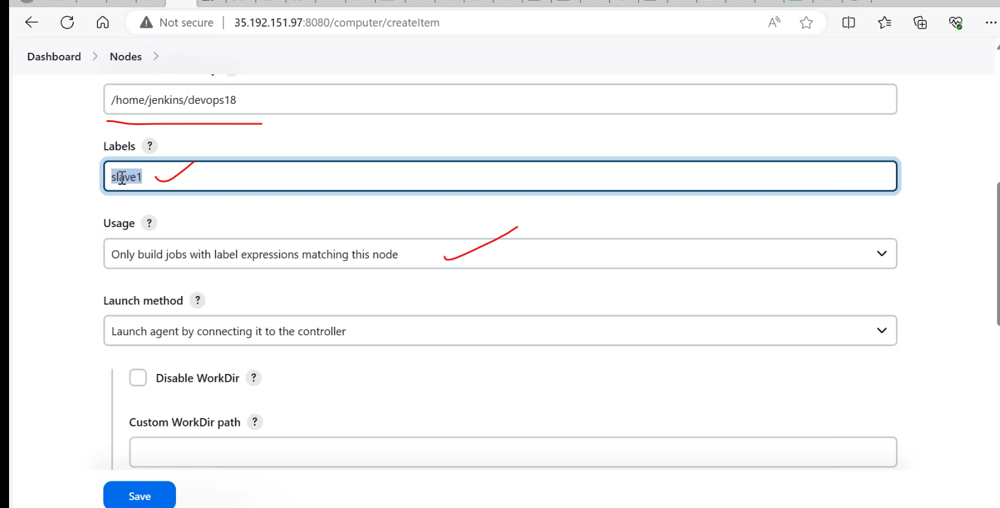
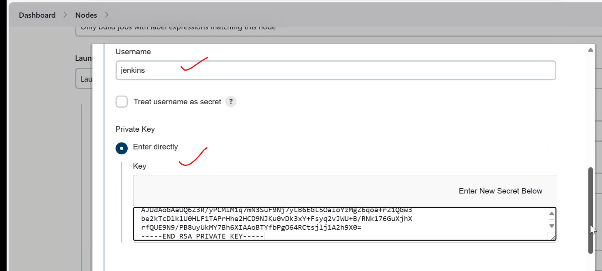
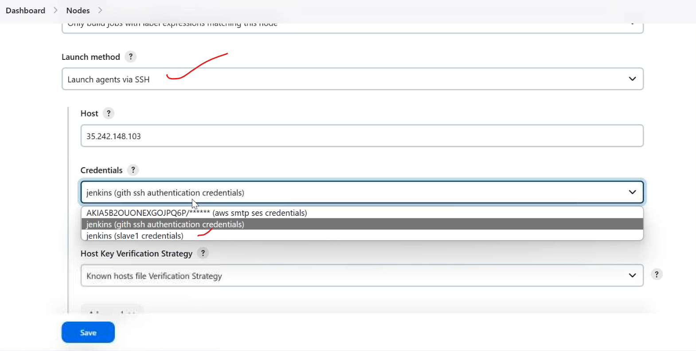
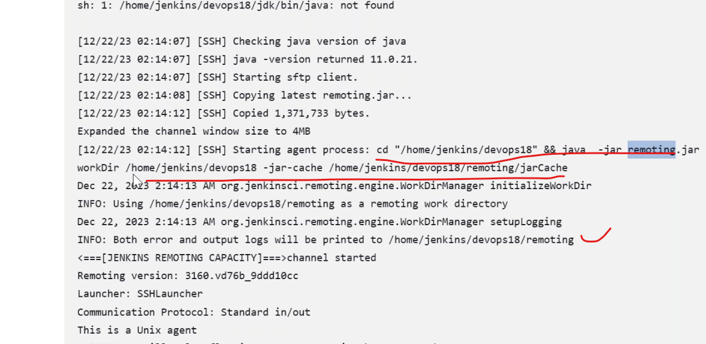
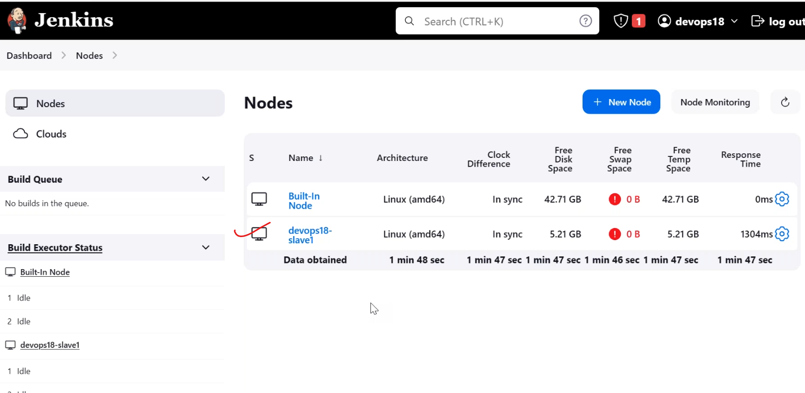
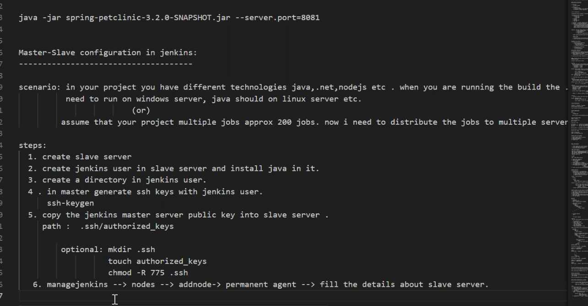
## jenkins master node integration
--------------------------------------
### private-key
-----------------------------------
* first create a ubuntu/centos machine with __my_key__(with importkey from my laptop)
* goto jenkins UI managenodes->create node->
   * in the agent via ssh
   * give username and rivate key
     * inthis give default user of that ubuntu machine and copy the private key from our laptop.(/home/user/.ssh/id_rsa)
     * becuase you login with __my_key__
### password
* first login into ubuntu/centos machine
* create a user jenkins with password
* goto sudovisudo ,add jenkins to sudoers file
* remove default passwordauthentication no to yes in
``````
sudo vi /etc/ssh/sshd_config
sudo systemctl restart sshd
exit
``````
* after that login with jenkins user by entering password.
``````
ssh jenkins@publicip
``````
* got jenkins ui mangenodes-> add node
   * add agent via ssh
   * give username and password
   * give passowrd of that user
  