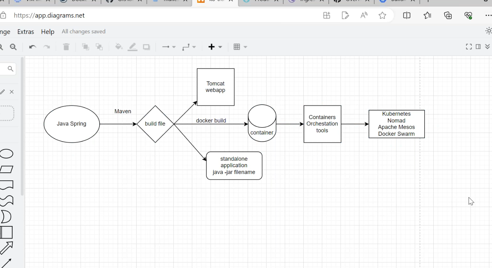
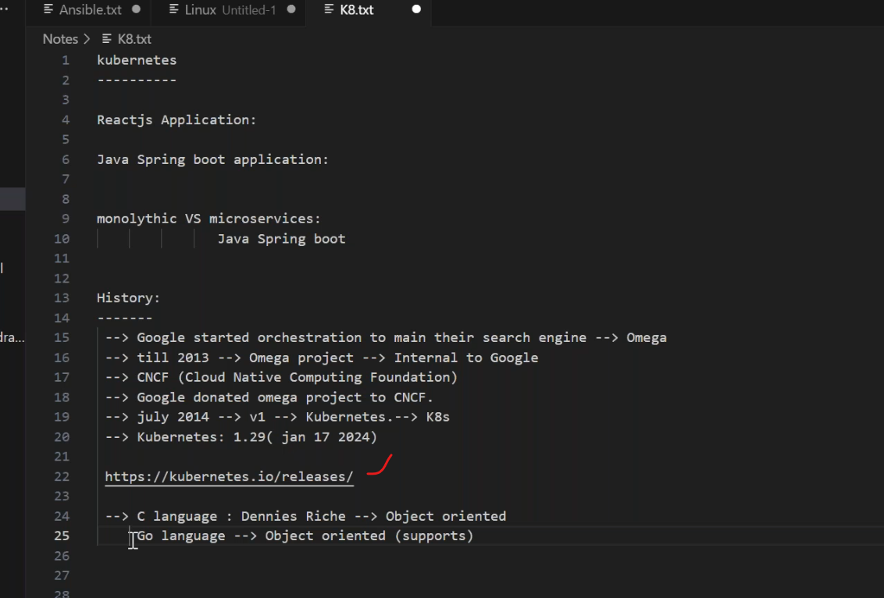
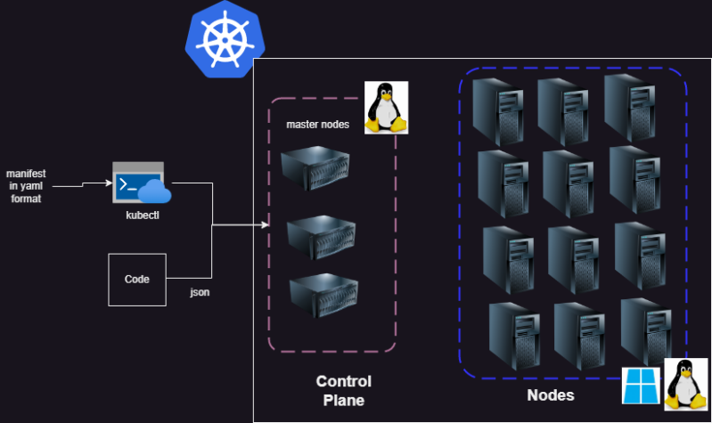
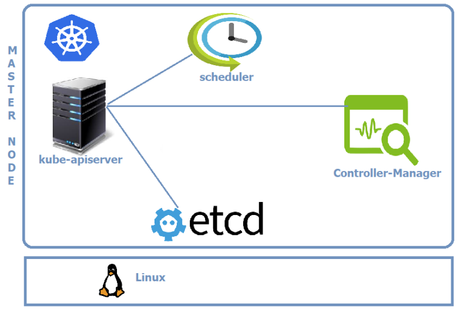
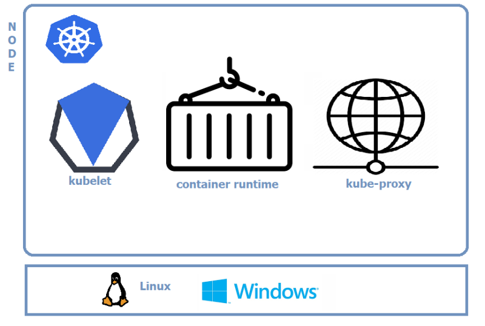

##  k8s
---------------------------

* for CNCF [Refere Here](https://www.cncf.io/projects/)
  
## k8s architecture
-------------------------------

* To interact with k8s cluster we have
  * kubectl: a command line tool which takes commands or yaml manifests as inputs.
  * SDKS: client libraries in different programming languages.

## k8s master components
-----------------------------

* Kubernetes master runs on Linux nodes.
  
  **master components**
  ----------------------------
  ### kube-apiserver
  ----------------------
* This component is Central to Kubernetes. All communications between all components goes through the kube-apiserver.
* This component is frontend of the Kubernetes control plane.
* This component exposes a REST API.
* We would interact with this component using kubectl by using the YAML files, which are also referred as manifests.
  
### etcd
---------------------
* etcd stores the entire configuration and the state of the cluster.
* etcd is consistent and highly available distributed key-value store.

### kube-scheduler
---------------------
* It watches for new work tasks and assigns them to healthy nodes in the cluster.

### Controller-Manager
-------------------------
* It is responsible for maintaining desired states mentioned in the manifest.
* It looks like single component, but with in it has
    * Node Controller: for noticing & responding when node goes down
    * Replication Controller: for maintaining the correct number of pods for every replication controller object.
    * Endpoints Controller: Populates the Endpoints object.
  
### Cloud-Controller-manager
------------------------------------
* If you run the Kubernetes on a supported cloud platform such as AWS, Azure or Google, your control plane runs the Cloud-Controller-Manager.
* It is responsible for underlying cloud specific controllers.
  
## Node Components
----------------------------

### kubelet
---------------
* This is an agent which runs on each node in the cluster.
* It watches for the instructions from API Server for new work assignments.
* If it can’t run the task assigned, it reports back to master and lets   control plane decide on the actions.
* It is responsible for the node registration process.
  
### Container Runtime
--------------------------------
* This is software which is responsible for running containers.
* Some of them are Docker, containerd, cri-o, rktlet.
### kube-proxy
 -----------------------------
  * Maintains the network rules on nodes.
  * This is responsible for networking on nodes.
### Cluster DNS
--------------------------------
* Every Kubernetes Cluster has an internal DNS service.
* This has static IP address that is hardcoded into every Pod on the cluster i.e. all Pods now how to find the DNS Server.
* Services, Stateful Sets and Pods are registered with Cluster DNS.
Cluster DNS is based on CoreDNS.