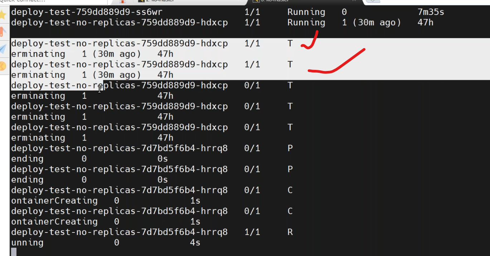
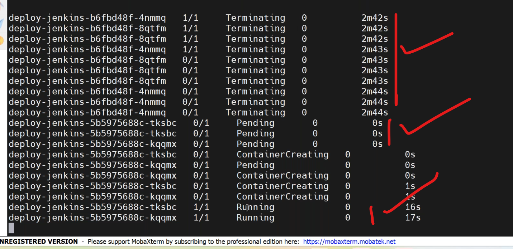
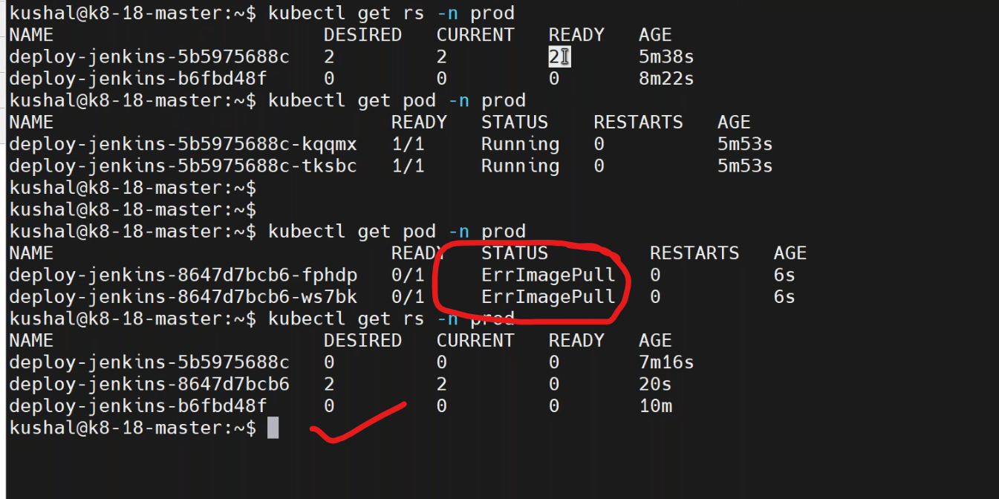
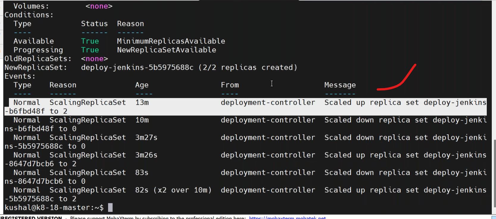
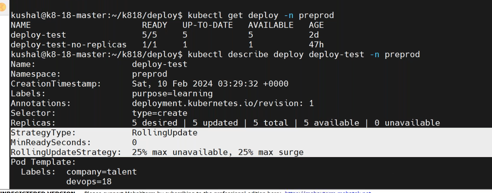
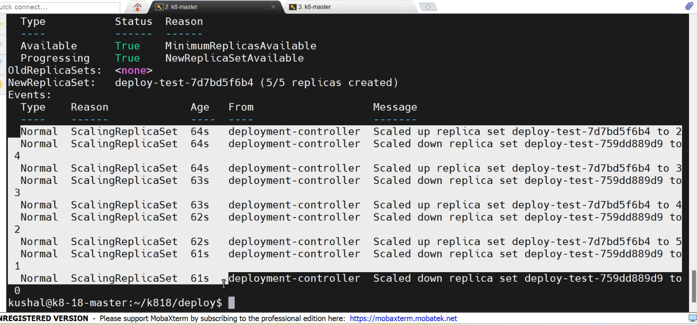
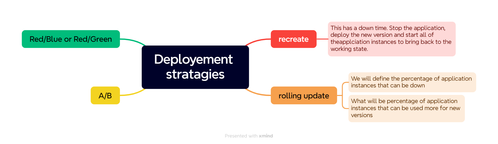

## deployments
------------------------
* scaleup and scaledown.[refer here](https://kubernetes.io/docs/concepts/workloads/controllers/deployment/) for official docs.
```
kubectl scale deploy <deploy-name> -n preprod --replicas=10
kubectl scale deploy <deploy-name> -n preprod --replicas=3
kubectl scale deploy/<deploy-name> -n preprod --replicas=10 
kubectl scale deployment.v1.apps/<deploy-name> -n preprod --replica3
```
### deployment processes:
-------------------------------
1. if you have html pages and copying it into nginx "/usr/share/nginx/html" 
2. html files copyied to httpd server "/var/www/html"
3. you have build the maven build and copied jar file to tomcat server "webapps" and restart it.
* assume that developer has made some changes/added new feature to java project and then he asked to deploy for testing.
1. maven build
2. build the docker image
3. update the manifest file with latest docker image and tag.
4. apply the k8 yaml changes.
## k8s deployment stratagies
-----------------------------------------
### 1.recreate
-----------------------
   * it means change the docker image tag with new updated tag.
   * write a deployment manifest with recreate `vi deployment-recreate.yaml`.
```yaml
apiVersion: apps/v1
kind: Deployment
metadata:
  name: deployment
  labels: 
    purpose: learning
spec:
  selector:
    matchLabels:
      env: dev
  strategy:
    type: Recreate
  replicas: 5
  template:
    metadata:
      name: deployment-pod
      labels:
        env: dev
        company: vtalent
    spec: 
      containers:
        - name: nginx-deployment
          image: jenkins/jenkins:2.60
          ports:
            - containerPort: 80
```
* apply the changes by,
```
kubectl get po -n preprod -w
kubectl apply -f deploy-recreate.yaml
```


* recreate.
  1. Re + Create --> first delete the existing pods and then create new prod .
  2. The time period where pod has been deleted and created called timetake to create a prod.
  3. The time taken to create new pod is an outage.
  4. it has downtime.we didnot use in realtime.
  5. to back to previous deplyment use the command
```
kubectl rollout undo deploy <deploy-name> -n prod
kubectl describe deploy <deploy-name> -n prod
```
* to restart the existing pods.
```
kubectl rollout restart deploy <deploy-name> -n prod
```

* the meaning of below command is updating the docker image version.
```
kubectl set image deployment/nginx-deployment nginx=nginx:1.16.1
```
* rollout commands.
```
kubectl edit deployment/nginx-deployment
kubectl rollout status deployment/nginx-deployment
kubectl rollout history deployment/nginx-deployment
```

### 2. rolling update
-----------------------------
* default stratagy of k8s.
* it means change the docker image tag with new updated tag.
* write a deployment manifest with recreate `vi deployment-rolling update`.
```yaml
apiVersion: apps/v1
kind: Deployment
metadata:
  name: deployment
  labels: 
    purpose: learning
spec:
  selector:
    matchLabels:
      env: dev
  strategy:
    type: RollingUpdate
    rollingUpdate:  #default
      maxUnavailable: 25%
      maxSurge: 25%
  replicas: 5
  template:
    metadata:
      name: deployment-roll
      labels:
        env: dev
        company: vtalent
    spec: 
      containers:
        - name: jenkins-deployment
          image: jenkins/jenkins:2.60
          ports:
            - containerPort: 80
```
* to deploy rolling update by,
```
kubectl apply -f deply-rolling.yaml
kubectl describe deploy <deploy-name> -n preprod
```



* rolling update has zero downtime.

### drawback
--------------------------
* 4 pods(3gb) --> 4 servers(4gb) 
* 5 pods(3gb) --> 4 servers(4gb) + 1 server
* if incase in rolling updates,when we increase 25% pods to create these extra pod cluster have to be enough(additional) resources.(extra nodes or servers).
* in this rolling update dynamically add servers(nodes),not pods `hpa`,it will be possible in cloud specific k8s. AKS ,EKS,Openshift,Ock,ACK,GKE.
* `ha proxy wiil be configured in another server,not in master or node`.


   