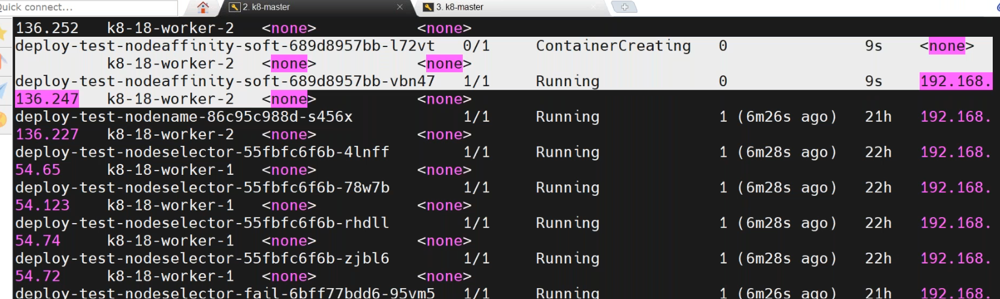
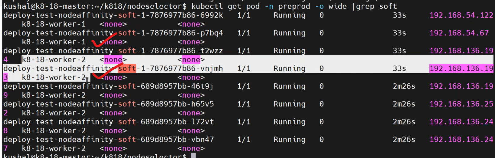
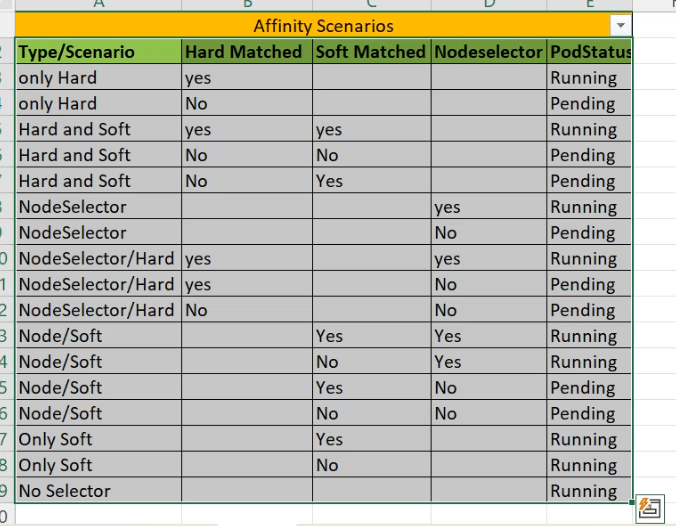

## 2. Soft Affinity 
----------------------------------
* write a manifest on soft affinity `vi softaffinity.yaml`.
```yaml
apiVersion: apps/v1
kind: Deployment
metadata:
  name: deployment-node-softaffinity
  labels: 
    purpose: learning
spec:
  selector:
    matchLabels:
      env: dev
  strategy:
    type: RollingUpdate
    rollingUpdate:   #default
      maxSurge: 25%
      maxUnavailable: 25%
  replicas: 3
  template:
    metadata:
      name: deployment-roll
      labels:
        env: dev
        company: vtalent
    spec: 
      containers:
        - name: nginx-deployment-nodesoftaffinity
          image: nginx:latest
          ports:
              - containerPort: 80
      affinity:
        nodeAffinity:    #soft affinity
          preferredDuringSchedulingIgnoredDuringExecution: 
            - weight: 1  # priority
              preference:
                matchExpressions:
                  - key: batch  # add a label batch=18 to one of the nodes
                    operator: In
                    values:
                      - "18" # string if integer we got error                    
```
* deploy manifest by,
```
kubectl apply -f softaffinity.yaml
kubectl get -n preprod -o wide
```

* write a manifest by without matching the labels `vi softaffinitynomatch.yaml`.
```yaml
apiVersion: apps/v1
kind: Deployment
metadata:
  name: deployment-node-softaffinity-nomatch
  labels: 
    purpose: learning
spec:
  selector:
    matchLabels:
      env: dev
  strategy:
    type: RollingUpdate
    rollingUpdate:   #default
      maxSurge: 25%
      maxUnavailable: 25%
  replicas: 3
  template:
    metadata:
      name: deployment-roll
      labels:
        env: dev
        company: vtalent
    spec: 
      containers:
        - name: nginx-deployment-nodesoftaffinity-nomatch
          image: nginx:latest
          ports:
            - containerPort: 80
      affinity:
        nodeAffinity:    #soft affinity
          preferredDuringSchedulingIgnoredDuringExecution: 
            - weight: 1  # priority
              preference:
                matchExpressions: # failurecase label change
                  - key: batch  
                    operator: In
                    values:
                      - "100" # string if integer we got error                    
```
* deploy the manifest by,
```
kubectl apply -f sofaffinitynomatch.yaml
kubectl get po -n preprod
```

* write a manifest on all three types `vi affinityall.yaml`.
```yaml
apiVersion: apps/v1
kind: Deployment
metadata:
  name: deployment-node-softaffinity-nomatch
  labels: 
    purpose: learning
spec:
  selector:
    matchLabels:
      env: dev
  strategy:
    type: RollingUpdate 
    rollingUpdate:  #default
      maxSurge: 25%
      maxUnavailable: 25%
  replicas: 3
  template:
    metadata:
      name: deployment-roll
      labels:
        env: dev
        company: vtalent
    spec: 
      containers:
        - name: nginx-deployment-nodesoftaffinity-nomatch
          image: nginx:latest
          ports:
            - containerPort: 80
      affinity:
        nodeAffinity:    #hard affinity
          requiredDuringSchedulingIgnoredDuringExecution: 
            nodeSelectorTerms:
              - matchExpressions:
                  - key: batch  
                    operator: In
                    values:
                      - "18"
          preferredDuringSchedulingIgnoredDuringExecution: 
            - weight: 1  # soft affinity
              preference:
                matchExpressions: 
                  - key: use  
                    operator: In
                    values:
                      - "testing" 
      nodeSelector:
        tier: web # add a label to node                              
```
* deploy the manifest by,
### conditions
-------------------
* node1 --> tier=web 
* node2 --> batch=18,tier=db

* condition: hard --> batch=18  --> mandatory 
    * soft --> use=testing 
    * nodeselector --> tier=web --> mandatory
* gates
```
AND        OR         NOT 
1 1 `1`      1 1 `1`      1 `0`
1 0 `0`      1 0 `1`      0 `1`
0 1 `0`      0 1 `1`
0 0 `0`      0 0 `0`
```

* deploy the manifest by,
```
kubectl apply -f affinityall.yaml
```
## sla (service level agrement)
---------------
