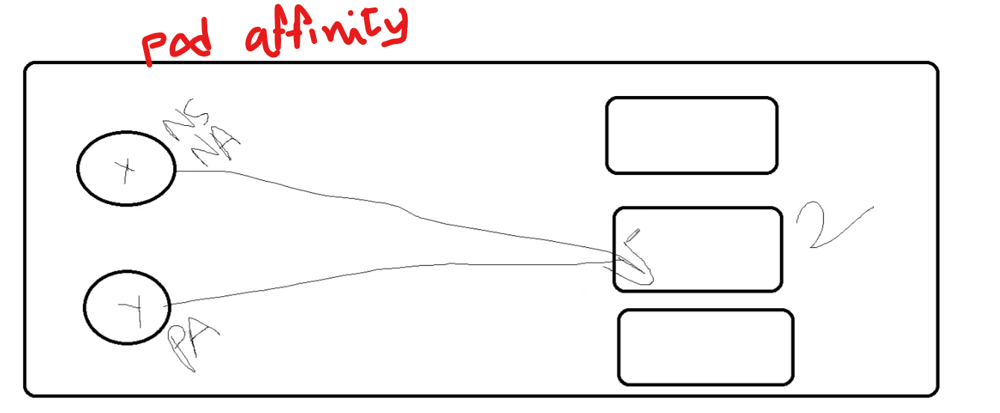
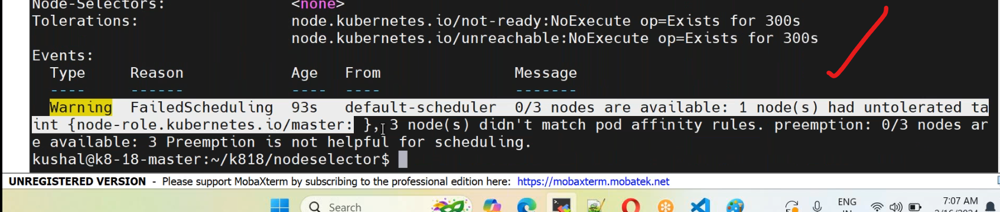
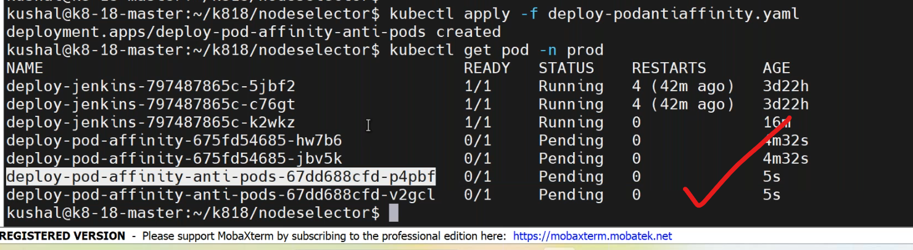

## pod affinity&antiaffinity
-----------------------------
### scenario:
---------------------------
1. when  pod1 with labels "abc=xyz" is on the xyz node.
      pod2 with labels "devops=18" this pod also need to run in the xyz node where pod1 is running.
* solution: pod affinity.
2. The database pod with labels app=db is running on server3 
      - The java pod shoud not run into the same server where db pod is,
      - running. i.e not on Server3


                  (or)
      - the java application with replicas=5
      - None of the two pods should run in the same server
   
* solution: pod antiaffinity.
* to maintain high avalability for our application we implement antiaffinity pod rule.
* create a label for any node in cluster `cicd` and write a manifest on podaffinity `vi podaffinity.yaml`.
```yaml
apiVersion: apps/v1
kind: Deployment
metadata:
  name: deployment-podaffinity
  labels: 
    purpose: learning
  namespace: prod
spec:
  selector:
    matchLabels:
      env: dev
  strategy:
    type: RollingUpdate   #default
      maxsurge: 25%
      maxunavialable: 25%
  template:
    metadata:
      name: deployment-roll
      labels:
        env: dev
        company: vtalent
      spec: 
        containers:
          - name: nginx-podaffinity
            image: nginx:1.23
            ports:
              - containerPort: 80
        affinity:
          podAffinity:
            requiredDuringSchedulingIgnoredDuringExecution:
              - labelSelector:
                matchExpressions:
                  - key: type
                    operator: In
                    values:
                      - cicd # already this label defined in some node
                topologyKey: opology.kubernetes.io/zone                            
```
* deploy the manifest file by,
```
kubectl apply -f podaffinity.yaml
kubectl get po -n prod
```
* inthis namespace none of the pods have label cicd so it is failed .

* `#kubectl apply -f podaffinity.yaml` means this command is not going to executed.
### pod antiaffinity
------------------------------------
* to distribute our pods to different nodes we use pod antiaffinity.
* write a manifest on pod antiaffinity `vi podantiaffinity.yaml`.
```yaml
apiVersion: apps/v1
kind: Deployment
metadata:
  name: deployment-podantiaffinity
  labels: 
    purpose: learning
  namespace: prod
spec:
  selector:
    matchLabels:
      env: dev
  strategy:
    type: RollingUpdate   #default
      maxsurge: 25%
      maxunavialable: 25%
  template:
    metadata:
      name: deployment-roll
      labels:
        env: dev
        company: vtalent
      spec: 
        containers:
          - name: nginx-podantiaffinity
            image: nginx:1.23
            ports:
              - containerPort: 80
        affinity:
          podAntiAffinity:
            requiredDuringSchedulingIgnoredDuringExecution:
              - labelSelector:
                matchExpressions:
                  - key: type
                    operator:NotIn
                    values:
                      - cicd # already this label defined in some node
                topologyKey: topology.kubernetes.io/zone                            
```
* execute the manifestfile by,
```
kubectl apply -f podantiaffinity.yaml
kubectl get po -n prod
```

 ### Apache Kafka confluent
---------------------
1. ksqldb     --> nodeaffinity
2. zookeeper  --> app=zooker  --> 3 pods 
3. kafaka     --> pod anti affinity 
4. controlcenter
### aws k8 --> eks 
-------------------------
* workers : 10
  * 3 servers --> app: other
  * 4 servers --> app: kafka 
  * 3 servers --> app: zookeeper


