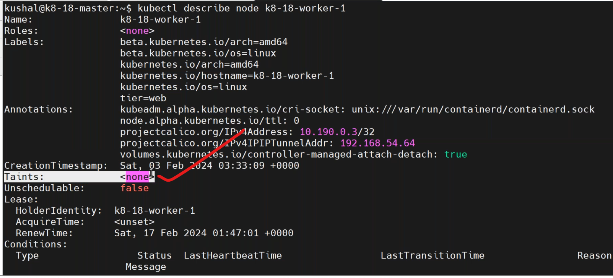
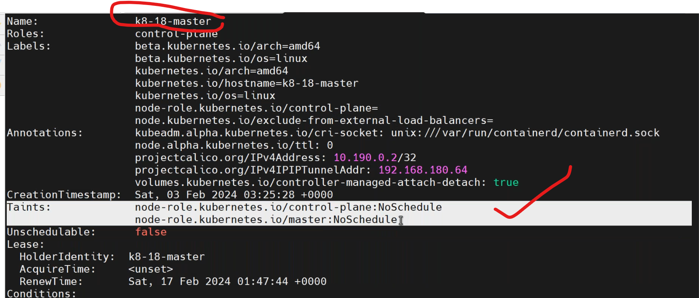
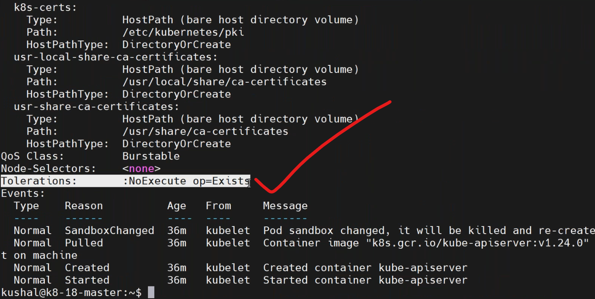
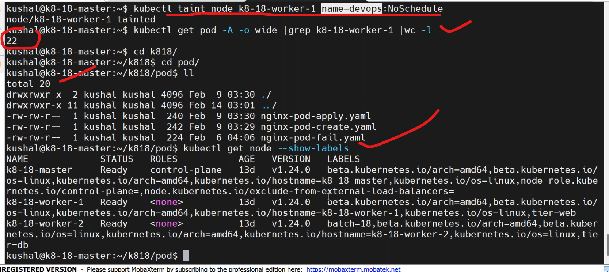
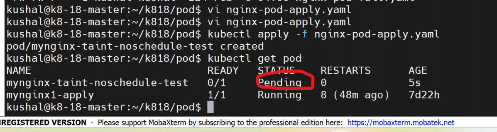

## taint & tolerations
---------------------------------
* `scenario`: The node should not allow any kind of pod except the one's which having some kind permission.
* Restrions on Node level 
### types of taints
-------------------------

### 1.noshcedule
-----------------------------
* it indicated that no pod should allocated to that specific node.
* Before applying taint if any pod is running in that node it continue to run in that server only.
* if you restart the running pod after the taint applied then it will never allow to schedule in the same server until you have toleration permission.
### 2.noexecute
---------------------------------------
* its not allowing to place any new pods and also going force delete already running pods.
* The pod which are satifying the taint condtions(toleration) still runs in the same node.
### prefernoschedule
-----------------------------------------
* it allows to place new pod if no other nodes is allowing it.
```
kubectl describe node <node-name>
kubectl describe node <master-node>
kubectl get po -n kube-system
kubectl describe pod <api-server> -n kube-system
```

* why no pod is presented to the master???
  * `master has somekind of taint`.



### how to apply taints
-------------------------------
* we do aplly taints by,
```
* syntax: kubectl taint node <nodename> <key>=<value>:<effect>
* effect: NoSchedule,PreferNoSchedule,NoExecute

-> kubectl taint node k8-18-worker-1 name=devops:Noschedule  --> apply the taint on the node. 
-> kubectl taint node k8-18-worker-1 name=devops:Noschedule-   --> to remove the taint from the node.
```
* to know the only pods running in particular node by,
```
kubectl get pod -A -o wide | grep <node-name>
kubectl get pod -A -o wide | grep <node-name>| wc -l
```

* write a manifest on nodeselector for taint `vi taint.yaml`.
```yaml
apiVersion: apps/v1
kind: Deployment
metadata:
  name: deployment-taint-noshcedule
  labels: 
    purpose: learning
  namespace: prod
spec:
  selector:
    matchLabels:
      env: dev
  strategy:
    type: RollingUpdate   #default
      maxsurge: 25%
      maxunavialable: 25%
  template:
    metadata:
      name: deployment-roll
      labels:
        env: dev
        company: vtalent
      spec: 
        containers:
          - name: nginx-noschedule
            image: nginx:1.23
            ports:
              - containerPort: 80
        nodeSelector:
          tier: web
```
* deploy the manifest by,
```
kubectl apply -f taint.yaml
kubectl get pod
kubectl describe pod <pod-name> 
```

* write a manifest on tolerations `vi tolerations.yaml`.
```yaml
apiVersion: apps/v1
kind: Deployment
metadata:
  name: deployment-taint-noshcedule-toleration
  labels: 
    purpose: learning
  namespace: prod
spec:
  selector:
    matchLabels:
      env: dev
  strategy:
    type: RollingUpdate   #default
      maxsurge: 25%
      maxunavialable: 25%
  template:
    metadata:
      name: deployment-roll
      labels:
        env: dev
        company: vtalent
      spec: 
        containers:
          - name: nginx-noschedule-toleration
            image: nginx:1.23
            ports:
              - containerPort: 80
        nodeSelector:
          tier: web
        tolerations:
          - key: "name"
            operator: "Equal"
            value: "devops"
            effect: "NoSchedule"
```
* deploy the manifest file by,
```
systemctl apply -f tolerations.yaml
kubectl get pod
```


