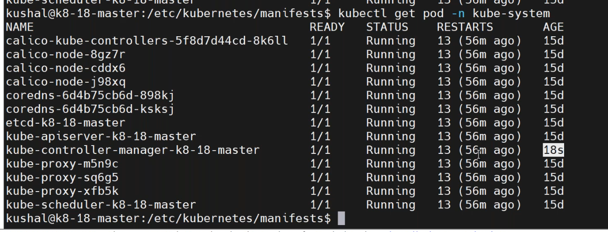
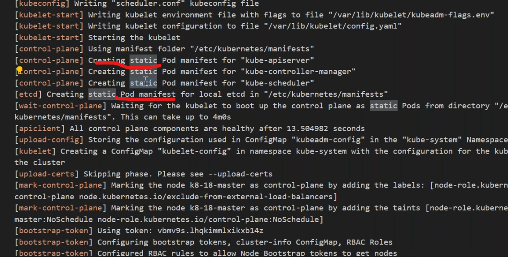
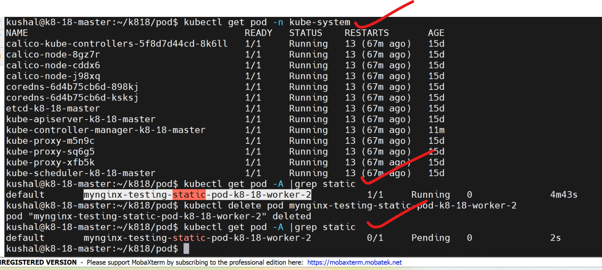

## taintas and toleratios (continuee)
------------------------------------------
### tolerations:
-----------
```
tolerations:
  - key: "example-key"
    operator: "Equals"
    value: " "
    effect: "NoSchedule"
```
* `Operatior`: Equals , Exists
*  -->when you specifying Exists no need to specify the values.
```
tolerations:
  - key: "example-key"
    operator: "Exists"
    effect: "NoSchedule"
```
* --> When there is no operator specified it takes default as "Equals"
*  we can check the nodes by describe command to know the taint is happen to nodes or not??
## static pods
-----------------------------
1. what is the usage of static pod??
*  the pods which are going to start as part of bootup process of your kubelet.
* The pod resource definiton kept under the path "/etc/kubernetes/manifests" those pods called static pods.
    *  apiServer
    *  etcd
    *  schedular
    *  control-manager

* when we initilizing the cluster static pods get created

## custom static pods
-------------------------
* create a pod definition
* place that pod definiton into a path /etc/kubernetes/manifests
* write a manifest for custom static pod, `vi custom.yaml`.
```yaml
apiVersion: v1
kind: Pod
metadata:
  name: myfirstpod
  labels: 
    devops: "18" 
    company: vtalent
  namespace: dev   # namespace defined in metadata section
spec:
  containers:  
    - image: nginx:1.23
      name: myngix
      ports:
        - containerPort: 80 
```
* copy manifist on master or worjer nodes defulat manifest path of `/etc/kubeernates/manifest`.



