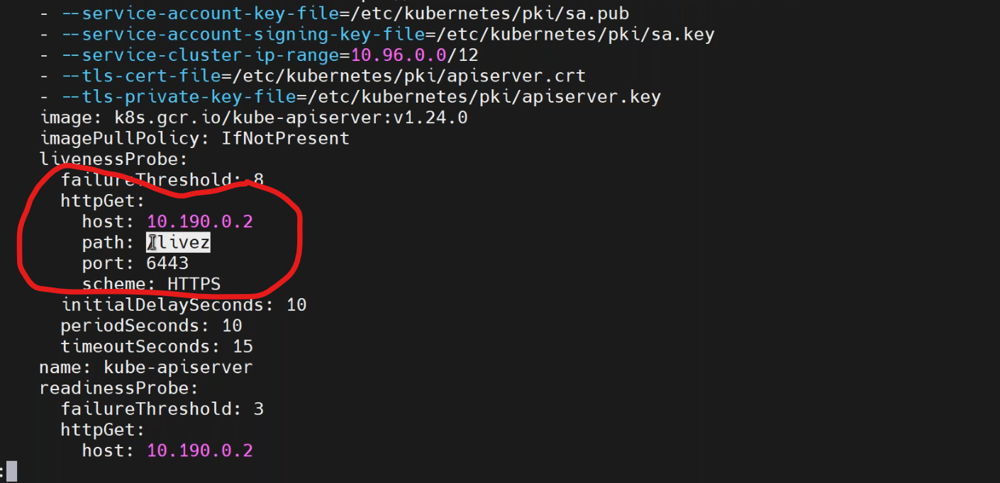
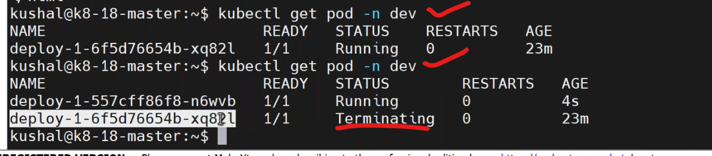
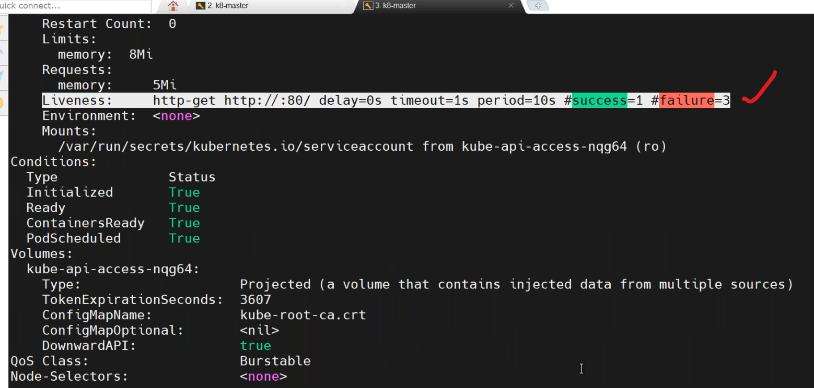

## probes
-------------------------
* when the container can be restarted 
   * --> kubelet is responsible for creating a pod and containers in it.
   * --> health checkS implementation of your containers.
   * --> self-healing can be implemented by using probes.
1. LivenessProbe
2. readynessProbe
3. StartProbe
### liveness VS Readiness:
---------------------------------
 1. it will check whether the container is in running state or not.
      * whenever the healthcheck fails the pod/container is getting restarted automatically.

2. Readiness probe check whether the application is ready to process the requests.
      * it will never restart the pod/container but it can set the status as "0/1" in the pod status.
### ways to implement the probes:
----------------------------
1. `command mode` :
* create a file while container starting and check whether that file exists or not.
2. `httpget` :
* check whether the health api/default homepage is accessible or not.
3. `tcpsocket`:
* check the port status for your application.
* `NOTE`: url: /health --> it just response with 200 response code.
    * /home 
* verify it in kube-apiserver by path `/etc/kubernates/maanifest` by `sudo less kube-apiserver.yaml`.

* write a manifest on liveness probe `vi liveness.yaml`.
```yaml
apiVersion: v1
kind: Pod
metadata:
  name: liveness
  namespace: prod
spec:
  containers:
    - name: livenessprobe
      image: nginx:1.23
      imagePullPolicy: Never
      ports:
        - containerPort: 80
          protocol: "TCP"
      resources:
        requests:
          memory: "100Mi"
          cpu: "250m"  # milli core
        limits:
          memory: "500Mi"
          cpu: "500m"  # milli core
      livenessProbe:
        httpGet:
          path: /
          port: 80
```
* deploy the manifest file by,
```
kubectl apply -f liveness.yaml
kubectl get po -n dev
kubectl descibe pod <pod-name> -n dev
```

* write a manifest on livenessfail by `vi livenessfail.yaml`.
```yaml
apiVersion: v1
kind: Pod
metadata:
  name: liveness
  namespace: prod
spec:
  containers:
    - name: livenessprobe
      image: nginx:1.23
      imagePullPolicy: Never
      ports:
        - containerPort: 80
          protocol: "TCP"
      resources:
        requests:
          memory: "100Mi"
          cpu: "250m"  # milli core
        limits:
          memory: "500Mi"
          cpu: "500m"  # milli core
      livenessProbe:
        httpGet:
          path: /users
          port: 80
```
* deploy the manifest by,
```
kubectl apply -f livenessfail.yaml
kubectl get po -n dev -w
kubectl describe pod <pod-name> -n dev
```



