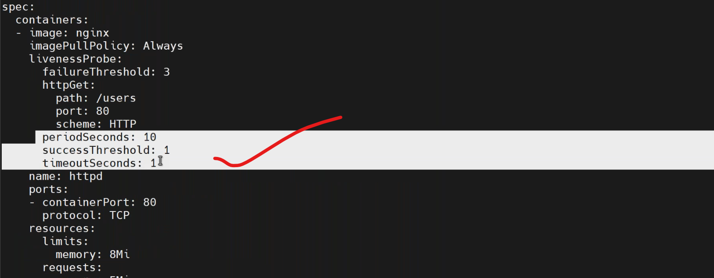
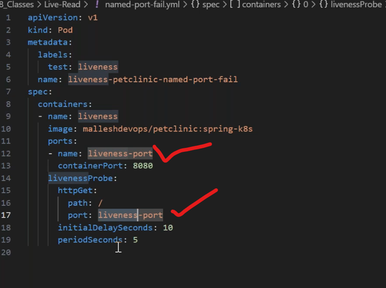

* to know the syntax of this probe use,
```
kubectl get po <pod-name> -n dev -o y
```

* write a manifest on delay by `vi livenessdelay.yaml`
```yaml
apiVersion: v1
kind: Pod
metadata:
  name: liveness-delay
  namespace: prod
spec:
  containers:
    - name: livenessprobe-delay
      image: nginx:1.23
      imagePullPolicy: Never
      ports:
        - containerPort: 80
          protocol: "TCP"
      resources:
        requests:
          memory: "100Mi"
          cpu: "250m"  # milli core
        limits:
          memory: "500Mi"
          cpu: "500m"  # milli core
      livenessProbe:
        httpGet:
          path: /list
          port: 80
        initialDelaySeconds: 15
```
* deploy the manifest file by,
```
kubectl apply -f livenessdelay.yaml
kubectl get po -n dev
kubectl describe pod <pod-name> -n dev
```
* try spring application for delay scenario.
* named port concept.

### both liveness and Readiness:
---------------------------
* only liveness-fail  --> restart 
* only readiness fail  --> no-restart 
* both fail -->  restart 

  

