## daemonsets
------------------------------
### scenario:
------------------------------------
* Assume that you have 100 worker nodes in the k8 cluster. now i want monitor performance of all the worker nodes like cpu utilization,memory utilization,how many pods running on each node ,disk utilization etc.
* solution: concept of daemonsets
### daemonsets:
-----------------------------------
1. each pod in each server (per node one pod)   
2. it sets the replicas number automatically to the number of worker nodes.
3. if you add or delete any worker nodes it adust replicas automatically.
* ex: kube-proxy , prometheus,datadog,elastic search, graylog,splunk, elk,new relic,velero(backutool),appdynamics,dynatrace etc.
```
kubeproxy is a pod,kubelet is the background process
```
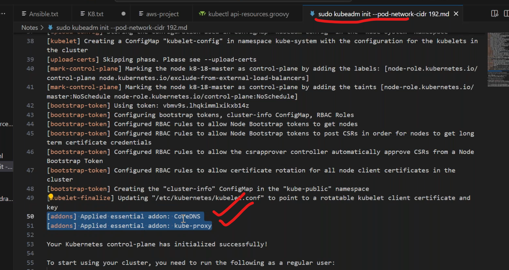
* write a manifest on daemonset `vi daemonset.yaml`.
```yaml
apiVersion: apps/v1
kind: 	DaemonSet  # run pod in each node
metadata:
  name: first-daemonset
  labels:
    purpose: learning
spec:
  selector:
    matchLabels:
      env: dev
  template:
    metadata:
      name: daemonset-pod
      labels:
        env: dev
    spec:
      containers:
        - name: elasicsearch-pod
          image: elasticsearch:8.12.2
```
* deploy the manifest by,
```
kubectl apply -f daemonset.yaml
kubectl get ds <ds-name> -n kube-system
kubectl describe ds <ds-name> -n kube-system
kubectl get po -n kube-system | grep elastic
```
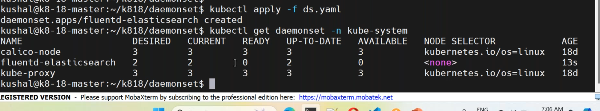
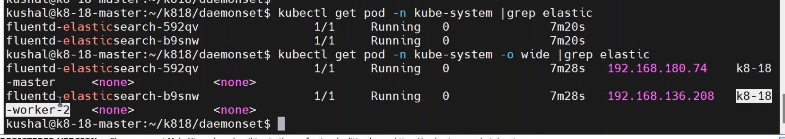

## list of controllers in k8:
-------------------------
1. ReplicationController
2. Replicaset 
3. Deployment-Controller
4. Daemonset-Controller
* to entered to the pod,
```
docker exec -it <containerid/name> /bin/bash
kubectl exec -it <podname> -n <namespace> -- /bin/bash
```
* to apply and remove the taints by,
```
kubectl taint node <node-name> name=devops:NoSchedule    (apply)
kubectl taint node <node-name> name=devops:NoSchedule-   (remove)
```
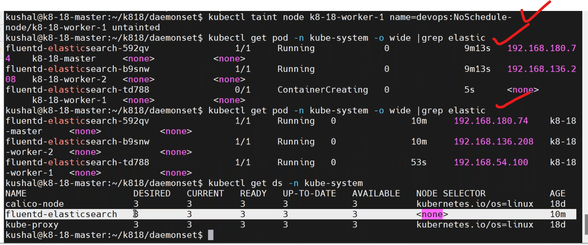
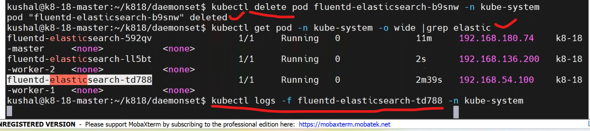
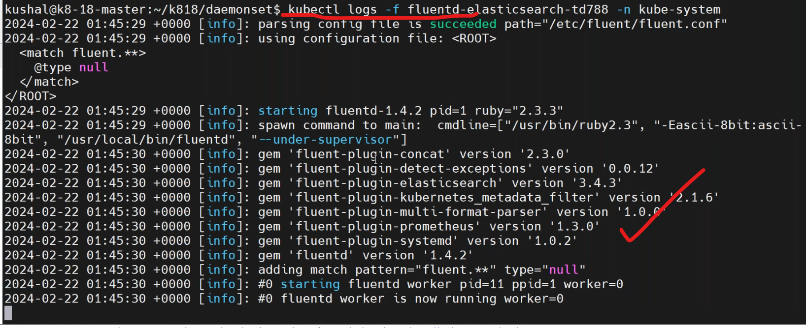
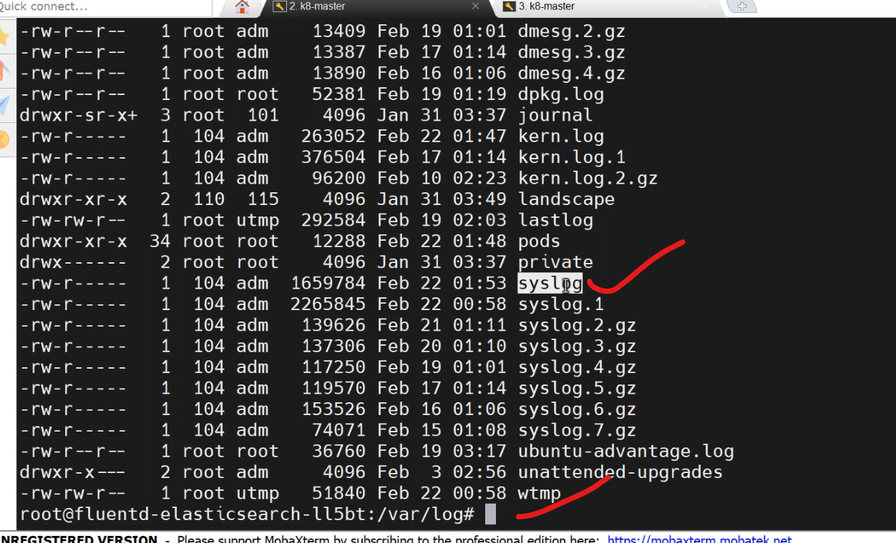
* daemonset controlled by,
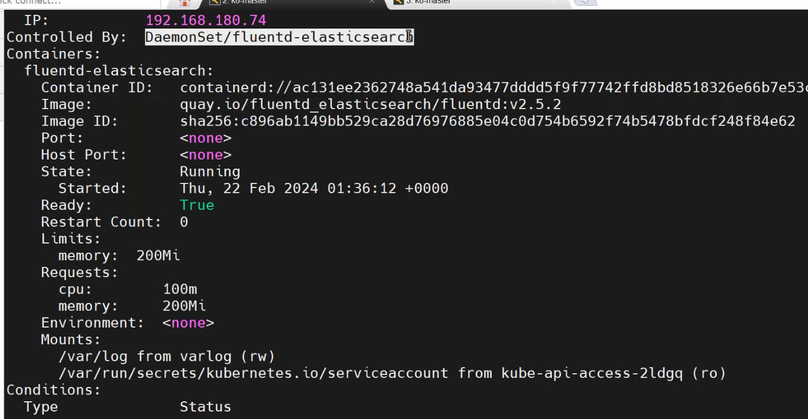

## job and cronjobs:
----------------
* job --> one time its going to run and stop.
* cronjob : run multiple based on the schedule.
* cron-job internally depends on job only.
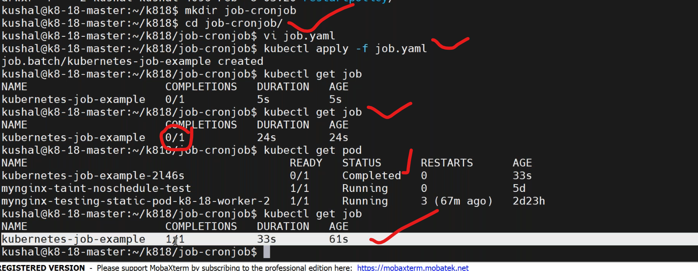
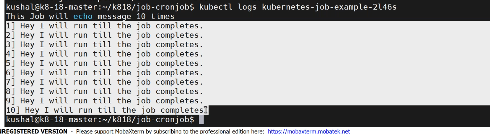
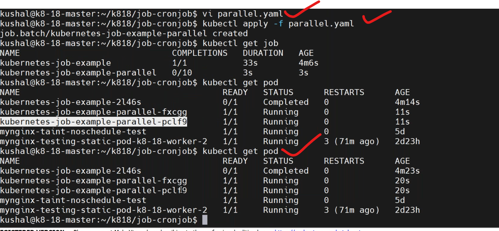
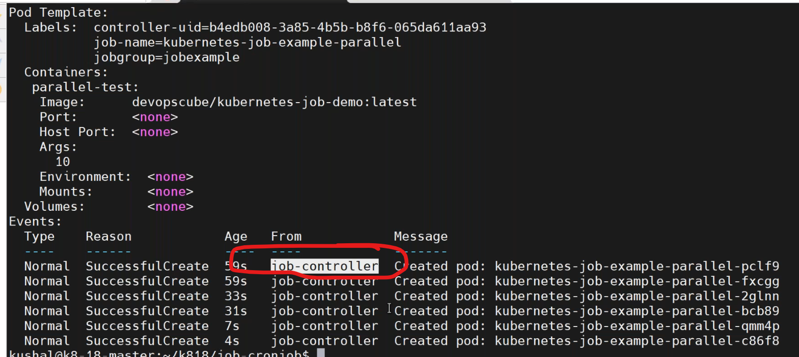
* cronjob
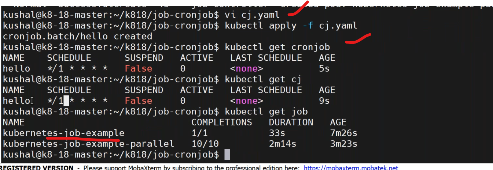


