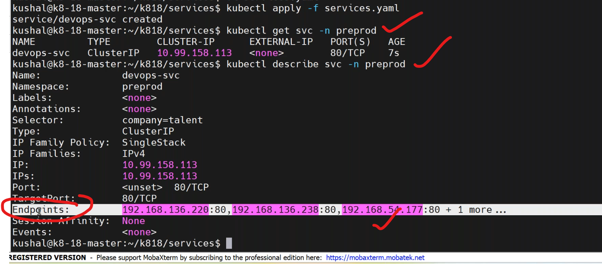
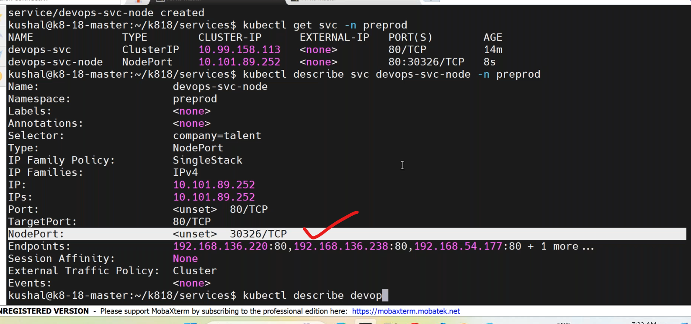
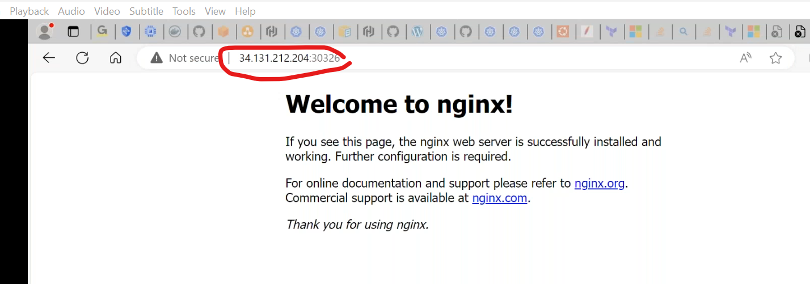
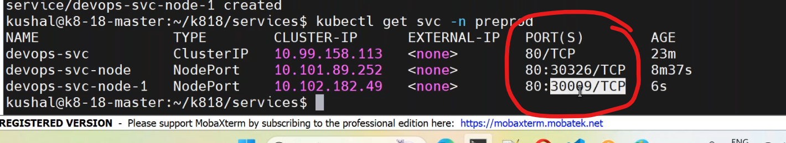
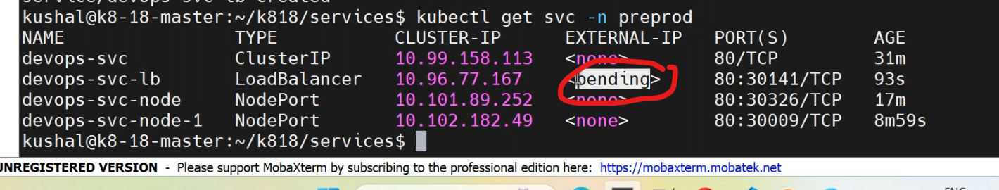

## k8s service
---------------------------------
* service is providing network application to the pods .
* by using labels 
* all the pods matching the labels will be registered as a endpoints to service.
* we can create more than on service for the same set of pods.
### types of services:
-------------------------------
1. `ClusterIP`.
------------------------------
* default service by kubernetes
* it can be accessed within the k8 cluster only.
* * write a manifest on service by `vi service.yaml`
```yaml
apiVersion: v1
kind: Service
metadata:
  name: pod-service
  namespace: dev
spec:
  selector:
    env: dev
  ports:
    - port: 80  # service port
      targetPort: 80  ## container running port 
---
apiVersion: v1
kind: Pod
metadata:
  name: nginx-pod
  labels:
    env: dev
spec:
  containers:
    - name: nginx
      image: nginx:1.23
      ports:
        - containerPort: 80 
```
* deploy the manifest file by,by default it takes clusterip.
```
kubectl apply -f service.yaml
kubectl get service
kubectl get services
kubectl get svc
kubectl describe svc -n dev
```
* service is also specific to `namespace`.
* all the pods ip addresses which match labels added as endpoints to service.

* to know endpoints,
```
kubectl get endpoints <service-name> -n dev
curl http://<service-ip>
```
* clustertip works within tthe cluster only,it doesnot expose to outside of the cluster.
2. ` NodePort`.
-----------------
* it providing access to your application via internet.
* it blocks a unique port into each and every worker node.
* default node port range is 30000 to 32767.
* write a manifest on nodeport `vi nodeport.yaml`
```yaml
apiVersion: v1
kind: Service
metadata:
  name: nodeport-service
  namespace: dev
spec:
  type: NodePort
  selector:
    env: dev
  ports:
    - port: 80  # service port
      targetPort: 80  ## container running port 
---
apiVersion: v1
kind: Pod
metadata:
  name: nginx-pod
  namespace: dev
spec:
 replicas: 5
 selector:
   env: dev
   company: vtalent
 template:
   metadata:
     name: nginx-nodeport
     labels:
       env: dev
       company: vtalent
       batch: '18'
   spec:
     containers:
       - name: nginx-pod
         image: nginx:1.23
         ports:
           - containerPort: 80
```
* deploy the manifest by,
```
kubectl apply -f nodeport.yaml
kubectl describe svc <service-name> -n dev
```

* to access the applictaion by node port,
```
http://<publicip of any workernode>:<port given by service>
```


* to write a manifest for custom nodeport by,`vi customnode.yaml`.
```yaml
apiVersion: v1
kind: Service
metadata:
  name: nodeport-service-custom
  namespace: dev
spec:
  type: NodePort
  selector:
    env: dev
  ports:
    - port: 80  # service port
      targetPort: 80  ## container running port 
      nodePort: 30008      # range should be 32,000 to 32767
---
apiVersion: v1
kind: Pod
metadata:
  name: nginx-pod
  namespace: dev
spec:
 replicas: 5
 selector:
   env: dev
   company: vtalent
 template:
   metadata:
     name: nginx-nodeport
     labels:
       env: dev
       company: vtalent
       batch: '18'
   spec:
     containers:
       - name: nginx-pod
         image: nginx:1.23
         ports:
           - containerPort: 80
```
* apply the yaml file by,
```
kubectl apply -f customnode.yaml
kubectl get svc -n dev
kubectl describe svc <svc-name> -n dev
```
1. `loadbalancer`.
-----------------------------------------------
* routing traffice to each and every equally based on the roud-robin algoritham.
* provides access to internet.
* lb service internally used concept of nodeport mapping only.
* write a manifest for loadbalencer by `vi lb.yaml`.
```yaml
apiVersion: v1
kind: Service
metadata:
  name: lb-service
  namespace: dev
spec:
  type: LoadBalancer
  selector:
    env: dev
  loadBalancerIP: 
  ports:
    - port: 80  # service port
      targetPort: 80  ## container running port 
---
apiVersion: v1
kind: Pod
metadata:
  name: nginx-pod
  namespace: dev
spec:
 replicas: 5
 selector:
   env: dev
   company: vtalent
 template:
   metadata:
     name: nginx-lb
     labels:
       env: dev
       company: vtalent
       batch: '18'
   spec:
     containers:
       - name: nginx-pod
         image: nginx:1.23
         ports:
           - containerPort: 80
```
* apply the manifest by,
``` 
kubectl apply -f lb.yaml
kubectl get svc -n dev
kubectl describe svc <lb-name> -n dev
```


### same pods can we create multiple services??


