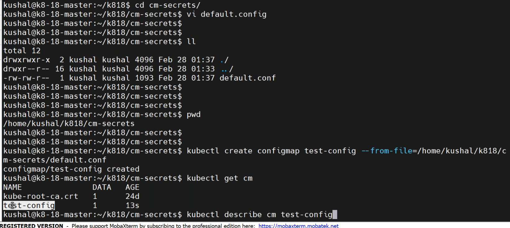
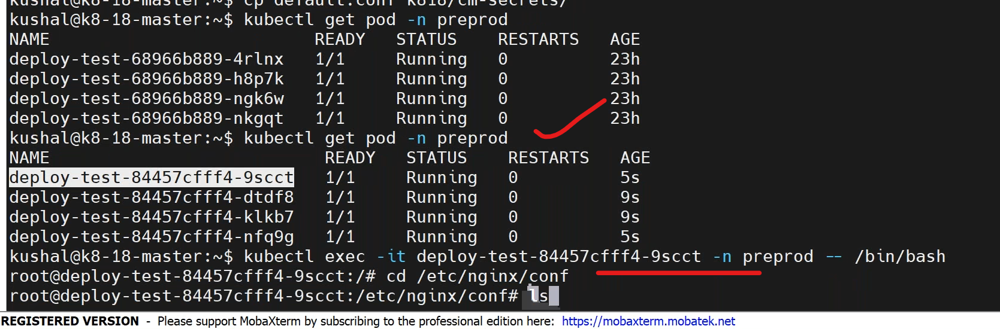

## configmap & secrets
----------------------------
### scenario: you are deploying java based application and you have done the following things.
1. maven build
2. docker image creation
3. deployment in k8
## configmaps:
  -------------------------------------------
* -- to seperate the configuration files from your application.
* write a manifest on configmap `vi configmap.yaml`.
```yaml
apiVersion: v1
kind: 	ConfigMap
metadata:
  name: config-pod
data:
  timeout: 300
  application.properties: |
     spring.datasource.url=jdbc:mysql://localhost:3306/employee_management_system?useSSL=false
     spring.datasource.username=root
     spring.datasource.password=root
     spring.jpa.hibernate.ddl-auto = update
```
* deafault nginx configuration file is in `/etc/nginx/conf.d/default.conf `.
* to create a configmap by command,
```
kubectl create configmap test-config --from-file=/home/kushal/k818/cm-secrets/default.conf
```
* to copy the file from the pod to local,
  ```
  kubectl cp deploy-test-68966b889-4rlnx:/etc/nginx/conf.d/default.conf /home/kushal/default.conf -n preprod
  ```

### how to add configmap to deployment file?
* as a volume we can add configmaps like directory.
* write a manifestfile for configmap in deployment `vi config-deploy.yaml`
```yaml
apiVersion: apps/v1
kind: Deployment
metadata:
  name: deployment-config
  labels: 
    purpose: learning
spec:
  selector:
    matchLabels:
      env: dev
  strategy:
    type: RollingUpdate   #default
      maxsurge: 25%
      maxunavialable: 25%
  template:
    metadata:
      name: deployment-config
      labels:
        env: dev
        company: vtalent
      spec: 
        containers:
          - name: config-deployment
            image: nginx:latest
            ports:
              - containerPort: 80
            volumeMounts:
              - name: test-config #name should be matched with configmap name
                mountPath: /etc/nginx/conf
                subPath: default.conf   #update file filepath
        volumes: 
          - name: devops-cm  # create a configmap
            configMap:
              name: test-config
              
```
* deploy the manifest by,
```
kubectl apply -f config-deploy.yaml
kubectl get po -n prod
```

* to check the config file update or not by, goto the path and do, 
```
cd <path> in the container
cat default.conf
```
* so we no need to rebuild the docker image.
````

apiVersion: v1
data:
  default.conf: |+
    server {
        listen       80;
        listen  [::]:80;
        server_name  localhost;

        #access_log  /var/log/nginx/host.access.log  main;

        location / {
            root   /usr/share/nginx/html;
            index  index.html index.htm;
        }

        #error_page  404              /404.html;

        # redirect server error pages to the static page /50x.html
        #
        error_page   500 502 503 504  /50x.html;
        location = /50x.html {
            root   /usr/share/nginx/html;
        }

        # proxy the PHP scripts to Apache listening on 127.0.0.1:80
        #
        #location ~ \.php$ {
        #    proxy_pass   http://127.0.0.1;
        #}

        # pass the PHP scripts to FastCGI server listening on 127.0.0.1:9000
        #
        #location ~ \.php$ {
        #    root           html;
        #    fastcgi_pass   127.0.0.1:9000;
        #    fastcgi_index  index.php;
        #    fastcgi_param  SCRIPT_FILENAME  /scripts$fastcgi_script_name;
        #    include        fastcgi_params;
        #}

        # deny access to .htaccess files, if Apache's document root
        # concurs with nginx's one
        #
        #location ~ /\.ht {
        #    deny  all;
        #}
    }
```


