## secrets
-------------------------
* -- which used for keeping sensitive data like password, tokens etc.
* write a sample manifest on secrets.`vi secrets.yaml`.
```yaml
apiVersion: v1
kind: 	Secret
metadata:
  name: config-pod
data:
  username: 
  password:
```
* encrypt the credentials: base64 encryption
```
echo "devops" |base64
ZGV2b3BzCg==

echo "devops18" |base64
ZGV2b3BzMTgK

echo "c2VjcmV0" |base64 -d
secret
```
* deploy the manifest file by,
```
kubectl apply -f secrets.yaml
kubectl get sectrets
```
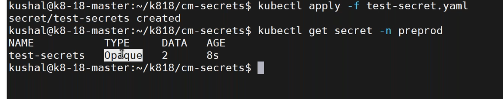
* [Refere Here](https://kubernetes.io/docs/concepts/configuration/secret/) for secrets types.
* [Refere Here](https://mariadb.org/start-mariadb-in-k8s/) for mariadb installation in k8s.
* create a mariadb.yaml,
```yaml
apiVersion: apps/v1
kind: Deployment # what to create?
metadata:
  name: mariadb-deployment
spec: # specification for deployment resource
  replicas: 1 # how many replicas of pods we want to create
  selector:
    matchLabels:
      app: mariadb
  template: # blueprint for pods
    metadata:
      labels:
        app: mariadb # service will look for this label
    spec: # specification for pods
      containers:
      - name: mariadb
        image: mariadb:10.3
        ports:
        - containerPort: 3306 #default one
```
* deploy the mariadb by,
```
kubectl apply -f mariadb.yaml
kubectl get po 
kubectl describe pod <pod-name>
kubectl logs -f <pod-name>
```
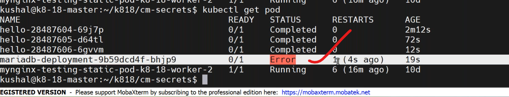
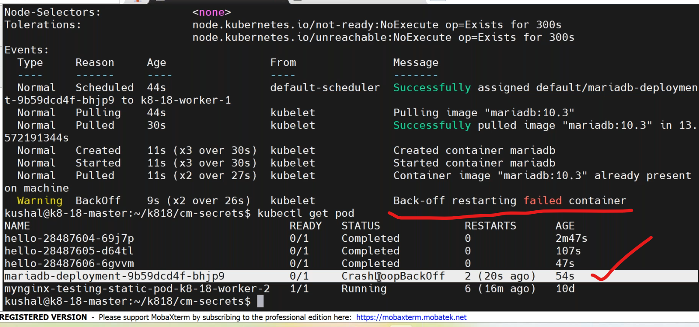
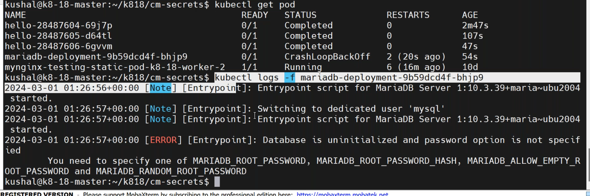
* default user : root 
* password: <we need set the password>
* wite a manifest for secrets `vi secret.yaml`
```yaml
apiVersion: v1
kind: Secret
metadata:
    name: mariadb-secret
type: Opaque
data:
  mariadb-root-password: c2VjcmV0 #echo -n 'secret'|base64
```
* apply the manifest by `kubectl apply -f secret.yaml`.
* after adding secrets to deployment file.
```yaml
apiVersion: apps/v1
kind: Deployment # what to create?
metadata:
  name: mariadb-deployment
spec: # specification for deployment resource
  replicas: 1 # how many replicas of pods we want to create
  selector:
    matchLabels:
      app: mariadb
  template: # blueprint for pods
    metadata:
      labels:
        app: mariadb # service will look for this label
    spec: # specification for pods
      containers:
      - name: mariadb
        image: mariadb:10.3
        ports:
        - containerPort: 3306 #default one
        env:
        - name: MARIADB_ROOT_PASSWORD
            valueFrom:
            secretKeyRef:
              name: mariadb-secret
              key: mariadb-root-password
```
* deploy the manifest again by,
```
kubectl apply f mariadb.yaml
kubectl get po
kubectl logs -f <pod-name>
```
* now database is working.
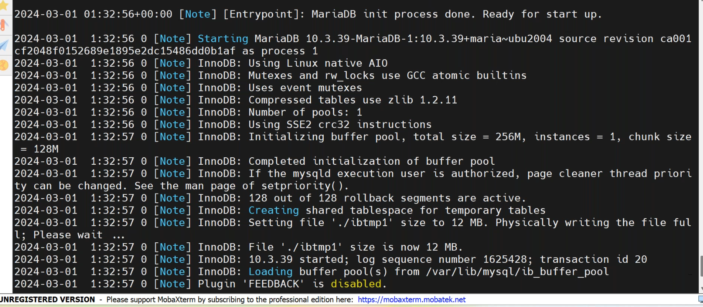
* to check the database by,
```
kubectl get po
kubectl exec -it mariadb-deployment-7b495c4d74-xnpk8 -- /bin/bash
ps -ef
mysql -u root -p 'devops18'
```
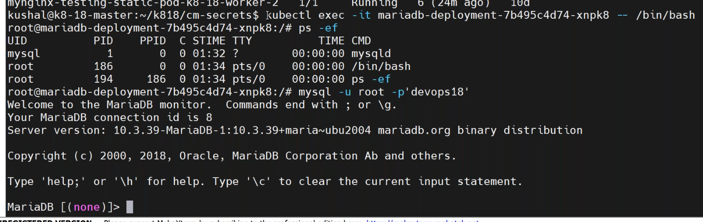
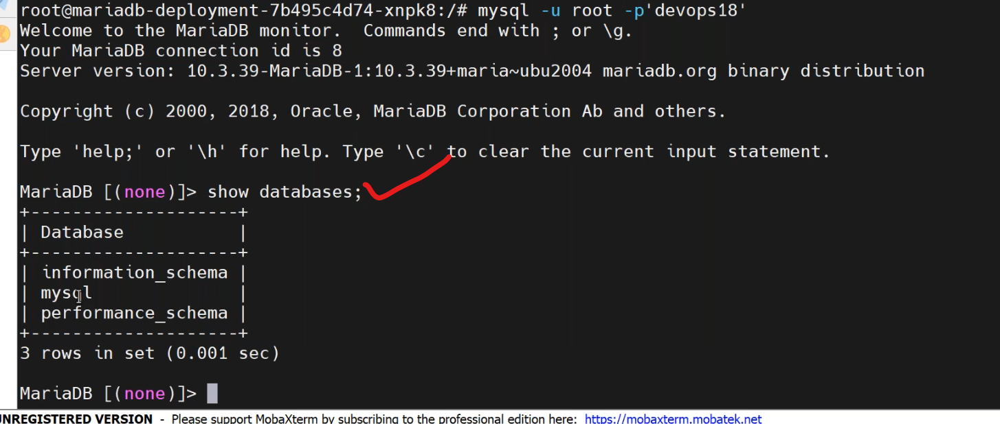
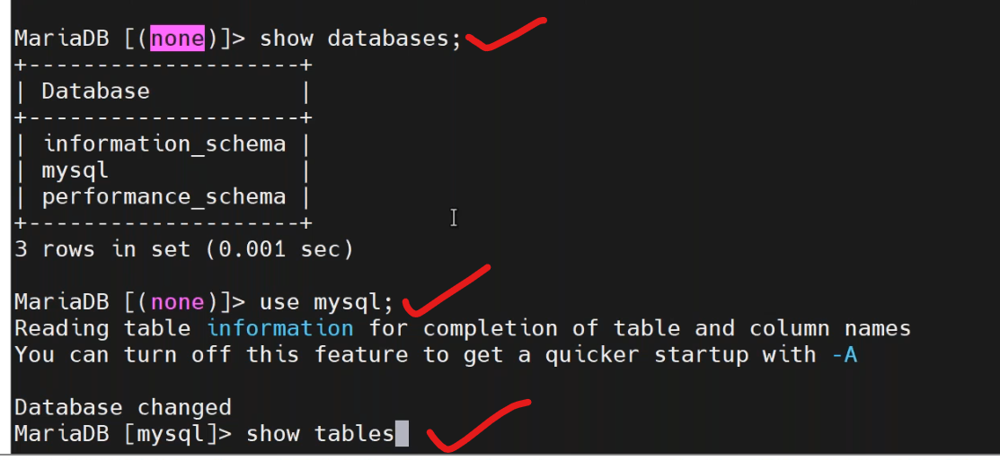
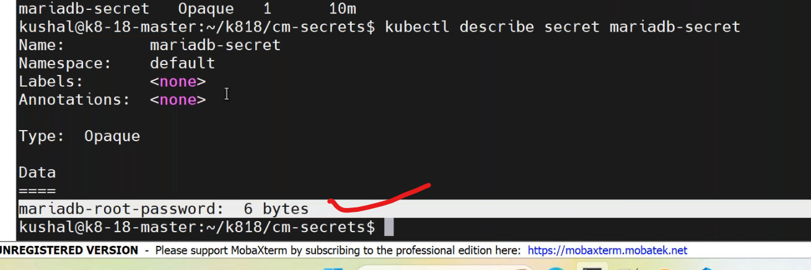
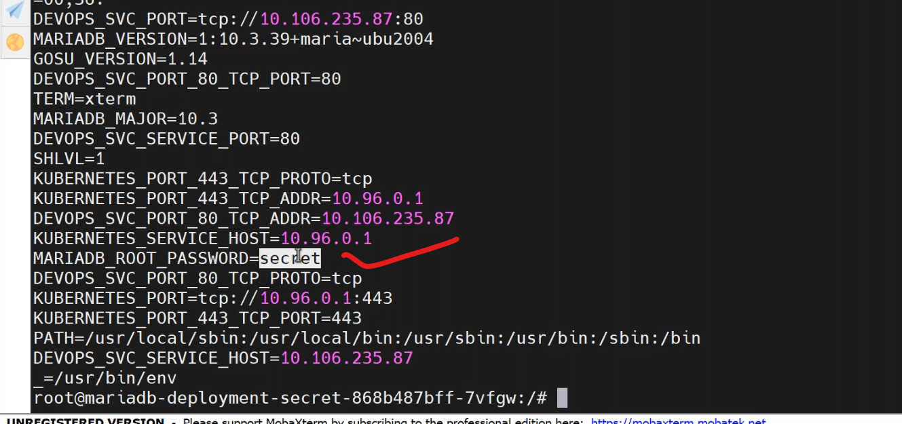
* [Refere Here](https://www.vaultproject.io/use-cases/kubernetes) for hashicorp vault.

## pull the images from docker private repositories
------------------------------------------------------
* create a manifest `vi mariadb-private.yaml`
```yaml
apiVersion: v1
kind: Secret
metadata:
    name: mariadb-secret
type: Opaque
data:
  mariadb-root-password: c2VjcmV0 #echo -n 'secret'|base64
```
* apply the manifest by `kubectl apply -f secret.yaml`.
* after adding secrets to deployment file.
```yaml
apiVersion: apps/v1
kind: Deployment # what to create?
metadata:
  name: mariadb-deployment-private
spec: # specification for deployment resource
  replicas: 1 # how many replicas of pods we want to create
  selector:
    matchLabels:
      app: mariadb
  template: # blueprint for pods
    metadata:
      labels:
        app: mariadb # service will look for this label
    spec: # specification for pods
      containers:
      - name: mariadb
        image: myrepo # give private repository
        ports:
        - containerPort: 3306 #default one
        env:
        - name: MARIADB_ROOT_PASSWORD
            valueFrom:
            secretKeyRef:
              name: mariadb-secret
              key: mariadb-root-password
```
* deploy the manifest by,
```
kubectl apply -f mariadb-private.yaml
kubectl get po
```
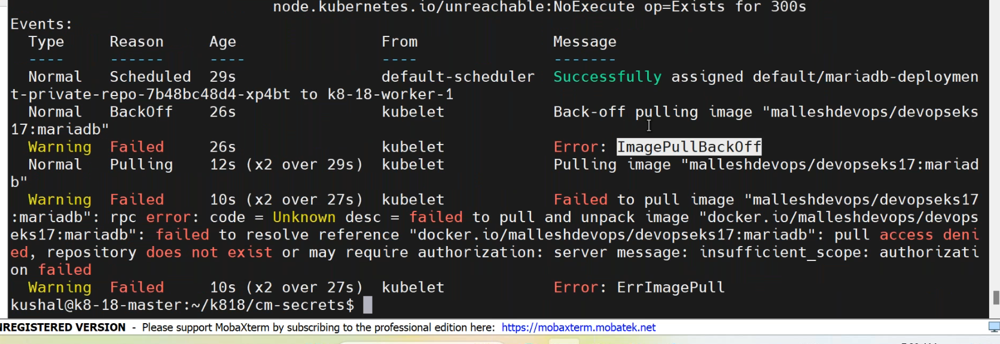
* to pull the docker image from private repo [Refere Here](https://kubernetes.io/docs/tasks/configure-pod-container/pull-image-private-registry/)
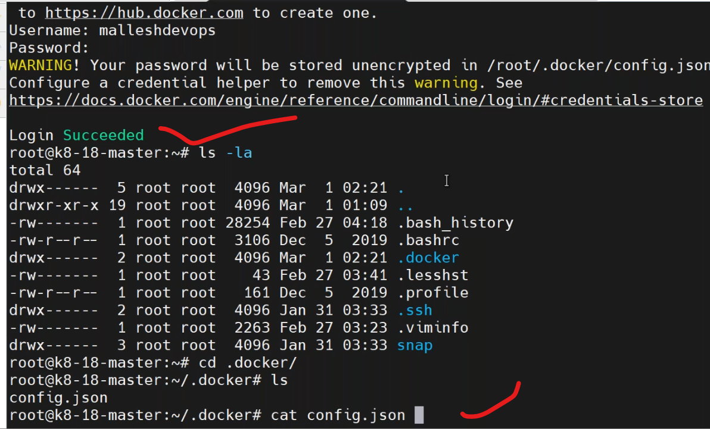
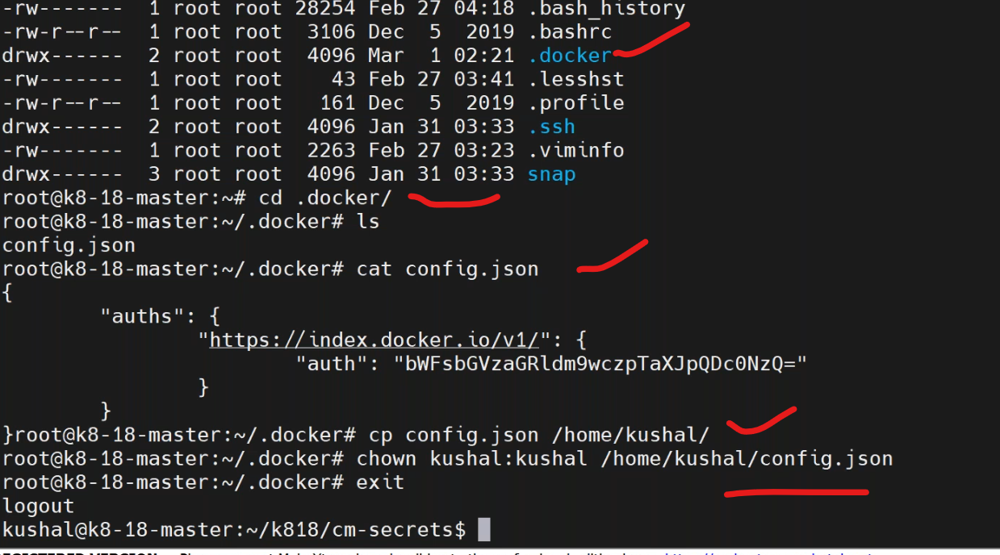
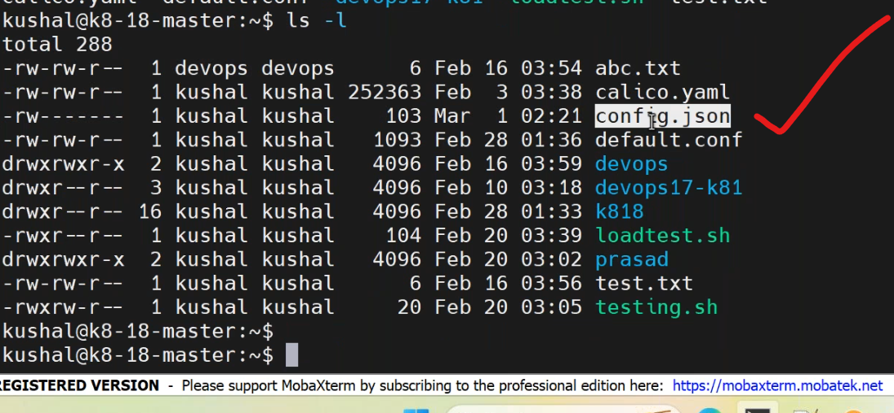
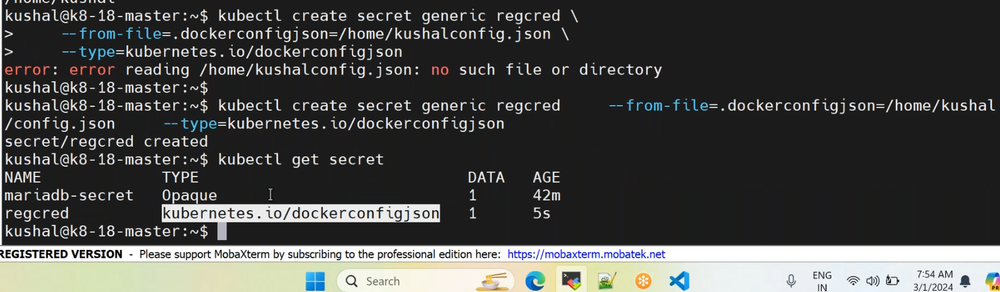
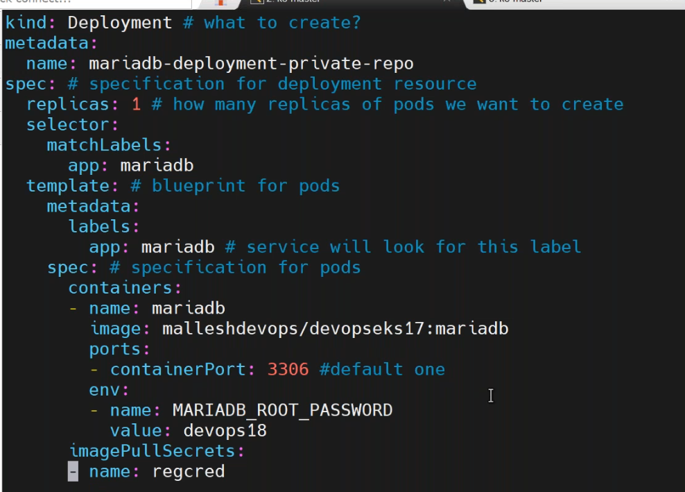
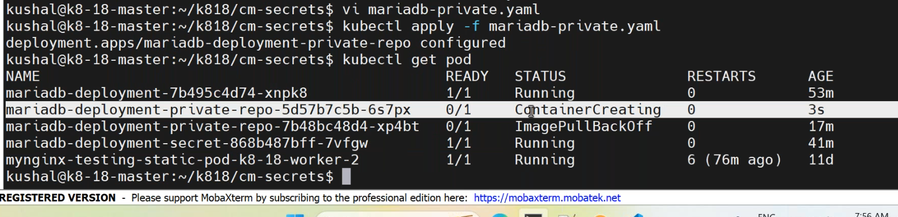
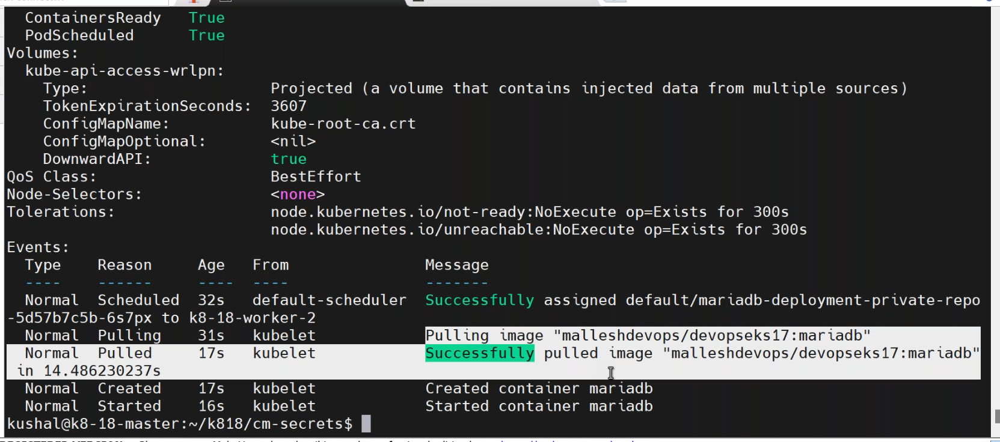


