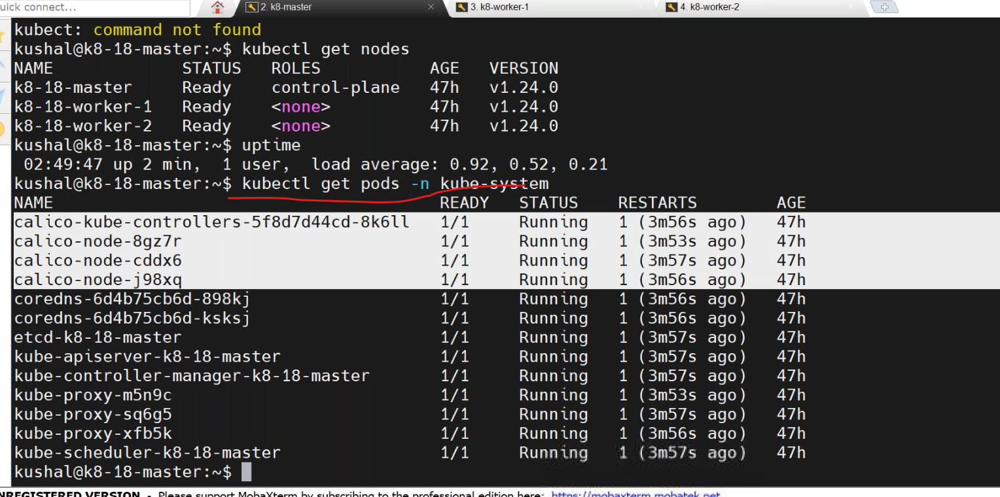
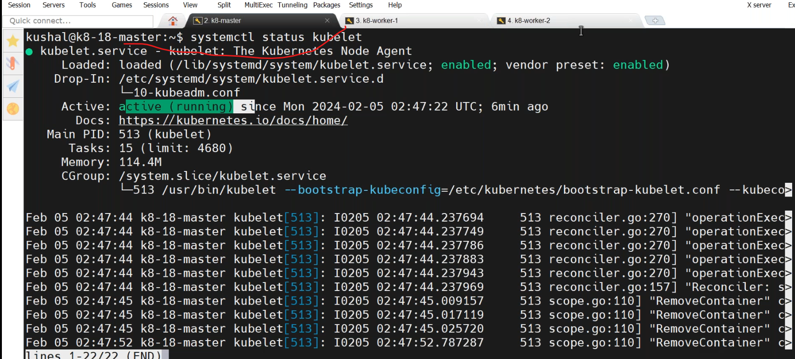
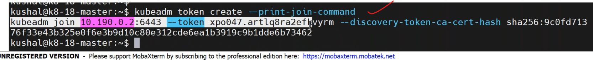
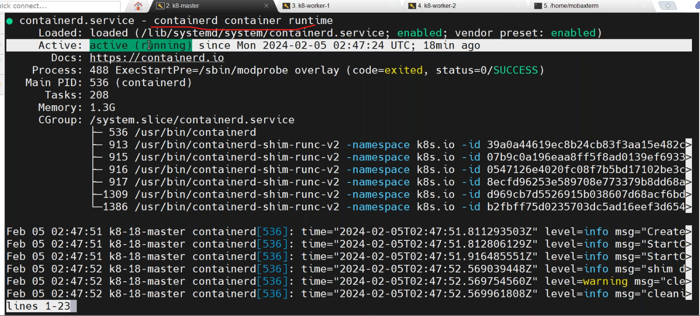
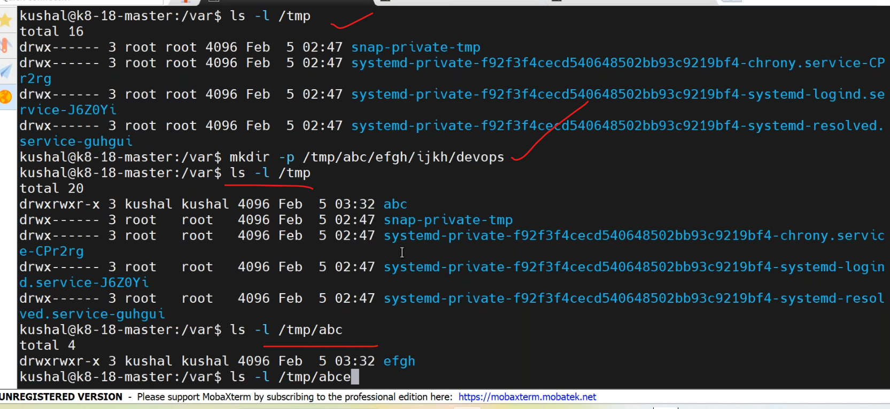
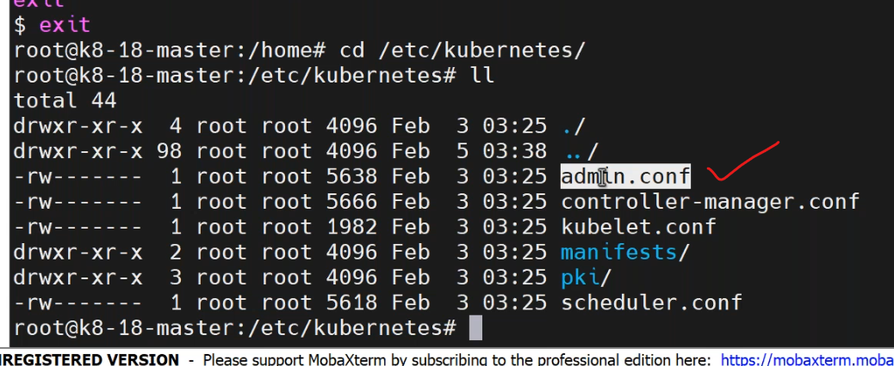
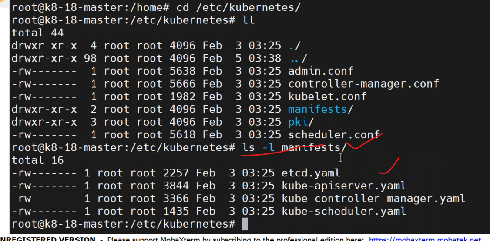

## 05_02_2024
---------------------------

* kubelet is responsible for pod creation.

* to create a new temporary acess token for joining a new node to the cluster,execute it in master-node.

* containerd is a daemon process.`sudo systemctl status containerd`.it runs on every node and master.

* if we want to maintain 3 master nodes in cluster? how they sync with each other?
    * by `etcd`.



* dont try to modify `admin.conf` file but copy to another user configfiles to acces the cluster by another user.
* to check manifest files

---------------------------------------------------------------------------------------------------------------------------------------------------------------------
## kubernetes
----------------------------

* Reactjs Application:

* Java Spring boot application: 


* monolythic VS microservices:
     * Java Spring boot


## History:
-----------------------------
```
 --> Google started orchestration to main their search engine --> Omega
 --> till 2013 --> Omega project --> Internal to Google
 --> CNCF (Cloud Native Computing Foundation)
 --> Google donated omega project to CNCF.
 --> july 2014 --> v1 --> Kubernetes.--> K8s
 --> Kubernetes: 1.29( jan 17 2024)
 ```

 * [refere here](https://kubernetes.io/releases/) k8s versions.

 * --> C language : Dennies Riche --> Object oriented 
    *  Go language --> Object oriented (supports)


* --> Cloud specific kubernetes:
   * AWS --> EKS(Elastic Kubenetes services)-->60%
   * Azure --> AKS(Azure kubernetes Services)
   * Google --> GKE(Google Kubernetes Engine)
   * Oracle --> OCK 
   * Alibaba --> ACK
   * Redhat --> Pass plaform --> Openshift


 ## K8 architecture:
 ---------------

  * --> Control plane --> worker nodes 
  * --> Control plane:
       1. ApiServer: heart of k8 cluster
                     it provide communication between compoenents.
                     it validates definitions/commands which is executed users.(syntax/semantic)

       2. Ectd     : its a data store.
                     cluster status(conterolplane,worker nodes etc)
                     key=value pair machanism to be used to store it.

       3. kube-schedular: it schedules a pods in the worker nodes by considering few conditons.
       4. Control-manager: it controlls the pods running in the cluster.

 * --> Worker nodes: 
       1. kubelet : its a daemon process
                    it has responsibility to create a pods 
       2. kube-proxy: it allowcates IP address to pods.

## Terminalogy:
-----------
   pod :  The pod is primary element in the k8 and it can run one or more containers in it.

   node: Node is server(physical or Virtual server)

## k8 Workloads:
------------
  * --> pod
  * --> deployments
  * --> daemonset
  * --> statefulset
  * --> job
  * -- cronjob

* --> Container Runtime Environment: docker,Rancher or CRI-O etc.

* [refere here](https://kubernetes.io/blog/2020/12/02/dont-panic-kubernetes-and-docker/) docker and k8s issue.

## installation steps to follow:
---------------------------------------------
# method1
----------------------------------------------
* [refere here](https://discuss.kubernetes.io/t/building-a-kubernetes-1-24-cluster-with-kubeadm/22047) for installation steps.

* step-1 
``` 
cat <<EOF |tee /etc/modules-load.d/containerd.conf
overlay
br_netfilter
EOF
```
* step2    
```
 sudo modprobe overlay sudo modprobe br_netfilter
```

* step3
``` 
cat <<EOF | sudo tee /etc/sysctl.d/99-kubernetes-cri.conf
net.bridge.bridge-nf-call-iptables = 1 
net.ipv4.ip_forward = 1 
net.bridge.bridge-nf-call-ip6tables = 1 
EOF
```
* step4
```
sudo sysctl --system
```
* follwo the documentaion for remaining steps.
* last steps
```
cat <<EOF | sudo tee /etc/apt/sources.list.d/kubernetes.list 
deb https://apt.kubernetes.io/ kubernetes-xenial main 
EOF
```

* kubeadm --> kubernetes adminstration --> cluster creation/deletion/keysgeneration
* kubectl --> kubernetes terminal to execute k8 command.
* kubelet --> this is daemon process running in each server of cluster.
            It is responsible for pod creation in that server.
* why disable swap memory in k8s??
   * to improve the k8s performance.

*  master commands to execute.
```
sudo kubeadm init --pod-network-cidr 192.168.0.0/16 --kubernetes-version 1.24.0
```
`````
[init] Using Kubernetes version: v1.24.0
[preflight] Running pre-flight checks
error execution phase preflight: [preflight] Some fatal errors occurred:
        [ERROR FileContent--proc-sys-net-bridge-bridge-nf-call-iptables]: /proc/sys/net/bridge/bridge-nf-call-iptables does not exist
[preflight] If you know what you are doing, you can make a check non-fatal with `--ignore-preflight-errors=...`
To see the stack trace of this error execute with --v=5 or higher
`````

* resolution: do it in all the servers.
```
modprobe br_netfilter and echo '1' > /proc/sys/net/ipv4/ip_forward
echo "br_netfilter" | sudo tee -a /etc/modules
echo "br_netfilter" | sudo tee /etc/modules-load.d/netfilter.conf  
```  
* do agian init.   

## network to cluster by using calico
--------------------------------------------
* [refere here](https://docs.tigera.io/calico/latest/getting-started/kubernetes/self-managed-onprem/onpremises#install-calico-with-kubernetes-api-datastore-50-nodes-or-less) for calico installation.


* DNS url --> nginx proxy/http proxy --> 3 master nodes 

https://github.com/kubernetes-sigs/kubespray


kubeadm init --> initialize the cluster
kubeadm reset --> it removes/delete clusters
kubeadm token create --print-join-command

# method2
-----------------------------------------------------------------------------------------
### Single Master K8s installation using kubeadm
* Create atleast two linux vms 2vcpu 2GB RAM with all internal communication open as specified overhere [Refer Here](https://kubernetes.io/docs/reference/networking/ports-and-protocols/)
* Install docker container runtime on both machines.
```
curl -fsSL https://get.docker.com -o install-docker.sh
sh install-docker.sh
sudo usermod -aG docker ubuntu
```
* Install kubelet, kubeadm and kubectl on all nodes [Refer Here](https://v1-29.docs.kubernetes.io/docs/setup/production-environment/tools/kubeadm/install-kubeadm/)
```
sudo apt-get update
# apt-transport-https may be a dummy package; if so, you can skip that package
sudo apt-get install -y apt-transport-https ca-certificates curl gpg
curl -fsSL https://pkgs.k8s.io/core:/stable:/v1.29/deb/Release.key | sudo gpg --dearmor -o /etc/apt/keyrings/kubernetes-apt-keyring.gpg
echo 'deb [signed-by=/etc/apt/keyrings/kubernetes-apt-keyring.gpg] https://pkgs.k8s.io/core:/stable:/v1.29/deb/ /' | sudo tee /etc/apt/sources.list.d/kubernetes.list
sudo apt-get update
sudo apt-get install -y kubelet kubeadm kubectl
sudo apt-mark hold kubelet kubeadm kubectl 
```
* Now lets configure cri-dockerd as k8s doesnot directly communicate with docker [Refer Here](https://github.com/Mirantis/cri-dockerd),Download a deb or  rpm package acording to your linux distribution [Refer Here](https://github.com/Mirantis/cri-dockerd/releases).
```
wget https://github.com/Mirantis/cri-dockerd/releases/download/v0.3.9/cri-dockerd_0.3.9.3-0.ubuntu-jammy_amd64.deb
sudo dpkg -i cri-dockerd_0.3.9.3-0.ubuntu-jammy_amd64.deb
```
* ssh into master node and execute as root user
```
kubeadm init --cri-socket unix:///var/run/cri-dockerd.sock
```
* the output of the command is,
```
  mkdir -p $HOME/.kube
  sudo cp -i /etc/kubernetes/admin.conf $HOME/.kube/config
  sudo chown $(id -u):$(id -g) $HOME/.kube/config

Alternatively, if you are the root user, you can run:

  export KUBECONFIG=/etc/kubernetes/admin.conf

You should now deploy a pod network to the cluster.
Run "kubectl apply -f [podnetwork].yaml" with one of the options listed at:
  https://kubernetes.io/docs/concepts/cluster-administration/addons/

Then you can join any number of worker nodes by running the following on each as root:

kubeadm join 172.31.16.89:6443 --token snlscz.jxder09kwfg1s2vw \
        --discovery-token-ca-cert-hash sha256:d6ee2abe7de1df91db473cbc3133cf6f6dc631fe6cd24e4c6c7283faafe95ff8
```
* Now ssh into node1 and execute join command as root user
```
kubeadm join 172.31.16.89:6443 --token snlscz.jxder09kwfg1s2vw \
        --discovery-token-ca-cert-hash sha256:d6ee2abe7de1df91db473cbc3133cf6f6dc631fe6cd24e4c6c7283faafe95ff8
```
* execute the command
```
 kubectl get nodes
```
### 
* Available Commands:
 ```
  certs       Commands related to handling kubernetes certificates
  completion  Output shell completion code for the specified shell (bash or zsh)
  config      Manage configuration for a kubeadm cluster persisted in a ConfigMap in the cluster
  help        Help about any command
  init        Run this command in order to set up the Kubernetes control plane
  join        Run this on any machine you wish to join an existing cluster
  kubeconfig  Kubeconfig file utilities
  reset       Performs a best effort revert of changes made to this host by 'kubeadm init' or 'kubeadm join'
  token       Manage bootstrap tokens
  upgrade     Upgrade your cluster smoothly to a newer version with this command
  version     Print the version of kubeadm
  ```

## Default configuration:
---------------------
* --> /etc/kubernetes/
     * --> admin.conf this is used to connect to cluster.
     * --> pki --> certificates related to cluster
     * --> manifest --> definiton of kubernetes componetns

* --> namespace : its a seperate virtual environment in the kubernests cluster.

###  kubectl get namespace
```
kubectl get namespace
NAME              STATUS   AGE
default           Active   2d
kube-node-lease   Active   2d
kube-public       Active   2d
kube-system       Active   2d --> This is used by kubernetes default components.
```
* terminalogy: pod and namespace


 