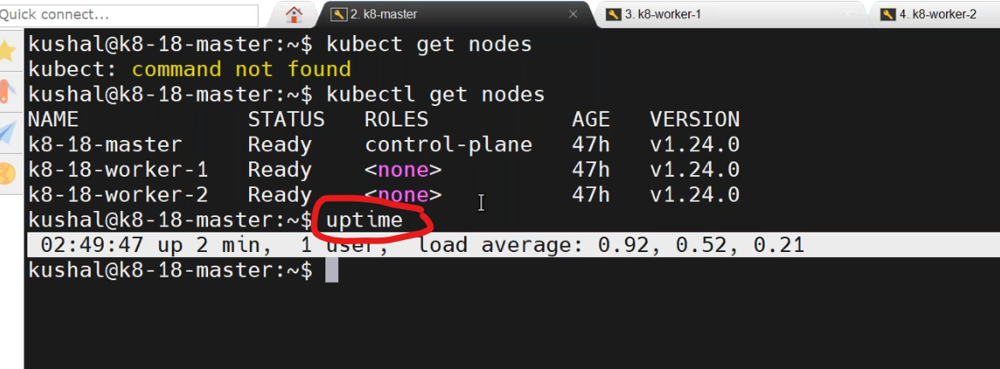
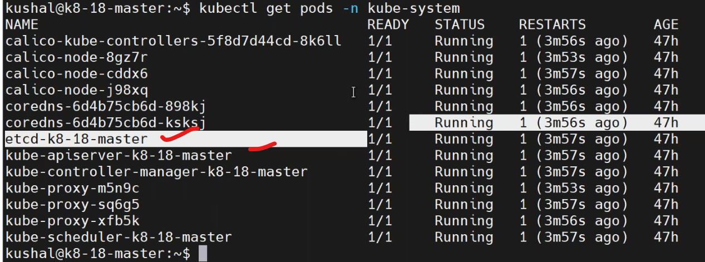
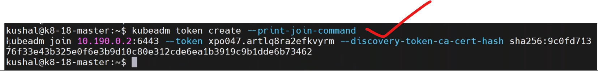
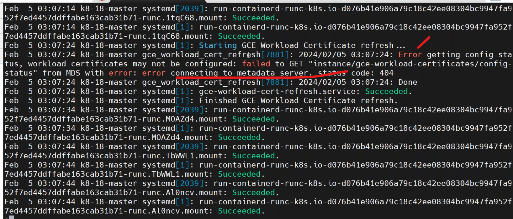
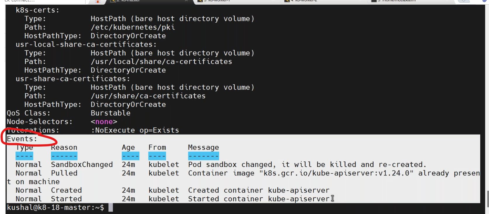
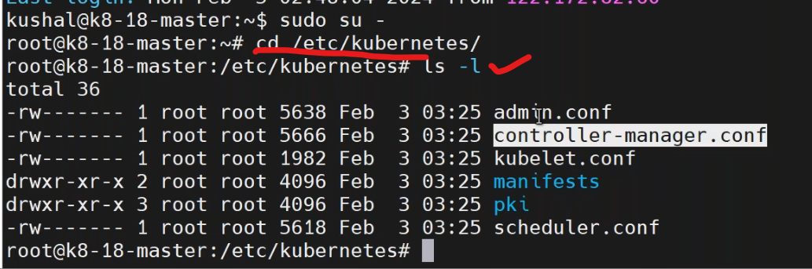
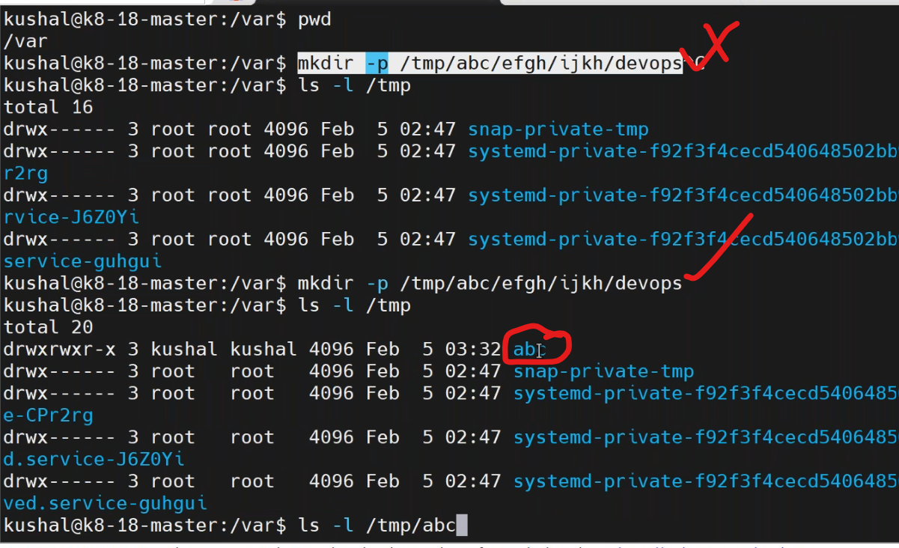
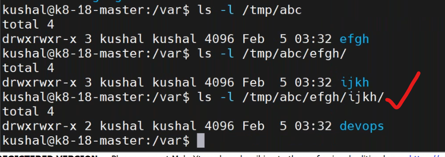

## k8s namespace (05/02/2024)
--------------------

* default name space for k8s is `kube-syatem.
````
kubectl get pods -n kube-system
````
* `namespace` is a separate virtual environment in k8s cluster.

## defualt configurations in k8s
---------------------------------
### kubelet
----------------
* kubelet is a daemon it runs background in masternode.
* execute command in masternode by `sudo systemctl status kubelete`.untill unless it commes to running status none of the pod will come to running status.
* in architectre diagram in master not give the kubelet but generally in every node in cluster including master have kubelet.
### kubeadm
--------------
* `kubeadm init` is used to initilized the cluster.
* `kubeadm reset` is used delete the cluster
* to get a temporary token to join another node to the cluster by,
````
kubeadm token create --print-join-command
````

* `conatainerd`,it runs on each and every node.
````
sudo systemctl status containerd
````
* execute command in master to know logs status
````
less /var/log/syslog
````

* to know events
````
kubectl get po -n kube-system
kubectl describe pod <pod-neme> -n kube-system
kubectl logs -f <pod-name> -n kube-system
````

* to maintain high availability of application we maintian 3 to 5 mastersservers.
* if i maintain  3 masters in single cluster how they sync??
  * for this we use some proxy servers.
  * DNS url -----> nginx proxy/http proxy
  * ETCD will be sync in the all 3 masternodes.
* [refer here](https://directdevops.blog/2022/11/30/devops-classroomnotes-30-nov-2022/) for installation types of k8s.
* default config file of k8s is `/etc/kubernatees`.

  * `pki` means some certificates.
* to know meaning of the below steps
````
mkdir -p $HOME/.kube  (-p->path) # create a `.kube` folder in homedirctory
sudo cp -i /etc/kubernetes/admin.conf $HOME/.kube/config
sudo chown $(id -u):$(id -g) $HOME/.kube/config
````
* `-p` means path,whereever u r present path but when use -p create a directory in particular path.


* if we create another user (devops) and execute kubectl command it didnot work,because kubectl by default looking for `.kube` folder.

* if we want to give access to anoter user to the cluster,create a user and create a .kube folder init and copy the config from where the config available in another user.
