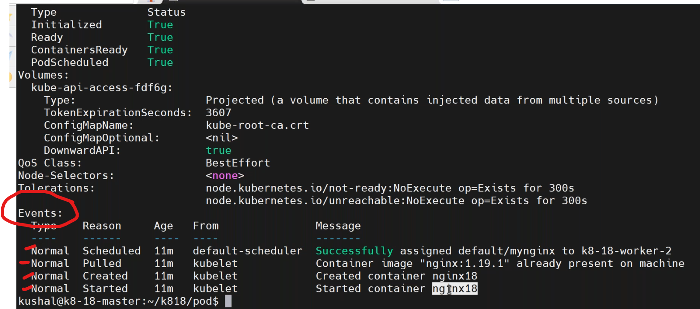
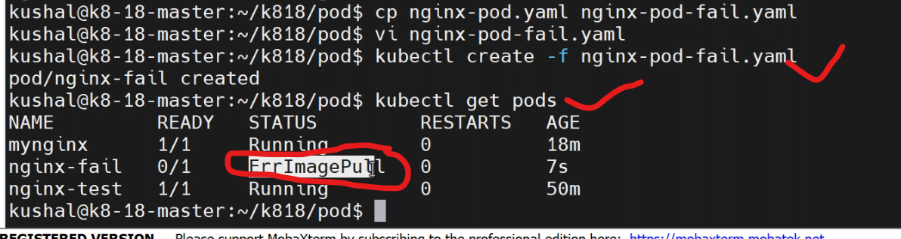
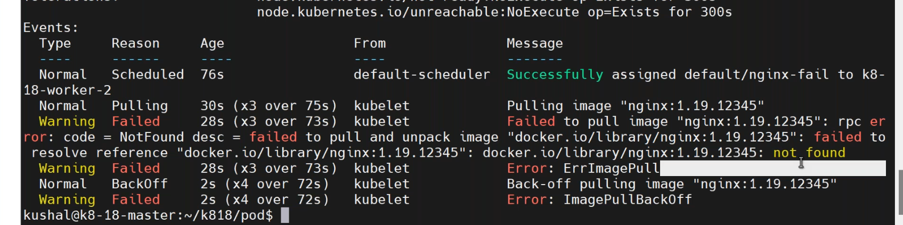

## kubernatees resources
----------------------------
### manifest structure
------------------------------
* manifest 
```yaml
apiVersion: v1
kind: Pod
metadata:
  name: myfirst_pod
  labels:         # labels must be in strings not in integers 
    devops: "18"  # labels={"devops":"18","company":"vtalent"}
    company: vtalent
spec:
  containers:  # containers=[{"name":"mynginx","image":"nginx:1.23"}]
    - image: nginx:1.23
      name: myngix
status:
```
* `apiVersion`:
  - v1 (main release)
  - v1 (alpha1) - (intermediate release)
  - vi (beta1)
  * `catogery`:
    - networking/v1
    - apps/v1
    - batch/v1
* `kind`:
  - component name
* `metedata`:
  - information about our pod
* `spec`:
  - container details.  
* to deploy pod by manually by commands.but we can only write yaml manifests.
```
kubectl run --help
kubectl run nginx-test --image=nginx:1.23 
kubectl get pods
```
* write a pod manifest.
```
mkdir k8s
cd k8s/
mkdir pod
cd pod/
vi nginx-pod.yaml
```
* nginx-pod.yaml
```yaml
apiVersion: v1
kind: Pod
metadata:
  name: myfirst_pod
  labels: 
    devops: "18"  # labels={"devops":"18","company":"vtalent"}
    company: vtalent
spec:
  containers:  # containers=[{"name":"mynginx","image":"nginx:1.23"}]
    - image: nginx:1.23
      name: myngix
      ports:
        - ContainerPort: 80
```
1. `kubectl create -f nginx-pod.yaml`
```
1.kubectl pass the definition to apiserver.
2.apiserver validating the definition file,syntax and semantic.
3.internally yaml manifest converted to json,because apiserver understands json.
4.apiserver pass the information to scheduler.
5.shceduler decides where this pod has to be run,node1 or node2.
6.the apiserver receives the node details from shceduler and then it do two actions.
    * it passes the information to etcd to store.
    * passes to the respect node kubelet.
7.kubelet in the node is responsible for pod creation.
    * it pull the respected docker image
    * create the container
    * start the container
8.kubeproxy is allocating ipaddress to the pod.
9.now kubelet passes the pod status information back to apiserver.
10.apiserver pass the same to etcd to store current status.
11.the controller managing the desired pods.
```
* to know all the above events by executing.
```
kubectl get pods
kubectl describe pod <pod-name>
```

* create a error yamlfile `nginx-fail.yaml`.
```yaml
apiVersion: v1
kind: Pod
metadata:
  name: myfirst_pod
  labels: 
    devops: "18"  # labels={"devops":"18","company":"vtalent"}
    company: vtalent
spec:
  containers:  
    - image: nginx:1.23.12345
      name: myngix_fai # name must be unique
      ports:
        - ContainerPort: 80
```
  * `kubectl create nginx-fail.yaml`.




