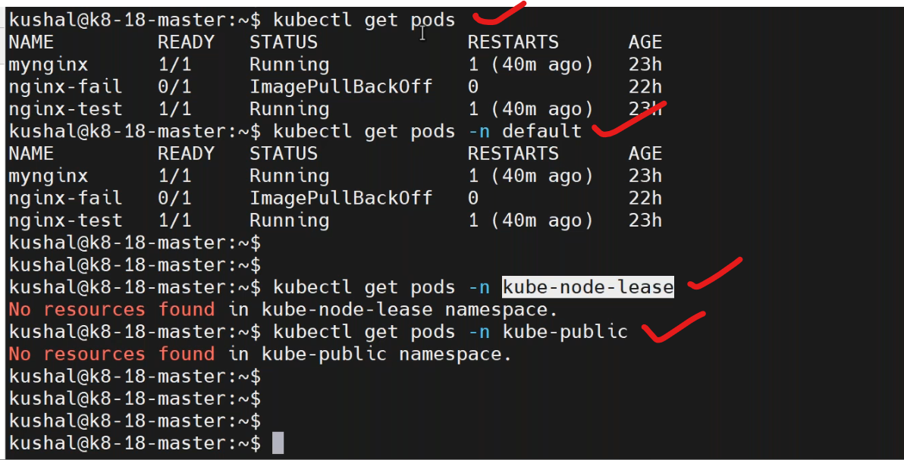
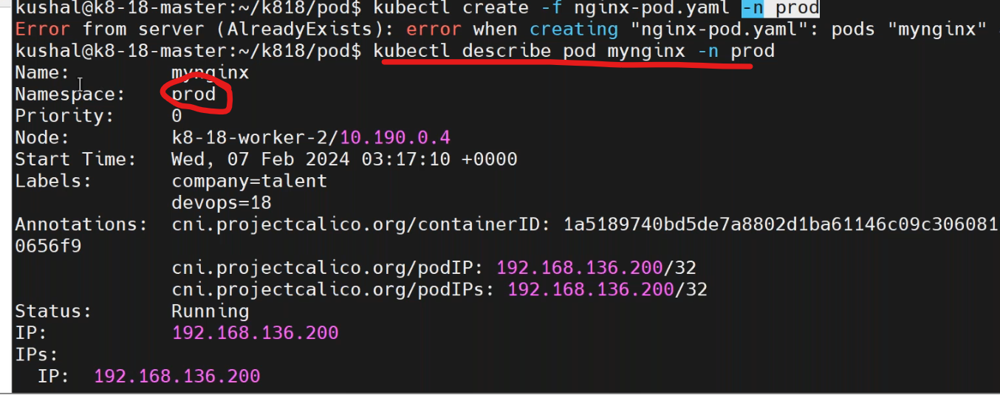
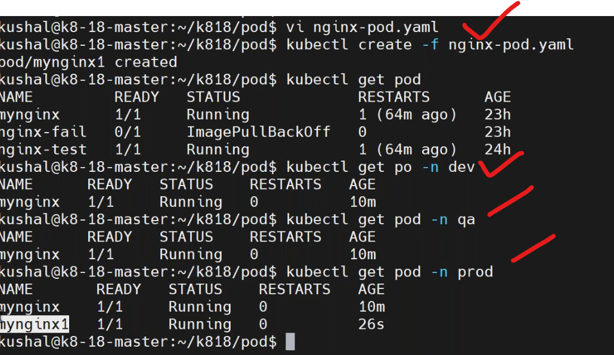
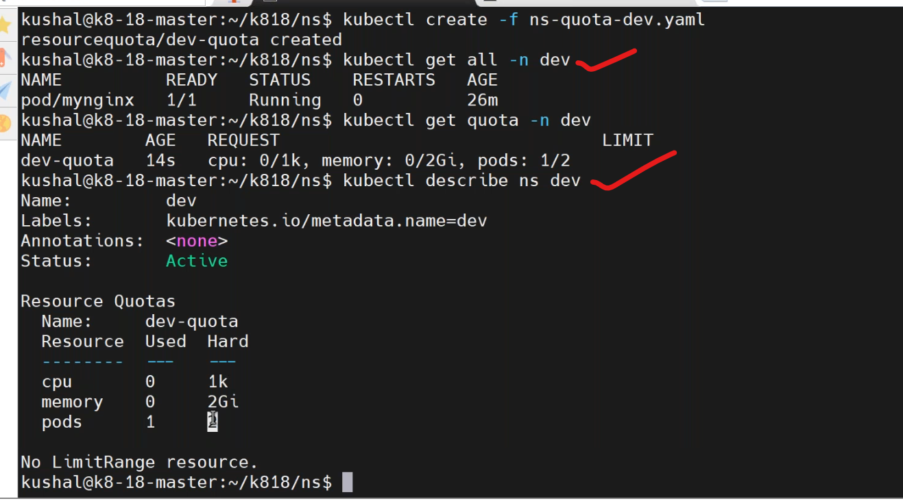

## namespaces
-----------------------------
* it is a virtual environment in k8s cluster.
```
kubectl get namespaces
kubectl create ns <name>
kubectl get ns <name> -o yaml
```
* each namespace have its own network.
* certain objects in k8s which can be create in namespace,there are certain objects in k8s which cannot create namespace but they are shared accross all the namespaces.
  * namespace `true` means it belong to one namespace.
    * pods-true
  * namespace false means not belong to particular one,it shared accross all namespaces.
    * nodes-false
    * persistent volumes-false
    * namespace-false

* to create a namespace by using manifest.[refere here](https://kubernetes.io/docs/reference/generated/kubernetes-api/v1.29/#namespacespec-v1-core)
```yaml
apiVersion: v1
kind: Namespace
metadata: 
  name: dev
```
* create a folder.
```
mkdir ns
cd ns
vi dev.yaml
kubectl create -f dev.yaml
kubectl get ns
```


-----------------------------------------
* define namespace by comand level.

* defining namespace by manifest level.
```yaml
apiVersion: v1
kind: Namespace
metadata: 
  name: dev
---
apiVersion: v1
kind: Pod
metadata:
  name: myfirstpod
  labels: 
    devops: "18" 
    company: vtalent
  namespace: dev   # namespace defined in metadata section
spec:
  containers:  
    - image: nginx:1.23
      name: myngix
      ports:
        - containerPort: 80 
```
* after that use `kubectl create -f nginx-pod.yaml`.

* `kubectl cluster-info` use this command to cluster details.
### restrictions kept on namespacewise
--------------------------------------------------------------
* [refere here](https://kubernetes.io/docs/concepts/policy/resource-quotas/) for resource quota.
* to write manifest for resource-quota by `vi resourcequota.yaml`
```yaml
apiVersion: v1
kind: Namespace
metadata: 
  name: qa
---
apiVersion: v1
kind: ResourceQuota
metadata:
  name: resourcequotapod
  namespace: qa
spec:
  hard:
    cpu: 10m
    memory: 512Mi
    pods: 5
```
* `kubectl create resourcequota.yaml` for dev namespace.
```
kubectl get quota -n dev
kubectl describe ns dev
```



