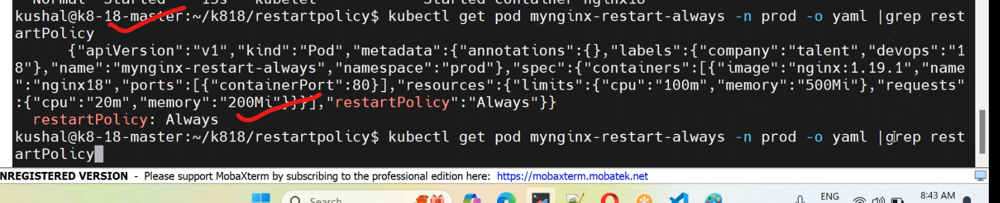
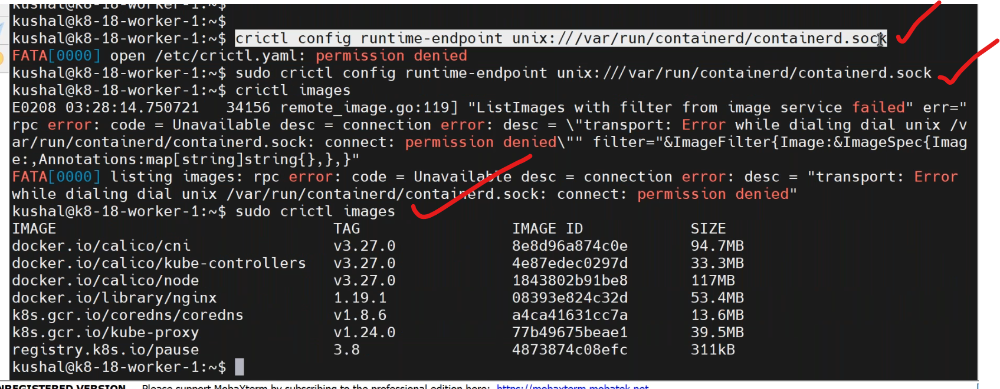
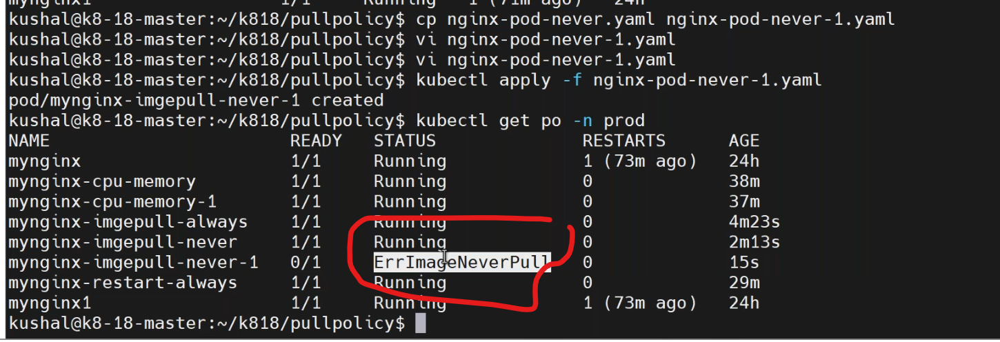

## resourcs allocation to pods (08/02/2024)
------------------------------------------------
* resources limits in pod.
* `cpu`:
  * requests:20
  * limits:200
* `memory`:
  * requests:100mi
  * limits:500mi
* write manifest for resourcelimits in pod `vi resourcelimits.yaml`.
```yaml
apiVersion: v1
kind: Pod
metadata:
  name: resource-nginx
  namespace: dev
spec:
  containers:
    - name: nginx-rslimits
      image: nginx:1.23
      ports:
        - containerPort: 80
          protocol: "TCP"
      resources:
        requests:
          memory: "100Mi"
          cpu: "250m"  # milli core
        limits:
          memory: "500Mi"
          cpu: "500m"  # milli core
```
* execute the manifest by
```
kubectl apply -f resourcelimits.yaml
kubectl describe pod <pod-name> -n dev
```
## restart policies for pod
----------------------------
### Always (default)
-------------------------
* write a restart policy manifest `vi restartpolicy-always.yaml`.
```yaml
apiVersion: v1
kind: Namespace
metadata: 
  name: qa
---
apiVersion: v1
kind: Pod
metadata:
  name: restart-nginx
  namespace: qa
spec:
  containers:
    - name: nginx-always
      image: nginx:1.23
      ports:
        - containerPort: 80
          protocol: "TCP"
      resources:
        requests:
          memory: "100Mi"
          cpu: "250m"  # milli core
        limits:
          memory: "500Mi"
          cpu: "500m"  # milli core
  restartPolicy: Always
```
* execute the manifest by,
```
kubectl apply -f restartpolicy-always.yaml
kubectl describe pod <pod-name> -n qa
```

### Never
------------------------------------
### OnFailure
-------------------------
* write a manifest on onfailure `vi onfailure.yaml`.
```yaml
apiVersion: v1
kind: Pod
metadata:
  name: restart-nginx
  namespace: qa
spec:
  containers:
    - name: nginx-onfailure
      image: nginx:1.23
      ports:
        - containerPort: 80
          protocol: "TCP"
      resources:
        requests:
          memory: "100Mi"
          cpu: "250m"  # milli core
        limits:
          memory: "500Mi"
          cpu: "500m"  # milli core
  restartPolicy: OnFailure
```
* `crictl commands` [refere here](https://github.com/kubernetes-sigs/cri-tools/blob/master/docs/crictl.md)
```
crictl images
```


## image pull policies
---------------------------------
### Always
--------------------------------------------------
* write a manifestfile on pullpolicy `vi image-pullpolicy.yaml.`
```yaml
apiVersion: v1
kind: Pod
metadata:
  name: imagepull-nginx
  namespace: prod
spec:
  containers:
    - name: nginx-alwayspolicy
      image: nginx:1.23
      imagePullPolicy: Always
      ports:
        - containerPort: 80
          protocol: "TCP"
      resources:
        requests:
          memory: "100Mi"
          cpu: "250m"  # milli core
        limits:
          memory: "500Mi"
          cpu: "500m"  # milli core
  restartPolicy: Always
```
* execute the imagepullpolicy by,
```
kubectl get pod <pod-name> -n qa -o yaml
kubectl apply -f image-pullpolicy.yaml
kubectl describe pod <pod-name> -n qa
```
### Never (only from local,not pull from remote repo)
---------------------------------------------------------
* write a manifest on Never `vi imagepull-never.yaml`.
```yaml
apiVersion: v1
kind: Pod
metadata:
  name: imagepull-nginx
  namespace: prod
spec:
  containers:
    - name: nginx-Neverpolicy
      image: nginx:1.23
      imagePullPolicy: Never
      ports:
        - containerPort: 80
          protocol: "TCP"
      resources:
        requests:
          memory: "100Mi"
          cpu: "250m"  # milli core
        limits:
          memory: "500Mi"
          cpu: "500m"  # milli core
  restartPolicy: Always
```
* execute command by `kubectl apply -f imagepull-never.yaml`
* create a another manifest on never `vi imagepull-never2.yaml`
```yaml
apiVersion: v1
kind: Pod
metadata:
  name: imagepullnever2-nginx
  namespace: qa
spec:
  containers:
    - name: nginx-neverpolicy
      image: tomcat
      imagePullPolicy: Never
      ports:
        - containerPort: 80
          protocol: "TCP"
      resources:
        requests:
          memory: "100Mi"
          cpu: "250m"  # milli core
        limits:
          memory: "500Mi"
          cpu: "500m"  # milli core
  restartPolicy: Always
```
* execute manifest by
```
kubectl apply -f imagepull-neve2.yaml
kubectl get po -n qa
kubectl describe pod <pod-name> -n qa
```

### IfNotPresent(default)
---------------------------------------------
* write a manifest on `if not present` `vi imagepull-ifnotpresent.yaml`.
```yaml
apiVersion: v1
kind: Pod
metadata:
  name: imagepullifnot-nginx
  namespace: qa
spec:
  containers:
    - name: nginx-ifnotpresentpolicy
      image: tomcat
      imagePullPolicy: IfNotPresent
      ports:
        - containerPort: 80
          protocol: "TCP"
      resources:
        requests:
          memory: "100Mi"
          cpu: "250m"  # milli 
        limits:
          memory: "500Mi"
          cpu: "500m"  # milli core
  restartPolicy: Always
```
* execute policy by,
```
kubectl apply -f imagepull-ifnotpresent.yaml
kubectl get po -n qa
kubectl describe pod <pod-name> -n qa
```
### scenario:
-------------------------
  * you have build the docker images as tag "java:v1" and this is deployed into k8.
  * again there are some changes into your java application and developer has commited the code and then you are building docker image.
  * in this if you have not changed docker image tag and keeping same as old "java:v1" and pushed to dockerhub.
  * Then deployed into k8.
  * `ans:`
    * ifnotpresent --> wrong method
    * always --> right method
  


         