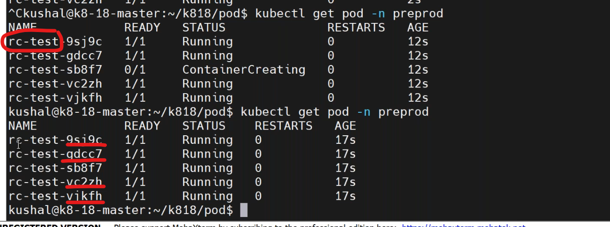
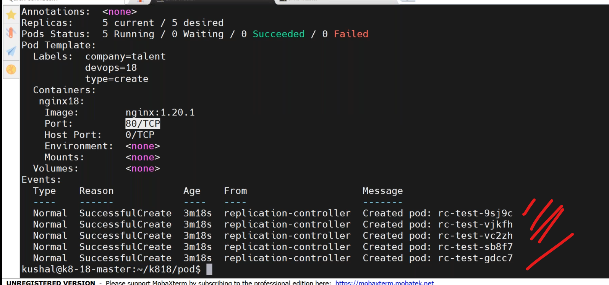

## labels
-------------------------
* to know the labels use command,
```
kubectl get pod --show-labels
kubectl label pod <podname> testing=1234
kubectl get po -l 'testing'
kubectl get pods -l environment=production,tier=frontend  # equality
kubectl get pods -l 'environment in (production),tier in (frontend)' # set based
```
### equality based labels
------------------------
* `examples`:
  *  environment = production
  * tier != frontend
### set based labels
----------------------------
* `examples`:
  * environment in (production, qa)
  * tier notin (frontend, backend)
  * partition
  * !partition
## kubectl create vs kubectl apply
------------------------------------------
* write a manifest to deploy pod by create by `vi pod-create.yaml`.
```yaml
apiVersion: v1
kind: Pod
metadata:
  name: pod-create
  labels: 
    devops: "18" 
    company: vtalent
spec:
  containers:  
    - image: nginx:1.23
      name: myngix
      ports:
        - containerPort: 80
```
* create a pod by create command.
```
kubectl create -f pod-create.yaml
kubectl get po
kubectl get po pod-create -o yaml
```
* write manifest to deploy pod by apply by`vi po-apply.yaml`.
```yaml
apiVersion: v1
kind: Pod
metadata:
  name: pod-apply
  labels: 
    devops: "18" 
    company: vtalent
spec:
  containers:  
    - image: nginx:1.23
      name: myngix
      ports:
        - containerPort: 80
```
* create pod by apply command.
```
kubectl apply -f pod-apply.yaml
kubectl get po 
kubectl get po pod-apply -o yaml
```


1. kubectl create and apply both used to create resources.
   * kubectl create -f nginx.yaml
   * kubectl apply -f nginx.yaml

2. When we created with apply command the entire yaml file defintion will be added to pod in the below tag.
```
 kubectl.kubernetes.io/last-applied-configuration: |
      {"apiVersion":"v1","kind":"Pod","metadata":{"annotations":{},"labels":{"company":"talent","devops":"18"},"name":"mynginx1-apply","namespace":"default"},"spec":{"containers":[{"image":"nginx:1.19.1","name":"nginx18","ports":[{"containerPort":80}]}]}}
```

3. apply will support addition  or updating existing manifest in the running pods,but not updated by create command.

### Scenarios:
----------------------
1. i want to create multiple pods with same configurations with single manifest file.
2. if i delete the pod by mistakenly or purpose fully it has to auto recrate with same configurations.

### solutions: 
* kubernetes workloads
    1. deployment
    2. statefulset
    3. daemonset
    4. job
    5. cronjob
* additionally few others:
   1. ReplicationController:
   2. Replicset: 
## 	ReplicationController
-----------------------------------
* write a manifest for `5` pods by using rc `vi rc.yaml`.
```yaml
---
apiVersion: v1
kind: Pod
metadata:
  name: imagepull-nginx
  namespace: preprod
---
apiVersion: v1
kind: ReplicationController
metadata:
  name: testing-pusrpose
  labes:
    purpose: learning
  namespace: preprod
spec:
  minReadySeconds: 5
  replicas: 5
  selector:    # labesl in template metadata match to selector
    env: dev
    company: vtalent
  template:
    metadata: 
      name: rc-nginx
      labels:   # these labels are used in selectors
        env: dev
        company: vtalent
    spec:
      containers:
        - name: my-nginx
          iamge: nginx:1.23
          ports:
            - containerPort: 80
```
* deploy the manifest file ,
```
kubectl get po -n preprod
kubectl get po -n preprod -w
kubectl apply -f rc.yaml
kubectl get po -n preprod
kubectl get rc -n preprod
kubectl describe rc <name-rc> -n preprod
```


* replication controller is part of controll manager.it maintains desire state of pods.if incase one pod get deleted it automatically up the another pod.but the container name will be changed(hash value changed).


  

  
